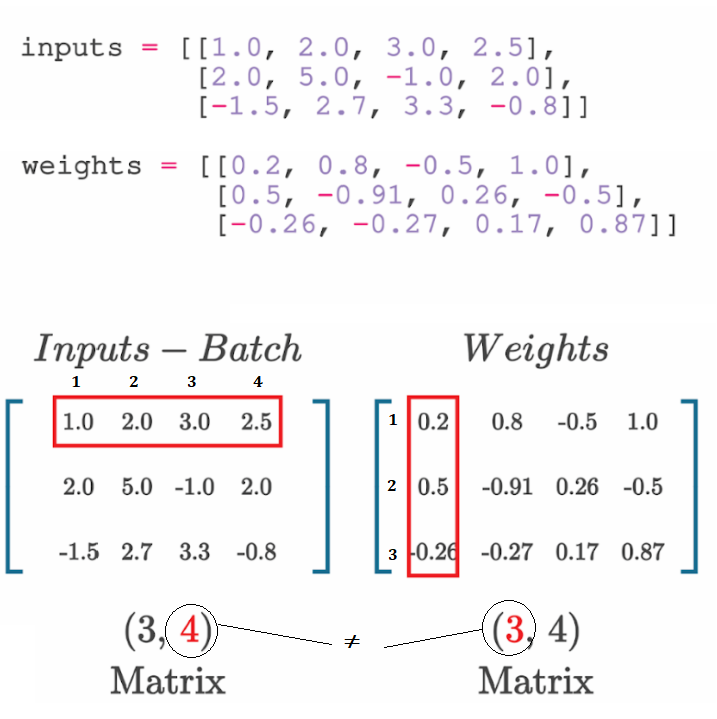
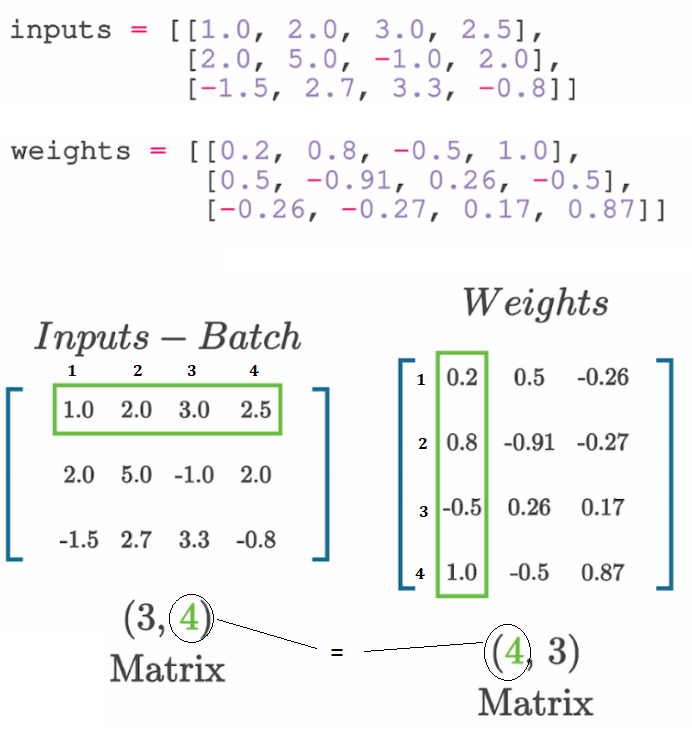

# Artificial Neural Networks & Deep Learning

## Contents

 - **Fundamentals of Artificial Neural Networks:**
   - [Artificial Neural Networks Inspiration](#ann-inspiration)
   - [The First Artificial Neuron (Perceptron)](#intro-to-perceptron)
   - [Neuron calculation (Inputs, Weights, and Biases)](#neuron-calculation)
     - [3 neuron layer with 4 inputs](#3neuron-layer-w-4inputs)
     - [Why do we need to transpose the matrix of weights?](#transpose-matrix-of-weights)
     - [Adding the biases](#adding-the-biases)


   - [How to count the parameters of an Artificial Neural Network](#counting-ann-parameters)
 - [**Project Structure**](#project-structure)
 - [**Settings**](#settings)
 - [**References**](#ref)
<!---
[WHITESPACE RULES]
- Same topic = "20" Whitespace character.
- Different topic = "100" Whitespace character.
--->


<!--- ( Fundamentals of Artificial Neural Networks ) --->

---

<div id="ann-inspiration"></div>

## Artificial Neural Networks Inspiration

> *Artificial Neural Networks are inspired by the organic brain, translated to the computer.

  

> **NOTE:**  
> A single neuron by itself is relatively useless, but, when combined with hundreds or thousands (or many more) of other neurons, the interconnectivity produces relationships and results that frequently outperform any other machine learning methods.


---

<div id="intro-to-perceptron"></div>

## The First Artificial Neuron (Perceptron)

The first **Artificial Neuron** created was the **[Perceptron](https://en.wikipedia.org/wiki/Perceptron)** in 1958 by [Frank Rosenblatt](https://en.wikipedia.org/wiki/Frank_Rosenblatt):


 - The **[Perceptron](https://en.wikipedia.org/wiki/Perceptron)** had the main idea of receiving different inputs (or signals) and outputting the signal (result) **1** or **0**.
 - This signal (result) basically indicates whether the neuron will be *active* or *not* to proceed to another neuron.
 - **NOTE:** Over time, scientists discovered that there were other possibilities for neurons; Not only *active* or *not*, but we won't delve into details for now.

> **NOTE:**  
> The idea of the **[Perceptron](https://en.wikipedia.org/wiki/Perceptron)** was a single *neuron* that received **x<sub>i</sub>** inputs; Multiplied these inputs by their respective weights; Then passed through a *Non-Linear Activation Function* and received an *output*.


---

<div id="neuron-calculation"></div>

## Neuron calculation (Inputs, Weights, and Biases)

> Here, let's see how neurons are calculated.

The most important components to calculate a neuron are:

 - **Inputs**
 - **Weights**
 - **Bias**

> **NOTE:**  
> Initially, let's pay attention to the **"weight"** and **"bias"** components that *we can use to fit our model to the data (podemos usar para ajustar nosso modelo aos dados.)*.

To understand more easily, let's take a look at the image below:

  

See that:

 - **Each neuron has a specific output:**
   - Calculated by: `output = input * weight + bias`
 - **The "slope of the line formula" can represent that calculation:**
   - `y = mx + b`
 - **weight:**
   - The weight *moves* the *"line slope"* up or down.
 - **bias:**
   - The bias *moves* the *"line intercept"* up or down.

Now let's program this for a single neuron:

  

<!--- ( Numpy ) --->
<details>

<summary>Numpy</summary>

</br>

[neuron_np_calc-01.py](../../examples/neurons/neuron_np_calc-01.py)
```python
import numpy as np

inputs = [1.0, 2.0, 3.0, 2.5]
weights = [0.2, 0.8, -0.5, 1.0]
bias = 2.0

outputs = np.dot(weights, inputs) + bias

print(outputs)
```

**OUTPUT:**  
```bash
2.3
```

</details>


<!--- ( TensorFlow ) --->
<details>

<summary>TensorFlow</summary>

</br>

[neuron_tf_calc-01.py](../../examples/neurons/neuron_tf_calc-01.py)
```python
import os
os.environ['TF_CPP_MIN_LOG_LEVEL'] = '3'

import tensorflow as tf

inputs = tf.constant([1.0, 2.0, 3.0, 2.5])
weights = tf.constant([0.2, 0.8, -0.5, 1.0])
bias = tf.constant(2.0)

# Calculate the "Dot Product" and "add" the bias.
outputs = tf.tensordot(weights, inputs, axes=1) + bias

print(outputs)
print(outputs.numpy())
```

**OUTPUT:**  
```bash
tf.Tensor(4.8, shape=(), dtype=float32)
4.8
```

 - **The main difference here is that in TensorFlow you work with tensors instead of NumPy arrays:**
   - `print(outputs)`
     - Show the *tensor structure*.
   - `print(outputs.numpy())`
     - Show the *tensor value*.

</details>


---

<div id="3neuron-layer-w-4inputs"></div>

## 3 neuron layer with 4 inputs

A single neuron is easy to calculate. Now, let's see how to calculate a **layer of 3 neurons** with **4 inputs**:

  

<!--- ( Numpy ) --->
<details>

<summary>Numpy</summary>

</br>

[neuron_np_calc-02.py](../../examples/neurons/neuron_np_calc-02.py)
```python
import numpy as np

inputs = [1.0, 2.0, 3.0, 2.5]

weights = [
    [0.2, 0.8, -0.5, 1],
    [0.5, -0.91, 0.26, -0.5],
    [-0.26, -0.27, 0.17, 0.87]
]

biases = [2.0, 3.0, 0.5]

layer_outputs = np.dot(weights, inputs) + biases

print(layer_outputs)
```

**OUTPUT:**  
```bash
[4.8   1.21  2.385]
```

</details>


<!--- ( TensorFlow ) --->
<details>

<summary>TensorFlow</summary>

</br>

[neuron_tf_calc-02.py](../../examples/neurons/neuron_tf_calc-02.py)
```python
import os
os.environ['TF_CPP_MIN_LOG_LEVEL'] = '3'

import tensorflow as tf

inputs = tf.constant([1.0, 2.0, 3.0, 2.5])
weights = tf.constant([[0.2, 0.8, -0.5, 1], [0.5, -0.91, 0.26, -0.5], [-0.26, -0.27, 0.17, 0.87]])
biases = tf.constant([2.0, 3.0, 0.5])

layer_outputs = tf.tensordot(weights, inputs, axes=1) + biases

print(layer_outputs)
print(layer_outputs.numpy())
```

**OUTPUT:**  
```bash
tf.Tensor([4.8       1.2099999 2.385    ], shape=(3,), dtype=float32)
[4.8       1.2099999 2.385    ]
```

</details>


---

<div id="transpose-matrix-of-weights"></div>

## Why do we need to transpose the matrix of weights?

To apply **Dot Products** between the *input matrix* and the *weights matrix*, first we need the following conditions:

 - The number of *columns* in the *input matrix*;
 - Must be equal to the number of *rows* in the *weights matrix*.
 - **NOTE:** The result will be a matrix with the same number of *rows* of the *first matrix (inputs)* and the number of *columns* of the *second matrix (weights)*.

  

> **Ok, how solve this problem?**  
> *"Transpose"* the *matrix of weights*.

  

Now, let's see visually:


<!--- ( Numpy ) --->
<details>

<summary>Numpy</summary>

</br>

[transpose-np-01.py](../../examples/neurons/transpose-np-01.py)
```python
import numpy as np

inputs = [
    [1.0, 2.0, 3.0, 2.5],
    [2.0, 5.0, -1.0, 2.0],
    [-1.5, 2.7, 3.3, -0.8]
]

weights = [
    [0.2, 0.8, -0.5, 1.0],
    [0.5, -0.91, 0.26, -0.5],
    [-0.26, -0.27, 0.17, 0.87]
]

biases = [2.0, 3.0, 0.5]

layer_outputs = np.dot(inputs, np.array(weights).T) + biases

print(layer_outputs)
```

**OUTPUT:**  
```bash
[[ 4.8    1.21   2.385] 
 [ 8.9   -1.81   0.2  ] 
 [ 1.41   1.051  0.026]]
```

</details>


<!--- ( TensorFlow ) --->
<details>

<summary>TensorFlow</summary>

</br>

[transpose-np-01.py](../../examples/neurons/transpose-tf-01.py)
```python
import os
os.environ['TF_CPP_MIN_LOG_LEVEL'] = '3'

import tensorflow as tf

inputs = tf.constant([
    [1.0, 2.0, 3.0, 2.5],
    [2.0, 5.0, -1.0, 2.0],
    [-1.5, 2.7, 3.3, -0.8]
])

weights = tf.constant([
    [0.2, 0.8, -0.5, 1.0],
    [0.5, -0.91, 0.26, -0.5],
    [-0.26, -0.27, 0.17, 0.87]
])

biases = tf.constant([2.0, 3.0, 0.5])

layer_outputs = tf.tensordot(inputs, tf.transpose(weights), axes=1) + biases

print(layer_outputs.numpy())
```

**OUTPUT:**  
```bash
[[ 4.8         1.2099999   2.385     ]
 [ 8.9        -1.8100004   0.20000005]
 [ 1.4100001   1.051       0.02599993]]
```

</details>


---

<div id="adding-the-biases"></div>

## Adding the biases

  

> **NOTE:**  
> If we look at the **Dot Product** above, we can see that the bias is missing.

The bias vector will be added to each row vector of the matrix:

  


<!--- ( Numpy ) --->
<details>

<summary>Numpy</summary>

</br>

[adding-biases-np-01.py](../../examples/neurons/adding-biases-np-01.py)
```python
import numpy as np

inputs = [
    [1.0, 2.0, 3.0, 2.5],
    [2.0, 5.0, -1.0, 2.0],
    [-1.5, 2.7, 3.3, -0.8]
]

weights = [
    [0.2, 0.8, -0.5, 1.0],
    [0.5, -0.91, 0.26, -0.5],
    [-0.26, -0.27, 0.17, 0.87]
]

biases = [2.0, 3.0, 0.5]

outputs = np.dot(inputs, np.array(weights).T) + biases

print(outputs)
```

**OUTPUT:**  
```bash
[[ 4.8    1.21   2.385] 
 [ 8.9   -1.81   0.2  ] 
 [ 1.41   1.051  0.026]]
```

</details>


<!--- ( TensorFlow ) --->
<details>

<summary>TensorFlow</summary>

</br>

[adding-biases-tf-01.py](../../examples/neurons/adding-biases-tf-01.py)
```python
import tensorflow as tf

inputs = tf.constant([
    [1.0, 2.0, 3.0, 2.5],
    [2.0, 5.0, -1.0, 2.0],
    [-1.5, 2.7, 3.3, -0.8]
])

weights = tf.constant([
    [0.2, 0.8, -0.5, 1.0],
    [0.5, -0.91, 0.26, -0.5],
    [-0.26, -0.27, 0.17, 0.87]
])

biases = tf.constant([2.0, 3.0, 0.5])

layer_outputs = tf.tensordot(inputs, tf.transpose(weights), axes=1) + biases

print(layer_outputs.numpy())
```

**OUTPUT:**  
```bash
[[ 4.8         1.2099999   2.385     ] 
 [ 8.9        -1.8100004   0.20000005] 
 [ 1.4100001   1.051       0.02599993]]
```

</details>


---

<div id="counting-ann-parameters"></div>

## Parameter counting of an Artificial Neural Network

Depending on how many layers and how many neurons there are in each layer, the number of parameters of our Artificial Neural Network can change in size.

Here, let's see how to count the parameters of an *Artificial Neural Network (Densely)*.

  

To understand the count above, let's imagine we have the following Artificial Neural Network (Densely):

```bash
10, 8, 8, 8, 2
```

 - **Input Layer to First Hidden Layer:**
   - **Weights:** Each of the 10 input neurons connects to each of the 8 neurons in the first hidden layer. That’s `10 × 8 = 80 weights`.
   - **Biases:** Each neuron in the first hidden layer has one bias. So, `8 biases`.
   - **Total for this layer:** `80 + 8 = 88 parameters`.
 - **First Hidden Layer to Second Hidden Layer:**
   - **Weights:** Each of the 8 neurons in the first hidden layer connects to each of the 8 neurons in the second hidden layer. That’s `8 × 8 = 64 weights`.
   - **Biases:** There are 8 biases for the 8 neurons in the second hidden layer.
   - **Total for this layer:** `64 + 8 = 72 parameters`.
 - **Second Hidden Layer to Third Hidden Layer:**
   - **Weights:** Similarly, `8 × 8 = 64 weights`.
   - **Biases:** `8 biases`.
   - **Total for this layer:** `64 + 8 = 72 parameters`.
 - **Third Hidden Layer to Output Layer:**
   - **Weights:** Each of the 8 neurons in the third hidden layer connects to each of the 2 output neurons. That’s `8 × 2 = 16 weights`.
   - **Biases:** There are `2 biases` for the `2 output neurons`.
   - **Total for this layer:** `16 + 2 = 18 parameters`.

Now, add all the parameters together:

```bash
(10 x 8 + 8) + (8 x 8 + 8) + (8 x 8 + 8) + (8 x 2 + 2)
      |             |             |             |
      |             |             |             |
      88     +      72     +      72     +      18    =   250
```

Thus, the network has a total of `250 parameters`.


<!--- ( Project Structure ) --->

---

<div id="project-structure"></div>

## Project Structure

 - **ai-codes/**
   - Main package directory containing the source code.
    - **algorithms/**
      - Contains implementations of machine learning and deep learning algorithms.
      - **`__init__.py`**
        - Marks the directory as a Python package, enabling direct module imports.
      - **`dl.py`**
        - Implementations of deep learning algorithms.
      - **`ml.py`**
        - Functions and classes for traditional machine learning algorithms.
      - **`utils.py`**
        - Utility functions that support the algorithms.
    - **datasets/**
      - Holds scripts for loading and preprocessing datasets.
      - **`__init__.py`**
        - Marks the datasets directory as a package.
      - **`loader.py`**
        - Functions for loading and managing datasets.
   - **docs/**
     - Contains the detailed documentation of the project, such as usage guides, API references, and technical notes that help developers and users understand how the project works.
     - **`__init__.py`**
       - Marks the datasets directory as a package.
   - **examples/**
     - Holds practical examples and notebooks (e.g., Jupyter Notebooks) demonstrating how to use the algorithms and models provided by the project.
     - **`__init__.py`**
       - Marks the examples directory as a package.
   - **models/**
     - Defines models and neural network structures for training and evaluation.
     - **`__init__.py`**
       - Initializes the models module.
   - **tests/**
     - Contains automated unit and integration tests to ensure code quality and stability.
     - **`__init__.py`**
       - Marks the tests directory as a package.
   - **`__init__.py`**
     - Marks the root (top-level) directory as a Python package, enabling direct module imports.
   - **`main.py`** (Optional)
      - Serves as the entry point for running demonstrations or integrated tests of the project.
   - **`README.md`**
     - Provides an overview of the project, including basic installation instructions, usage examples, and information for contributions or contact.


<!--- ( References ) --->

---

<div id="ref"></div>

## References

 - **General:**
   - [Neural Networks from Scratch in Python Book](https://nnfs.io/)

---

**Rodrigo** **L**eite da **S**ilva - **rodrigols89**

<!---


<!--- () ->
<details>

<summary>Title here...</summary>

</br>

[](../../examples/)
```python

```

**OUTPUT:**  
```bash

```

</details>


--->
