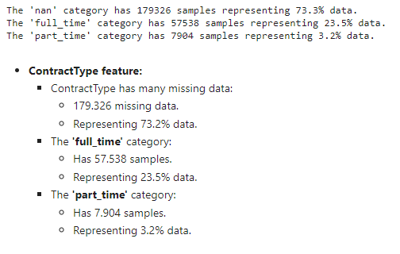

# Categorical Encoding

## Contents

 - [Intro to Categorical Variables](#main-intro)
 - **One hot encoding:**
 - **Count and Frequency encoding:**
 - **Target encoding / Mean encoding:**
 - **Ordinal encoding:**
 - **Weight of Evidence:**
 - **Rare label encoding:**
 - **BaseN, feature hashing and others:**
 - **Tips & Tricks:**
   - [Checking how many unique values each categorical variable has](#check-unique)
   - [Checking percent of each unique value from one category](#check-percent)

---

<div id="main-intro"></div>

##  Intro to Categorical Variables

> **Categorical variables** are often called nominal.

Some examples include:

 - A **“pet”** variable with the values: **“dog”** and **“cat“**.
 - A **“color”** variable with the values: **“red“**, **“green“**, and **“blue“**.
 - A **“place”** variable with the values: **“first“**, **“second“**, and **“third“**.

**NOTE:**  
Each value from each variable represents a different category.

---

<div id="check-unique"></div>

## Checking how many unique values each categorical variable has

Imagine we have the follows features from [Dataset (Used cars catalog)](https://www.kaggle.com/datasets/lepchenkov/usedcarscatalog):

```python
categorical_features_names = [
    'manufacturer_name',
    'model_name',
    'transmission',
    'color',
    'engine_fuel',
    'engine_type',
    'body_type',
    'state',
    'drivetrain',
    'location_region'
]
```

To check how many **unique values each categorical variable has** we use the Pandas method **nunique()**:

```python
df[categorical_features_names].nunique()
```

**OUTPUT:**  
```python
manufacturer_name      55
model_name           1118
transmission            2
color                  12
engine_fuel             6
engine_type             3
body_type              12
state                   3
drivetrain              3
location_region         6
dtype: int64
```

---

<div id="check-percent"></div>

## Checking percent of each unique value from one category

> To thist analyse we use the category **'ContractType'** from [Job Salary Prediction](https://www.kaggle.com/c/job-salary-prediction) dataset.

To check the percent of the unique value of **'ContractType'** category we use the follow code:

```python
from collections import Counter
c = Counter(df.ContractType)
c.most_common()
```

**OUTPUT:**  
```python
[(nan, 179326), ('full_time', 57538), ('part_time', 7904)]
```

Now, let's check the percent by category:

```python
ContractType_values = c.most_common()

# Check categories percent (%) + Missing data.
for category in ContractType_values:
    percentCategory = (category[1] / len(df.index)) * 100
    print(f"The '{category[0]}' category has {category[1]} samples representing {round(percentCategory, 1)}% data.")
```

**OUTPUT:**  
  

---

**REFERENCES:**  
[CatBoost tutorial: Categorical features parameters](https://github.com/catboost/catboost/blob/master/catboost/tutorials/categorical_features/categorical_features_parameters.ipynb)

---

Ro**drigo** **L**eite da **S**ilva - **drigols**
