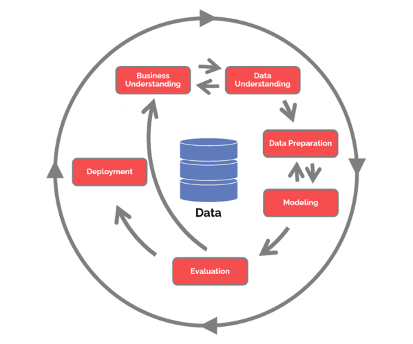
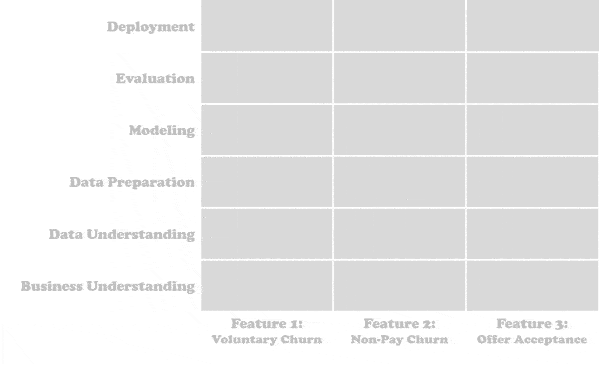

# CRoss Industry Standard Process for Data Mining (CRISP-DM)

## Contents

 - [Intro to CRISP-DM](#intro)
 - [1. Business Understanding](#business-understanding)
 - [2. Data Understanding](#data-understanding)
 - [3. Data Preparation](#data-preparation)
 - [4. Modeling](#modeling)
 - [5. Evaluation](#evaluation)
 - [6. Deployment](#deployment)
 - **Tips & Tricks:**
   - [CRISP-DM Horizontal vs. Vertical Slicing](#horizontal-vs-vertical)

---

## Intro to CRISP-DM

> Published in 1999 to standardize data mining processes across industries, it has since become the most common methodology for **data mining**, **analytics**, and **data science projects**.

The **CRISP-DM** cycle/process:

 - **1. Business understanding:**
   - What does the business need?
 - **2. Data understanding:**
   - What data do we have / need? Is it clean?
 - **3. Data preparation:**
   - How do we organize the data for modeling?
 - **4. Modeling:**
   - What modeling techniques should we apply?
 - **5. Evaluation:**
   - Which model best meets the business objectives?
 - **6. Deployment:**
   - How do stakeholders access the results?

To understand more easily see the image below:

  

**NOTE:**  
See that some steps are repeated between them.

---

## 1. Business Understanding

> The **Business Understanding** phase focuses on understanding the `objectives` and `requirements` of the project.

Some important questions in *Business Understanding* step:

 - **Determine business objectives:**
   - You should first “thoroughly understand, from a business perspective, what the customer really wants to accomplish.”
   - And then define business success criteria.
 - **Assess situation:**
   - Determine resources availability;
   - Project requirements;
   - Assess risks and contingencies;
   - And conduct a cost-benefit analysis.
 - **Determine data mining goals:**
   - In addition to defining the business objectives, you should also define what success looks like from a technical data mining perspective.
 - **Produce project plan:**
   - Select technologies and tools;
   - And define detailed plans for each project phase.

---

## 2. Data Understanding

> Next is the **Data Understanding** phase, it drives the focus to **identify**, **collect**, and **analyze** the data sets that can help you accomplish the project goals.

This phase also has four tasks:

 - **Collect initial data:**
   - Acquire the necessary data and (if necessary) load it into your analysis tool.
 - **Describe data:**
   - Examine the data and document its surface properties like data format, number of records, or field identities.
 - **Explore data:**
   - Dig deeper into the data. Query it, visualize it, and identify relationships among the data.
 - **Verify data quality:**
   - How clean/dirty is the data? Document any quality issues.

---

## 3. Data Preparation

> This phase, which is often referred to as **“data munging (Manipulação de Dados)”**, prepares the final data set(s) for modeling.

It has five tasks:

 - **Select data:**
   - Determine which data sets will be used;
   - Document reasons for inclusion/exclusion.
 - **Clean data:**
   - Often this is the lengthiest task. Without it, you’ll likely fall victim to garbage-in, garbage-out. A common practice during this task is to correct, impute, or remove erroneous values.
 - **Construct data:**
   - Derive new attributes that will be helpful. For example, derive someone’s body mass index from height and weight fields.
 - **Integrate data:**
   - Create new data sets by combining data from multiple sources.
 - **Format data:**
   - Re-format data as necessary. For example, you might convert string values that store numbers to numeric values so that you can perform mathematical operations.

---

## 4. Modeling

> Here you’ll likely build and assess various models based on several different modeling techniques.

This phase has four tasks:

 - **Select modeling techniques:**
   - Determine which algorithms to try (e.g. regression, classification, neural net).
 - **Generate test design:**
   - Pending your modeling approach, you might need to split the data into training, test, and validation sets.
 - **Build model:**
   - As glamorous as this might sound, this might just be executing a few lines of code like **“reg = LinearRegression().fit(X, y)”**.
 - **Assess model:**
   - Generally, multiple models are competing against each other, and the data scientist needs to interpret the model results based on domain knowledge, the pre-defined success criteria, and the test design.

---

## 5. Evaluation

 - Whereas the **Assess Model** task of the **Modeling** phase focuses on technical model assessment;
 - The Evaluation phase looks more broadly at which model best meets the business and what to do next.

This phase has three tasks:

 - **Evaluate results:**
   - Do the models meet the business success criteria?
   - Which one(s) should we approve for the business?
 - **Review process:** Review the work accomplished
   - Was anything overlooked?
   - Were all steps properly executed?
   - Summarize findings and correct anything if needed.
 - **Determine next steps:**
   - Based on the previous three tasks, determine whether to proceed to deployment, iterate further, or initiate new projects.

---

## 6. Deployment

> **NOTE:**  
> A model is not particularly useful unless the customer can access its results.

The complexity of this phase varies widely. This final phase has four tasks:

 - **Plan deployment:**
   - Develop and document a plan for deploying the model.
 - **Plan monitoring and maintenance:**
   - Develop a thorough monitoring and maintenance plan to avoid issues during the operational phase (or post-project phase) of a model.
 - **Produce final report:**
   - The project team documents a summary of the project which might include a final presentation of data mining results.
 - **Review project:**
   - Conduct a project retrospective about what went well, what could have been better, and how to improve in the future.

---

## CRISP-DM Horizontal vs. Vertical Slicing

**CRISP-DM Waterfall (cascata): Horizontal Slicing**  
In a waterfall-style implementation, the team’s work would comprehensively and horizontally span across each deliverable as shown below. **The team might infrequently loop back to a lower horizontal layer only if critically needed**.

  

**CRISP-DM Agile: Vertical Slicing**  
Alternatively, in an agile implementation of CRISP-DM, the team would narrowly focus on quickly delivering one vertical slice up the value chain at a time as shown below. **They would deliver multiple smaller vertical releases and frequently solicit feedback along the way**.

  

**Which is better?**

 - When possible, take an agile approach and slice vertically so that:
   - Stakeholders get value sooner.
   - Stakeholders can provide meaningful feedback.
   - The data scientists can assess model performance earlier.
   - The project team can adjust the plan based on stakeholder feedback.

---

**REFERENCES:**  
[CRoss Industry Standard Process for Data Mining (CRISP-DM)](https://www.datascience-pm.com/crisp-dm-2/)  

---

Ro**drigo** **L**eite da **S**ilva - **drigols**
