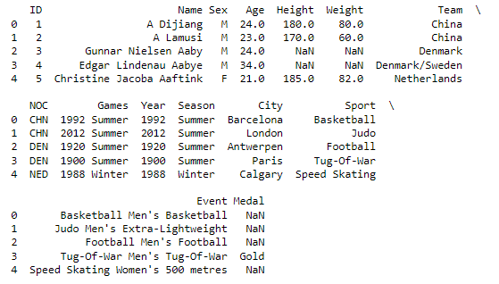
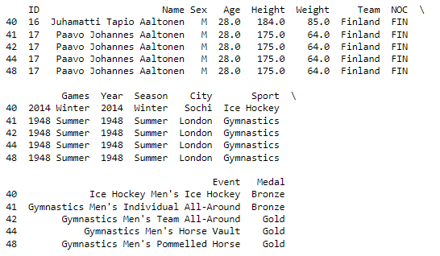
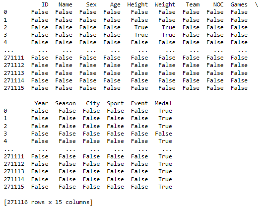

# Missing Data Imputation

## Contents

 - **Complete case analysis:**
 - **Mean / Median / Mode imputation:**
 - **Random Sample Imputation:**
 - **Replacement by Arbitrary Value:**
 - **Missing Value Indicator:**
 - **Multivariate imputation:**
 - **Tips & Tricks:**
   - [Tips and Tricks for missing data percent (artificial data)](#md-tips-tricks)
   - [Working with dropna() function (Dropping registers (samples) "NaN")](#dropna)
   - [Working with isnull() function](#isnull)
   - [Checking missing (NaN) data amount](#amount)
   - [Checking missing (NaN) data percent (%)](#percent)
   - [Working with fillna() function (Changing NaN (missing) values by something)](#fillna)

---

<div id="md-tips-tricks"></div>

##  Tips and Tricks for missing data percent (artificial data)

> There many missing data research and what to do in each occasion. 

Knowing that, let's see some examples and use cases:

 - **When missing data is below 5%, `maybe is irrelevant`:**
   - That is, if the column has less than 5% of the data missing, it won't make much difference.
   - You can exchange it for the mean, median, mode or something of interest.
 - **Now when the missing data is above 30% it is already considered a high amount of missing data.**
 - **Now, if the missing data is above 60% , something should be done:**
   - Because if you have more than 60% of the data missing, maybe this variable in our model is `almost null (quase nula)`.

**NOTE:**  
Remembering that these examples above are just notes and tips. It all depends on the variable and how important it is. For example, when forecasting a house, which variables are most relevant?

 - Room numbers?
 - The color of the house?

> **NOTE:**  
> There are Data Scientists who say that all data is relevant, that is, we should never exclude any variable (column/feature).

**NOTE - IMPORTANT**  
But if we think about it, a variable (column) that has 60% of the data missing and we replace these values ​​with the **mean** or **median**, we are just creating artificial data and this can generate some pollution in our model, which can generate a untrue result. That's because the data was not actually collected, and yes we are artificially manipulating it.

---

<div id="dropna"></div>

## Working with dropna() function (Dropping registers (samples) "NaN")

> To this example we go use [120 years of Olympic history](https://www.kaggle.com/heesoo37/120-years-of-olympic-history-athletes-and-results) dataset.


```python
import pandas as pd
pd.set_option('display.max_columns', 18)

data = pd.read_csv('athlete_events.csv')

print(data.head(15))
```

**OUTPUT:**  
  

> **NOTE:**  
> See that we have some NaN (missing) data. For example, the features **Height** ,**Weight** and **Medal**.

**But, if I wish to drop the registers (samples) with this NaN (missing) values?**  
Easy, just use the **dropna()** function from Pandas library:

```python
data = data.dropna()

print(data.head())
```

**OUTPUT:**  
  

**NOTE:**  
See that the function **dropna()** excluded samples with **NaN** values.

---

<div id="isnull"></div>

## Working with isnull() function

> Now, imagine you want to know if a sample of a column is **NaN (missing)**?

East, just use the function **isnull()** from Pandas library:

```python
isnull = data.isnull()

print(isnull)
```

**OUTPUT:**  
  

See that the return is:

 - **True =** When the sample in the column **is NaN (missing)**.
 - **False =** When the sample in the column **is not NaN (missing)**.

---

<div id="amount"></div>

## Checking missing (NaN) data amount

To check **missing (NaN)** data **amount** we combine two functions:

 - isnull()
 - sum()

The code is the following:

```python
isNullSum = data.isnull().sum()

print(isNullSum)
```

**OUTPUT:**
```python
ID             0
Name           0
Sex            0
Age         9474
Height     60171
Weight     62875
Team           0
NOC            0
Games          0
Year           0
Season         0
City           0
Sport          0
Event          0
Medal     231333
```

---

<div id="percent"></div>

## Checking missing (NaN) data percent (%)

To check **missing (NaN)** data **percent (%)** we combine:

 - isnull() function
 - sum() function
 - +Some algebraic math

```python
missingAmount = data.isnull().sum()

missingPercent = (missingAmount / len(data.index)) * 100
missingPercent
```

**OUTPUT:**  
```python
ID         0.000000
Name       0.000000
Sex        0.000000
Age        3.494445
Height    22.193821
Weight    23.191180
Team       0.000000
NOC        0.000000
Games      0.000000
Year       0.000000
Season     0.000000
City       0.000000
Sport      0.000000
Event      0.000000
Medal     85.326207
dtype: float64
```

Looking at the result above we have that:

 - The column (feature) **"age"** has **3%** missing data.
 - The column (feature) **"Height"** has **22%** missing data.
 - The column (feature) **"Weight"** has **23%** missing data.
 - The column (feature) **"Medal"** has **85%** missing data.

> **But how was this done in practice?**

 - **First, we sum the missing data by column:**
   - data.isnull().sum()
 - **Then we divide each column by the size of our sample**:
   - missingAmount / len(data.index)
 - **And finally, we multiply by 100:**
   - That is, 100% of the data.

---

<div id="fillna"></div>

## Working with fillna() function (Change NaN (missing) values by something)

> Imagine you want to change some NaN (missing) value by something like, mean, median, mode.  
> **How to do this? (como fazer isso?)**

For this you can use a fillna() function and pass some value to be used:

```python
data['Medal'] = data['Medal'].fillna('--> testing fill NaN < ---')

print(data['Medal'].head(20))
```

**OUTPUT:**  
```python
0     --> testing fill NaN< ---
1     --> testing fill NaN< ---
2     --> testing fill NaN< ---
3                          Gold
4     --> testing fill NaN< ---
5     --> testing fill NaN< ---
6     --> testing fill NaN< ---
7     --> testing fill NaN< ---
8     --> testing fill NaN< ---
9     --> testing fill NaN< ---
10    --> testing fill NaN< ---
11    --> testing fill NaN< ---
12    --> testing fill NaN< ---
13    --> testing fill NaN< ---
14    --> testing fill NaN< ---
15    --> testing fill NaN< ---
16    --> testing fill NaN< ---
17    --> testing fill NaN< ---
18    --> testing fill NaN< ---
19    --> testing fill NaN< ---
Name: Medal, dtype: object
```

**NOTE:**  
We also can fill NaN (missing) values with **Mean**, **Median**, **Mode**, **True**, **False**.

---

**REFERENCES:**  
[Como lidar com dados faltantes (NaN) em um Dataset (Python para machine learning - Aula 22)](https://www.youtube.com/watch?v=k1zi4EwIXoc)  
[Didática Tech - Inteligência Artificial & Data Science](https://didatica.tech) 

---

Ro**drigo** **L**eite da *S*ilva - **drigols**
