# Reinforcement Learning

## Contents

 - [Intro to Reinforcement Learning](#intro-to-rl)
 - [Observations/States Space](#observations-states-space)
 - [Action Space (Discrete vs. Continuous)](#action-space)
 - [Type of tasks (Episodic Task vs. Continuing Tasks)](#types-of-tasks)
 - [Exploitation/Exploration trade-off](#exploitation-exploration-trade-off)
 - [The RL Components & Process](#rl-components-process)
   - [States](#states)
   - [Actions](#actions)
   - [Rewards](#rewards)
     - [Expected Return](#expected-return)
     - [Discounted Return (Discount Factor | 𝛾)](#discount-factor)
 - [Markov Decision Process (MDP)](#intro-to-mdp)
 - [Policy (π)](#intro-to-policy)
   - [Policy-Based Methods](#policy-based-methods)
   - [Value-Based Methods](#value-based-methods)
   - [Policy vs. Value](#policy-vs-value)
 - [Q-Learning](#intro-to-q-learning)
   - [Q-Learning Algorithm](#q-learning-algorithm)
   - [Q-Learning and Bellman Equation](#ql-and-be)
 - [**Settings**](#settings)
 - [**References**](#ref)


<!--- ( Intro to Reinforcement Learning ) --->

---

<div id="intro-to-rl"></div>

## Intro to Reinforcement Learning

Well, to start our studies on *Reinforcement Learning*, the first thing you have to keep in mind is that *Reinforcement Learning* is a technique of **"Unsupervised Learning"**.

> In other words, there is no reference or guideline saying that this is the best *action* to take.

Unlike other types of learning, here the only thing the model will have in terms of *supervision (or feedback)* will be a signal that will be the **reward** it obtained in the system and the goal will be to *maximize the reward* as much as possible.

> In other words, I want to gain the maximum possible rewards.

**NOTE:**  
The idea behind (por trás) *Reinforcement Learning* is that an `agent (an AI)` will learn from the *environment* by **interacting with it** (through trial and error) and **receiving rewards** (negative or positive) as feedback to perform actions.

For example, imagine you place your younger brother in front of a video game he's never played before, hand him a controller, and let him play:

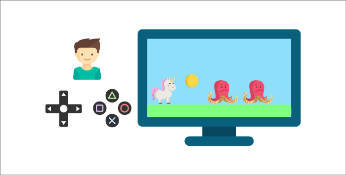  

Your brother will interact with the environment (the video game) by pressing the *right button* **(action)**. He has a coin, which is a *reward* of **"+1"**. It's positive, he just understood that in this game **he should collect the coins**...

  

So, **he presses to the right again** and touches an enemy, he just died **"-1" reward**...

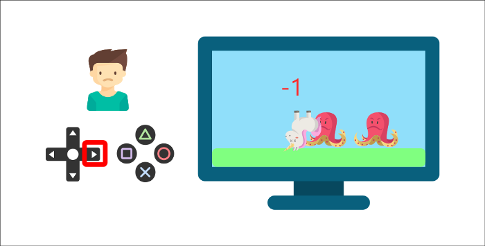  

 - By interacting with its *environment* through `trial` and `error`, your little brother has just figured out that in this environment **he needs to collect coins**, **but avoid enemies**.
 - Without any supervision, the child will get better at the game over time. That's how humans and animals learn, *through interactions*.

> *Reinforcement Learning* is just a computational approach to learning from *Actions*.


<!--- ( Observations/States Space ) --->

---

<div id="observations-states-space"></div>

## Observations/States Space

> *"Observations/States"* are the **information our agent gets from the environment**.

 - In the case of a video game, it can be a frame (a screenshot).
 - In the case of the trading agent, it can be the value of a certain stock, etc.

Briefly, we can think of as:

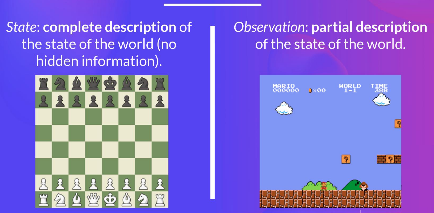


<!--- ( Action Space (Discrete vs. Continuous) ) --->

---

<div id="action-space"></div>

## Action Space (Discrete vs. Continuous)

> The **Action Space** is the *set* of **all possible *actions* in an environment (You can think as "Universal Set (U)" or Probability "Sample Space (Ω)")**.

> **NOTE:**  
> The **Actions** can come from a *"discrete"* or *"continuous space"*:

### Discrete Space

> In the case of a **Discrete Space**, the number of possible actions is **finito**.

For example, in *Super Mario Bros*, we have only 4 possible actions:

 - Left.
 - Right.
 - Up (jumping).
 - Down (crouching).

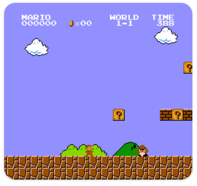

**NOTE:**  
Again, in Super Mario Bros, we have a finite set of actions since we have only 4 directions.

### Continuous Space

> In the case of a **Continuous Space**, the number of possible actions is **infinito**.

For example, in a *Self Driving Car agent* has an infinite number of possible actions since it can turn left 20°, 21,1°, 21,2°, honk, turn right 20°…


<!--- ( Types of Tasks ) --->

---

<div id="types-of-tasks"></div>

## Type of tasks (Episodic Task vs. Continuing Tasks)

> A *Task* is an **instance** of a *Reinforcement Learning problem*.

We can have two types of tasks:

 - **Episodic Task.**
 - **Continuous Task.**

Briefly, we can think of as:

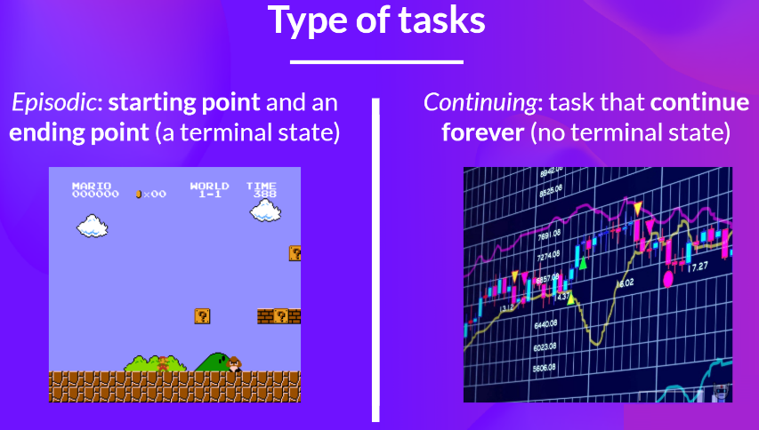


<!--- ( Exploitation/Exploration trade-off ) --->

---

<div id="exploitation-exploration-trade-off"></div>

## The Exploitation/Exploration trade-off

### Exploitation

> **The technique of "Exploitation" always tries the Action that it already knows has worked the most (or better).**

In summary, suppose a child is crying, the technique of **Exploitation** will always look for an Action that it has already tried and seen that it worked.


Now let's analyze the following situation:

- **1st -** Suppose we were using a technique **(Action)** where the child only stopped crying after 5 minutes of rocking her;
- **2nd -** We discovered another technique **(Action)** where the child stopped crying instantly - For example, calling the mother.

It's obvious that the second option now gives a better **reward**. Therefore, the **Exploitation** technique will use the second option as the standard.

**NOTE:**  
The problem is that this approach will not lead us to an **optimal point**. This is because it always picks the best **Action** it already knows and ignores others that could yield better results **(For example, breastfeeding the child)**.

### Exploration

On the other hand, **Exploration** does the *exploration*. That is, it explores all possible **Actions**, calculating the average and percentage of all of them until finding the one that gives the best **reward**.

> **NOTE:**  
> The problem with **Exploration** is that depending on the problem, this can cost a lot of time and computational resources.

### Exploitation vs. Exploration

Well, the ideal is that when applying these concepts in practice, we carefully consider how much we will allocate for **Exploitation** and how much we will allocate for **Exploration**.


<!--- ( RL Components & Process ) --->

---

<div id="rl-components-process"></div>

## The RL Components & Process

The crucial components of **Reinforcement Learning** are:

 - **Environment.**
 - **Agent.**

For example, see the image below:

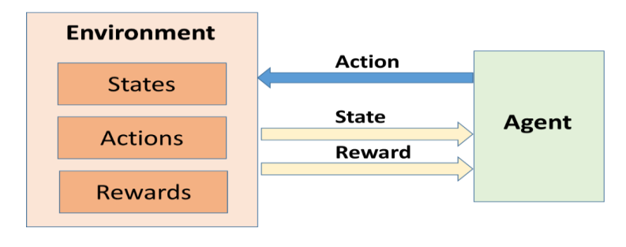  

See that:

 - An **agent** sends *"Actions"* to the **Environment**.
 - And the **environment** sends *"States"* and *Rewards* to the **Agent**.

The **Reinforcement Learning** process is:

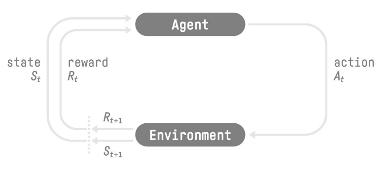  

See that:

 - First, the **Agent** receives the initial State **"S<sub>t</sub> (or S<sub>0</sub>)"** and Reward **"R<sub>t</sub> (or R<sub>0</sub>)"**.
 - Next, the **Agent** sends the **Action "A<sub>t</sub> (or A<sub>0</sub>)"** to the **Environment**.
 - Finally, the **Environment** sends the State **"S<sub>t+1</sub>"** and Reward **"R<sub>t+1</sub>"** to the **Agent**.

For example, let’s imagine an agent learning to play a platform game:

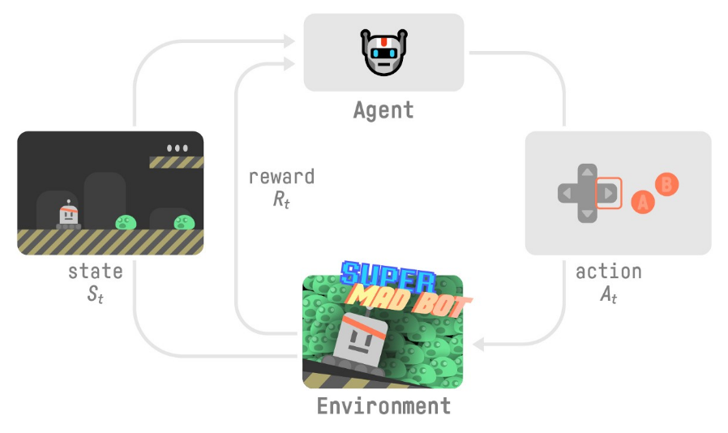

 - Our **Agent** receives **State S<sub>0</sub>** from the **Environment** — We receive the first frame of our game (Environment).
 - Based on that **State S<sub>0</sub>**, the **Agent** takes **Action A<sub>0</sub>** — our Agent will move to the right.
 - The **Environment** goes to a new **State S<sub>1</sub>** — new frame.
 - The **Environment** gives some **Reward R<sub>1</sub>** to the **Agent** — We’re not dead (Positive Reward +1).

**This RL loop outputs a sequence of "State", "Action", "Reward" and next "State":**

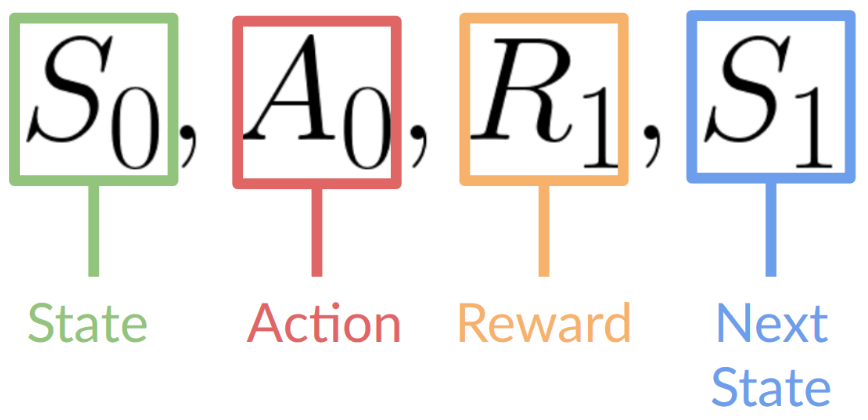

> The agent’s goal is to `maximize its cumulative reward`, called the expected return.

---

<div id="states"></div>

## States

Well, to begin understanding what **Actions**, **States**, and **Rewards** are, let's think about a *chess game*:

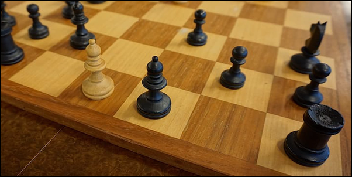

> Let's imagine that the **states** are the positions in which the pieces are located **at the moment**.

If two people (or even one playing against themselves) are playing at a certain moment of the game, the pieces will be positioned in very specific regions of the two opponents, and this is what we can call or define as a **state**.


> **NOTE:**  
> That is, the position in which the pieces are in this specific scenario.

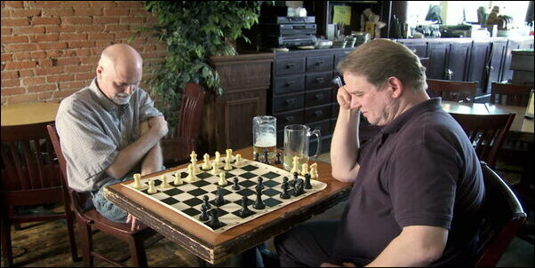

> **NOTE:**  
> Well, now you'll agree with me that if I move even a single piece, we'll have another state. That is, another specific scenario.

---

<div id="actions"></div>

## Actions

Okay, but what is an **Action** then? In a chess game, an action can be an agent making a move (moving a piece):

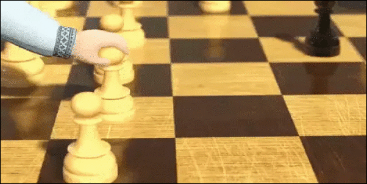

Well, now think with me... What happens with each of my actions in a chess game?

> **A new state is created.**

That's easy to understand because with each **action**, we will have a new *specific scenario*. That is, a new state.

---

<div id="rewards"></div>

## Rewards

> The *"reward"* is fundamental in Reinforcement Learning because it’s **the only feedback** for the agent (positive or negative).

So, following our line of thought in a chess game, the **rewards** will be the **feedback** we will have **after each action**.

Look at the scenario below:

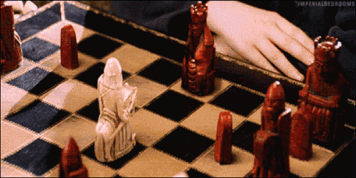

> **In this above scenario, was the *reward* *positive* or *negative*?**

 - **It depends:**
   - If you were a *white piece* that moved and was captured - The rewards were negative (-1).
   - Now if you were the *red piece* moving to capture the opponent - The reward was positive (+1).

> **NOTE:**  
> Another observation here is that an agent can take an **action** that returns *zero*. That is, no pieces were lost on either side.

Now think as if you were a **Data Scientist**, how could you *"accumulate"* these **rewards** mathematically?

> **With a *Cost Function*.**

---

<div id="expected-return"></div>

## Expected Return

The goal of the agent is to maximize the cumulative rewards, we need to represent this cumulative reward in a formal way to use it in the calculations. We can call it as **"Expected Return"** and can be represented as:

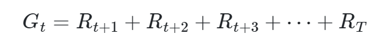  

> **NOTE:**  
> Where **"T"** is the final time step.

Now let's look at the same formula from another perspective:

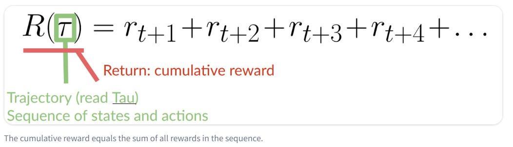  

Let's break it down the formula above:

 - Trajectory
   - In the context of Reinforcement Learning, a *"trajectory"* refers to the sequence of states, actions, and rewards experienced by an agent as it interacts with the environment over a certain period of time.
 - $R(\tau)$
   - This represents the cumulative reward for a **"trajectory 𝜏"**, which is the sum of rewards received along that trajectory.
 - $r_{t+1} + r_{t+2} + r_{t+3} + r_{t+4}$
   - These terms represent the rewards received at specific time steps within the trajectory. For example:
     - $r_{t+1}$ represents the reward received at time step $t+1$ in the trajectory.
     - $r_{t+2}$ represents the reward received at time step $t+2$ in the trajectory.

---

<div id="discount-factor"></div>

## Discounted Return (Discount Factor | 𝛾)

The **Discounted Return (Discount Factor | 𝛾)** (prounced “gamma”) determines how much a future reward should be discounted compared to a current reward.

> **NOTE:**  
> On the other hand, **Discounted Return (Discount Factor | 𝛾)** forces the agent to focus on immediate rewards instead of future rewards.

```md
OK, but why do future rewards need to be discounted compared to current rewards?
```

To understand first, let's recall the **"Expected Return"** formulas:

**Example-01:**  
  

**Example-02:**  
  

 - The equations (are the same) above works for **"Episodic Tasks"**.
 - For **"Continuing Tasks"**, we need to update this equation:
   - As we don’t have a limit of time step **"T"** in **continuing tasks**.
   - **Discounted Return (Discount Factor | 𝛾)** is introduced here which **forces the agent to focus on immediate rewards instead of future rewards**.
   - **NOTE:** The value of **"𝛾"** remains between **"0"** and **"1"**.

Adding the **Discounted Return (Discount Factor | 𝛾)** we have the following formula:

**Example-01:**  
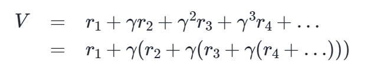  

Now let's look at the same formula from other perspectives:

**Example-02:**  
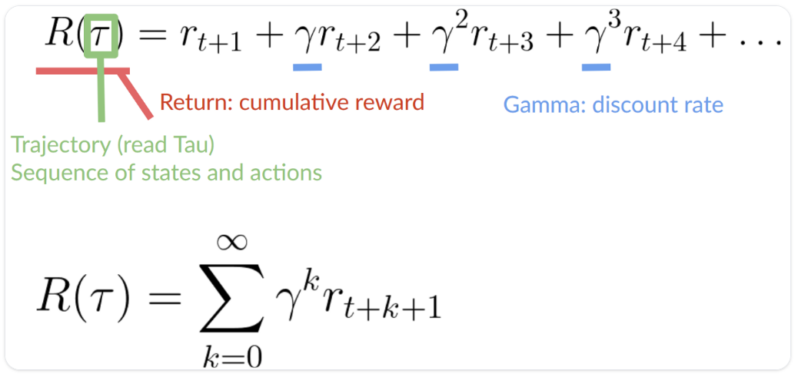  

For example, let’s imagine:

 - Our agent is a *tiny mouse (pequeno rato)* that can move one tile at each time step.
 - And your opponent is the *cat* (that can move too).
 - **NOTE:** The *mouse’s goal* is to *eat the maximum amount of cheese before being eaten by the cat*.

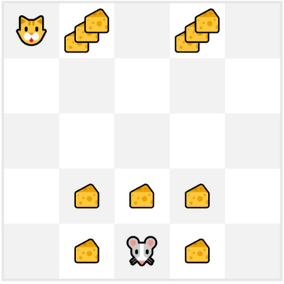  

 - As we can see in the diagram:
   - it’s more probable to eat the cheese near us.
   - Than the cheese close to the cat (the closer we are to the cat, the more dangerous it is).
 - Consequently:
   - **EN:** The reward near the cat, even if it is bigger (more cheese), will be more *"discounted"* since we’re not really sure we’ll be able to eat it.
   - **PT:** A recompensa perto do gato, mesmo que seja maior (mais queijo), terá mais *"desconto"* já que não temos certeza se conseguiremos comê-lo.

### Gamma (𝛾)

To discount the rewards, we proceed like this:

 - **We define a discount rate called gamma (𝛾):**
   - It must be between **0** and **1**.
   - Most of the time between **0.95** and **0.99**.
   - The larger the *gamma (𝛾)*, the smaller the discount:
     - This means our agent cares more about the long-term reward (Isso significa que nosso agente se preocupa mais com a recompensa de longo prazo).
   - On the other hand, the smaller the *gamma (𝛾)*, the bigger the discount:
     - This means our agent cares more about the short term reward (Isso significa que nosso agente se preocupa mais com a recompensa de curto prazo).
 - **Then, each reward will be discounted by gamma (𝛾) to the exponent of the time step:**
   - **EN:**  As the time step increases, the cat gets closer to us, so the future reward is less likely to happen.
   - **PT:** À medida que o intervalo de tempo aumenta, o gato se aproxima de nós, então é menos provável que a recompensa futura aconteça.

Summary:

 - **EN:** The *rewards* that arrive early (at the start of the game) are more likely to happen as they are more predictable than long-term future rewards.
 - **PT:** As recompensas que chegam mais cedo (no início do jogo) têm maior probabilidade de acontecer, pois são mais previsíveis do que as recompensas futuras a longo prazo.


<!--- ( MDP ) --->

---

<div id="intro-to-mdp"></div>

## Markov Decision Process (MDP)

> The **Markov Decision Process** is a state in which the current state contains enough (suficiente) information to allow us to plan the future without depending on previous states.

For example, imagine that we receove a game Super Mario World in a specific state:

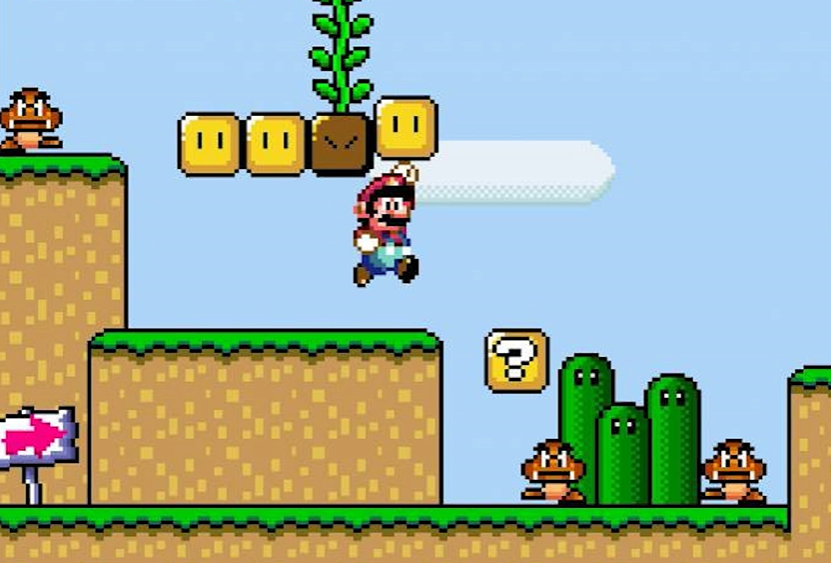  

**NOTE:**  
From this state (frame) the agent must be able to know where to go, without depending on previous states. In other words, planning the future without depending on previous states.

The **Markov Decision Process** is the following:

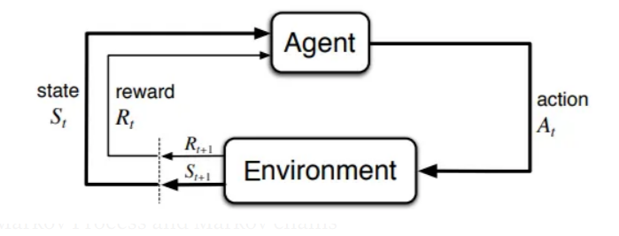  

For example, we can think of the **"Agente"** as a *"brain"* and the **"Environment"** as the *"world"*:

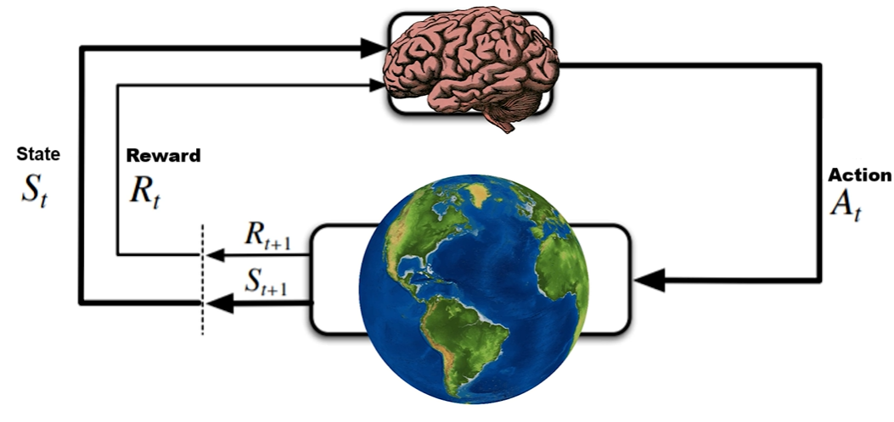  

The most common formulation of MDPs is a **Discounted-Reward Markov Decision Process**:

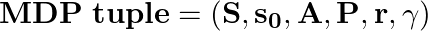  

Where:

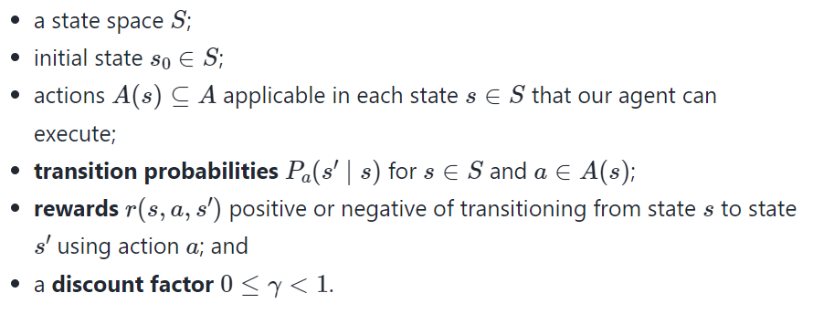  


<!--- ( Policy ) --->

---

<div id="intro-to-policy"></div>

## Policy (π)

> The **"Policy π"** is the *brain of our Agent*, it’s the function that tells us what action to take given the state we are in - So it defines the agent’s behavior *at a given time*.

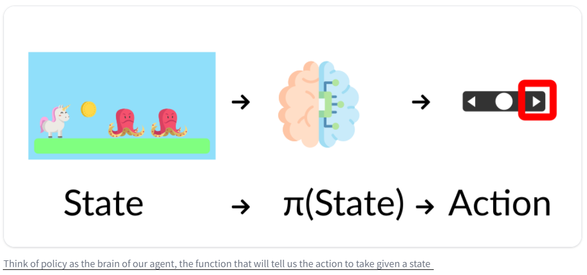

 - This Policy is the function we want to learn, our goal is to find the *"optimal policy `π*`"*.
 - The *"policy that maximizes expected return"* when the agent acts according to it - **We find this `π*` through training**.

There are two approaches to train our agent to find this optimal `policy π*`:

 - **Directly:**
   - Directly, by teaching the agent to learn which action to take, given the current state: *"Policy-Based Methods"*.
 - **Indirectly:**
   - Indirectly, teach the agent to learn which state is more valuable and then take the action that leads to the more valuable states: *"Value-Based Methods"*.

---

<div id="policy-based-methods"></div>

## Policy-Based Methods

> In **Policy-Based methods**, we learn a *"policy function directly"*.

 - This function will define a mapping from each state to the best corresponding action.
 - Alternatively, it could define a probability distribution over the set of possible actions at that state.

For example, see the image below:

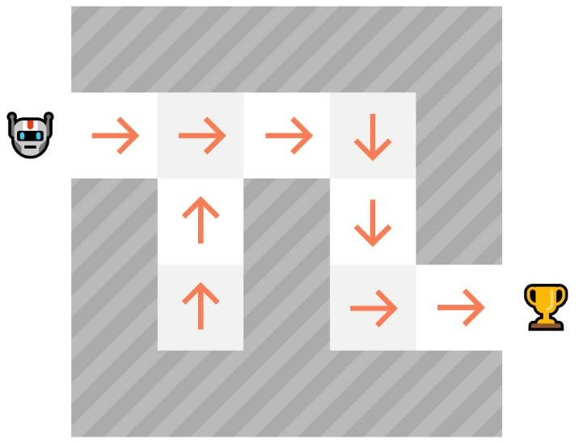  

> **NOTE:**  
> As we can see here, the *"policy (deterministic)"* **directly indicates the action to take for each step**.

For this type we have to types of policies:

 - **Deterministic:**
   - A *policy* at a given state will always return the same action.
 - **Stochastic:**
   - Outputs a probability distribution over actions.

For example, see the diagram below to understand more easily:

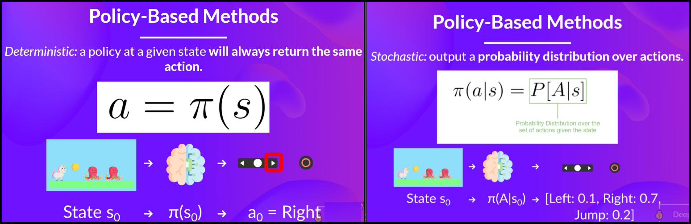  

See that:

 - **The Determinist approach:**
   - Always returns the same action.
 - **The Stochastic approach:**
   - Return probability of each action.

---

<div id="value-based-methods"></div>

## Value-based methods

> In *"value-based methods"*, **we learn a value function** that **maps a state to the expected value of being at that state (mapeia um estado para o valor esperado de estar nesse estado)**. 

In the **"value-based methods"** we:

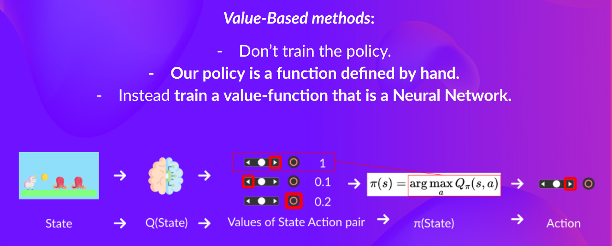  

---

<div id="policy-vs-value"></div>

## Policy vs. Value

> Here, let's recall and see the difference between **Policy-Based Methods** and **Value-Based Methods**.

First, let's see the main idea of each approach:

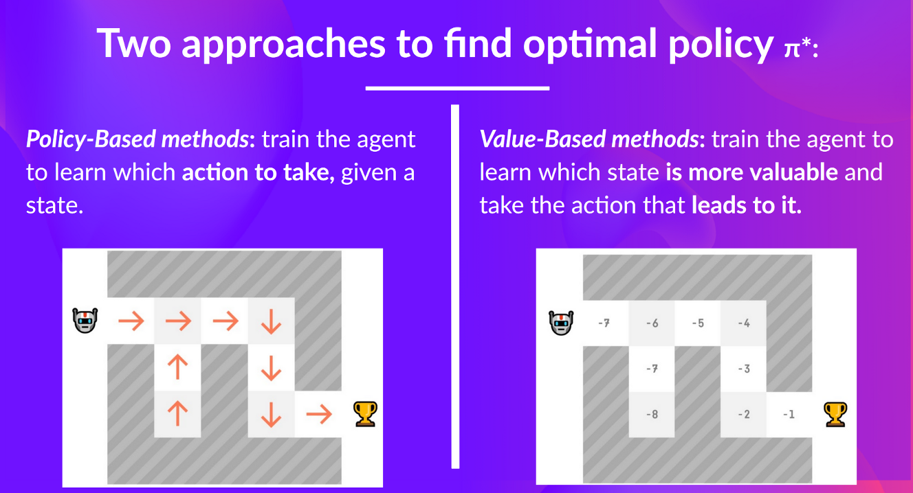  

 - **Policy-Based Methods:**
   - In *"policy-based training"*, the optimal policy (denoted `π*`) is found by training the policy *"directly"*.
 - **Value-Based Methods:**
   - In *"value-based training"*, finding an optimal value function (denoted `Q*` or `V*`) leads (leva) to having an optimal policy.


<!--- ( Q-Learning ) --->

---

<div id="intro-to-q-learning"></div>

## Q-Learning

> The first thing we need to know is that the **“Q-Learning”** algorithm is based on the **“Value-Based methods”**.

To understand the **"Q-Learning"** algorithm first, let's imagine you’re a **"Knight"** and you need to save the **"Princess"** trapped in the castle:

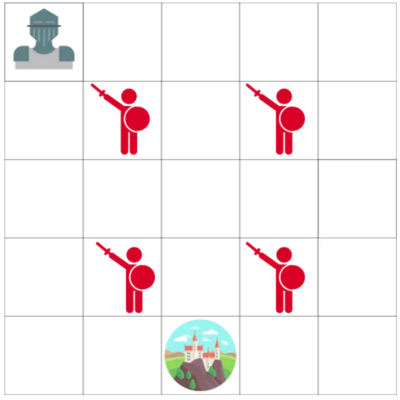  

The Game following the rules below:

 - You can move one tile at a time.
 - The enemy can’t:
   - But land on the same tile as the enemy, and you will die.
 - Your goal is to go the castle by the fastest route possible (Seu objetivo é chegar ao castelo pelo caminho mais rápido possível).
 - **NOTE:** This can be evaluated using a “points scoring” system:
   - You lose **"-1"** at each step (losing points at each step helps our agent to be fast).
   - If you touch an enemy, you lose **"-100"** points, and the episode ends.
   - If you are in the castle you win, you get **"+100"** points.

The question is:

> **How do you create an Agent that will be able to do that?**

One strategy is:

 - The Agent tries to go to each tile, and then colors each tile:
   - Green for "safe".
   - Red if "not safe".

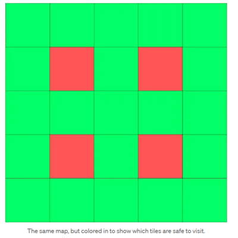  

> **NOTE:**  
> Then, we can tell our Agent to take only green tiles.

However, using this approach we have a problem:

 - We don’t know *"the best tile to take"* when green tiles are adjacent each other.
 - So our Agent can fall (cair) into an infinite loop by trying to find the castle.

### Q-Table

To solve the problem our Agente doesn't know *"the best tile to take"*, we can create a table where we’ll calculate the maximum expected future reward, for each Action at each State.

For example, see the **"Q-Table"** below:

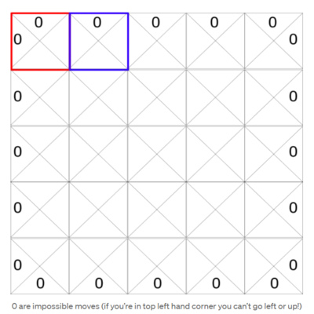  

Each State (tile) allows four possible actions:

 - Moving:
   - Left.
   - Right.
   - Up.
   - Down.

> **NOTE:**  
> See that the corners are zero (0), that is, we can't move to the corners.

In terms of computation, we can transform this grid into a table:

 - The **columns** will be the *four* actions *(left, right, up, down)*.
 - The **rows** will be the States.
 - The **value** of each cell will be the **maximum expected future reward** for that given state and action.

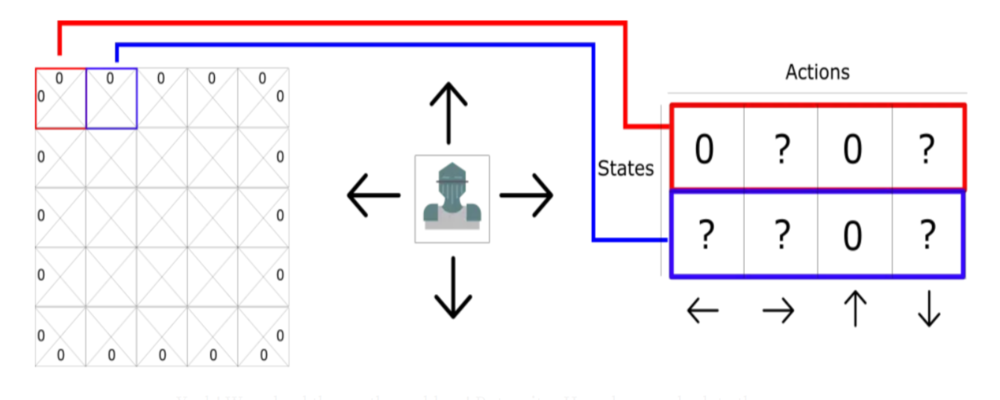  

> Think of this **"Q-table"** as a game **“Cheat Sheet (Folha de Dicas)”**.

Thanks to that, we know for each state (each line in the Q-table) what’s the best action to take, by finding the highest score in that line.

---

<div id="q-learning-algorithm"></div>

## Q-Learning Algorithm


> **OK, but how do we calculate the values for each element of the Q-Table?**

To learn each value of this **Q-Table**, we’ll use the **Q-Learning algorithm**:

**Q-learning Algorithm: learning the Action Value Function:**  
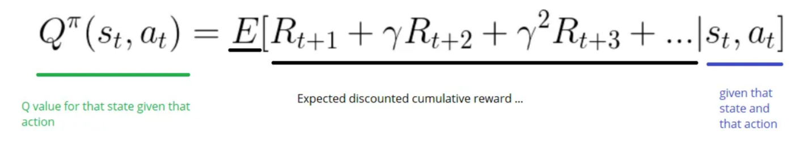  

The **Action Value Function (or “Q-function”)** takes two inputs:

 - “state” and “action”.
 - It returns the **Expected Future Reward** of that action at that state.

---

<div id="ql-and-be"></div>

## Q-Learning and Bellman Equation

The **"Q-Table"** will give us a better and better approximation by iteratively updating **Q(s, a)** using the **"Bellman Equation"**.

For example, see the process below:

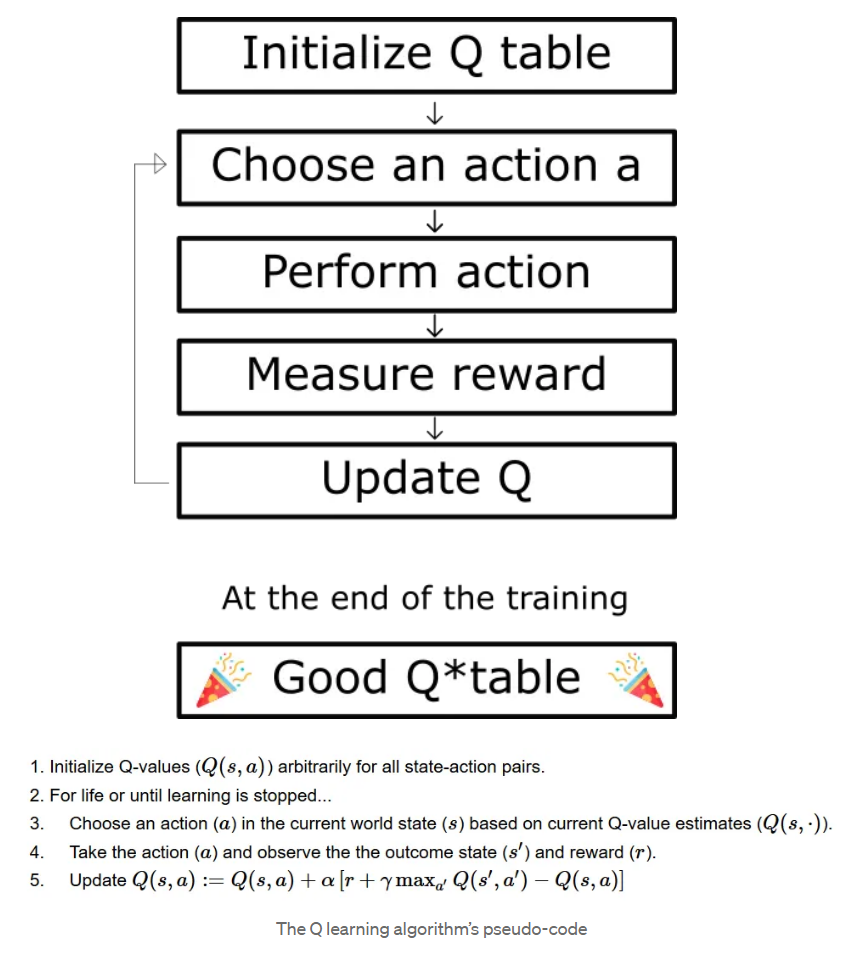  

In the first step, we have to initialize the **Q-Table**:

 - We build a **Q-table**, with **"m"** *cols (m= number of actions)*.
 - And **"n"** *rows (n = number of states)*.
 - Finally, we initialize the values as **0**.

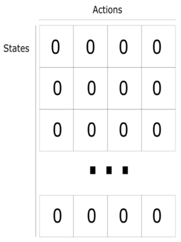  


<!--- ( Settings ) --->

---

<div id="settings"></div>

## Settings

**CREATE VIRTUAL ENVIRONMENT:**  
```bash
python -m venv ai-environment
```

**ACTIVATE THE VIRTUAL ENVIRONMENT (LINUX):**  
```bash
source ai-environment/bin/activate
```

**ACTIVATE THE VIRTUAL ENVIRONMENT (WINDOWS):**  
```bash
source ai-environment/Scripts/activate
```

**UPDATE PIP:**
```bash
python -m pip install --upgrade pip
```

**INSTALL PYTHON DEPENDENCIES:**  
```bash
pip install -U -v --require-virtualenv -r requirements.txt
```

**Now, Be Happy!!!** 😬


<!--- ( References ) --->

---

<div id="ref"></div>

## References

 - **General:**
   - [Deep Reinforcement Learning Course](https://huggingface.co/learn/deep-rl-course/unit0/introduction)
   - [Introduction to Reinforcement Learning](https://gibberblot.github.io/rl-notes/index.html)
   - [Didatica Tech](https://didatica.tech/)
 - **Discounted Return (Discount Factor | 𝛾):**
   - [Reinforcement Learning - Developing Intelligent Agents](https://deeplizard.com/learn/video/a-SnJtmBtyA)
 - **Markov Decision Processes:**
   - [Markov Decision Processes](https://gibberblot.github.io/rl-notes/single-agent/MDPs.html)
 - **Bellman Equation:**
   - [Bellman Optimality Equation in Reinforcement Learning](https://www.analyticsvidhya.com/blog/2021/02/understanding-the-bellman-optimality-equation-in-reinforcement-learning/)
 - **Q-Learning:**
   - [Diving deeper into Reinforcement Learning with Q-Learning](https://medium.com/free-code-camp/diving-deeper-into-reinforcement-learning-with-q-learning-c18d0db58efe)


---

**R**odrigo **L**eite da **S**ilva - **drigols**
