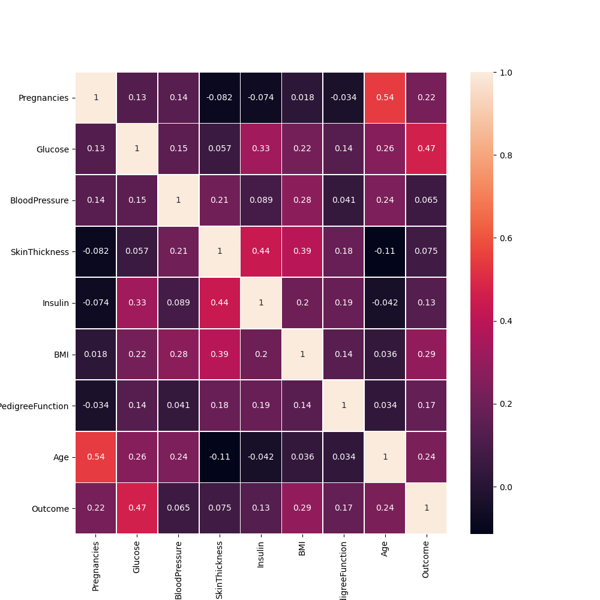

# Correlação (Feature selection) 

## Conteúdo

 - [01 - Introdução à Correlação](#01)
 - [02 - Criando um mapa de calor (heatmap) para ver à correlação entre variáveis](#02)

<div id='01'></div>

## 01 - Introdução à Correlação

Ok, agora nós vamos aprender o calculo da correlação. Mas afinal, para que serve esse cálculo? Bem, o cálculo da correlação tenta identificar quais variáveis estão conectadas (ou mais relacionadas) uma com a outra.

Suponha que nós temos uma amostra (dataset) de dados de várias pessoas e entre as variáveis (colunas) nós temos as variáveis `salário` e `quantidade de bens`. Se você parar para pensar pode existir uma relação entre essas variáveis, seja essa relação *(correlação)* diretamente ou inversamente proporcional.

**NOTE:**  
Bem, nem tudo são flores! Essas variáveis que existem uma certa relação *(correlação)* é o que nós chamamos de variáveis dependentes. Mas essa relação não é uma coisa boa para um modelo de Machine Learning.  

Pensem comigo, se eu tenho 2 variáveis que são diretamente ou inversamente proporcional, por que eu tenho essas variáveis que podem me gerar basicamente o mesmo resultado? Ou seja, eu tenho 2 variáveis, porém com apenas uma já daria para prever (estimar) a outra. Logo, uma das variáveis não está nos ajudando!!!

> Basicamente a vantagem do cálculo da correlação é ver quais variáveis estão mais/muito correlacionadas eliminar uma delas para facilitar o trabalho do nosso modelo.

**NOTE:**  
Outra problema é que essas 2 variáveis cada uma vai ter um peso e no fim nós podemos está dando um peso duplo para a mesma característica.

Agora vamos ver a matemática do [Coeficiente de correlação de Pearson (Pearson correlation coefficient)](https://en.wikipedia.org/wiki/Pearson_correlation_coefficient). A fórmula é a seguinte:

  

Bem, dependendo do resultado da nossa fórmula nós vamos ter uma varição de **1** e **-1**, onde:

 - **1** (máximo da correlação), significa que nós temos o máximo de correlação possível, ou **perfeita positiva**:
   - Ou seja, nossas variáveis estão muito correlacionadas;
   - Também conhecida como correlação perfeita, cada variação em uma altera a mesma coisa na outra positivamente.
 - **-1**, significa que nós temos uma correlação **perfeita negativa**:
   - Aumenta um pouco em uma e a outra diminui aquele mesmo pouco também.

Uma interpretação melhor é a seguinte para saber quão forte é a relação das nossas variáveis:

 - **0.9** - Para mais ou para menos indica uma correlação muito forte.
 - **0.7** a **0.9** - Positivo ou negativo indica uma correlação forte.
 - **0.5** a **0.7** - Positivo ou negativo indica uma correlação moderada.
 - **0.3** a **0.5** - Positivo ou negativo indica uma correlação fraca.
 - **0** a **0.3** - Positivo ou negativo indica uma correlação desprezível.

Bem, graças a Deus primeiramente, o Python e as comunidades Open-Source, nós não vamos precisar fazer esses cálculos manualmente sempre.  
Vamos ver como é simples aplicar isso na prática em uma amostra de dados real. Para isso nós vamos utilizar o Dataset [Pima Indians Diabetes Database](https://www.kaggle.com/uciml/pima-indians-diabetes-database/data#) que tenta prever se um paciente tem ou não diabetes de acordo com algumas variáveis em conjunto com a função **corr()** do *Pandas*:

[corr.py](src/corr.py)
```python
import pandas as pd

data = pd.read_csv('../datasets/datasets_228_482_diabetes.csv')
print(data.corr(method = 'pearson'))
```

**OUTPUT:**  
```python
                          Pregnancies   Glucose  BloodPressure  SkinThickness   Insulin       BMI  DiabetesPedigreeFunction       Age   Outcome
Pregnancies                  1.000000  0.129459       0.141282      -0.081672 -0.073535  0.017683                 -0.033523  0.544341  0.221898
Glucose                      0.129459  1.000000       0.152590       0.057328  0.331357  0.221071                  0.137337  0.263514  0.466581
BloodPressure                0.141282  0.152590       1.000000       0.207371  0.088933  0.281805                  0.041265  0.239528  0.065068
SkinThickness               -0.081672  0.057328       0.207371       1.000000  0.436783  0.392573                  0.183928 -0.113970  0.074752
Insulin                     -0.073535  0.331357       0.088933       0.436783  1.000000  0.197859                  0.185071 -0.042163  0.130548
BMI                          0.017683  0.221071       0.281805       0.392573  0.197859  1.000000                  0.140647  0.036242  0.292695
DiabetesPedigreeFunction    -0.033523  0.137337       0.041265       0.183928  0.185071  0.140647                  1.000000  0.033561  0.173844
Age                          0.544341  0.263514       0.239528      -0.113970 -0.042163  0.036242                  0.033561  1.000000  0.238356
Outcome                      0.221898  0.466581       0.065068       0.074752  0.130548  0.292695                  0.173844  0.238356  1.000000
```

**NOTE:**  
 - Vejam que a nossa saída foi o tamanho da correlação entre as nossas variáveis **(Muito parecido com o Grafo de uma Matriz de Adjacência)**.
 - Outro ponto importante a se notar é que a relação de uma variável com ela mesma é **1**:
   - Ou seja, **perfeita positiva**.

<div id='02'></div>

## 02 - Criando um mapa de calor (heatmap) para ver à correlação entre variáveis

Outra maneira bem mais interessante e visual de ver correlações entre as variáveis e criar um **mapa de calor (heatmap)**. Vamos ver isso em Python:

[heatmap.py](src/heatmap.py)
```python
import pandas as pd
import seaborn as sns
import matplotlib.pyplot as plt

data = pd.read_csv('../datasets/datasets_228_482_diabetes.csv')

# Plot.
plt.figure(figsize=(10, 10))
sns.heatmap(data.corr(), annot=True, linewidths=.5)
plt.savefig('../images/plot-01.png', format='png')
plt.show()
```

**OUTPUT:**  
  

**NOTE:**  
Se você prestar atenção vai ver que ele usou apenas os dados numéricos para ver essa correlação e faz todo sentido já que a fórmula de `Pearson` trabalha com a covariância de números.

---

**REFERÊNCIA:**  
[Didática Tech - Inteligência Artificial & Data Science](https://didatica.tech)  
