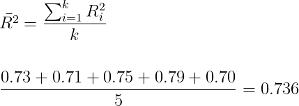

# Validação Cruzada e Ajuste Fino dos Parâmetros

## Conteúdo

 - [01 - Introdução a divisão de dados](#01)
 - [02 - O problema da divisão dos dados](#02)
 - [03 - Validação Cruzada: K-Fold](#03)
 - [04 - KFold na Prática](#k-fold-in-practice)

<div id="01"></div>

## 01 - Introdução a divisão de dados

Bem, é muito comum quando estamos iniciando com *Data Science* e *Machine Learning* dividirmos nosso conjunto de dados em dados de **treino** e **teste**. A porcentagem mais comum é essa:

  

Vale lembrar que:

 - **Os dados de treino são usado para treinar nosso modelo:** Por exemplo, em uma Regressão Linear nós podemos criar uma *reta de melhor ajuste* para ver relação entre os dados.
 - **E os dados de teste são utilizados para testar quão bom está aprendendo nosso modelo:** Por exemplo, na Regressão Linear, ver quão bom está nossa *reta de melhor ajuste* e depois testar as relações.

**NOTE:**  
Vale dar enfâse que os dados de **treino** e **teste** são escolhidos **aleatóriamente**. Por exemplo, se tivermos 100mil amostra para o nosso dataset:

 - 30mil vão ser escolhidas **aleatóriamente** para **teste**;
 - 70mil vão ser escolhidas **aleatóriamente** para **treino**.

<div id="02"></div>

## 02 - O problema da divisão dos dados

Agora pensem comigo... Se eu dividir o mesmo modelo novamente com a mesma porcentagem (%) para **treino** e **teste** e depois executar o meu modelo (com os dados de treino é claro), vou ter o mesmo resultado?

  

**Claro que não!!!**  
Os dados são divididos **aleatóriamente** para **treino** e **teste**. Ou seja, os dados que antes eram utilizados para teste agora podem está sendo utilizados para treino e vice-versa.

Então, temos um probleminha... Como podemos resolver isso?

<div id="03"></div>

## 03 - Validação Cruzada: K-Fold

Bem, agora vamos aprender uma ténica bem básica conhecida por **K-Fold**. Veja a imagem abaixo:

  

Essa técnica de **validação cruzada** é conhecida de **K-Fold** pelo o seguinte fato:

 - **K -** Significa o número de subdivisões (iguais) que nós fizemos: No nosso caso **K = 5**;
 - **Fold -** Sifnifica cada um dos **blocos** de cada **K**.

Veja essa outra imagem abaixo para ficar mais claro:

  

**Ok, mas o que muda essa abordagem da que nós utilizavamos antes?**  
Bem, pensem comigo... Para cada subdivisão vamos utilizar dados diferentes para **treino** e **teste**. Ou seja, vamos ter resultados diferentes de acordo com cada iteração **K** do nosso modelo.

Veja uma abstração de resultados de **R<sup>2</sup>** para cada subdivisão:

  

Agora é só escolher o que melhor representa o nosso modelo.

  

**NOTE:**  
Mas se pensarmos bem, uma maneira mais inteligente seria tirar a média de todos os nossos **R<sup>2</sup>**, algo parecido com isso:

  

  

**Ótimo, então essa abordagem é perfeita não é?**  
Pensando bem, nós devemos ter sempre muita cuatela quando aplicarmos essa abordagem. Isso, porque dependendo do nosso dataset o **custo computacional** pode ser muito grande já que nós vamos treinar o mesmo modelo em várias subdivisões.

**NOTE:**  
Outra observação muito importante é que a **Validação Cruzada K-Fold** não retorma um modelo (Por exemplo, Regressão Linear) pronto para nós utilizarmos. Ele retorna os **scores** de cada subdivisão, ou seja, quão performático cada uma é.

Isso é interessante para comparar a performance de vários modelos e ver qual é mais performático.

<div id="k-fold-in-practice"></div>

## 04 - KFold na Prática

Agora vamos praticar isso com **Python** e **Scikit-Learn**. Para isso vamos utilizar o dataset [Graduate Admission 2 - Predicting admission from important parameters](https://www.kaggle.com/mohansacharya/graduate-admissions).

[k-fold.py](src/k-fold.py)
```python
import matplotlib.pyplot as plt
import pandas as pd

from sklearn.model_selection import cross_val_score # Cross Validation Function.
from sklearn.model_selection import KFold # KFold Class.
from sklearn.linear_model import LinearRegression # Linear Regression class.

df = pd.read_csv("../datasets/Admission_Predict.csv")

df.drop('Serial No.', axis = 1, inplace = True)

x = df.drop('Chance of Admit ', axis = 1)
y = df['Chance of Admit ']

model  = LinearRegression()
kfold  = KFold(n_splits=5, shuffle=True) # shuffle=True, Shuffle (embaralhar) the data.
result = cross_val_score(model, x, y, cv = kfold)

print("K-Fold (R^2) Scores: {0}".format(result))
print("Mean R^2 for Cross-Validation K-Fold: {0}".format(result.mean()))
```

**OUTPUT:**  
```python
K-Fold (R^2) Scores: [0.75872602 0.84426748 0.67785048 0.82651749 0.82568233]
Mean R^2 for Cross-Validation K-Fold: 0.7866087616458846
```

Ótimo, agora temos o nosso **R<sup>2</sup>** para **K** iterações com **dados de treinos e teste aleatórios**. Agora vem a pergunta:

> Como eu posso criar uma função que veja a performance **(R<sup>2</sup>)** de vários modelos (Ex: Regressão) e escolha o melhor?

Será que isso é uma tarefa complexa? Vamos ver isso na prática:

[k-fold-v2.py](src/k-fold-v2.py)
```python
def ApplyesKFold(x_axis, y_axis):
  # Linear Models.
  from sklearn.linear_model import LinearRegression
  from sklearn.linear_model import ElasticNet
  from sklearn.linear_model import Ridge
  from sklearn.linear_model import Lasso

  # Cross-Validation models.
  from sklearn.model_selection import cross_val_score
  from sklearn.model_selection import KFold

  # KFold settings.
  kfold  = KFold(n_splits=10, shuffle=True) # shuffle=True, Shuffle (embaralhar) the data.

  # Axis
  x = x_axis
  y = y_axis

  # Models instances.
  linearRegression = LinearRegression()
  elasticNet       = ElasticNet()
  ridge            = Ridge()
  lasso            = Lasso()

  # Applyes KFold to models.
  linearRegression_result = cross_val_score(linearRegression, x, y, cv = kfold)
  elasticNet_result       = cross_val_score(elasticNet, x, y, cv = kfold)
  ridge_result            = cross_val_score(ridge, x, y, cv = kfold)
  lasso_result            = cross_val_score(lasso, x, y, cv = kfold)

  # Creates a dictionary to store Linear Models.
  dic_models = {
    "LinearRegression": linearRegression_result.mean(),
    "ElasticNet": elasticNet_result.mean(),
    "Ridge": ridge_result.mean(),
    "Lasso": lasso_result.mean()
  }
  # Select the best model.
  bestModel = max(dic_models, key=dic_models.get)

  print("Linear Regression Mean (R^2): {0}\nElastic Net Mean (R^2): {1}\nRidge Mean (R^2): {2}\nLasso Mean (R^2): {3}".format(linearRegression_result.mean(), elasticNet_result.mean(), ridge_result.mean(), lasso_result.mean()))
  print("The best model is: {0} with value: {1}".format(bestModel, dic_models[bestModel]))


if __name__ =='__main__':
  import pandas as pd

  df = pd.read_csv("../datasets/Admission_Predict.csv")
  df.drop('Serial No.', axis = 1, inplace = True)

  x = df.drop('Chance of Admit ', axis = 1)
  y = df['Chance of Admit ']

  ApplyesKFold(x, y)
```

**OUTPUT:**  
```python
# The first Run:
Linear Regression Mean (R^2): 0.7897084153867848
Elastic Net Mean (R^2): 0.5203451094489794
Ridge Mean (R^2): 0.7771667506690682
Lasso Mean (R^2): 0.2569904339264844
The best model is: LinearRegression with value: 0.7897084153867848

# The second run:
Linear Regression Mean (R^2): 0.7866950600812153
Elastic Net Mean (R^2): 0.532657928647275
Ridge Mean (R^2): 0.7876746996784943
Lasso Mean (R^2): 0.25087272330850907
The best model is: Ridge with value: 0.7876746996784943

# The Third run:
Linear Regression Mean (R^2): 0.7881860034693391
Elastic Net Mean (R^2): 0.5316122498998679
Ridge Mean (R^2): 0.7855190176462508
Lasso Mean (R^2): 0.2549741277785563
The best model is: LinearRegression with value: 0.788186003469339
```

  

**NOTE:**  
Vejam que eu rodei a função 3 vezes e como os dados de treino são aleatórios o modelo mais perfomático acaba mudando de acordo com os dados que estão sendo utilizados.

---

**REFERENCES:**  
[Didática Tech - Inteligência Artificial & Data Science](https://didatica.tech/)  

---

**Rodrigo Leite -** *Software Engineer*
