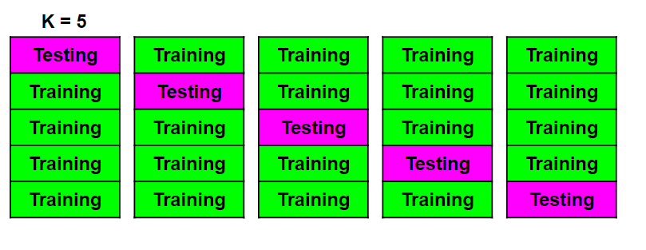

# Cross-Validation

## Contents

 - **Theory:**
   - [Data splitting](#data-splitting)
   - [Data splitting problem](#data-splitting-problem)
   - [Cross-Validation: K-Fold](#intro-to-kfold)
   - [Cross-Validation: Stratified K-Fold](#intro-to-stratified-k-fold)
 - **K-Fold examples:**
   - [Graduate Admission 2](#ga2)
 - **Stratified K-Fold examples:**
   - [Coming soon...](#)

---

<div id="data-splitting"></div>

## Data splitting

> Well, it's very common when work with Data Science project splitting split the data into **training** and **test**.

The most common percentage is the following:

  

 - **The training data are used to train the model.**
 - **The test data is used to test how good our model is learning.**


**NOTE:**  
It is worth emphasizing that the **training** and **testing** data are **chosen at random**.

For example, if we have 100k sample for our dataset:

 - *30.000* will be **chosen at random** for **testing**.
 - *70.000* will be **chosen at random** for **training**.

---

<div id="data-splitting-problem"></div>

## Data splitting problem

Now, think with me... If we split the same the same data again with the same percentage (%) for **training** and **testing**, then and run the model again:

> **Will I get the same result?**

  

**Of course not (Claro que não)!!!**  
The data are randomly split for **training** and **testing**. That's, data that was previously used for **testing** can now be used for **training** and vice versa.

> **Then, we have the problem... How to solve that?**

---

<div id="intro-to-kfold"></div>

## Cross-Validation: K-Fold

> Well, now let's learn a technique known as **K-Fold** to solve our data split problem.

This **cross-validation** technique is known as **K-Fold** for the following fact:

 - **K -** It means the number of (equal) subdivisions we made.
 - **Fold -** It means each of the blocks of each K.

For example, let's see a *cross-validation* *K-Fold* with **K=5**:

  

> **Ok, but what this approach changes in relation to the old?**

Well, think with me... For each subdivision we will use different data for **training** and **testing**. That is, we will have different results according to each **K** iteration of our model.

For example, let's see a fake sample **R²** with **K=5**:

  

Now, we just need to choose the better represents our model.

  

**NOTE:**  
But, if we think better about it, a smarter way would be to average all of our **R²**, something like this:

  
  

> **Ok, then that's a perfect approach?**

 - Come to think of it, we should always be very cautious when applying this approach:
   - This is because, depending on our dataset, the computational cost can be very high since we are going to train the same model in several subdivisions.
 - Another very important observation is that **K-Fold** *Cross Validation* does not return a model (For example, Linear Regression) ready for us to use:
   - It **returns** the **scores of each subdivision**, that is, how performant each one is.
 - This is interesting to compare the performance of various models and see which is more performant.

---

<div id="intro-to-stratified-k-fold"></div>

## Cross-Validation: Stratified K-Fold

To understand how Stratified K-Fold technique works, let's imagine that we classify if the students are **approved (1)** and **disapproved (0)** according your grade.

Imagine that **approved (1)** and **disapproved (0)** percentages of students were:

 - **Approved (1) =** 3%
 - **Disapproved (0) =** 97%

Now, suppose we apply the same [cross-validation K-Fold](#intro-to-kfold) logic to subdivide the data into **training** and **testing**.

  

> **Is it ok to subdivide our data for our classification problem this way?**

**NOT!**  
The problem (of this example) is the following... As the data is *randomly* divided and only **3%** of the students **approved (1)**, if these **3%** (all of them) fall into a *block (K)* of **testing**, when we train our model (with the training data of course) we will not get an efficient result. This is because none of the data referring to approved students is in the training block (K).

> **Ok, but how a solve that classification problem?**  
> Using **Stratified K-Fold**

The **Stratified K-Fold cross-validation** algorithm ensures (garante) that at least a percentage **(you can specify, eg: 1%)** of the data for a *classification problem (YES/NO)* is in the training data.

**NOTE:**  
That is, I can always specify that a **percentage (you can specify, eg: 1%)** of the 3% of students approved are in the **training** data.

  

---

<div id="ga2"></div>

## Graduate Admission 2

In this example, let's use ["Graduate Admission 2"](https://www.kaggle.com/mohansacharya/graduate-admissions) dataset to practice **K-Fold** *Cross-Validation*:

[k-fold.py](src/k-fold.py)
```python
from sklearn.model_selection import cross_val_score # Cross Validation Function.
from sklearn.model_selection import KFold # K-Fold Class.
from sklearn.linear_model import LinearRegression # Linear Regression class.

import pandas as pd


df = pd.read_csv("../datasets/Admission_Predict.csv")
df.drop('Serial No.', axis = 1, inplace = True)

x = df.drop('Chance of Admit ', axis = 1)
y = df['Chance of Admit ']

model  = LinearRegression()
kfold  = KFold(n_splits=5, shuffle=True) # shuffle=True, Shuffle (embaralhar) the data.
result = cross_val_score(model, x, y, cv = kfold)

print("K-Fold (R²) Scores: {0}".format(result))
print("Mean R² for Cross-Validation K-Fold: {0}".format(result.mean()))
```

**OUTPUT:**  
```python
K-Fold (R²) Scores: [0.77717416 0.76219833 0.76624331 0.80876491 0.83030883]
Mean R² for Cross-Validation K-Fold: 0.788937911164113
```

Great, now we have **R²** of *"K" iterations* of **training** and **testing** data randomly. Now, comes the question...


> **How can I create a function that sees the performance (R²) of several models (eg Regression) and chooses the best?**

Let's see, how apply this in the practice:

[k-fold-v2.py](src/k-fold-v2.py)
```python
def ApplyesKFold(x_axis, y_axis):

  from sklearn.linear_model import LinearRegression, ElasticNet, Ridge, Lasso
  from sklearn.model_selection import cross_val_score, KFold

  # KFold instance and settings - shuffle=True, Shuffle (embaralhar) the data.
  kfold  = KFold(n_splits=10, shuffle=True)

  # Models instances.
  linearRegression = LinearRegression()
  elasticNet       = ElasticNet()
  ridge            = Ridge()
  lasso            = Lasso()

  # Set the axes.
  x = x_axis
  y = y_axis

  # Applyes KFold to the models.
  linearRegression_result = cross_val_score(linearRegression, x, y, cv = kfold)
  elasticNet_result       = cross_val_score(elasticNet, x, y, cv = kfold)
  ridge_result            = cross_val_score(ridge, x, y, cv = kfold)
  lasso_result            = cross_val_score(lasso, x, y, cv = kfold)

  # Creates a dictionary to store Linear Models.
  dic_models = {
    "LinearRegression": linearRegression_result.mean(),
    "ElasticNet": elasticNet_result.mean(),
    "Ridge": ridge_result.mean(),
    "Lasso": lasso_result.mean()
  }
  # Select the best model.
  bestModel = max(dic_models, key=dic_models.get)
  
  # Print models scores and the best model.
  models_cores = f'''
  Mean of the R² for : {linearRegression_result.mean()}
  Mean of the R² for Elastic Net Mean (R^2): {elasticNet_result.mean()}
  Mean of the R² for Ridge Mean: {ridge_result.mean()}
  Mean of the R² for Lasso Mean: {lasso_result.mean()}
  The best model is: {bestModel} with R² value: {dic_models[bestModel]}
  '''
  print(models_cores)


if __name__ =='__main__':

  import pandas as pd

  df = pd.read_csv("../datasets/Admission_Predict.csv")
  df.drop('Serial No.', axis = 1, inplace = True)

  x = df.drop('Chance of Admit ', axis = 1)
  y = df['Chance of Admit ']

  ApplyesKFold(x, y)
```

**OUTPUT:**  
```python
# First Run:
Mean of the R² for : 0.7859299246841316
Mean of the R² for Elastic Net Mean (R^2): 0.5274544735222146
Mean of the R² for Ridge Mean: 0.7810896942475347
Mean of the R² for Lasso Mean: 0.2500586270150702
The best model is: LinearRegression with R² value: 0.7859299246841316

# Second run:
Mean of the R² for : 0.7844363670983473
Mean of the R² for Elastic Net Mean (R^2): 0.530324085528644
Mean of the R² for Ridge Mean: 0.7857379059266417
Mean of the R² for Lasso Mean: 0.22918993084165856
The best model is: Ridge with R² value: 0.7857379059266417

# Third run:
Mean of the R² for : 0.78801640804746
Mean of the R² for Elastic Net Mean (R^2): 0.5136802308202981
Mean of the R² for Ridge Mean: 0.7840030563633275
Mean of the R² for Lasso Mean: 0.2464651607747726
The best model is: LinearRegression with R² value: 0.78801640804746
```

  

**NOTE:**  
See that I ran the function 3 times and as the **training** and **testing** data are randomly chosen, the best model ends up changing according to the data being distributed.

---

**REFERENCES:**  
[Didática Tech - Inteligência Artificial & Data Science](https://didatica.tech/)  

---

**R**odrigo **L**eite da **S**ilva - **drigols**
