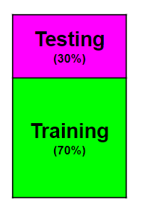
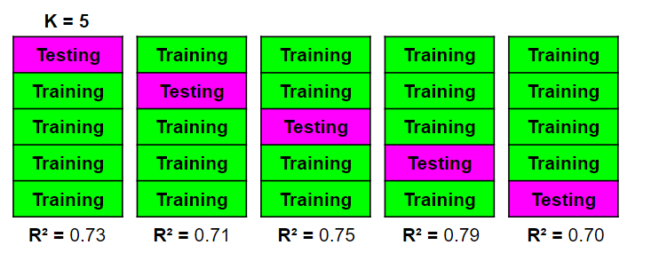

# K-Fold

## Contents

 - [01 - Introduction to Data Split](#data-split)
 - [02 - The problem of Data Split](#data-split-problem)
 - [03 - Cross Validation: K-Fold](#intro-to-kfold)
 - [04 - K-Fold in Practice](#kfold-in-practice)

<div id="data-split"></div>

## 01 - Introduction to Data Split

> Well, it is very common when we are starting with **Data Science** and **Machine Learning** to divide our dataset into **training** and **testing** data.

The most common percentage (%) is this:

  

Please note that:

 - **The training data is used to train our model:** For example, in a Linear Regression we can create a *best fit line* to see the relationship between the data;
 - **And the testing data is used to test how good our model is learning:** For example, in Linear Regression, see how good our *best fit line* is and then test the relationships.

**NOTE:**  
It is worth emphasizing that the **training** and **testing data** are chosen at random. For example, if we have 100.000 samples for our dataset:

 - 30.000 will be chosen at random for **testing**;
 - 70.000 will be chosen at random for **training**.

<div id="data-split-problem"></div>

## 02 - The problem of Data Split

Now think with me ... If I divide the same model again with the same percentage (%) for training and testing and then execute my model (with the training data of course), will I have the same result?

  

**Of course not!!!**  
The data is divided **randomly** for **training** and **testing**. That is, the data that used to be used for testing can now be used for training and vice versa.

So, we have a little problem ... How can we solve this?

<div id="intro-to-kfold"></div>

## 03 - Cross Validation: K-Fold

Well, now we are going to learn a very basic technique known as **K-Fold**.

See the image below:

  

This **cross-validation** technique is known as **K-Fold** for the following fact:

 - **K -** It means the number of subdivisions *(equal)* that we did: In our case **K = 5**;
 - **Fold -** Means each of the blocks of each **K**.

See this other image below for clarity:

  

**Okay, but what changes this approach from the one we used before?**
Well, think with me... For each subdivision we will use different data for **training** and **testing**. That is, we will have different results according to each **K** iteration of our model.

See an abstraction of **R²** results for each subdivision:

  

Now just choose the one that best represents our model.

  

**NOTE:**  
But if you think about it, a smarter way would be to average all of our **R²**, something like this:

  

  

**Great, so this approach is perfect isn't it?**  
On second thought, we should always be very careful when applying this approach. This is because depending on our dataset the **computational cost** can be very large since we are going to train the same model in several subdivisions.

**NOTE:**  
Another very important observation is that **Cross-validation: K-Fold** does not return a model (For example, Linear Regression) ready for us to use. It returns the **scores** for each subdivision, that is, how *performant* each is.

This is interesting to compare the performance of various models and see which is more performative.

<div id="kfold-in-practice"></div>

## 04 - K-Fold in Practice

Now we are going to practice this with *Python* and *Scikit-Learn*. For that we will use the [Graduate Admission 2](https://www.kaggle.com/mohansacharya/graduate-admissions) *dataset*.

[k-fold.py](src/k-fold.py)  
```python
import matplotlib.pyplot as plt
import pandas as pd

from sklearn.model_selection import cross_val_score # Cross Validation Function.
from sklearn.model_selection import KFold # KFold Class.
from sklearn.linear_model import LinearRegression # Linear Regression class.

df = pd.read_csv("../datasets/Admission_Predict.csv")

df.drop('Serial No.', axis = 1, inplace = True)

x = df.drop('Chance of Admit ', axis = 1)
y = df['Chance of Admit ']

model  = LinearRegression()
kfold  = KFold(n_splits=5, shuffle=True) # shuffle=True, Shuffle (embaralhar) the data.
result = cross_val_score(model, x, y, cv = kfold)

print("K-Fold (R^2) Scores: {0}".format(result))
print("Mean R^2 for Cross-Validation K-Fold: {0}".format(result.mean()))
```

**OUTPUT:**  
```python
K-Fold (R^2) Scores: [0.83595449 0.80188521 0.62158707 0.82441102 0.82843378]
Mean R^2 for Cross-Validation K-Fold: 0.7824543131933422
```

Great, now we have our **R²** for **K** iterations with **random training and testing data**. Now comes the question:

> How can I create a function that sees the performance *(R²)* of several models (e.g. Linear Regression, Ridge Regression) and choose the best one?

Is this a complex task? Let's see this in practice:

[k-fold-v2.py](src/k-fold-v2.py)  
```python
def ApplyesKFold(x_axis, y_axis):
  # Linear Models.
  from sklearn.linear_model import LinearRegression
  from sklearn.linear_model import ElasticNet
  from sklearn.linear_model import Ridge
  from sklearn.linear_model import Lasso

  # Cross-Validation models.
  from sklearn.model_selection import cross_val_score
  from sklearn.model_selection import KFold

  # KFold settings.
  kfold  = KFold(n_splits=10, shuffle=True) # shuffle=True, Shuffle (embaralhar) the data.

  # Axis
  x = x_axis
  y = y_axis

  # Models instances.
  linearRegression = LinearRegression()
  elasticNet       = ElasticNet()
  ridge            = Ridge()
  lasso            = Lasso()

  # Applyes KFold to models.
  linearRegression_result = cross_val_score(linearRegression, x, y, cv = kfold)
  elasticNet_result       = cross_val_score(elasticNet, x, y, cv = kfold)
  ridge_result            = cross_val_score(ridge, x, y, cv = kfold)
  lasso_result            = cross_val_score(lasso, x, y, cv = kfold)

  # Creates a dictionary to store Linear Models.
  dic_models = {
    "LinearRegression": linearRegression_result.mean(),
    "ElasticNet": elasticNet_result.mean(),
    "Ridge": ridge_result.mean(),
    "Lasso": lasso_result.mean()
  }
  # Select the best model.
  bestModel = max(dic_models, key=dic_models.get)

  print("Linear Regression Mean (R^2): {0}\nElastic Net Mean (R^2): {1}\nRidge Mean (R^2): {2}\nLasso Mean (R^2): {3}".format(linearRegression_result.mean(), elasticNet_result.mean(), ridge_result.mean(), lasso_result.mean()))
  print("The best model is: {0} with value: {1}".format(bestModel, dic_models[bestModel]))


if __name__ =='__main__':
  import pandas as pd

  df = pd.read_csv("../datasets/Admission_Predict.csv")
  df.drop('Serial No.', axis = 1, inplace = True)

  x = df.drop('Chance of Admit ', axis = 1)
  y = df['Chance of Admit ']

  ApplyesKFold(x, y)
```

**OUTPUT:**  
```python
# First Run:
Linear Regression Mean (R^2): 0.7845797014983722
Elastic Net Mean (R^2): 0.5341357377445626
Ridge Mean (R^2): 0.7908718570820955
Lasso Mean (R^2): 0.2553768686054375
The best model is: Ridge with value: 0.7908718570820955

# Second Run:
Linear Regression Mean (R^2): 0.788771080521622
Elastic Net Mean (R^2): 0.5373908173719228
Ridge Mean (R^2): 0.7789218591457968
Lasso Mean (R^2): 0.25172131662743985
The best model is: LinearRegression with value: 0.788771080521622

# Third run:
Linear Regression Mean (R^2): 0.791907266683424
Elastic Net Mean (R^2): 0.5455381340765999
Ridge Mean (R^2): 0.7751402946554636
Lasso Mean (R^2): 0.22034414841895175
The best model is: LinearRegression with value: 0.791907266683424
```

  

**NOTE:**  
See that I ran the function 3 times and as the training data is random, the most perfect model ends up changing according to the data being used.

---

**REFERENCES:**  
[Didática Tech - Inteligência Artificial & Data Science](https://didatica.tech/)

---

**Rodrigo Leite -** *Software engineer*
