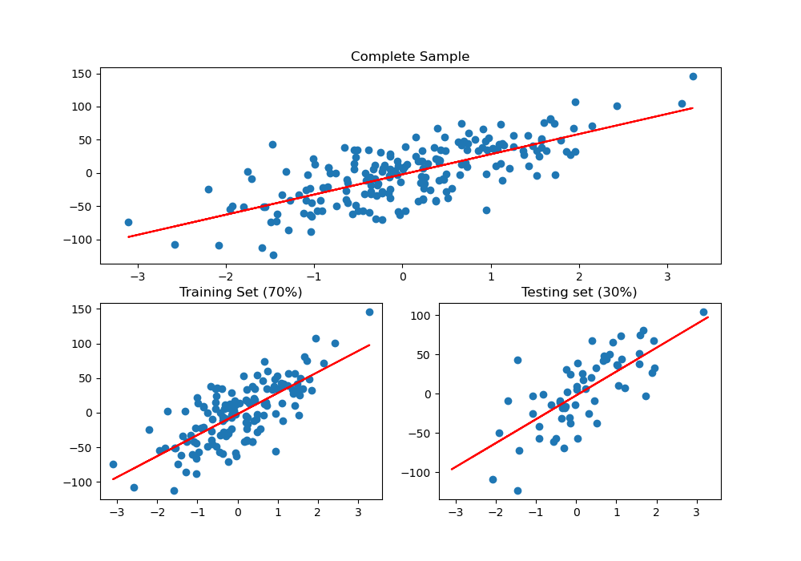

# Training vs Test sets

## Contents

 - [01 — Training vs Test sets — Theory](#theory)
 - [02 — Training & Testing sets with Scikit-Learn](#practice-w-sklearn)

<div id="theory"></div>

## 01 — Training vs Test sets — Theory

One thing you have to understand first is that Machine Learning models learn from data. Knowing this, it is interesting to divide our dataset into Training Data & Test Data.

**TRAINING DATA:**  
Ok, suppose we want to develop a program (model) that identifies whether an image **is a dog** or **not a dog**.

At first we will receive a set (sample) with several images of dogs, then we will take a part of this set *(usually 70%)* and give it to our model to learn by identifying common characteristics between dogs.

**TEST DATA:**  
Ok, did we reserve 70% of our dataset (sample) for our algorithm to learn and the other 30%? So, these are the test data. We will pass the test data to our model and see how well it is learning. For example:

> **Is this a dog?**

  

And our model will have to give a feedback saying if it is a dog or not.

**NOTE:**  
See how interesting it is to divide the dataset (sample) into **training** and **testing**? Another example would be to identify a disease in patients, how would we know if our model has learned (or is learning) well if we let it learn from the entire data set?

Therefore, he will learn from one part *(70% in our case)* and we will reserve another part (30% in our case) to test and see how well he (our model) is learning.

<div id="practice-w-sklearn"></div>

## 02 — Training & Testing sets with Scikit-Learn

Now let's see how it works in practice:

[training-testing.py](src/training-testing.py)
```python
def createRegression(samples,variavel_numbers, n_noise):
  from sklearn.datasets import make_regression
  x, y = make_regression(n_samples=samples, n_features=variavel_numbers, noise=n_noise)
  return x, y

if __name__ =='__main__':

  from sklearn.linear_model import LinearRegression
  from sklearn.model_selection import train_test_split
  from matplotlib import pyplot as plt

  reg = createRegression(200, 1, 30)
  model = LinearRegression()

  # Divide the data into Training and Testing - 30% for testing.
  x_train, x_test, y_train, y_test = train_test_split(reg[0], reg[1], test_size=0.30)

  # Just the training data is transferred to the fit() function (which finds the best values ​​for m and b).
  model.fit(x_train, y_train)

  a_coeff = model.coef_ # Take Angular Coefficient - m
  l_coeff = model.intercept_ # Take Linear Coefficient - b

  print('Angular Coefficient: {0}\nLinear Coefficient: {1}'.format(a_coeff, l_coeff))

  plt.figure(figsize=(10, 7))
  plt.subplot(211)
  plt.scatter(reg[0], reg[1])
  plt.title('Complete Sample')
  plt.plot(x_train, a_coeff*x_train + l_coeff,color='red')

  plt.subplot(223)
  plt.scatter(x_train, y_train)
  plt.title('Training Set (70%)')
  plt.plot(x_train, a_coeff*x_train + l_coeff,color='red')

  plt.subplot(224)
  plt.scatter(x_test, y_test)
  plt.title('Testing set (30%)')
  plt.plot(x_train, a_coeff*x_train + l_coeff,color='red')

  plt.savefig('../images/plot-01.png', format='png')
  plt.show()
```

**OUTPUT:**
```python
Angular Coefficient: [6.6424235]
Linear Coefficient: 0.039089037745552765
```

  

Now we will comment only on the crucial parts that were used to divide the data in Training and Test. First, we import the **train_test_split()** function.

```python
from sklearn.model_selection import train_test_split
```

Then we pass the following arguments to this function:

 - **1st —** The data on the x-axis of the data set;
 - **2nd —** Its correspondents on the y-axis;
 - **3rd —** Finally, how much we reserve the data for testing: **test_size = 0.30 = 30%**.

```python
x_train, x_test, y_train, y_test = train_test_split(reg[0], reg[1], test_size=0.30)
```

**NOTE:**  
Note that the **train_test_split()** function returns data already separated (randomly) into training and test data.

Now at last, we will train our model with training data only (as explained previously):

```python
model.fit(x_train, y_train)
```

---

**REFERENCES:**  
[Didática Tech - Inteligência Artificial & Data Science](https://didatica.tech/)  

---

**Rodrigo Leite -** *Software Engineer*
