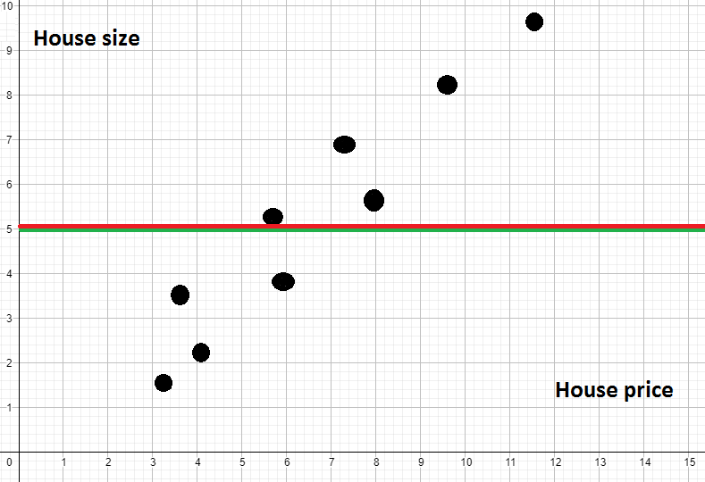

# Coefficient of Determination (R-square / R² / Adjusted R²)

## Contents

 - [[TSS] - Total Sum of Squares (Total variance of our dataset)](#tss)
 - [[RSS] - Residual Sum of Squares (How much of the variation was explained)](#rss)
 - [Coefficient of Determination R²](#r-square)
 - [Interpreting Coefficient of Determination R²](#interpreting-r2)
 - **Examples:**
   - [R² with scikit-learn](#r2-sklearn)

---

<div id='tss'></div>

## [TSS] - Total Sum of Squares (Total variance of our dataset)

Well, before getting the **Coefficient of Determination R²**, do you know *What the heck that (que diabos é isso)*? Not? Okay, let's go for a brief explanation...

Suppose we create a chart with some data to see the relationship between the house prices and your sizes, something like that *(and not very beautiful)*:

  

If you pay attention, you will see that our chart has an increasing variation, that is:

> **As the price increases, the size also increases - vice versa.**

Now, suppose I want to create a model that uses a line to represent this data, so that if I enter a new price it will try to find out (predict) the size of the house.

**NOTE:**  
The first idea we'll have is to calculate the average of the sizes and draw a straight line. Suppose the line looks like this:

  

Well, this line does not represent this model very well. If you pay attention you will see that we have a lot of errors. How could we calculate the error of this model?

 - **1st -** Just get each of the values (points on the graph);
 - **2nd -** Calculate the distance for my line:
   - Each point you will square;
   - And then add it to the next point.

In the graph the distances of the points to the line you can see like this:

  


> **This is what we know as *[TSS] - Total Sum of Squares (Total variance of our dataset)***.

  

**NOTE:**  
In fact (na verdade), what we did above is to take the *variance* out of our data.

---

<div id="rss"></div>

## [RSS] - Residual Sum of Squares (How much of the variation was explained)

Continuing... Now, suppose I created a new model, but with a line that seems to align better with this data, see below:

  

Okay, just looking at it, you can see that this line represents this data much better than just averaging the errors of all the data.

 - It appears to be growing at the same rate that this data is growing.
 - A final ela parece está crescendo a mesma taxa que esses dados estão crescendo.

> **But, how can I prove that this second line is really better than the other?**

Simple, just calculate each of these distances between our data and the green line (new line):

  

> **NOTE:**  
> **This is what we know as *[RSS] - Residual Sum of Squares (How much of the variation was explained)***.

  

**NOTE:**
Ok, if we calculate the data we will see that my **RSS** is smaller than the **TSS**. That is, my **TSS** is *better adjusted*.


> **But how do I know how much better my *TSS* is relative to the *TSS* - That is, how much better is it relative to the average? So that's where our dear R² comes in.**

---

<div id="r-square"></div>

## Coefficient of Determination R²

**R²** is nothing more than my **TSS** minus **RSS** divided by **TSS**:

  

> **But what the **R²** formula really means?**

 - **Numerator:**
   - Well, in the numerator we see how well my **RSS** model does against **TSS**.
 - **Denominator**
   - When we divide by TSS we are **normalizing**, that is, we are bringing this value to a scale between **0** and **1**.

**But, why normalize between 0 and 1?**  
Okay, let's see... Suppose we created a really bad Machine Learning model that created a line that was equal to the *[TSS] - Total Sum of Squares (Total variance of our dataset)*, something like this:

  

Hey, my **RSS** will be the same as my **TSS**, so my **R²** will be **0 (zero)**.

  

Now, let's imagine another scenario (it's just an example) where my data is distributed in a way where my Machine Learning model passes exactly through all the data, that is, **it didn't have any errors**:

  

So, since our **RSS** didn't have any errors, what will our **R²** be now?

  

> **Great, but what does our *R²* tell us?**

 - The **higher (closer to 1) R² is, the better my scenario** will be.
 - The **smaller (closer to 0) R² the worse my scenario** will be.

---

<div id="interpreting-r2"></div>

## Interpretating Coefficient of Determination R²

> **Ok, but how interprete our Coefficient of Determination R²?**

For example, imagine we create a Machine Learning model that generated **R² = 0.87**.

> **What that means?**

 - It means that my Machine Learning model is *87%* better than simply taking the average of the values.
 - Another interpretation approach is to say that my model explains *87%* of the *variance* in the data.

> **As well?**

 - Remember that the calculation of **TSS** is the calculation of the *variance* of our dataset:
   - That is, the total variance result.
 - While my **RSS** shows how much of this variance has been explained:
   - If my R2 were 1 it would mean that 100% of the variance would have been explained - zero error on the line.

---

<div id="r2-sklearn"></div>

## R² with scikit-learn

Let's see an easy example with **R²**:

[r-squared.py](src/r-squared.py)  
```python
"""
R-Squared or Coefficient of Determination
"""

def createRegression(data, features_number, n_noise):
    from sklearn.datasets import make_regression
    x, y = make_regression(n_samples=data, n_features=features_number, noise=n_noise)
    return x, y

if __name__ =='__main__':

    from sklearn.linear_model import LinearRegression
    from sklearn.model_selection import train_test_split

    reg = createRegression(200, 1, 30)
    model = LinearRegression()

    x_train, x_test, y_train, y_test = train_test_split(
        reg[0],
        reg[1],
        test_size=0.30
    )
    model.fit(x_train, y_train)

    # Coefficient of Determination R² / R-Squared.
    r2 = model.score(x_test, y_test)
    print('Coefficient of Determination R²: {0}'.format(r2))
```

**OUTPUT:**  
```python
Coefficient of Determination R²: 0.8998468700339362
```

**NOTE:**  
Great, we got our **R²** which was **0.91**, meaning we **explained 91%** of our dataset.

---

**REFERENCES:**  
[Didatica Tech - MÓDULO - I](https://didatica.tech/)  
