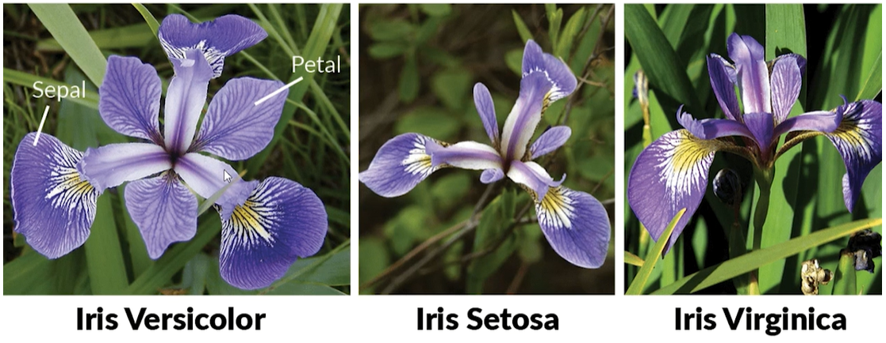

# KNN com Scikit-Learn

## Conteúdo

 - [01 - Métodos matemáticos utilizados no Algoritmo KNN](#01)
 - [02 - Classificando mulheres com câncer de mama com o Algoritmo KNN](#02)
   - [02.1 - Normalizando as colunas (festures) para tentar conseguir uma melhor accuracy](#02-1)
   - [02.2 - Escolhendo o melhor valor de "K" e método matemático com a classe GridSearchCV](#02-2)
 - [03 - Classificando Iris (um tipo de flor) com o dataset load_iris do Scikit-Learn](#03)
   - [03.1 - Aplicando o Algoritmo KNN no Dataset load_iris do Scikit-Learn](#03-1)

---

<div id="01"></div>

## 01 - Métodos matemáticos utilizados no Algoritmo KNN

Agora nós vamos aprender o básico de como implementar classificações com a biblioteca [Scikit-Learn](https://scikit-learn.org/stable/index.html). A primeira coisa que nós devemos saber é que existe **métodos matemáticos** diferentes para resolver esse problema. Isso porque o *Algoritmo KNN* utilizar uma maneira de calcular todas as distâncias entre o dado observado e os demais pontos do nosso conjunto de dados.

Os métodos mais comuns são os seguinte: [sklearn.neighbors.DistanceMetric](https://scikit-learn.org/stable/modules/generated/sklearn.neighbors.DistanceMetric.html)

  

**NOTE:**  
Esses métodos matemáticos podem perfomar melhor de acordo com o conjunto de dados que você tenha, por isso, é interessante você testar sempre que possível a maioria deles.

---

<div id="02"></div>

## 02 - Classificando mulheres com câncer de mama com o Algoritmo KNN

Para esse nosso primeiro exemplo de classificação utilizando o **Algoritmo KNN** nós vamos utilizar o dataset [sklearn.datasets.load_breast_cancer](https://scikit-learn.org/stable/modules/generated/sklearn.datasets.load_breast_cancer.html) que classifica se mulheres tem ou não câncer de mama.

O código completo vai ser o seguinte:

[knn_intro.py](src/knn_intro.py)
```python
from sklearn.model_selection import train_test_split
from sklearn.neighbors import KNeighborsClassifier
from sklearn.datasets import load_breast_cancer
import pandas as pd

pd.set_option('display.max_columns', 30)

df = load_breast_cancer() # Dataset instance.

x = pd.DataFrame(df.data, columns=[df.feature_names])
y = pd.Series(df.target)

x_train, x_test, y_train, y_test = train_test_split(x, y, test_size=0.3, random_state=16)

model = KNeighborsClassifier(n_neighbors=5)
model.fit(x_train, y_train)

result = model.score(x_test, y_test)
print("Accuracy:", result)
```

**OUTPUT:**  
```python
Accuracy: 0.9005847953216374
```

**NOTE:**  
Vejam que nós utilizamos a classe **KNeighborsClassifier** do **Scikit-Learn** no nosso modelo e passamos como argumento **K = 5** *(que é o valor default)*, para o mesmo ver qual é a classe predominante entre os **5 K's** mais próximos.

```python
model = KNeighborsClassifier(n_neighbors=5)
model.fit(x_train, y_train)
```

Por fim, nós pegamos a **accuracy** do nosso modelo que foi de **90%**:

```python
result = model.score(x_test, y_test)
print("Accuracy:", result)
```

**OUTPUT:**  
```python
Accuracy: 0.9005847953216374
```

---

<div id="02-1"></div>

## 02.1 - Normalizando as colunas (festures) para tentar conseguir uma melhor accuracy

É muito importante **normalizar os dados** para esse exemplo, porque se você olhar bem nosso dataset vai ver que temos várias colunas *(features)* com unidades de medidas diferentes. A variável **target** não vai precisar ser normalizada porque ela basicamente vai está sempre em um intervalo entre **0** e **1**.

Agora vamos aplicar a normalização das *colunas (features)* para ver se conseguimos uma melhor **accuracy**:

[knn_normalized.py](src/knn_normalized.py)
```python
from sklearn.model_selection import train_test_split
from sklearn.neighbors import KNeighborsClassifier
from sklearn.datasets import load_breast_cancer
from sklearn.preprocessing import MinMaxScaler
import pandas as pd

pd.set_option('display.max_columns', 30)

df = load_breast_cancer() # Dataset instance.

x = pd.DataFrame(df.data, columns=[df.feature_names])
y = pd.Series(df.target)

# Normalize columns (features).
normalized = MinMaxScaler(feature_range = (0 , 1))
x_norm = normalized.fit_transform(x)

x_train, x_test, y_train, y_test = train_test_split(x_norm, y, test_size=0.3, random_state=16)

model = KNeighborsClassifier(n_neighbors=5)
model.fit(x_train, y_train)

result = model.score(x_test, y_test)
print("Accuracy:", result)
```

**OUTPUT:**  
```
Accuracy: 0.9649122807017544
```

**NOTE:**  
Veja que agora nós conseguimos uma **accuracy** de **96%**. Isso porque as colunas (features) agora estão na mesma **unidade de medida**.

Outra mudança que tivemos nessa implementação foi passar os dados do *eixo-x* já normalizados **(x_norm)** para a função **train_test_split()**.

```python
x_train, y_train, x_test, y_test = train_test_split(x_norm, y, test_sizer=3.0, random_state=16)
```

---

<div id="02-2"></div>

## 02.2 - Escolhendo o melhor valor de "K" e método matemático com a classe GridSearchCV

Agora suponha que nós temos os seguintes problemas para resolver:

 - Qual o **melhor de "K"** para esse conjunto de dados;
 - E qual **método matemáticos** nós vamos utilizar para calcular a distância do meu dado **"x"** em relação aos demais, *para esse conjunto de dados*.

Bem, pode parecer muito complexo, mas com a classe [GridSearchCV](https://scikit-learn.org/stable/modules/generated/sklearn.model_selection.GridSearchCV.html) da biblioteca Scikit-Learn isso fica mais fácil.

Veja o código completo abaixo:

[knn_gridSearchCV.py](src/knn_gridSearchCV.py)
```python
from sklearn.model_selection import train_test_split
from sklearn.neighbors import KNeighborsClassifier
from sklearn.model_selection import GridSearchCV
from sklearn.datasets import load_breast_cancer
from sklearn.preprocessing import MinMaxScaler
import pandas as pd
import numpy as np

pd.set_option('display.max_columns', 30)

df = load_breast_cancer() # Dataset instance.

x = pd.DataFrame(df.data, columns=[df.feature_names])
y = pd.Series(df.target)

# Normalize predict variables.
normalized = MinMaxScaler(feature_range = (0 , 1))
x_norm = normalized.fit_transform(x)

# Defining values for KNN testing (K, Math method, and "p" values for math mathods = minkowski).
k_values = np.array([3, 5, 7, 9, 11]) # K Values.
math_method = ['minkowski', 'chebyshev'] # Math methods.
p_values = np.array([1, 2, 3, 4]) # p values for math methods.
grid_values = {'n_neighbors': k_values, 'metric': math_method, 'p':p_values}

model = KNeighborsClassifier() # Instance.

knnGrid = GridSearchCV(estimator = model, param_grid = grid_values, cv=5)
knnGrid.fit(x_norm, y)

print("Best accuracy:", knnGrid.best_score_)
print("Best K value:", knnGrid.best_estimator_.n_neighbors)
print("Best Math method:", knnGrid.best_estimator_.metric)
print("Best p value:", knnGrid.best_estimator_.p)

```

**OUTPUT:**  
```python
Best accuracy: 0.9701133364384411
Best K value: 3
Best Math method: minkowski
Best p value: 1
```

**NOTE:**  
Veja que agora a nossa **accuracy** aumentou **1%** de **96** para **97**. Isso porque agora nós estamos utilizando o melhor valor de **"K"** e melhor **método matemático** de calcular às distância `para esse conjunto de dados`.

---

<div id="03"></div>

## 03 - Classificando Iris (um tipo de flor) com o dataset load_iris do Scikit-Learn

A biblioteca **Scikit-Learn** tem um dataset muito utilizado para classificação que é o [sklearn.datasets.load_iris](https://scikit-learn.org/stable/modules/generated/sklearn.datasets.load_iris.html) que se refere a 3 tipos/classes de **Iris *(um tipo de flor)***. Mas como é feita essa classificação?

Primeiro vamos dar uma olhada nesse tipo de flor chamada **Iris**:

  

Vejam que nós temos 3 tipos/classes de Iris que são: **versicolor**, **setosa** e **virginica**. Ok, mas quais critérios **(features)** nós podemos utilizar para classificar esses 3 tipos/classes de **Iris**?

Bem, as **carasterísticas (features)** utilizadas no dataset [sklearn.datasets.load_iris](https://scikit-learn.org/stable/modules/generated/sklearn.datasets.load_iris.html) para fazer essa classificação são as dimensões da suas **sépalas (sepal)** e **pétalas (petal)**, ou seja, dependendo do tamanho de suas sépalas e pétalas nós vamos classificar se elas são **versicolor**, **setosa** ou **virginica**.

Aqui estão algumas informações retiradas do [dataset oficial](https://scikit-learn.org/stable/datasets/toy_dataset.html#iris-dataset):

 - **Class:**
   - Iris-Setosa
   - Iris-Versicolour
   - Iris-Virginica
 - **Attribute Information:**
   - sepal length in cm
   - sepal width in cm
   - petal length in cm
   - petal width in cm
 - **Number of Instances:**
   - 150 (50 in each of three classes)

Vejam que nós vamos ter as 3 classes de **Iris**; As *colunas (festures)* vão ser as sépelas e pétalas com suas dimensões; E vamos ter 150 amostras, 50 de cada tipo/classe de **Iris**.

Agora que nós já entendemos mais sobre o Dataset que vamos trabalhar, vamos dar uma pequena olhadinha nele:

[iris-v1.py](src/iris-v1.py)
```python
from sklearn.datasets import load_iris
import pandas as pd

iris = load_iris()

x = pd.DataFrame(iris.data, columns=[iris.feature_names])
y = pd.Series(iris.target)

print("Load Iris dataset dimensions: {0}".format(x.shape))
print("Load Iris dataset features:\n", x.head(10))
```

**OUTPUT:**  
```python
Load Iris dataset dimensions: (150, 4)
Load Iris dataset features:
   sepal length (cm) sepal width (cm) petal length (cm) petal width (cm)
0               5.1              3.5               1.4              0.2
1               4.9              3.0               1.4              0.2
2               4.7              3.2               1.3              0.2
3               4.6              3.1               1.5              0.2
4               5.0              3.6               1.4              0.2
5               5.4              3.9               1.7              0.4
6               4.6              3.4               1.4              0.3
7               5.0              3.4               1.5              0.2
8               4.4              2.9               1.4              0.2
9               4.9              3.1               1.5              0.1
```

**NOTE:**  
Vejam que as *dimensões (shape)* do nosso dataset são 150x4, ou seja, 150 amostras (50 de cada tipo/classe de Iris) e 4 *colunas (features)* que representam o *comprimento (length)* e *largura (width)* das **sépalas (sepal)** e **pétalas (petal)** da amostra em questão (a que estamos analisando).

Nós também podemos dar uma olhada no dataset como um todo, porque até então nós estamos focando apenas no que nós vamos análise com o Algoritmo **KNN** para classificar as **Iris**.

Vamos dar uma olhada geral então:

[iris-v2.py](src/iris-v2.py)
```python
from sklearn.datasets import load_iris
import pandas as pd

iris = load_iris()

x = pd.DataFrame(iris.data, columns=[iris.feature_names])
y = pd.Series(iris.target)

print("Load Iris dataset:\n", iris)
```

**OUTPUT:**  
```python
Load Iris dataset:
{
  'data': array([[5.1, 3.5, 1.4, 0.2],
                 [4.9, 3. , 1.4, 0.2],
                 [4.7, 3.2, 1.3, 0.2],
                 [4.6, 3.1, 1.5, 0.2],
                 [5. , 3.6, 1.4, 0.2],
                 [5.4, 3.9, 1.7, 0.4],
                 [4.6, 3.4, 1.4, 0.3],
                 [5. , 3.4, 1.5, 0.2],
                 [4.4, 2.9, 1.4, 0.2],
                 [4.9, 3.1, 1.5, 0.1],
                 [5.4, 3.7, 1.5, 0.2],
                 [4.8, 3.4, 1.6, 0.2],
                 [4.8, 3. , 1.4, 0.1],
                 [4.3, 3. , 1.1, 0.1],
                 [5.8, 4. , 1.2, 0.2],
                 [5.7, 4.4, 1.5, 0.4],
                 [5.4, 3.9, 1.3, 0.4],
                 [5.1, 3.5, 1.4, 0.3],
                 [5.7, 3.8, 1.7, 0.3],
                 [5.1, 3.8, 1.5, 0.3],
                 [5.4, 3.4, 1.7, 0.2],
                 [5.1, 3.7, 1.5, 0.4],
                 [4.6, 3.6, 1. , 0.2],
                 [5.1, 3.3, 1.7, 0.5],
                 [4.8, 3.4, 1.9, 0.2],
                 [5. , 3. , 1.6, 0.2],
                 [5. , 3.4, 1.6, 0.4],
                 [5.2, 3.5, 1.5, 0.2],
                 [5.2, 3.4, 1.4, 0.2],
                 [4.7, 3.2, 1.6, 0.2],
                 [4.8, 3.1, 1.6, 0.2],
                 [5.4, 3.4, 1.5, 0.4],
                 [5.2, 4.1, 1.5, 0.1],
                 [5.5, 4.2, 1.4, 0.2],
                 [4.9, 3.1, 1.5, 0.2],
                 [5. , 3.2, 1.2, 0.2],
                 [5.5, 3.5, 1.3, 0.2],
                 [4.9, 3.6, 1.4, 0.1],
                 [4.4, 3. , 1.3, 0.2],
                 [5.1, 3.4, 1.5, 0.2],
                 [5. , 3.5, 1.3, 0.3],
                 [4.5, 2.3, 1.3, 0.3],
                 [4.4, 3.2, 1.3, 0.2],
                 [5. , 3.5, 1.6, 0.6],
                 [5.1, 3.8, 1.9, 0.4],
                 [4.8, 3. , 1.4, 0.3],
                 [5.1, 3.8, 1.6, 0.2],
                 [4.6, 3.2, 1.4, 0.2],
                 [5.3, 3.7, 1.5, 0.2],
                 [5. , 3.3, 1.4, 0.2],
                 [7. , 3.2, 4.7, 1.4],
                 [6.4, 3.2, 4.5, 1.5],
                 [6.9, 3.1, 4.9, 1.5],
                 [5.5, 2.3, 4. , 1.3],
                 [6.5, 2.8, 4.6, 1.5],
                 [5.7, 2.8, 4.5, 1.3],
                 [6.3, 3.3, 4.7, 1.6],
                 [4.9, 2.4, 3.3, 1. ],
                 [6.6, 2.9, 4.6, 1.3],
                 [5.2, 2.7, 3.9, 1.4],
                 [5. , 2. , 3.5, 1. ],
                 [5.9, 3. , 4.2, 1.5],
                 [6. , 2.2, 4. , 1. ],
                 [6.1, 2.9, 4.7, 1.4],
                 [5.6, 2.9, 3.6, 1.3],
                 [6.7, 3.1, 4.4, 1.4],
                 [5.6, 3. , 4.5, 1.5],
                 [5.8, 2.7, 4.1, 1. ],
                 [6.2, 2.2, 4.5, 1.5],
                 [5.6, 2.5, 3.9, 1.1],
                 [5.9, 3.2, 4.8, 1.8],
                 [6.1, 2.8, 4. , 1.3],
                 [6.3, 2.5, 4.9, 1.5],
                 [6.1, 2.8, 4.7, 1.2],
                 [6.4, 2.9, 4.3, 1.3],
                 [6.6, 3. , 4.4, 1.4],
                 [6.8, 2.8, 4.8, 1.4],
                 [6.7, 3. , 5. , 1.7],
                 [6. , 2.9, 4.5, 1.5],
                 [5.7, 2.6, 3.5, 1. ],
                 [5.5, 2.4, 3.8, 1.1],
                 [5.5, 2.4, 3.7, 1. ],
                 [5.8, 2.7, 3.9, 1.2],
                 [6. , 2.7, 5.1, 1.6],
                 [5.4, 3. , 4.5, 1.5],
                 [6. , 3.4, 4.5, 1.6],
                 [6.7, 3.1, 4.7, 1.5],
                 [6.3, 2.3, 4.4, 1.3],
                 [5.6, 3. , 4.1, 1.3],
                 [5.5, 2.5, 4. , 1.3],
                 [5.5, 2.6, 4.4, 1.2],
                 [6.1, 3. , 4.6, 1.4],
                 [5.8, 2.6, 4. , 1.2],
                 [5. , 2.3, 3.3, 1. ],
                 [5.6, 2.7, 4.2, 1.3],
                 [5.7, 3. , 4.2, 1.2],
                 [5.7, 2.9, 4.2, 1.3],
                 [6.2, 2.9, 4.3, 1.3],
                 [5.1, 2.5, 3. , 1.1],
                 [5.7, 2.8, 4.1, 1.3],
                 [6.3, 3.3, 6. , 2.5],
                 [5.8, 2.7, 5.1, 1.9],
                 [7.1, 3. , 5.9, 2.1],
                 [6.3, 2.9, 5.6, 1.8],
                 [6.5, 3. , 5.8, 2.2],
                 [7.6, 3. , 6.6, 2.1],
                 [4.9, 2.5, 4.5, 1.7],
                 [7.3, 2.9, 6.3, 1.8],
                 [6.7, 2.5, 5.8, 1.8],
                 [7.2, 3.6, 6.1, 2.5],
                 [6.5, 3.2, 5.1, 2. ],
                 [6.4, 2.7, 5.3, 1.9],
                 [6.8, 3. , 5.5, 2.1],
                 [5.7, 2.5, 5. , 2. ],
                 [5.8, 2.8, 5.1, 2.4],
                 [6.4, 3.2, 5.3, 2.3],
                 [6.5, 3. , 5.5, 1.8],
                 [7.7, 3.8, 6.7, 2.2],
                 [7.7, 2.6, 6.9, 2.3],
                 [6. , 2.2, 5. , 1.5],
                 [6.9, 3.2, 5.7, 2.3],
                 [5.6, 2.8, 4.9, 2. ],
                 [7.7, 2.8, 6.7, 2. ],
                 [6.3, 2.7, 4.9, 1.8],
                 [6.7, 3.3, 5.7, 2.1],
                 [7.2, 3.2, 6. , 1.8],
                 [6.2, 2.8, 4.8, 1.8],
                 [6.1, 3. , 4.9, 1.8],
                 [6.4, 2.8, 5.6, 2.1],
                 [7.2, 3. , 5.8, 1.6],
                 [7.4, 2.8, 6.1, 1.9],
                 [7.9, 3.8, 6.4, 2. ],
                 [6.4, 2.8, 5.6, 2.2],
                 [6.3, 2.8, 5.1, 1.5],
                 [6.1, 2.6, 5.6, 1.4],
                 [7.7, 3. , 6.1, 2.3],
                 [6.3, 3.4, 5.6, 2.4],
                 [6.4, 3.1, 5.5, 1.8],
                 [6. , 3. , 4.8, 1.8],
                 [6.9, 3.1, 5.4, 2.1],
                 [6.7, 3.1, 5.6, 2.4],
                 [6.9, 3.1, 5.1, 2.3],
                 [5.8, 2.7, 5.1, 1.9],
                 [6.8, 3.2, 5.9, 2.3],
                 [6.7, 3.3, 5.7, 2.5],
                 [6.7, 3. , 5.2, 2.3],
                 [6.3, 2.5, 5. , 1.9],
                 [6.5, 3. , 5.2, 2. ],
                 [6.2, 3.4, 5.4, 2.3],
                 [5.9, 3. , 5.1, 1.8]]),
  'target': array([0, 0, 0, 0, 0, 0, 0, 0, 0, 0, 0, 0, 0, 0, 0, 0, 0, 0, 0, 0, 0, 0,
       0, 0, 0, 0, 0, 0, 0, 0, 0, 0, 0, 0, 0, 0, 0, 0, 0, 0, 0, 0, 0, 0,
       0, 0, 0, 0, 0, 0, 1, 1, 1, 1, 1, 1, 1, 1, 1, 1, 1, 1, 1, 1, 1, 1,
       1, 1, 1, 1, 1, 1, 1, 1, 1, 1, 1, 1, 1, 1, 1, 1, 1, 1, 1, 1, 1, 1,
       1, 1, 1, 1, 1, 1, 1, 1, 1, 1, 1, 1, 2, 2, 2, 2, 2, 2, 2, 2, 2, 2,
       2, 2, 2, 2, 2, 2, 2, 2, 2, 2, 2, 2, 2, 2, 2, 2, 2, 2, 2, 2, 2, 2,
       2, 2, 2, 2, 2, 2, 2, 2, 2, 2, 2, 2, 2, 2, 2, 2, 2, 2]),
  'target_names': array(['setosa', 'versicolor', 'virginica'],

  ..........

```

**NOTE:**  
Eu removi algumas partes da saída para não ficar muito grande, mas você pode ver a saída completa se rodar no seu computador.

---

<div id="03-1"></div>

## 03.1 - Aplicando o Algoritmo KNN no Dataset load_iris do Scikit-Learn

Ok, agora que nós já temos uma visão geral do Dataset [sklearn.datasets.load_iris](https://scikit-learn.org/stable/modules/generated/sklearn.datasets.load_iris.html) vamos aplicar o Algoritmo KNN a ele para tentar classificar os tipos de **Iris**.

O código completo vai ser o seguinte:

[load_iris_knn.py](src/load_iris_knn.py)
```python
from sklearn.neighbors import KNeighborsClassifier
from sklearn.model_selection import GridSearchCV
from sklearn.preprocessing import MinMaxScaler
from sklearn.datasets import load_iris
import pandas as pd
import numpy as np


iris = load_iris()

x = pd.DataFrame(iris.data, columns=[iris.feature_names])
y = pd.Series(iris.target)

# Normalize predict variables.
normalized = MinMaxScaler(feature_range = (0 , 1))
x_norm = normalized.fit_transform(x)

# Defining values for KNN testing (K, Math method, and "p" values for math mathods = minkowski).
k_values = np.array([3, 5, 7, 9, 11]) # K Values.
math_method = ['minkowski', 'chebyshev'] # Math methods.
p_values = np.array([1, 2, 3, 4]) # p values for math methods.
grid_values = {'n_neighbors': k_values, 'metric': math_method, 'p':p_values}

model = KNeighborsClassifier() # Instance.

knnGrid = GridSearchCV(estimator = model, param_grid = grid_values, cv=5)
knnGrid.fit(x_norm, y)

print("Best accuracy:", knnGrid.best_score_)
print("Best K value:", knnGrid.best_estimator_.n_neighbors)
print("Best Math method:", knnGrid.best_estimator_.metric)
print("Best p value:", knnGrid.best_estimator_.p)
```

**OUTPUT:**  
```python
Best accuracy: 0.9733333333333334
Best K value: 5
Best Math method: minkowski
Best p value: 3
```

**NOTE:**  
Vejam que basicamente os códigos são muito similares com os outros. O que mais leva tempo quando estamos começando um project de Machine Learning é preparar os dados antes de treinar.

---

**REFERÊNCIA:**  
[Didática Tech - Inteligência Artificial & Data Science](https://didatica.tech) 
