# Gradient Descent Method

## Contents

 - [01 - The Linear Regression problem and Gradient Descent Method](#01)
 - [02 - Cost Function](#02)
 - [03 - Trying to minimize the Cost Function](#03)
 - [04 - The Chain Rule](#04)
 - [05 - Applying the Chain Rule to the Cost Function](#05)
 - [06 - Learning Rate](#06)
 - [07 - Gradient Descent in practice](#07)

---

<div id="01"></div>

## 01 - The Linear Regression problem and Gradient Descent Method

Okay, to start with our practical examples in *Linear Regression* let's imagine the following... Suppose we are looking at the relationship between student **grades** and their **salaries**.

The code will be as follows:

[students.py](src/students.py)
```python
from matplotlib import pyplot as plt
import pandas as pd

df = pd.DataFrame(
  {
    'Grade':[50, 50, 46, 95, 50, 5, 57, 42, 26, 72, 78, 60, 40, 17, 85],
    'Salary':[50000, 54000, 50000, 189000, 55000, 40000, 59000, 42000, 47000, 78000, 119000, 95000, 49000, 29000, 130000]
  }
)

plt.figure(figsize=(10, 7))
plt.scatter(df.Grade, df.Salary, color='g')
plt.title('Grades vs Salaries')
plt.xlabel('Grade')
plt.ylabel('Salary')
plt.savefig('../images/grades-vs-salaries-01.png', format='png')
plt.show()
```

**OUTPUT:**  

  

These variables are known, respectively:

 - **Grade:** Independent variables , inputs or predictors;
 - **Salary:** Dependent variables, outputs or responses.

In a **Linear Regression** it is common to denote the outputs with **𝑦<sub>i</sub>** and the inputs with 𝑥<sub>i</sub>. If there are two or more Independent Variables, they can be represented as a vector **𝐱 = (𝑥<sub>1</sub>,…, 𝑥<sub>r</sub>)**, where 𝑟 (or n) is the number of entries.

**NOTE:**  
But then, how can I analyze students' **grades** and their **salaries**? Well, there are several ways, but let's look at the **Gradient Descent Method**.

Now let's go back to our *Linear Regression problem*, where, we wanted to create a **better fit line** using the *Line Equation*:

  

**NOTE:**  
However, it is worth remembering that we will no longer use those magic formulas to try to find good values ​​of the coefficients **m** and **b** for our dataset.

> That's because we're going to use an **iterative approach**.

**What do you mean an Iterative Approach?**  
In short, we will keep trying values ​​for the coefficients **m** and **b** until we find the best fit line for our data set.

A very abstract **(and crazy)** example could be the following:

  

**NOTE:**  
But if we think about it, we solved one problem and now we have another one (even if simpler), which is to keep trying various values ​​for the coefficients **m** and **b** until we find the **best fit line** for our dataset.

  

**So, we have a problem huh?**  
Have you ever thought about having to create 1 million **best fit line** the size of the computational resource that would be spent?

Ok we have a problem, how to choose the best possible values ​​for my m and b ? Well, think with me on the following approaches:

 - **First approach:** We can change values ​​little by little, for example, 1 unit per test in **m** and **b**:
   - The problem is that if we have a long way from the best values ​​for **m** and **b** it will require a lot of computational resources.
 - **Second approach:** This approach is very simple, we are going to increase very large values ​​for tests on **m** and **b**. For example, 1000, 500, 300, 100...

**What is the best approach? BOTH!!!**  
That's right... Think with me, if I increase large units (values) for my **m** and **b** ; And as they get closer to the best possible line, I can decrease these values ​​until I reach the **best fit line** for our dataset.

That is:

> **Walking fast when we're far away; And walking slowly when we are very close.**

  

**NOTE:**  
So, the **Gradient Descent Method** is the *rocket science* that can apply this concept that we have learned now. 

**But how?**  
First let's see here the math of things, right:

**Linear Regression equation (Line Equation):**  

  

Now let's take our graph of comparison between students' **grades** and their **salaries**:

  

Suppose we select one of these points, the point y<sub>i</sub>, something like this:

  

Now suppose we take the equation of the line *(Linear Regression)* and draw any line:

  

So, now we have the following situation:

 - A selected point **y<sub>i</sub>**;
 - And we create a straight equation with random values ​​for the coefficients **m** and **b**.

Now comes the key question:

> **How do I know how far this line is from my data? - All of them!**

It may seem very difficult, but it is simple:

 - **1st -** I'll get my **x<sub>i</sub>**;
 - **2nd -** See the result of the line equation at that point.

Did not understand? Let's see this visually:

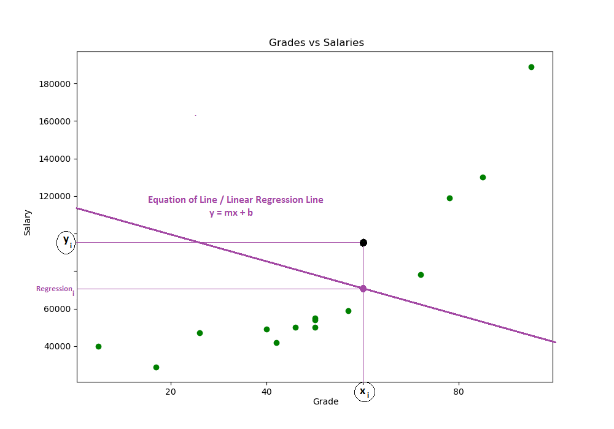  

See that now we have another point of intersection, but this will represent mine **(regression<sub>i</sub>)**. But what does this have to do with our key question?

> **How do I know how far this line is from my data? - All of them!**

Well, the ideal would be for this equation of the line to pass well at our point **y<sub>i</sub>**, but as we can see there is a distance between my point **y<sub>i</sub>** and my **regression<sub>i</sub>**.

**NOTE:**  
Well, but if we have a distance between these two points, just calculate that distance, right?

  

That is, the difference between my **regression<sub>i</sub>** and my point **y<sub>i</sub>**:

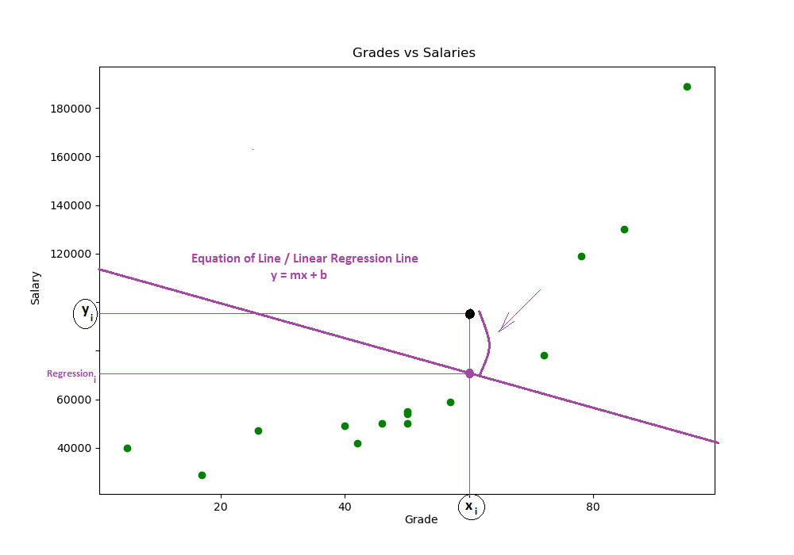  

---

<div id="02"></div>

## 02 - Cost Function

**Now let's see some details here:**

 - **1st -** This distance between my point **y<sub>i</sub>** and my **regression<sub>i</sub>** is what we know as:
   - **Error for that point y<sub>i</sub>**.
 - **2nd -** We will have to start measuring this error for all points on our graph:
   - **That is, we will remove the error for all our y<sub>i</sub> in relation to this line that we created.**
 - **3rd -** And finally, make the sum of all errors for this line:
   - *The sum of all errors will give us the size of our error for this line:*
     - **The higher this value, the greater our error will be;**
     - **The lower this value, the smaller our error will be.**


**Okay, but how can I equate this?**  
Well this is what we know as **Cost Function**, **Loss Function**, **L**, **J**... There are several approaches.

Some examples are:

**Example-01:**

  

**Example-02:**

  

**Example-03:**

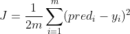  

These functions will vary according to your problem, Some use:

 - **RMSE: Root Mean Square Error;**
 - **MSE: Mean Squared Error;**
 - **MAE: Mean Absolute Error...**

As we are focusing only add up all our mistakes and all, let's get to the first example **(Example-01)** of **Cost Function**.

---

<div id="03"></div>

## 03 - Trying to minimize the Cost Function

Ok, we already have our cost function that will add up all of our errors:

  

To recap:

 - **1st -** We draw a line;
 - **2nd -** We calculate the error for each point on the line;
 - **3rd -** Finally, we added up all the errors and got the **size of our error**.

So far so good, we calculated the **size of our error** for a straight line, but remember that we had an approach?

> **Walking fast when we're far away; And walking slowly when we are very close - To find the best values ​​of *m* and *b*.**

In other words, we are going to build another line that gives us a lower value for our **Cost Function**.

But how? Simple, we will pass new values ​​for the coefficients **m** and **b**:

  

Looking at the above abstraction we have that our variables **m** and **b** in the equation of the line will receive new values; that are going to be subtracted from something . But what is this?

> So, this is where the concept of **Derivatives**, **Partial Derivatives** and **Minima of a Function comes in**.

Suppose that our line equation has the following graph (it's just an example):

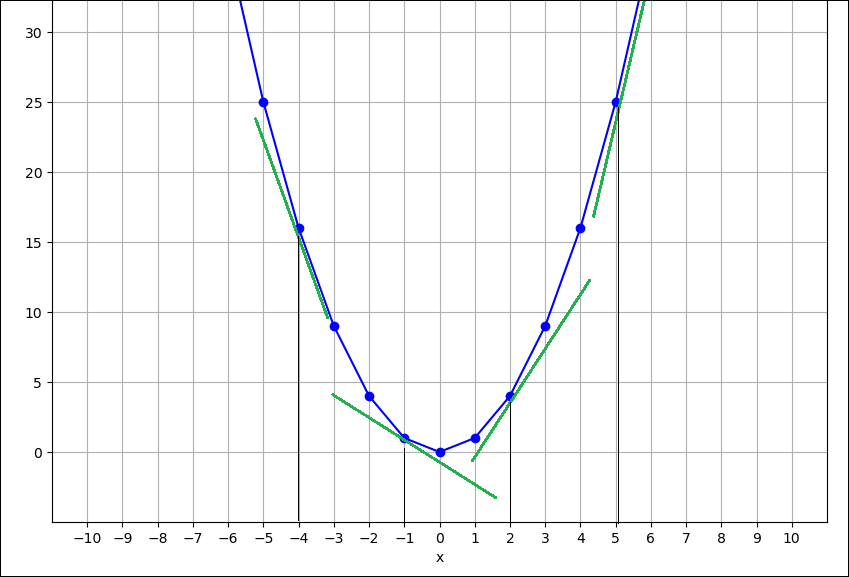  

Well, in the example above we have a parable (it's just an example) with several Rates of Change and we are interested in the **minimum points of the function** for our variables **m** and **b**.

Now knowing this and our approach we will:

 - Derive our **Cost Function** for **m** and **b**:
   - **Taking big steps when we are too far from the minimum point;**
   - **And short steps when we are very close to the minimum point.**

That is, as we have more than one variable, we will apply the concept of **Partial Derivatives**, where, we Derivate for one variable and leave the other as constant and then do the same for the other and we decrease until we find the minimum possible points for the coefficients **m** and **b**:

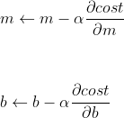  

Nice, got it, but there are 2 observations in the above abstraction:

 - **1st -** We have 2 constants **α (Alpha)** and **β (Beta)** that are multiplying our *Partial Derivatives*;
 - **2nd -** We are Deriving our **Cost Function** for the variables **m** and **b** of the line equation - **(What?)**.

---

<div id="04"></div>

## 04 - The Chain Rule

**NOTE:**  
For now **(but only for now)** we will ignore the constants **α (Alpha)** and **β (Beta)** and we will remember a mathematical concept called: **Chain Rule**.

In calculus, the **Chain Rule** is a formula for the derivative of the function composed of two functions - **What?**  
Okay, let's go to the examples, suppose we have the following functions:

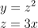  

See that we now have **2** functions **y** and **z**, where:

 - My **y** depends on **z**;
 - And my **z** depends on **x**.

Now I want to Derive my **y** function for **x**:

  

**NOTE:**  
Hey, how will it be? If my **y** depends on **z**; and my **z** depends on **x**?

**THE CHAIN ​​RULE:**  
This is where the concept of **the Chain Rule comes in**. Just follow the formula below:

  

Now just take the Derivative from **y** to **z**; and from **z** to **x**; and then multiply them... It will look like this:

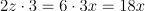  

**NOTE:**  
It is important to remember that some of these variables are related to another, for example, my **z = 3x**, so we changed that when working out the equation.

But in the end what matters is that the Derivative of the function **y** with respect to **x** is **18x**.

---

<div id="05"></div>

##  05 - Applying the Chain Rule to the Cost Function

Ok, now that we've reviewed the concept of **The Chain Rule**, how can I apply it to my **Cost Function** for the coefficients **m** and **b**? Well, let's see the relationships, right?

First let's get our **Cost Function**:

  

Okay, within the **Cost Function** we have the function **reg<sub>i</sub>** which depends on **m**; It is my Cost Function that depends on the **reg<sub>i</sub>**. Hey, just apply **The Chain Rule** then...

**NOTE:**  
First let's nickname in our function **(reg<sub>i</sub> + y<sub>i</sub>)<sup>2</sup>** of **error** to become a more nominal abstraction.

Now just take the Derivative of the **Cost Function** to **m** following *The Chain Rule*:

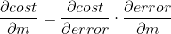  

 - See that my **Cost Function** depends on the **error**; and my **error** depends on **m**;
 - Now just take the Derivative out of my **Cost Function** for the **error**; and my **error** for **m** and then multiply:

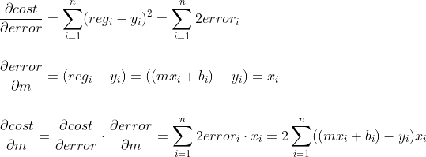  

Simply put, the Derivative of my **Cost Function** for **m** is going to be:

  

Great, now just take the Derivative of the **Cost Function** in relation to **b**:

  

**Ready, solved!**  
Now we already have the Derivatives of the **Cost Function** for **m** and **b**:

  

**NOTE:**  
As our **x<sub>i</sub>** and **y<sub>i</sub>** are values ​​that we already have on the graph (our data) we will only be Deriving the coefficients **m** and **b** until we get as close as possible to the minimum of the **Cost Function**, following our approach:

> **Walking fast when we're far away; And walking slowly when we are very close.**

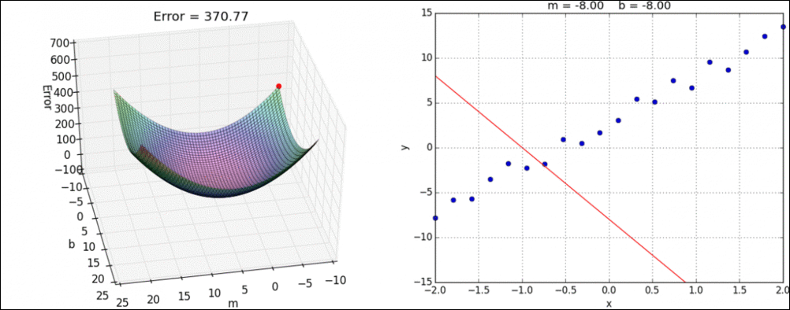  

---

<div id="06"></div>

## 06 - Learning Rate

Ok guys... Going back a few steps back, remember that we had constants that multiplied our Derivatives of the **Cost Function** to **m** and **b**?  
They were the constants **α (Alpha)** and **β (Beta)** , but what did they mean?

So, this is what we call the **Learning Rate**, responsible for adjusting and determines the size of the step in each iteration as it moves towards the **Minimum Function**.

The **Learning Rate** is a hyperparameter that controls how much the model changes in response to the estimated error each time the model weights are updated. Choosing the learning rate is challenging, as too small a value can result in a long training process that can stall, while too large a value can result in learning a sub-optimal set of weights too fast or an unstable training process .

Following our approach **Gradient Descent** the **Learning Rate** will determine the size of our steps towards the **minimum** of the **Cost Function**.

See the examples below:

**Example-01:**

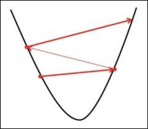  

**Example-01:**

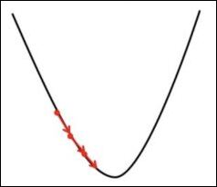  

---

<div id="07"></div>

## 07 - Gradient Descent in practice

Okay, but after all these **theoretical witchcraft**, how do you put it all into practice? Well, let's see this now with Python without having to import any libraries (but only for now):

[students-gd-bestLine.py](src/students-gd-bestLine.py)  
```python
from matplotlib import pyplot as plt
import pandas as pd

df = pd.DataFrame(
  {
    'Grade':[50, 50, 46, 95, 50, 5, 57, 42, 26, 72, 78, 60, 40, 17, 85],
    'Salary':[50000, 54000, 50000, 189000, 55000, 40000, 59000, 42000, 47000, 78000, 119000, 95000, 49000, 29000, 130000]
  }
)

m = 7
b = 1

# Learning Rate
alpha = 0.000001
beta  = 0.000001


for i in range(1, 1000+1, 1):
  y_pred = m*df['Grade'] + b
  m_derivative = sum(2*df['Grade']*(y_pred - df['Salary']))
  b_derivative = sum(2*(y_pred - df['Salary']))
  m = m - (alpha * m_derivative)
  b = b - (beta * b_derivative)
  # print(m, b) # Remove comments to view step-by-step.

print("\nAngular Coefficient (m): {0}\nLinear Coefficient (b): {1}".format(round(m), round(b)))

regression_line = [(m*x) + b for x in df['Grade']]

plt.figure(figsize=(10, 7))
plt.scatter(df.Grade, df.Salary, color='g')
plt.plot(df.Grade, regression_line, color='b')
plt.title('Grades vs Salaries | Gradient descent Approach')
plt.xlabel('Grade')
plt.ylabel('Salary')
plt.grid()
plt.savefig('../images/gd-method.png', format='png')
plt.show()
```

**OUTPUT:**  
```python
Angular Coefficient (m): 1425
Linear Coefficient (b): -7
```

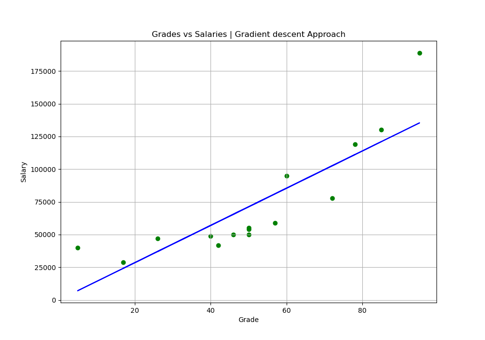  

---

**REFERENCES:**  
[A matemática do Gradiente Descendente & Regressão Linear (machine learning)](https://www.youtube.com/watch?v=htfh2xrnlaE)  
[Metodo da Descida do Gradiente](https://www.youtube.com/watch?v=s0VhfvCB0Vw)  
[AULA 5 - GRADIENTE DESCENDENTE EXPLICADO - CURSO DE INTELIGÊNCIA ARTIFICIAL PARA TODOS](https://www.youtube.com/watch?v=joaYDx1HTcA)  

---

**Rodrigo Leite -** *Software Engineer*
