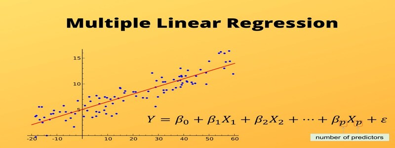

# Introduction to Linear Regression

## Contents

 - [01 - Introduction](#intro)
 - [02 - Simple Linear Regression](#slr)
 - [03 - Multiple Linear Regression](#mlr)
 - [04 - Multivariate Regression vs Multiple Regression](#mr-vs-mr)

## 01 - Introduction

Before falling into the headlines and more advanced topics, let's define some very basic things about **Linear Regression**.

> The most common **Linear Regressions** are *Simple* and *Multiple*.

 - In the first case, **Simple Linear Regression**, aims to investigate the influence of an *Independent Variable* on a *Dependent Variable*.
 - In the second case, **Multiple Linear Regression**, analyzes the influence of several *Independent Variables* on a *Dependent Variable*.

Something like that:

  

---

## 02 - Simple Linear Regression

> The objective of simple linear regression is to predict the value of a *Dependent Variable* based on an *Independent Variable*.

 - The greater the linear relationship between the Independent Variable and the Dependent Variable, the more accurate is the **forecast**.
 - This also means that the greater the proportion of the variance of the Dependent Variable that can be explained by the Independent Variable, the more accurate the forecast is.

**NOTE:**  
Visually, the relationship between variables can be shown on a scatter plot. The higher the linear relationship between the variables dependent and independent , more data points are in a straight line.

See the example below:

  

---

## 03 - Multiple Linear Regression

> Unlike Simple Linear Regression , Multiple Linear Regression allows more than two Independent Variables to be considered. The objective is to estimate a variable based on several other variables.

  

**NOTE:**  
The variable to be estimated is called the Dependent Variable (criterion) . The variables that are used for the forecast are called Independent Variables (predictors) .

---

## 04 - Multivariate Regression vs Multiple Regression

The Multiple Regression should not be confused with Multivariate regression:

 - In the first case, the influence of several independent variables on a dependent variable is examined;
 - In the second case, several regression models are calculated to allow conclusions to be drawn about several dependent variables.

**Conclusion:**  

 - In a **Multiple Regression**, a Dependent Variable is taken into account;
 - While in a **Multivariate Regression**, several Dependent Variables are analyzed.

---

**REFERENCES:**  
[Optimization: Ordinary Least Squares Vs. Gradient Descent — from scratch](https://towardsdatascience.com/https-medium-com-chayankathuria-optimization-ordinary-least-squares-gradient-descent-from-scratch-8b48151ba756)  

---

**Rodrigo Leite -** *Software Engineer*
