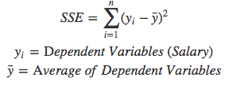
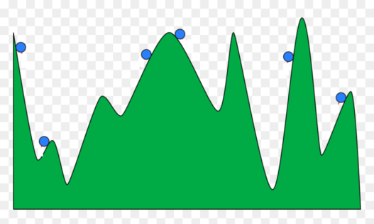

# Regressão Linear (SSE, OLS, GD)

## Conteúdo

 - [01 - Um problema envolvendo Regressão Linear](#01)
 - [02 - Método dos Mínimos Quadrados (Sum of Squared Errors: SSE)](#02)
 - [03 - Método dos Mínimos Quadrados Ordinários (Ordinary Least Squares: OLS)](#03)
 - [04 - Método do Gradiente Descendente](#04)
 - [05 - Função de Custo](#05)
 - [06 - Tentando minimizar a Função de Custo](#06)
 - [07 - A Regra da Cadeia](#07)
   - [07.1 - Aplicando a Regra da Cadeia na Função de Custo](#07-1)
 - [08 - Taxa de Aprendizagem (Learning Rate)](#08)
 - [09 - Aplicando o Método do Gradiente Descendente na prática](#09)

---

<div id='01'></div>

## 01 - Um problema envolvendo Regressão Linear

Ok, para começar com nossos exemplos práticos em **Regressões Lineares** vamos imaginar o seguinte... Suponha que nós estamos olhando a relação entre **notas** de alunos e seus **salários**.

O código vai ser o seguinte:

[students.py](src/students.py)
```python
from matplotlib import pyplot as plt
import pandas as pd

df = pd.DataFrame(
  {
    'Grade':[50, 50, 46, 95, 50, 5, 57, 42, 26, 72, 78, 60, 40, 17, 85],
    'Salary':[50000, 54000, 50000, 189000, 55000, 40000, 59000, 42000, 47000, 78000, 119000, 95000, 49000, 29000, 130000]
  }
)

plt.figure(figsize=(10, 7))
plt.scatter(df.Grade, df.Salary, color='g')
plt.title('Grades vs Salaries')
plt.xlabel('Grade')
plt.ylabel('Salary')
plt.savefig('../images/plot-01.png', format='png')
plt.show()
```

**OUTPUT:**  

  

Essas variáveis são conhecidas, respectivamente como:

 - **Grade (nota):** *Variáveis ​​independentes*, *entradas* ou *preditoras*;
 - **Salary (salário):** *Variáveis ​​dependentes*, *saídas* ou *respostas*.

Em uma **Regressão Linear** é  comum denotar as saídas com **𝑦<sub>i</sub>** e as entradas com **𝑥<sub>i</sub>**. Se houver duas ou mais *Variáveis ​Independentes*, elas podem ser representadas como um vetor **𝐱 = (𝑥₁,…, 𝑥ᵣ)**, onde **𝑟 (ou n)** é o número de entradas.

Mas então, como eu consigo analisar as **notas** de alunos e seus **salários**? Bem, existem várias maneiras, porém, vamos ver as mais comuns.

---

<div id='02'></div>

## 02 - Método dos Mínimos Quadrados (Sum of Squared Errors: SSE)

> O método dos Mínimos Quadrados calcula o erro para cada ponto **(x<sub>i</sub>, y<sub>i</sub>)** em relação a média de todas as saídas **y<sub>i</sub>**.

Não entendeu? Veja a fórmula abaixo:

  

> Resumidamente, nós estamos tirando a `variancia` de cada ponto **(x<sub>i</sub>, y<sub>i</sub>)** em relação a média de todos os meus **y**.

Agora vamos transformar tudo isso em Python para ficar algo mais automatizado:

[students_sse.py](src/students_sse.py)
```python
from matplotlib import pyplot as plt
import pandas as pd

df = pd.DataFrame(
  {
    'Grade':[50, 50, 46, 95, 50, 5, 57, 42, 26, 72, 78, 60, 40, 17, 85],
    'Salary':[50000, 54000, 50000, 189000, 55000, 40000, 59000, 42000, 47000, 78000, 119000, 95000, 49000, 29000, 130000]
  }
)

df['Error'] = df['Salary'] - df['Salary'].mean()
df['Squared Errors'] = df['Error']**2
print(df)
print("Sum of Squared Errors (SSE): ", round(sum(df['Squared Errors'])))
```

**OUTPUT:**  
```python
    Grade  Salary     Error  Squared Errors
0      50   50000  -22400.0    5.017600e+08
1      50   54000  -18400.0    3.385600e+08
2      46   50000  -22400.0    5.017600e+08
3      95  189000  116600.0    1.359556e+10
4      50   55000  -17400.0    3.027600e+08
5       5   40000  -32400.0    1.049760e+09
6      57   59000  -13400.0    1.795600e+08
7      42   42000  -30400.0    9.241600e+08
8      26   47000  -25400.0    6.451600e+08
9      72   78000    5600.0    3.136000e+07
10     78  119000   46600.0    2.171560e+09
11     60   95000   22600.0    5.107600e+08
12     40   49000  -23400.0    5.475600e+08
13     17   29000  -43400.0    1.883560e+09
14     85  130000   57600.0    3.317760e+09
Sum of Squared Errors (SSE):  26501600000
```

**NOTE:**  
Vale ressaltar aqui que nós estamos elevando todos os erros ao quadrado<sup>2</sup> porque alguns deles vão ser negativos, e como nós queremos **somar todos os erros** isso acabaria modificando o resultado. Ou seja, estamos deixando todos positivos.

---

<div id='03'></div>

## 03 - Método dos Mínimos Quadrados Ordinários (Ordinary Least Squares: OLS)

> Até então nós estamos utilizando uma abordagem, onde nós tiravamos a **variança** de cada ponto em relação a média de todos os resultados **y**.

Agora vamos utilizar uma abordagem que usa uma **reta de melhor ajuste** para ver se conseguimos um efeito melhor. Ou seja, vamos criar uma reta que fique o mais próximo possível de todos os pontos; Tanto os pontos acima da linha quanto os abaixo.

Para isso, nós podemos utilizar a **Equação da Reta** para criar uma linha que passe o mais próximo possível de todos os dados:

  

Tenho certeza, todos vocês aprenderam essa fórmula na escola. Para Regressão Linear, usamos símbolos como estes:

**Exemplo 01:**  
  

**Exemplo 02:**  
  

**Exemplo 03:**  
  

**Exemplo com Notação em Matriz:**  
  

Eu sei que isso pode acabar confundindo um pouco, mas é só se lembrar da *Equação da Reta*, **y = mx + b**, onde:

 - O meu **m (ou a)** representa o Coeficiente Angular:
   - Que altera a inclinação da reta;
   - E que é representado por um valor constante.
 - O meu **b** representa o deslocamento da Reta:
   - Interceptação no eixo-y;
   - Que também é representado por um valor constante.

**NOTE:**  
Para criar essa **reta de melhor ajuste** nós precisamos dos melhores valores possíveis para os termos **m** e **b** `para a amostra que estamos trabalhando`. Isso porque os coeficientes **m** e **b** variam de valores de acordo com os dados que nós temos.

> Ótimo, entendemos a ideia por trás do **Algoritmo de Regressão Linear** que usa uma **reta de melhor ajuste** para medir o **tamanho dos nossos erros** e **explicar a relação entre os dados**.

Uma maneira de tentar encontrar os valores para os coeficiente **m** e **b** é utilizando as seguintes fórmulas:

  
  

Agora vamos testar essa bruxaria em Python para praticar um pouco:

[students_mb_formula.py](src/students_mb_formula.py)
```python
from matplotlib import pyplot as plt
import pandas as pd

df = pd.DataFrame(
  {
    'Grade':[50, 50, 46, 95, 50, 5, 57, 42, 26, 72, 78, 60, 40, 17, 85],
    'Salary':[50000, 54000, 50000, 189000, 55000, 40000, 59000, 42000, 47000, 78000, 119000, 95000, 49000, 29000, 130000]
  }
)

df['(x_i - x_mean)'] = df['Grade'] - df['Grade'].mean()
df['(y_i - y_mean)'] = df['Salary'] - df['Salary'].mean()
df['(x_i - x_mean)(y_i - y_mean)'] = df['(x_i - x_mean)'] * df['(y_i - y_mean)']
df['(x_i - x_mean)^2'] = (df['Grade'] - df['Grade'].mean())**2

m = (sum(df['(x_i - x_mean)'] * df['(y_i - y_mean)'])) / sum(df['(x_i - x_mean)^2'])
b = df['Salary'].mean() - (m * df['Grade'].mean())

print("Angular Coefficient (m): {0}\nLinear Coefficient (b): {1}".format(round(m), round(b)))
```

**OUTPUT:**  
```python
Angular Coefficient (m): 1516
Linear Coefficient (b): -5732.0
```

Ok, agora que nós já temos os melhores valores para os coeficientes **m** e **b** `para esse conjunto de dados`  podemos aplicar eles na **Equação da Reta** e criar a **reta de melhor ajuste**:

[students_bestLine_OLS.py](src/students_bestLine_OLS.py)  
```python
from matplotlib import pyplot as plt
import pandas as pd

df = pd.DataFrame(
  {
    'Grade':[50, 50, 46, 95, 50, 5, 57, 42, 26, 72, 78, 60, 40, 17, 85],
    'Salary':[50000, 54000, 50000, 189000, 55000, 40000, 59000, 42000, 47000, 78000, 119000, 95000, 49000, 29000, 130000]
  }
)

df['(x_i - x_mean)'] = df['Grade'] - df['Grade'].mean()
df['(y_i - y_mean)'] = df['Salary'] - df['Salary'].mean()
df['(x_i - x_mean)(y_i - y_mean)'] = df['(x_i - x_mean)'] * df['(y_i - y_mean)']
df['(x_i - x_mean)^2'] = (df['Grade'] - df['Grade'].mean())**2

m = (sum(df['(x_i - x_mean)'] * df['(y_i - y_mean)'])) / sum(df['(x_i - x_mean)^2'])
b = df['Salary'].mean() - (m * df['Grade'].mean())

regression_line = [(m*x) + b for x in df['Grade']]

plt.figure(figsize=(10, 7))
plt.scatter(df.Grade, df.Salary, color='g')
plt.plot(df.Grade, regression_line, color='b')
plt.title('Grades vs Salaries | Ordinary Least Squares: OLS')
plt.xlabel('Grade')
plt.ylabel('Salary')
plt.grid()
plt.savefig('../images/plot-02.png', format='png')
plt.show()
```

**OUTPUT:**  

  

---

  

Ótimo, agora é só tirar a `variância` de cada ponto **y<sub>i</sub>** em relação a **reta de melhor ajuste**:

[students_error_OLS.py](src/students_error_OLS.py)
```python
from matplotlib import pyplot as plt
import pandas as pd

df = pd.DataFrame(
  {
    'Grade':[50, 50, 46, 95, 50, 5, 57, 42, 26, 72, 78, 60, 40, 17, 85],
    'Salary':[50000, 54000, 50000, 189000, 55000, 40000, 59000, 42000, 47000, 78000, 119000, 95000, 49000, 29000, 130000]
  }
)

df['(x_i - x_mean)'] = df['Grade'] - df['Grade'].mean()
df['(y_i - y_mean)'] = df['Salary'] - df['Salary'].mean()
df['(x_i - x_mean)(y_i - y_mean)'] = df['(x_i - x_mean)'] * df['(y_i - y_mean)']
df['(x_i - x_mean)^2'] = (df['Grade'] - df['Grade'].mean())**2

m = (sum(df['(x_i - x_mean)'] * df['(y_i - y_mean)'])) / sum(df['(x_i - x_mean)^2'])
b = df['Salary'].mean() - (m * df['Grade'].mean())

df['y = mx + b'] = [(m*x) + b for x in df['Grade']]
df['y_i - y = mx + b'] = df['Salary'] - df['y = mx + b']
df['(y_i - y = mx + b)^2'] = df['y_i - y = mx + b'] ** 2

newDF = df[['Grade', 'Salary', 'y = mx + b', 'y_i - y = mx + b', '(y_i - y = mx + b)^2']]

print(newDF)
print("Sum of Squared Errors (OLS): ", round(sum(newDF['(y_i - y = mx + b)^2'])))
```

**OUTPUT**
```python
    Grade  Salary     y = mx + b  y_i - y = mx + b  (y_i - y = mx + b)^2
0      50   50000   70075.255242     -20075.255242          4.030159e+08
1      50   54000   70075.255242     -16075.255242          2.584138e+08
2      46   50000   64010.703700     -14010.703700          1.962998e+08
3      95  189000  138301.460094      50698.539906          2.570342e+09
4      50   55000   70075.255242     -15075.255242          2.272633e+08
5       5   40000    1849.050390      38150.949610          1.455495e+09
6      57   59000   80688.220441     -21688.220441          4.703789e+08
7      42   42000   57946.152157     -15946.152157          2.542798e+08
8      26   47000   33687.945987      13312.054013          1.772108e+08
9      72   78000  103430.288725     -25430.288725          6.466996e+08
10     78  119000  112527.116039       6472.883961          4.189823e+07
11     60   95000   85236.634098       9763.365902          9.532331e+07
12     40   49000   54913.876386      -5913.876386          3.497393e+07
13     17   29000   20042.705017       8957.294983          8.023313e+07
14     85  130000  123140.081238       6859.918762          4.705849e+07
Sum of Squared Errors (OLS):  6958885882
```

Agora a *Soma dos Erros* foi reduzida significativamente de **26.501.600.000** para **6.958.885.882**. Isso porque nós estamos utilizando uma reta de melhor ajuste que tem os melhores valores de **m** e **b** `para esse conjunto de dados`, não apenas subtraindo os pontos **(x<sub>i</sub>, y<sub>i</sub>)** pelo a média de todos os **y**.

**NOTE:**  
Mas essa solução não é escalonável... Aplicar isso à Regressão Linear foi bastante fácil, pois tínhamos bons coeficientes e equações lineares, mas aplicar isso a algoritmos complexos e não lineares como *Support Vector Machine* não seria viável. 

> Então vamos encontrar a aproximação numérica desta solução por um **método iterativo**?.

---

<div id='04'></div>

## 04 - Método do Gradiente Descendente

  

> Calma gente, rss... Eu sei que esse nome **"Gradiente Descendente"** assusta todo mundo, mas vocês vão ver como é simples. É tudo questão de saber quando e como ele é aplicado.

Então, antes nós estavamos utilizando o **Método dos Mínimos Quadrados Ordinários (Ordinary Least Squares: OLS)** que construía uma **reta de melhor ajuste** a partir de 2 fórmulas... Agora nós vamos ter que criar a mesma reta, porém sem aquelas fórmulas. Isso porque nós vamos utilizar uma **abordagem iterativa**.

Para começar, vamos imaginar a seguinte história:

Considere que 20 pessoas (incluindo você) são lançadas aleatoriamente no ar em uma cadeia de montanhas. Sua tarefa é encontrar **o pico mais alto de todas as montanhas** em 30 dias.

  

Cada um de vocês tem um *walkie talkie* para se comunicar e um *altímetro* para medir a altitude. Todos os dias vocês passam horas localizando o pico mais alto possível e relatam sua altitude mais alta do dia a todos os outros.

  

Suponha que no dia 1 você relate 1000 pés; Outra pessoa informa 1230 pés e assim por diante. Depois, há uma pessoa que reporta 5000 pés, que é o máximo de todos.

**Lembre-se de que sua tarefa era atingir *coletivamente* o pico mais alto de todas as montanhas.**  
O que você faz a seguir no dia 2? No dia seguinte, todos se reunirão em direção à área onde a altitude máxima foi encontrada ontem. Eles pensarão que é provável que o pico mais alto seja nesta área.

> Por que alguém que reportou 500 pés ontem procuraria naquela área de novo se há outra área que já tem 5.000 pés?

**NOTE:**  
Portanto, todos os pesquisadores se movem **"rapidamente"** em direção ao ponto mais alto relatado. Agora, essa ganância pode levar você ao pico mais alto de todas as montanhas, mas também pode levar a um erro enorme... O cara que estava a 500 pés ontem poderia ter ido em direção a um pico que tinha uma altura de 10.000 pés! E ele o ignorou e foi em direção aquele de 5.000 pé. Você realmente fica preso em um **Máximo Local**. E não há como saber se você está preso no **Máximo Local**.

**Simulated Annealing:**  
Existe um Algoritmo que seria útil para nós nesse caso, **Simulated Annealing:**, onde os pesquisadores teriam pesquisado todo o espaço de pesquisa minuciosamente e sem serem tendenciosos para provavelmente encontrar os **máximos globais**.

Vou deixar alguns exemplos visuais de **Simulated Annealing** para deixar mais claro:

  

---

  

---

  

---

  

Voltando para o problema das montanhas... Se tivesse como equacionar esse problema das Montanhas, ou seja, transforma isso em Matemática nós só precisaríamos tentar chegar (ou encontrar) o ponto **Máximo Global** da função, tentando evitar ficar preso em *Máximos Locais*.

Agora vamos voltar para o nosso problema de **Regressão Linear**, onde, nós queríamos criar uma **reta de melhor ajuste** utilizando a *Equação da Reta*:

  

**NOTE:**  
Porém, vale lembrar que nós não vamos mais utilizar aquelas fórmulas mágicas para tentar encontrar bons valores dos coeficientes **m** e **b** para o nosso conjunto de dados. Isso porque nós vamos utilizar uma **abordagem iterativa**.

**Como assim uma Abordagem Iterativa?**  
Resumidamente, nós vamos ficar tentando valores para os coeficientes **m** e **b** até achar a **reta de melhor ajuste** para o nosso conjunto de dados.

Um exemplo bem abstrado (e maluco) poderia ser o seguinte:

  

Mas se pensarmos bem, nós resolvemos um problema e agora temos outro *(mesmo que mais simples)*, que é ficar tentando vários valores para os coeficientes **m** e **b** até achar a **reta de melhor ajuste** para o nosso conjunto de dados.

  

> Então, temos um problema hein? Já pensou ter que criar 1 milhão de retas o tamanho do recurso computacional que seria gasto?

Ok temos um problema, como escolher os melhores valores possíveis para os meus **m** e **b**? Bem, pensem comigo nas seguintes abordagens:

 - **Primeira abordagem:** Nós podemos ir alterando valores de pouco em pouco, por exemplo, 1 unidade por teste em **m** e **b**:
   - O problema é que se tivermos muito longe dos melhores valores para **m** e **b** isso vai exigir muito recurso computacional.
 - **Segunda abordagem:** Essa abordagem é muito simples, vamos aumentar valores muito grandes para testes em **m** e **b**. Por exemplo, 1000, 500, 300, 100...

**Qual a melhor abordagem? AS DUAS!**  
É isso mesmo... Pense comigo, se eu aumentar grandes unidades (valores) para os meus **m** e **b**; E a medida que eles vão se aproximando da melhor reta possível eu posso ir diminuindo esses valores até chegar na **reta de melhor ajuste** para o nosso conjunto de dados.

Ou seja:

> Caminhando rápido quando a gente está muito longe; E caminhando devagar quando a gente está muito perto.

  

Então, o **Gradiente Descendente** é o bixo de sete cabeças que consegue aplicar esse conceito que nós aprendemos agora. Mas como?

Primeiro vamos ver aqui a matemática das coisas né:

**Equação da Reta - (Regressão Linear)**  
  

Agora vamos pegar o nosso gráfico de comparação entre **notas** de alunos e seus **salários**:

  

Suponha que nós selecionamos um desses pontos, o ponto **y<sub>i</sub>**, algo parecido com isso:

  

Agora suponha que nós pegamos a *equação da reta* e desenhamos uma reta qualquer:

  

Então, agora nós estamos com a seguinte situação:
 - Um ponto **y<sub>i</sub>** selecionado;
 - E criamos uma *equação reta* com valores aleatórios para os coeficientes **m** e **b**.

Agora vem a pergunta chave:

> Como eu sei quão distante essa reta está dos meus dados? - **Todos eles!**

Pode parecer muito difícil, mas é simples:

 - **1ª -** Eu vou pegar o meu **x<sub>i</sub>**
 - **2ª -** Ver qual foi o resultado da equação da reta nesse ponto.
 
Não entendeu? Vamos ver isso visualmente:

  

Veja que agora nós temos outro ponto de intersecção, porém esse vai representar minha **(regressão<sub>i</sub>)**. Mas o que isso tem a ver com a nossa pergunta chave?

> Como eu sei quão distante essa reta está dos meus dados? - **Todos eles!**

Bem, o ideal seria que essa *equação da reta* passasse bem no nosso ponto **y<sub>i</sub>**,mas como podemos ver tem uma distância entre o meu ponto **y<sub>i</sub>** e a minha **regressão<sub>i</sub>**.

Ué, mas se temos uma distância entre esses dois pontos é só calcular essa distância não é?


Ou seja, a diferença entre a minha **regressão<sub>i</sub>** e o meu ponto **y<sub>i</sub>**:

  

---

<div id="05"></div>

## 05 - Função de Custo

**Agora vamos ver alguns detalhes aqui:**

 - **1ª -** Essa distância entre o meu ponto **y<sub>i</sub>** e a minha **regressão<sub>i</sub>** é o que nós conhecemos como:
   - **Erro para esse ponto y<sub>i</sub>.**
 - **2ª -** Nós vamos ter que sair medindo esse erro para todos os pontos do nosso gráfico:
   - Ou seja, nós vamos tirar o erro para todos os nossos **y<sub>i</sub>** em relação a essa *reta que nós criamos*.
 - **3ª -** E por fim, fazer a soma de todos os erros para essa reta:
   - A soma de todos os erros vai nós da o ***tamanho do nosso erro para essa reta***:
     - Quanto *maior* esse valor, *maior vai ser nosso erro*;
     - Quanto *menor* esse valor, *menor vai ser nosso erro*.

**Ok, mas como eu posso equacionar isso?**  
Bem isso é o que nós conhecemos como **Função de Custo**, **Loss Function**, **L**, **J**... Existem várias abordagens.

Alguns exemplos são:

**Example-01:**  
  

**Example-02:**  


**Example-03:**  


Essas funções vão variar de acordo com o seu problema, Algumas utilizam:

 - **RMSE**;
 - **MSE**;
 - **MAE**
 - **ErroMédio**... etc.

Como nós estamos focando apenas em somar todos os nossos erros e mais nada, vamos ficar com o primeiro exemplo **(Example-01)** de **Função de Custo**.

---

<div id='06'></div>

## 06 - Tentando minimizar a Função de Custo

Ok, nós já temos a nossa **Função de custo** que vai fazer a soma de todos os nossos erros:

  

Recapitulando:

 - 1ª - Nós traçamos uma reta;
 - 2ª - Calculamos o *erro* para cada ponto na reta;
 - 3ª - Por fim, fizemos a *soma de todos os erros* e conseguimos ***tamanho do nosso erro***.
   - Nós estamos elevando a subtração de **(reg<sub>i</sub> - y<sub>i</sub>)** PARA CADA ITERAÇÃO DO SOMATÓRIO ao quadrado<sup>2</sup> porque alguns desses valores podem ser negativos e nós queremos a SOMA DE TODOS ELES.

Até ai tudo bem, calculamos o ***tamanho do nosso erro*** para uma reta, mas lembra que nós tinhamos uma abordagem?

> Caminhando rápido quando a gente está muito longe; E caminhando devagar quando a gente está muito perto - Para encontrar os melhores valores de **m** e **b**.

Ou seja, nós vamos construir outra reta que nós dê um valor menor para a nossa **Função de Custo**.  
Mas como? Simples, nós vamos passar novos valores para os coeficientes **m** e **b**: 

  

Olhando para a abstração acima nós temos que as nossas variáveis **m** e **b** na *equação da reta* vão receber novos valores; que vão ser *subtraídos* de **algo (something)**. Mas que algo é esse?  

> Então, é ai que entra o conceito de **Derivadas**, **Derivadas Parciais** e **Mínimos de uma Função**.

Suponha que a nossa *equação da reta* tem o seguinte gráfico (é só um exemplo):

  

Bem, no exemplo acima nós temos uma parábola (é só um exemplo) com várias Taxas de Variação e nós estamos interessando nos **pontos mínimos da função** para as nossas variáveis **m** e **b**.

Agora sabendo disso e da nossa abordagem nós vamos:

 - Derivar a nossa **Função de Custo** para **m** e para **b**:
   - Dando grandes passos quando estivermos muito longe do ponto mínimo;
   - E passos curtos quando estivermos muito próximos do ponto mínimo.

Ou seja, como nós temos mais de uma variável, nós vamos aplicar o conceito de **Derivadas Parciais**, onde, nós derivamos para uma variável e deixamos a outra como constante e depois fazemos o mesmo para a outra e vamos diminuindo até achar os pontos mínimos possíveis para os coeficientes **m** e **b**:

  

Ahh, entendido, mas tem 2 observações na abstração acima:

 - 1ª - Nós temos 2 constantes **α (Alpha)** e **β (Beta)** que estão multiplicando as nossas Derivadas Parciais;
 - 2ª - Nós estamos Derivando a nossa **Função de Custo** para as variáveis **m** e **b** da *equação da reta* - **(What?)**.

<div id='07'></div>

## 07 - A Regra da Cadeia

> Por enquanto (mas só por enquanto) vamos ignorar as constantes **α (Alpha)** e **β (Beta)** e vamos relembrar um conceito matemático chamado: **Regra da Cadeia**.

Em cálculo, a **Regra da Cadeia** é uma fórmula para a derivada da função composta de duas funções - **What?**  
Ok, vamos para os exemplos, suponha que nós temos as seguintes funções:

  

Veja que agora nós temos 2 funções **y** e **z**, onde:

 - O meu **y** depende de **z**;
 - E o meu **z** depende de **x**.

Agora eu quero Derivar a minha função **y** para **x**:

  

Ué, como vai ser? Se o meu **y** depende do **z**; e o meu **z** depende do **x**?

**A REGRA DA CADEIA:**  
É ai que entra o conceito da **Regra da Cadeia**. Basta seguir a fórmula abaixo:

  

Agora é só tirar a Derivada de **y** para **z**; e de **z** para **x**; e depois multiplicar elas... Vai ficar assim:

  

**NOTE:**  
É importante lembrar que algumas dessas variáveis tem relações com outra, por exemplo, o meu **z = 3x**, por isso nós mudamos isso na hora de trabalhar a equação.

Mas no fim o que importa é que a Derivada da função **y** em relação a **x** é **18x**.

<div id='07-1'></div>

## 07.1 - Aplicando a Regra da Cadeia na Função de Custo

Ok, agora que nós já revisamos o conceito da **Regra da Cadeia**, como eu posso aplicar ela na minha **Função de Custo** para os coeficientes **m** e **b**? Bem, vamos ver as relações né?

Primeiro vamos pegar nossa **Função de Custo**:

  

Ok, dentro da *Função de Custo* nós temos a função **reg<sub>i</sub>** que depende de **m**; E a minha *Função de Custo* que depende de **reg<sub>i</sub>**. Ué, só aplicar a Regra da Cadeia então...

**NOTE:**  
Primeiro vamos apelidar na nossa função **(reg<sub>i</sub> + y<sub>i</sub>)<sup>2</sup>** de ***error*** para ficar uma abstração mais nominal.

Agora é só tirar a Derivada da **Função de Custo** para **m** seguindo a *Regra da Cadeia*:

  

 - Veja que a minha **Função de Custo** depende do **error**; e o meu **error** depende de **m**;
 - Agora é só tirar a Derivada da minha **Função de Custo** para o **erro**; e do meu **erro** para **m** e depois multiplicar:

  

Simplificando, a Derivada da minha **Função de Custo** para **m** vai ser :

  

Ótimo, agora é só tirar a Derivada da **Função de Custo** em relação a **b**:

  

Simplificando novamente:

  

**Pronto, resolvido!**  
Agora nós já temos as Derivadas da **Função de Custo** para **m** e **b**:

  

Como os nossos **x<sub>i</sub>** e **y<sub>i</sub>** são valores que nós já temos no gráfico (nossos dados) nós só vamos Derivando os coeficientes **m** e **b** até chegar o mais próximo possível do mínimo da **Função de Custo**, seguindo a nossa abordagem:

> Caminhando rápido quando a gente está muito longe; E caminhando devagar quando a gente está muito perto.

  

---

<div id='08'></div>

## 08 - Taxa de Aprendizagem (Learning Rate)

Ok pessoas... Voltando alguns passos atrás, lembram que nós tinhamos umas constantes que multiplicavam nossas Derivadas da **Função de Custo** para **m** e **b**? Eram as constantes **α (Alpha)** e **β (Beta)**, mas o que elas significavam?

Então, isso é o que nós chamamos de **Taxa de Aprendizado (Learning Rate)**, responsáveis por ajuste e determina o tamanho da etapa em cada iteração enquanto se move em direção ao **Mínimo da Função de Custo**.

A **Taxa de Aprendizado (Learning Rate)** é um hiperparâmetro que controla o quanto alterar o modelo em resposta ao erro estimado cada vez que os pesos do modelo são atualizados. Escolher a taxa de aprendizado é desafiador, pois um valor muito pequeno pode resultar em um longo processo de treinamento que pode travar, enquanto um valor muito grande pode resultar no aprendizado de um conjunto sub-ótimo de pesos muito rápido ou um processo de treinamento instável.

Seguindo a nossa abordagem de *Gradiente Descendente* a *Taxa de Veriação* vai determina o tamanho dos nossos passos em direção ao **Mínimo** da **Função de Custo**.

Veja os exemplos abaixo:

**Exemplo-01:**  
  

**Exemplo-02:**  
  

---

<div id='09'></div>

## 09 - Aplicando o Método do Gradiente Descendente na prática

Ok, mas depois de todas essas **bruxarias teóricas**, como colocar tudo isso em prática? Bem, vamos ver isso agora com Python sem precisar importar nenhuma biblioteca (mas só por agora):

[students_gd_bestLine.py](src/students_gd_bestLine.py)  
```python
from matplotlib import pyplot as plt
import pandas as pd

df = pd.DataFrame(
  {
    'Grade':[50, 50, 46, 95, 50, 5, 57, 42, 26, 72, 78, 60, 40, 17, 85],
    'Salary':[50000, 54000, 50000, 189000, 55000, 40000, 59000, 42000, 47000, 78000, 119000, 95000, 49000, 29000, 130000]
  }
)

m = 7
b = 1
learning_rate = 0.000001

for i in range(1, 1000+1, 1):
  y_pred = m*df['Grade'] + b
  m_derivative = sum(2*df['Grade']*(y_pred - df['Salary']))
  b_derivative = sum(2*(y_pred - df['Salary']))
  m = m - (learning_rate * m_derivative)
  b = b - (learning_rate * b_derivative)
  # print(m, b) # Remove comments to view step-by-step.

print("\nAngular Coefficient (m): {0}\nLinear Coefficient (b): {1}".format(round(m), round(b)))

regression_line = [(m*x) + b for x in df['Grade']]

plt.figure(figsize=(10, 7))
plt.scatter(df.Grade, df.Salary, color='g')
plt.plot(df.Grade, regression_line, color='b')
plt.title('Grades vs Salaries | Gradient descent Approach')
plt.xlabel('Grade')
plt.ylabel('Salary')
plt.grid()
plt.savefig('../images/plot-03.png', format='png')
plt.show()
```

**OUTPUT:**  
```python
Angular Coefficient (m): 1425
Linear Coefficient (b): -7
```


**NOTE:**  
Veja que com o **Método do Gradiente Descendente** nós conseguimos melhores valores para os coeficientes **m** e **b** em relação ao **Método dos Mínimos Quadrados Ordinários (OLS)**:

 - **Método dos Mínimos Quadrados Ordinários (OLS)**:
   - Angular Coefficient (m): 1516
   - Linear Coefficient (b): -5732.0
 - **Método do Gradiente Descendente**:
   - Angular Coefficient (m): 1425
   - Linear Coefficient (b): -7

---
**REFERENCES:**  
[Didatica Tech - MÓDULO - I](https://didatica.tech/)  
[A matemática do Gradiente Descendente & Regressão Linear (machine learning)](https://www.youtube.com/watch?v=htfh2xrnlaE)  
[Metodo da Descida do Gradiente](https://www.youtube.com/watch?v=s0VhfvCB0Vw)  
[AULA 5 - GRADIENTE DESCENDENTE EXPLICADO - CURSO DE INTELIGÊNCIA ARTIFICIAL PARA TODOS](https://www.youtube.com/watch?v=joaYDx1HTcA)  
[Optimization: Ordinary Least Squares Vs. Gradient Descent — from scratch](https://towardsdatascience.com/https-medium-com-chayankathuria-optimization-ordinary-least-squares-gradient-descent-from-scratch-8b48151ba756)   
