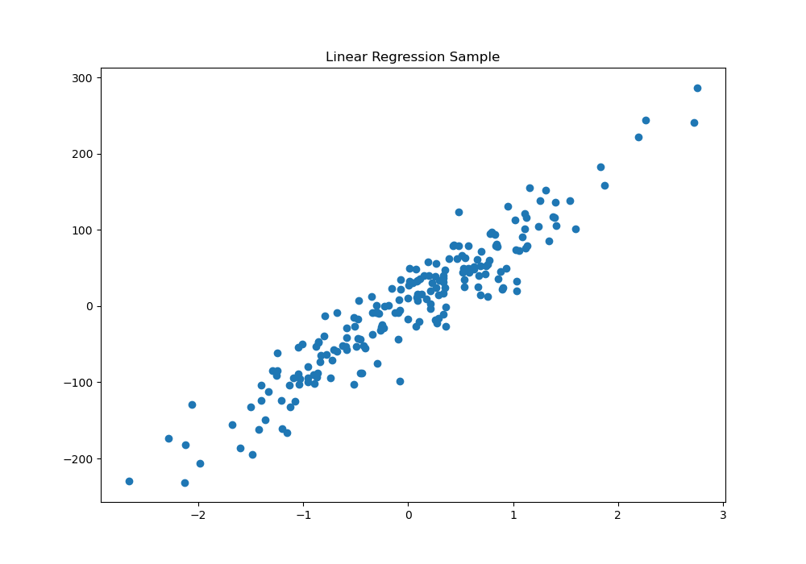
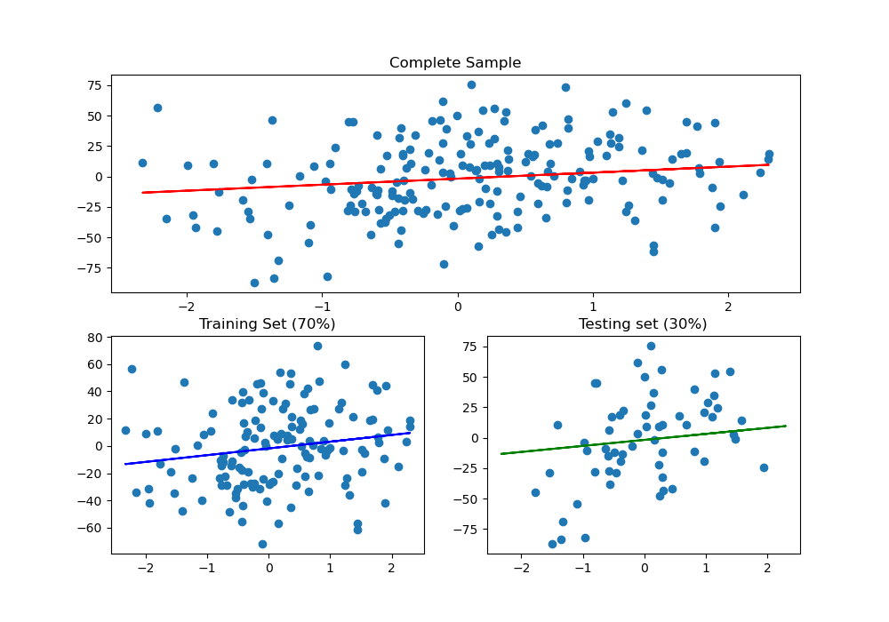

# Linear Regression with Scikit-Learn

## Contents

 - [01 - Installing the Scikit-Learn Library](#01)
 - [02 - Creating a random data for Linear Regression](#02)
 - [03 - Creating a Line of Best Fit](#03)
 - [04 - The "random_state" argument](#04)

<div id="01"></div>

## 01 - Installing the Scikit-Learn Library

Let's start by installing the library:

```python
pip install scikit-learn --upgrade
```

**NOTE:**  
If you are using a virtual environment (like me) it is recommended to save this dependency:

```python
pip freeze > requirements.txt
```

Okay, now let's see our current Scikit-Learn version?

[sklearnVersion.py](src/sklearnVersion.py)
```python
def checkVersion():
  import sklearn
  print('Scikit-Learn Version: {0}'.format(sklearn.__version__))

if __name__ =='__main__':
  checkVersion()
```

**OUTPUT:**  
```python
Scikit-Learn Version: 0.23.1
```

---

<div id="02"></div>

## 02 - Creating a Random Data for Linear Regression

Great, everything beautiful and wonderful at our disposal! But how do I create an example of **Linear Regression**?  
Simple, first let's create a random *(even meaningless)* dataset to represent our data:

[make_sample.py](src/make_sample.py)
```python
def createRegression(samples, variavel_numbers, n_noise):
  from sklearn.datasets import make_regression
  x, y = make_regression(n_samples=samples, n_features=variavel_numbers, noise=n_noise)
  return x, y

if __name__ =='__main__':
  from matplotlib import pyplot as plt

  reg = createRegression(200, 1, 30)

  plt.figure(figsize=(10, 7))
  plt.scatter(*reg)
  plt.title('Linear Regression Sample')
  plt.savefig('../images/make_sample-01.png', format='png')
  plt.show()
```

**OUTPUT:**  
  

The **Scikit-Learn** library has a method called **make_regression** that can be used to create a dataset so that we can work with it. The most common arguments *(which are what we used)* for this method are:

 - **n_samples:** The data sample number;
 - **n_features:** The number of variables / characteristics;
 - **noise:** How much noise our graph will have, that is, how messy the data is.

**NOTE:**  
Every time you run the [make_sample.py](src/make_sample.py) code, a different set of data will be generated. That is, it will be another **graph/plot**.

**NOTE:**  
Another important note that you should pay attention to is that the **make_regression** function returned **2** sets of data - **x** and **y**, that is:

```python
x, y = make_regression(n_samples=samples, n_features=variavel_numbers, noise=n_noise)
```

 - The random values ​​created for our **x-axis**;
 - And their corresponding on the **y-axis**.

---

<div id="03"></div>

## 03 - Creating a Line of Best Fit

Now, how do I create a **Line of Best Fit** with **Scikit-Learn**? Can you do this automatically and simply?

Of course, with **Scikit-Learn** and its **witchcraft**:

[lineOfBestFitSKLearn.py](src/lineOfBestFitSKLearn.py)
```python
def createRegression(samples,variavel_numbers, n_noise):
  from sklearn.datasets import make_regression
  x, y = make_regression(n_samples=samples, n_features=variavel_numbers, noise=n_noise)
  return x, y

if __name__ =='__main__':

  from sklearn.linear_model import LinearRegression
  from sklearn.model_selection import train_test_split
  from matplotlib import pyplot as plt

  reg = createRegression(200, 1, 30)
  model = LinearRegression()

  # Divide the data into Training and Testing - 30% for testing.
  x_train, x_test, y_train, y_test = train_test_split(reg[0], reg[1], test_size=0.30)

  # Just the training data is transferred to the fit() function (which finds the best values ​​for m and b).
  model.fit(x_train, y_train)

  a_coeff = model.coef_ # Angular Coefficient - m
  l_coeff = model.intercept_ # Linear Coefficient - b
  print('Angular Coefficient (m): {0}\nLinear Coefficient (b): {1}'.format(a_coeff, l_coeff))

  # Create plot.
  plt.figure(figsize=(10, 7))
  plt.subplot(211)
  plt.scatter(reg[0], reg[1])
  plt.title('Complete Sample')
  plt.plot(x_train, a_coeff*x_train + l_coeff,color='red')
  plt.subplot(223)
  plt.scatter(x_train, y_train)
  plt.title('Training Set (70%)')
  plt.plot(x_train, a_coeff*x_train + l_coeff,color='blue')
  plt.subplot(224)
  plt.scatter(x_test, y_test)
  plt.title('Testing set (30%)')
  plt.plot(x_train, a_coeff*x_train + l_coeff,color='green') # y = mx + b
  plt.savefig('../images/line-of-best-fit_sklearn.png', format='png')
  plt.show()
```

**OUTPUT:**  
```python
Angular Coefficient (m): [4.93844808]
Linear Coefficient (b): -1.814819839280097
```

  

---

<div id="04"></div>

## 04 - The "random_state" argument

The **train_test_split()** method can also take an argument called **random_state**. As it basically passes an integer and the data is `shuffle`, where, whenever you or anyone executes the **train_test_split()** method on the same dataset, the *training* and *test data* will be the same if both have the same argument **random_state**.

See below how it looks:

```python
x_train, x_test, y_train, y_test = train_test_split(reg[0], reg[1], test_size=0.30, random_state=10)
```

**NOTE:**  
Now if you or anyone else runs the same sample of data with **random_state=10** the *training* and *testing data* will always be the same.

---

**REFERENCES:**  
[Didática Tech - Inteligência Artificial & Data Science](https://didatica.tech/)  

---

**Rodrigo Leite -** *Software Engineer*
