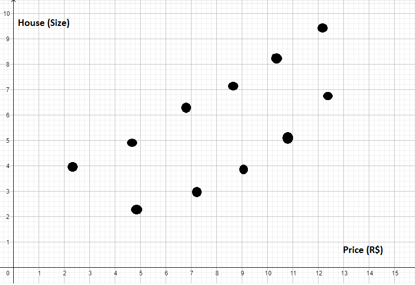
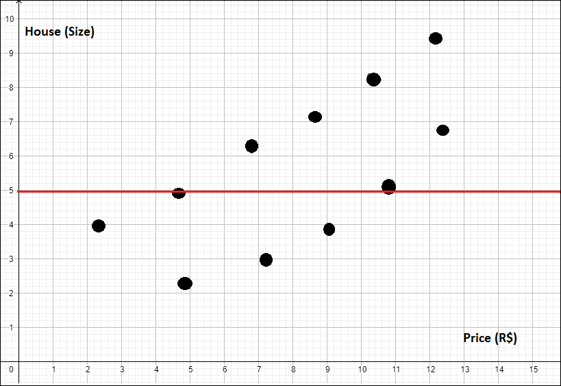
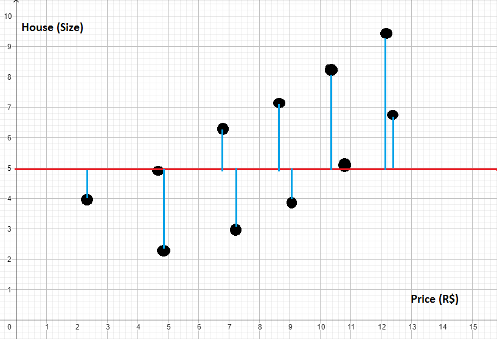
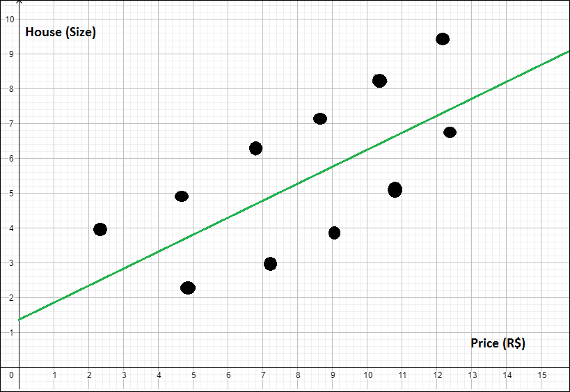
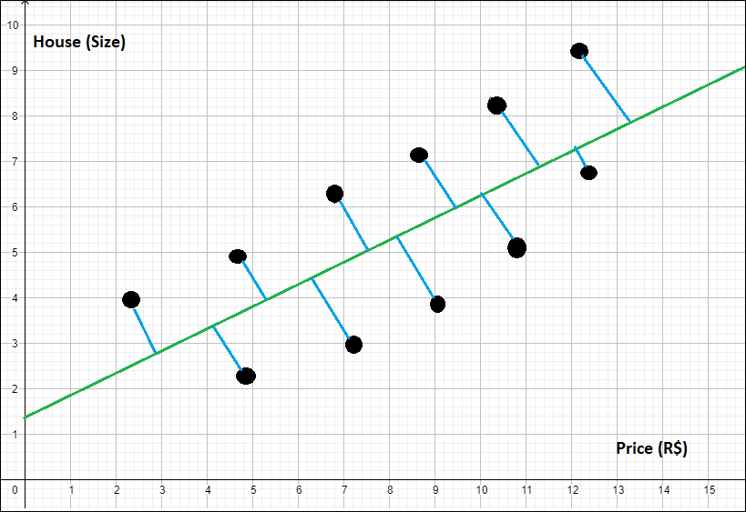
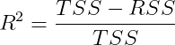
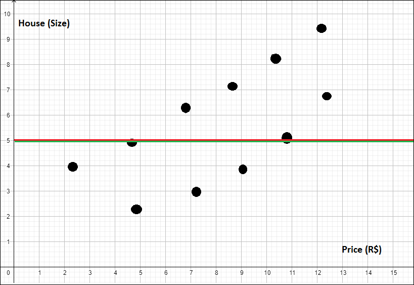
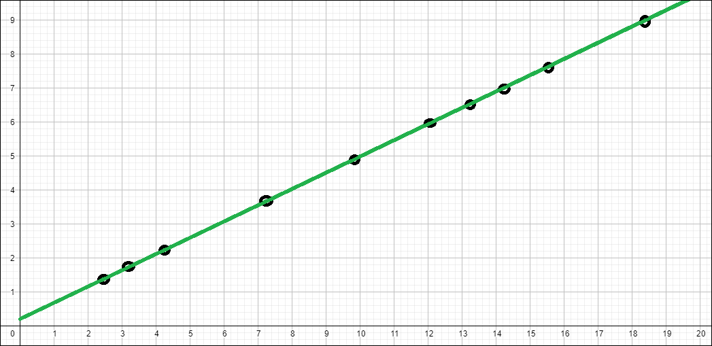
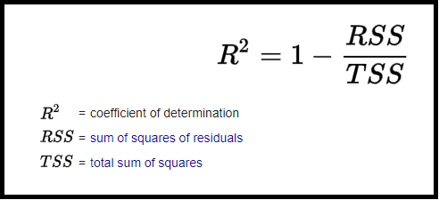

#  Coefficient of Determination (R<sup>2</sup>)

## Contents

 - [01 - TSS (Total Sum of Squares)](#01)
 - [02 - RSS (Residual Sum of Squares)](#02)
 - [03 - Coefficient of Determination R<sup>2</sup>](#03)
 - [04 - R<sup>2</sup> in practice with Scikit-Learn](#04)
 - [Another R<sup>2</sup> common formula](#r2-formula2)

<div id="01"></div>

## 01 - TSS (Total Sum of Squares)

Well, before catching the **Coefficient of Determination R<sup>2</sup>**, you know what is this? Not? Okay, let's go for a brief explanation...

Suppose we created a plot with some data to see the relationship between a houses **prices** and its **sizes**, it looked something like this **(and not very pretty)**:

  

If you pay attention you will see that our plot has an increasing variation, that is:

> **As the price increases, the size also increases - vice versa.**

Now suppose I want to create a model that uses a line to represent this data, so that if I enter a new price it will try to find out (predict) how big the house is.

**NOTE:**  
The first idea we are going to have is to average the sizes and draw a line. Suppose the line looks like this:

  

Well, this line does not represent that model very well. If you pay attention you will see that we have a lot of error. How could we calculate the error of this model?

 - **1st -** Just take each value (points on the plot);
 - **2nd -** Calculate the distance to my line:
   - You will square each point;
   - And then add to the next point.

In the plot the distances from the points to the line you can see like this:

  

**NOTE:**  
This is what we know as the **TSS (Total Sum of Squares)**.

Formula:

  

**NOTE:**  
Actually what we did above was to take the **variance** out of our data.

---

<div id="02"></div>

## 02 - RSS (Residual Sum of Squares)

Continuing... Now suppose I created a new model, but with a line that seems to align better with this data, see below:

  

**NOTE:**  
Ok, just looking at it, you can see that this line represents this data much better than just averaging the errors of all the data. In the end it looks like it is growing at the same rate as this data is growing.

But, how can I prove that this second straight is really better than the other? Well, just calculate each of these distances between our data and the green line **(new line)**:

  

**NOTE:**  
This is what we know as the **RSS (Residual Sum of Squares)**.

Okay, if we calculate the data we will see that my **RSS** is less than the **TSS**. That is, my **RSS** is better adjusted.

Formula:

  

---

<div id="03"></div>

## 03 - Coefficient of Determination R<sup>2</sup>

**NOTE:**  
But how do I know how much better my **RSS** is compared to **TSS**? - **That is, how much better is it compared to the average?**

So, this is where our dear **R<sup>2</sup>** comes in... **R<sup>2</sup>** is nothing more than my **TSS** minus **RSS** divided by **TSS**:

  

But what does this formula actually mean in practice?

 - **Numerator:** Well, in the numerator we see how well my **RSS** model is in relation to **TSS**;
 - **Denominator:** When we divide by **TSS** we are **normalizing**, that is, we are bringing this value to a scale that is between **0** and **1**.

**But why normalize between 0 and 1?**  
Ok, let's see... Suppose we created a very bad Machine Learning model that created a line that was equal to the **TSS**, more or less this:

  

**NOTE:**  
Well, my **RSS** will be equal to my **TSS**, so my **R<sup>2</sup>** will be **0**:

  

Now let's imagine another scenario *(it's just an example)* where my data is distributed in a way where my Machine Learning model goes through exactly all the data, that is, **there was no error**:

  

So, as our **RSS** had no errors, what will our **R<sup>2</sup>** be now?

  

Great, but what does our **R<sup>2</sup>** tell us?

 - The **higher (closer to 1)** the **R<sup>2</sup>**, the **better** my scenario will be;
 - The **lower (closer to 0)** the **R<sup>2</sup>**, the **worse** my supporter will be.

But how could we interpret our **R<sup>2</sup>**? For example:

> **I created a Machine Learning model that generated the *R<sup>2</sup>* of 0.87.**

What does that mean?

> **It means that my Machine Learning model is *87% better* than just taking the average of the values.**

Another interpretation approach is to say that my model explains **87% of the data variance**. As well?

 - Remember that the calculation of the **TSS** is the calculation of the **variance of our dataset**:
   - That is, the total result of the variance.
 - While my **RSS** shows how much of this variance has been explained:
   - If my **R<sup>2</sup>** was **1** it would mean that **100% of the variance would have been explained** - **1 error on the line**.

---

<div id="04"></div>

## 04 - R<sup>2</sup> in practice with Scikit-Learn

Okay, but how do I program this witchcraft all there? Simple, see the code below:

[r-squared.py](src/r-squared.py)  
```python
"""
R-Squared or Coefficient of Determination
"""

def createRegression(samples,variavel_numbers, n_noise):
  from sklearn.datasets import make_regression
  x, y = make_regression(n_samples=samples, n_features=variavel_numbers, noise=n_noise)
  return x, y

if __name__ =='__main__':

  from sklearn.linear_model import LinearRegression
  from sklearn.model_selection import train_test_split
  from matplotlib import pyplot as plt

  reg = createRegression(200, 1, 30)
  model = LinearRegression()

  x_train, x_test, y_train, y_test = train_test_split(reg[0], reg[1], test_size=0.30)
  model.fit(x_train, y_train)

  # Coefficient of Determination: R^2 / R-Squared.
  r2 = model.score(x_test, y_test)
  print('Coefficient of Determination: R^2: {0}'.format(r2))
```

**OUTPUT:**  
```python
Coefficient of Determination: R^2: 0.9158177316382643
```

Great, we took our **R<sup>2</sup>** which was **0.91**, that is, we explain 91% of our data set.  
Now let's see what part of the code did this and what was the logic:

First we create a model with the **training data**:

```python
model.fit(x_train, y_train)
```

And then just with the **testing data** we get **R<sup>2</sup>** with the **score()** method:

```python
# Coefficient of Determination: R^2 / R-Squared.
r2 = model.score(x_test, y_test)
```

---

<div id="r2-formula2"></div>

##  Another R<sup>2</sup> common formula

**NOTE:**  
Another common formula for finding **R<sup>2</sup>** is as follows:

  

---

**REFERENCES:**  
[Didática Tech - Inteligência Artificial & Data Science](https://didatica.tech/)  

---

**Rodrigo Leite -** *Software Engineer*
