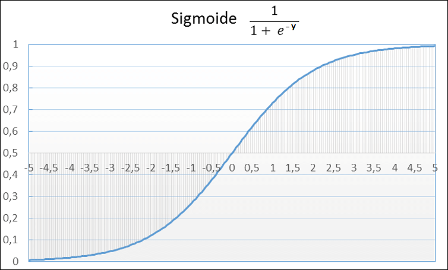

# Introdução à Regressão Logística

## Conteúdo

 - [01 - Introdução à Classificação & Regressão Logística](#01)

## 01 - Introdução à Classificação & Regressão Logística

Bem, diferente dos problemas de **Regressões**, onde estamos interessados em investigar **relações entre variáveis *quantitativas (numéricas)***. Um problema de **Classificação** tenta prever rótulos de classes discretas. Como assim?

> Bem, resumidamente (e não formal) nós estamos tentando classificar se um rótulo/classe é ou não o que estamos comparando.

Os problemas de classificação são aqueles onde se busca encontrar uma classe, dentro das possibilidades limitadas existentes. Esta classe pode ser:

 - Se um aluno foi **aprovado** ou **reprovado**;
 - Se uma pessoa **possui uma doença** ou **não**;

**NOTE:**  
Sendo que nestes casos ou a previsão será uma ou outra. As classes também podem possuir mais de duas opções, como separar pessoas em três grupos, A, B e C, ou 1, 2 e 3, ou ainda prever a marca de um determinado carro.

Mas e a Matemática muda muito em relação aos problemas de *Regressão*? Não necessariamente, mas temos algumas peculiaridades. Vamos começar revisando a *Equação da Reta* para uma ou mais variáveis:

  

Bem, mas agora temos um probleminha... Isso, porque o resultado **y** da **Equação da Reta** nós dá uma reta como saída e nós estamos interessados em classificar em determinadas classes existentes. Por exemplo: **SIM** ou **NÃO**.

Uma abordagem interessante para resolver nosso problema seria utilizar a **Função Sigmóide**:

  

Graficamente fica assim:

  

Agora eu vou partir do pressuposto que você já conhece a **Função Sigmóide** que resumidamente:

 - Binariza as saídas entre: **0** ou **1**;
 - E tem um **período** de **transição**;

Ótimo, eu sei que com a **Função Sigmóide** eu posso binariza minha saída, mas como eu aplico isso para o meu problema de Classificação? Simples:

  

---

**REFERENCES:**  
[Didática Tech - Inteligência Artificial & Data Science](https://didatica.tech/)  
[Problemas de Classificação e Regressão](https://didatica.tech/problemas-de-classificacao-e-regressao/)  

---

**Rodrigo Leite -** *Software Engineer*
