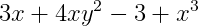

# Introduction to Polynomials

## Contents

 - [01 - Introduction to Polynomials](#intro-to-polynomials)
 - [02 - Standard Form for Polynomials](#standard-form-for-polynomials)

## 01 - Introduction to Polynomials

A polynomial is an algebraic expression containing one or more terms that each meet some specific criteria.

Specifically, each term can contain:

 - Numeric values that are coefficients or constants **(for example 2, -5, 1/7)**
 - Variables **(for example, x, y)**
 - Non-negative integer exponents **(for example 2², 64³)**
 - The terms can be combined using arithmetic operations - but not division by a variable.

For example, the following expression below is a polynomial:

  

When identifying the terms in a polynomial, it's important to correctly interpret the arithmetic addition and subtraction operators as the sign for the term that follows. For example, the polynomial above contains the following three terms:

 - **12x³**
 - **2x**
 - **-16**

The terms themselves include:

 - Two coefficients**(12 and 2)** and a constant **(-16)**
 - A variable **(x)**
 - An exponent **(³)**

**NOTE:**  
 - A polynomial that contains **three terms** is also known as a **trinomial**;
 - Similarly, a polynomial with **two terms** is known as a **binomial**
 - And a polynomial with **only one term** is known as a **monomial**.

So why do we care? Well, polynomials have some useful properties that make them easy to work with. for example, if you multiply, add, or subtract a polynomial, the result is always another polynomial.

## 02 - Standard Form for Polynomials

Techbnically, you can write the terms of a polynomial in any order; but the standard form for a polynomial is to start with the highest degree first and constants last. The degree of a term is the highest order (exponent) in the term, and the highest order in a polynomial determines the degree of the polynomial itself.

For example, consider the following expression:

  

To express this as a polynomial in the standard form, we need to re-order the terms like this:

  

---

**REFERENCES:**  
[Essential Mathematics for Artificial Intelligence](https://courses.edx.org/courses/course-v1:Microsoft+DAT256x+1T2018a/course/)  

---

**Rodrigo Leite -** *Software Engineer*
