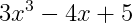
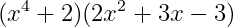
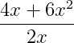
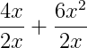
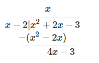

# Operations with Polynomials

## Contents

 - [01 - Simplifying Polynomials](#simplifying-polynomials)
 - [02 - Adding Polynomials](#adding-polynomials)
 - [03 - Subtracting Polynomials](#subtracting-polynomials)
 - [04 - Multiplying Polynomials](#multiplying-polynomials)
 - [05 - Dividing Polynomials](#dividing-polynomials)

<div id="simplifying-polynomials"></div>

## 01 - Simplifying Polynomials

Before we starting with **Polynomials Operations** we'll learning how simplify an equation by combining like terms. You can simplify polynomials in the same way.

For example, look at the following polynomial:

  

In this case, we can combine **x³** and **2x³** by adding them to make **3x³**. Then we can add -3x and -x (which is really just a shorthand way to say -1x) to get -4x, and then add 8 and -3 to get 5. Our simplified polynomial then looks like this:

  

We can use Python to compare the original and simplified polynomials to check them - using an arbitrary random value for **x**:

[polynomials01.py](src/polynomials01.py)
```python
from random import randint
x = randint(1,100)

result = (x**3 + 2*x**3 - 3*x - x + 8 - 3) == (3*x**3 - 4*x + 5)
print("Polynomials are Equals? {0}".format(result))
```

**OUTPUT:**  
```python
Polynomials are Equals? True
```

<div id="adding-polynomials"></div>

## 02 - Adding Polynomials

When you add two polynomials, the result is a polynomial. Here's an example

  

because this is an addition operation, you can simply add all of the like terms from both polynomials. To make this clear, let's first put the like terms together:

  

We can verify this with Python:

[polynomials02.py](src/polynomials02.py)
```python
from random import randint
x = randint(1,100)

result = (3*x**3 - 4*x + 5) + (2*x**3 + 3*x**2 - 2*x + 2) == 5*x**3 + 3*x**2 - 6*x + 7
print("Polynomials are Equals? {0}".format(result))
```

**OUTPUT:**  
```python
Polynomials are Equals? True
```

<div id="subtracting-polynomials"></div>

## 03 - Subtracting Polynomials

Subtracting polynomials is similar to adding them but you need to take into account that one of the polynomials is a negative.

Consider this expression:

  

The key to performing this calculation is to realize that the subtraction of the second polynomial is really an expression that adds -1(x² - 2x + 2); so you can use the distributive property to multiply each of the terms in the polynomial by -1 (which in effect simply reverses the sign for each term). So our expression becomes:

  

Which we can solve as an addition problem. First place the like terms together:

  

Let's check that with Python:

[polynomials03.py](src/polynomials03.py)
```python
from random import randint
x = randint(1,100)

result = (2*x**2 - 4*x + 5) - (x**2 - 2*x + 2) == x**2 - 2*x + 3
print("Polynomials are Equals? {0}".format(result))
```

**OUTPUT:**  
```python
Polynomials are Equals? True
```

<div id="multiplying-polynomials"></div>

## 04 - Multiplying Polynomials

To multiply two polynomials, you need to perform the following two steps:

 1. Multiply each term in the first polynomial by each term in the second polynomial;
 2. Add the results of the multiplication operations, combining like terms where possible.

For example, consider this expression:

  

Let's do the first step and multiply each term in the first polynomial by each term in the second polynomial. The first term in the first polynomial is x<sup>4</sup>, and the first term in the second polynomial is 2x<sup>2</sup>, so multiplying these gives us 2x<sup>6</sup>. Then we can multiply the first term in the first polynomial (x<sup>4</sup>) by the second term in the second polynomial (3x), which gives us 3x<sup>5</sup>, and so on until we've multipled all of the terms in the first polynomial by all of the terms in the second polynomial, which results in this:

  

We can verify a match between this result and the original expression this with the following Python code:

[polynomials04.py](src/polynomials04.py)
```python
from random import randint
x = randint(1,100)

result = (x**4 + 2)*(2*x**2 + 3*x - 3) == 2*x**6 + 3*x**5 - 3*x**4 + 4*x**2 + 6*x - 6
print("Polynomials are Equals? {0}".format(result))
```

**OUTPUT:**  
```python
Polynomials are Equals? True
```

<div id="dividing-polynomials"></div>

## 05 - Dividing Polynomials

When you need to divide one polynomial by another, there are two approaches you can take depending on the number of terms in the divisor (the expression you're dividing by).

### Dividing Polynomials Using Simplification

In the simplest case, division of a polynomial by a monomial, the operation is really just simplification of a fraction.

For example, consider the following expression:

  

This can also be written as:

  

One approach to simplifying this fraction is to split it it into a separate fraction for each term in the dividend (the expression we're dividing), like this:

  

Then we can simplify each fraction and add the results. For the first fraction, 2x goes into 4x twice, so the fraction simplifies to 2; and for the second, 6x<sup>2</sup> is 2x mutliplied by 3x. So our answer is 2 + 3x:

  

Let's use Python to compare the original fraction with the simplified result for an arbitrary value of ***x***:

[polynomials05.py](src/polynomials05.py)
```python
from random import randint
x = randint(1,100)

result = (4*x + 6*x**2) / (2*x) == 2 + 3*x
print("Polynomials are Equals? {0}".format(result))
```

**OUTPUT:**  
```python
Polynomials are Equals? True
```

### Dividing Polynomials Using Long Division

Things get a little more complicated for divisors with more than one term.

Suppose we have the following expression:

  

Another way of writing this is to use the long-division format, like this:

  

We begin long-division by dividing the highest order divisor into the highest order dividend - so in this case we divide x into x<sup>2</sup>. X goes into x<sup>2</sup> x times, so we put an x on top and then multiply it through the divisor:

  

Now we'll subtract the remaining dividend, and then carry down the -3 that we haven't used to see what's left:

  

OK, now we'll divide our highest order divisor into the highest order of the remaining dividend. In this case, x goes into 4x four times, so we'll add a 4 to the top line, multiply it through the divisor, and subtract the remaining dividend:

  

We're now left with just 5, which we can't divide further by x - 2; so that's our remainder, which we'll add as a fraction.

The solution to our division problem is:

  

Once again, we can use Python to check our answer:

[polynomials06.py](src/polynomials06.py)
```python
from random import randint
x = randint(1,100)

result = (x**2 + 2*x -3)/(x-2) == x + 4 + (5/(x-2))
print("Polynomials are Equals? {0}".format(result))
```

**OUTPUT:**  
```python
Polynomials are Equals? True
```

---

**REFERENCES:**  
[Essential Mathematics for Artificial Intelligence](https://courses.edx.org/courses/course-v1:Microsoft+DAT256x+1T2018a/course/)  

---

**Rodrigo Leite -** *Software Engineer*
