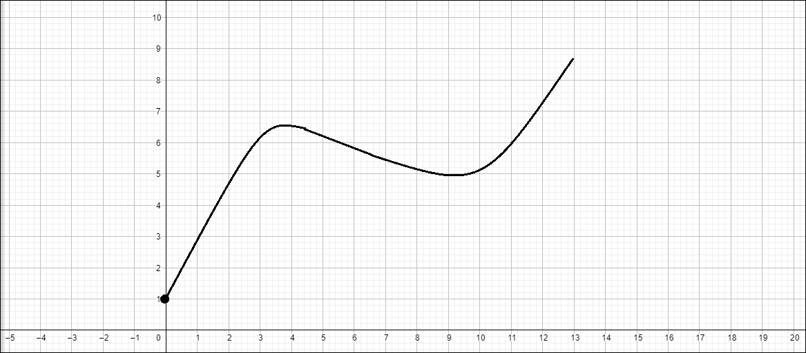
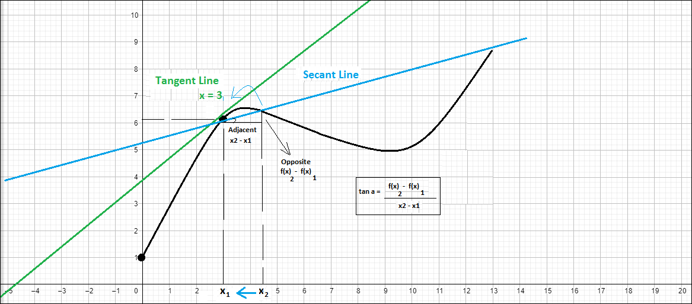

# Introduction to Derivatives

## Contents

 - [01 - The Parabola Rate of Change problem](#parabola-problem)
 - [02 - The main idea behind Derivatives](#derivative-behind)
 - [03 - Solving the Rate of Change problem in a Parabola](#solving-parabola-problem)

<div id="parabola-problem"></div>

## 01 - The Parabola Rate of Change problem

Suppose we have the following function:


Now let's create a graph with Python to see it visually:

[test_ffunction.py](src/test_ffunction.py)
```python
def f(x):
  return x**2

if __name__ =='__main__':
  from matplotlib import pyplot as plt
  import pandas as pd

  df = pd.DataFrame({'x': range(-10, 10+1)}) # x Values.
  df['y'] = [f(x) for x in df.x] # y Values.

  print(df)

  plt.figure(figsize=(10, 10))
  plt.plot(df.x, df.y, color='blue', marker='o')
  plt.title("f(x) = x^2")
  plt.xlabel('x')
  plt.ylabel('x^2')
  plt.xticks(range(-10, 10+1, 1))
  plt.yticks(range(0, 100+1, 5))
  plt.grid()
  plt.savefig("../images/plot-01.png", format='png')
  plt.show()
```

**OUTPUT:**  
```python
     x    y
0  -10  100
1   -9   81
2   -8   64
3   -7   49
4   -6   36
5   -5   25
6   -4   16
7   -3    9
8   -2    4
9   -1    1
10   0    0
11   1    1
12   2    4
13   3    9
14   4   16
15   5   25
16   6   36
17   7   49
18   8   64
19   9   81
20  10  100
```

  

> As we can see the graph of the function is a parable; That is, the **growth is exponential** and **not constant**.

**NOTE:**  
That is, the *Rate of Change* is always changing as we go through the parabola.

So how do you find the *rate of change* for such a problem? Well, let's go in parts .. The first thing we need to pay attention to is that for each point in our parabola we have a slight **inclination**.

I will select some random points from our chart above to demonstrate how it works:

  

**NOTE:**  
Note that at points **(-5, 25)**, **(-2, -4.8)**, **(2, 4.8)** and **(7, 48)** we create some **tangent lines** curve. These **tangent lines** represent the slope (gradient) at that point, that is, the *Rate of Change* of those points.

<div id="derivative-behind"></div>

## 02 - The main idea behind Derivatives

Now let's leave this example of the function **x²** aside *(but only for now)*, to pay attention to a graph of an abstract function that we created...

The most important thing for now is to pay attention to the function curve:

  

Well just by looking at the graph of this function (which is just an example) you can already see **3** things:

 - **1st -** That the function does not have a constant slope;
 - **2nd -** That it is not a parable;
 - **3rd -** Finally, we can already see that our Rate of Change is not constant.

Well, but where do we want to go? Well following the graph of this function my goal is:

> **Find the rate of change at any point on the curve.**

For example, suppose we want to find the *Rate of Change* at point **x = 3**:

  

> The Rate of Change at that point is given by a line tangent to that point, that is, a line that touches only that point.

It will look something like this:

  

> If you think about it, this **tangent line** will move throughout our function by calculating the *Rate of Change* for each specific point.

Did not understand? See the image below to better understand how this would work:

  

Well, back to our example with our tangent line **(which represents the rate of change at point x = 3)**. Now let's add a **secant line** that will cross two points of the function, one of our points being **x = 3**:

  

Let's call these two points **x<sub>1</sub>** and **x<sub>2</sub>** in our function:

  

**OK nice!!**  
But what good is this **secant line** crossing at two points, and what matters to us is the tangent line?

Well if we take the point **x = 3** we call it **x<sub>1</sub>** and leave it fixed; and going back to the values ​​of the second point **x<sub>2</sub>**, we are going to meet our **tangent line**.

  

What we are doing is going from our **x<sub>2</sub>** against the **x<sub>1</sub>** as close as possible until we get to where the green line is, that is, our **tangent line**.  
So, this is going to be our strategy to find the **tangent line**:

 - **1st -** We create a line that crosses two points - **secant line**;
 - **2nd -** We walk this **secant line** (keeping the x<sub>1</sub> fixed) until we reach our tangent line **(or rate of change)**.

Ok, everything beautiful is wonderful, but how do we equate it? In other words, turn this into mathematics? Ok, let's go by parts ...

First, let's pay attention to our **secant line**. If you pay attention you will see that this line has an angle and that is clear to see, because at some point this line will cross the x-axis.

So, knowing this we can calculate the *rate of change* of this **secant lin**e following our geometric rule:

> **Opposite / Adjacent = Rate of change of a line**.

  

Okay, now let's explain this bagasse right?

The first thing we did was to calculate the **Adjacent / x<sub>2</sub> - x<sub>1</sub>**:

  

Now that we have the Adjacent Cateto let's calculate the **Opposite Cateto / f(x)<sub>2</sub> - f(x)<sub>1</sub>**:

> So, after all this paranauê we have the following formula for our **secant line**:

  

You will also see this formula abstracted for the following when we are talking about Derivatives:

  

 - **Δ (delta) for f(x) -** It is calculated by subtracting the values ​​of **f(x)** from our points;
 - **Δ (delta) for x -** It is calculated by subtracting the values ​​of **x** from our points.

**Ok we already have the formula for our Secante Line , but how do I get on my tangent line with this?**  
Now feel the trickery ... First, we know that to get on **the tangent line** we must move my **x<sub>2</sub>** as close to x<sub>1</sub> as possible (that is, we are shifting our secant line to the tangent line).

Knowing this is very simple, just apply our knowledge of **Limits** to our equation/function of **the secant line** to go as close as possible from **x<sub>2</sub>** to **x<sub>1</sub>**:

  

So now with this formula it is possible to discover the **Rate of Change**:

 - For any function;
 - At any point in the function.

  

<div id="solving-parabola-problem"></div>

## 03 - Solving the Rate of Change problem in a Parabola

Well, now that we know how to calculate the *Rate of Change* **for any function** at **any point in the function**, let's go back to our function **x²**:

  

The graph for this function we already know is this:

  

Now suppose we want to know the *Rate of Change* of our function **f(x) = x²** to **x = 3**.

The graph will look like this:

  

Well, first let's take our generic formula that we applied to our *secant line* earlier:

  

Now let's apply the function **f(x) = x²** to **x = 3** in this formula:

  

If you didn't quite understand what happened at our limit above, it was the following:

 - The *Rate of Change* of our point **x = 3** will be:
   - My **x** tending to **3** (that is, as close to 3 as possible);
   - From the function **f(x) = x²** minus **(-) 9**:
     - In other words, the Opposite Cateto;
   - Divided by **x** minus **(-) 3**:
     - That is, the Adjoining Cateto.

What happens if we apply **3** to our formula above? It will look like this:

  

Hey, we have a little problem so ... We can't divide anything by zero!  
Knowing this, the time has come to use some **algebraic witchcraft** to transform our equation into something acceptable mathematically:

  

See that these expressions are now equivalent. Another thing we must pay attention to is that if we put the denominator of our expression in parentheses **(x - 3)** we can simplify our algebraic expression for this:

  

That is, our limit of **x** tending to **3** for the function **f(x) = x²** will now be:

  

Now that we have an acceptable formula mathematically, let's apply **x = 3** to find the Rate of Change at that point:

  

Oops, now we have the *Rate of Change* of the function **f(x) = x²** when **x** tends to **3** - **(6)**

**NOTE:**  
Ok, we have the *Rate of Change* of the function **f(x) = x²** to **x = 3**. Now and for the other points? Is it possible to generalize to find at any point of the function **f(x) = x²** the *Rate of Change*?

> That is, we want the Derivative of the function **f(x) = x²** with respect to **x**.

The representation for this will look like this:

  

We read it like this:

> The Derivative of **x²** with respect to **x**.

We will now call this function Derivative of **g(x)**:

  

Okay, now let's recover our formula that we used to calculate our *secant line*, remember it?

  

Can we apply our function **f(x) = x²** in this formula? Of course it does:

  

**NOTE:**  
 - Remember that we have tested this before, but for **x = 3**?
 - Do you also remember that the way this expression is, the result would be **0/0**?

Well, we’re going to have to do that same **algebraic witchcraft** to make this expression mathematically acceptable, but now for the entire function **x²** and not just for the point **x = 3**:

  

Summing it all up we will have:

  

Now just replace our **x<sub>2</sub>** to tend to **x<sub>1</sub>** as it is explicit in our limit and we will have the following:

  

That is, the Derivative of the function **x²** is **2x**. Now just represent this with our function **g(x)**:

  
  
  

Okay, we already tested this function at point **x = 3**. Will it be the same?

  

Oops, really hit! The *Rate of Change* at my point **x = 3** was actually **6** for the function **f(x) = x²**.

**NOTE:**  
In other words, for the function **f(x) = x²** at any point, just apply **g(x) = 2x** and we will get the Rate of Change at that point **x**.

  

---

**REFERENCES:**  
[Cálculo (AULA 2): Derivada](https://www.youtube.com/watch?v=vFHa2BK-xuU&t=2284s)  
[Cálculo (AULA 3): Derivadas Parciais](https://www.youtube.com/watch?v=_-xBDLCQ7pk&t=9s)    

---

**Rodrigo Leite -** *Software Engineer*
