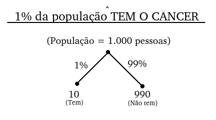

# Introdução ao Algoritmo Naive Bayes

## Conteúdo

 - [01 - O Problema inicial (analogia)](#intro)
 - [02 - Introdução ao Teorema de Bayes](#intro-to-bt)

---

<div id="intro"></div>

## 01 - O Problema inicial (analogia)

Ok, para vocês entenderem como funciona o **Teorema de Bayes** vamos começar com a seguinte analogia.

> Imagine que nós temos um teste que detecta se as pessoas tem ou não *câncer*. Esse teste tem **90% de accuracy** para ambos os lados.

**What?**  
Bem, a lógica é a seguinte:

 - **As pessoas que *TEM CÂNCER* e fazem esse teste:**
   - 90% dos casos o teste diz que a pessoa realmente *TEM CÂNCER*.
 - **E as pessoas que *NÃO TEM CÂNCER* e fazem esse teste:**
   - 90% dos casos o teste diz que a pessoa realmente *NÃO TEM CÂNCER*.

**NOTE:**  
Ou seja, ele acerta *90%* das vezes.

---

**Agora imagine que você fez esse teste e foi diagnosticado com câncer! Agora vem a pergunta chave:**

> **Qual a probabilidade de você realmente ter o câncer?**

**NOTE:**  
Em um primeiro momento a grande maioria das pessoas vão dizer que a **probabilidade é de 90%**, a final a **accuracy do teste é de 90%**. Mas essa resposta está muito errada e muito distante da resposta verdadeira.

**Por que?**  
Falta uma informação para nós respondermos essa pergunta, que é:

> **Quanto porcento (%) da população tem o câncer?**

Vamos imaginar o seguinte cenário:

```python
1% da população TEM O CÂNCER!
```

Seguindo, vamos expandir esse problema da seguinte forma:

```python
Imagine que nós temos uma população de 1.000 pessoas;
E você é uma delas e testou positivo para o câncer.
```

**NOTE:**  
Como apenas **1% da população TEM O CÂNCER** e a nossa população é de 1.000 pessoas, a pergunta vai ser a seguinte:

 - Sabendo que **1% da população TEM O CÂNCER** `e` **a população é de 1.000 pessoas**:
   - Quantas pessoas TEM CÂNCER? **(1% de 1.000)**
   - Quantas pessoas NÃO TEM CâNCER? **(99% de 1.000)**

**Essa é muito simples...**  

   - Quantas pessoas TEM CÂNCER? **(1% de 1.000)**
     - 10 Pessoas.
   - Quantas pessoas NÃO TEM CâNCER? **(99% de 1.000)**
     - 990 pessoas.

Vamos visualizar isso como uma árvore:

  

**NOTE:**  
Bem, entre essa população de *1.000 pessoas*, nós já sabemos:

 - Quais pessoas **tem (1%)** câncer.
 - E quais **não tem (99%)** câncer.

**Continuando...**  
Agora imagine que todas essas pessoas (população) mesmo sabendo quais *tem (1%)* ou não *câncer (99%)* vão fazer o nosso teste **que tem 90% de accuracy**.

> **Qual vai ser o resultado?**

**NOTE:**  
Novamente, vamos seguir o modelo de árvore para ficar mais claro o que está acontecendo:

  

Agora vem a pergunta...

> **Quantas pessoas o teste diagnosticou que tinha câncer?**

  

**NOTE:**  
Bem, o nosso teste diagnosticou que **108 pessoas tinham câncer**. Mas quantas pessoas de fato tinham câncer *(visto que nós já sabíamos quem realmente tinha ou não câncer)*?

Olhando para o nosso modelo de árvore nós temos o seguinte:

  

**NOTE:**  
Ou seja, das **108 pessoas diagnosticadas** com câncer, **apenas 9 realmente tinham**.

---

**NOTE:**  
Agora vamos voltar para a nossa pergunta original...

> **Qual a probabilidade de você realmente ter o câncer? (Utilizando o teste que tem 90% de accuracy).**

Pode parecer difícil, mas é simples. Nós temos:

 - **108 pessoas diagnosticadas com câncer:**
   - Total de amostras.
 - **Mas, apenas 9 realmente tem câncer:**
   - Você está incluso nessas amostras.

Fazendo um cálculo básico de probabilidade nós temos:

  

Ou seja:

> **Qual a probabilidade de você realmente ter o câncer? (Utilizando o teste que tem 90% de accuracy) é de *8.3%*.**

**NOTE:**  
Mas, por que apenas **8.3%**?

> **Porque uma parcela muito baixa da população tem câncer (1% da população).**

**NOTE:**  
Bem, equacionar isso para um problema pequeno parece ser simples, mas para um problema grande e com chances das porcentagens serem alteradas, isso fica mais complexo.

> **Como nós podemos automatizar esse processo para qualquer problema desse gênero? `Teorema de Bayes!`**

---

<div id="intro-to-bt"></div>

## 02 - Introdução ao Teorema de Bayes

Bem, toda essa bruxaria que nós fizemos acima pode ser automatizada para qualquer problema desse gênero com o **Teorema de Bayes**.

A fórmula é a seguinte:

  

**What?**  
Calma, vamos entender como funciona essa fórmula... x

 - ***A* & *B* são eventos:**
   - Por exemplo, a probabilidade de ter câncer é um evento.
   - Outro exemplo, a probabilidade do exame dar positivo é outro evento.

**Hum, mas e aquele barra entre os eventos *A* e *B* o que significa?**

  

**Agora vamos imaginar uma situação, onde nós temos os seguintes eventos:**

 - **A**
   - Ter câncer.
 - **B**
   - Fazer um teste e dar positivo.

**Algo parecido com isso:**

  

**Ou seja, nós vamos ter a seguinte pergunta:**

> **Qual a probabilidade de ter câncer *(evento A)* `se` o exame deu positivo *(evento B)*?**

Por fim, para finalizar vamos colocar o nosso primeiro problema (analogia) na fórmula de **bayes**:

  

> ***Em breve...***

---

**REFERÊNCIA:**  
[Didática Tech - Inteligência Artificial & Data Science](https://didatica.tech) 
