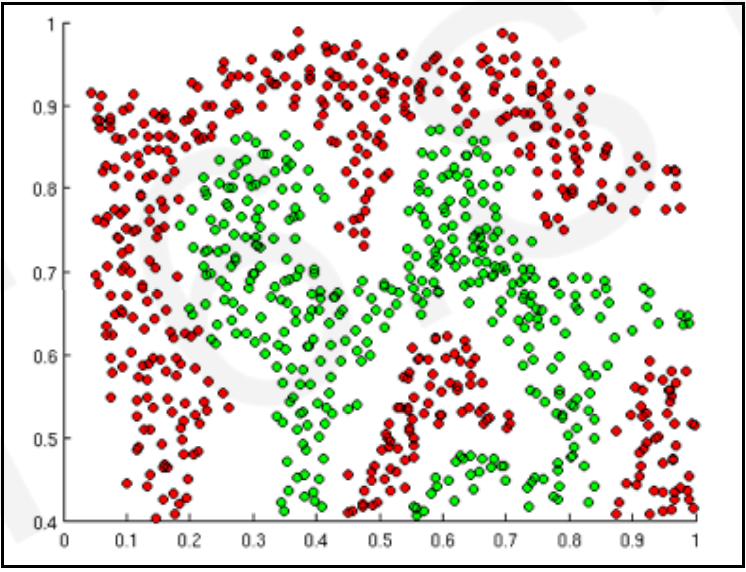
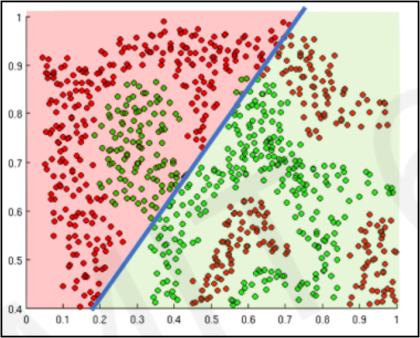
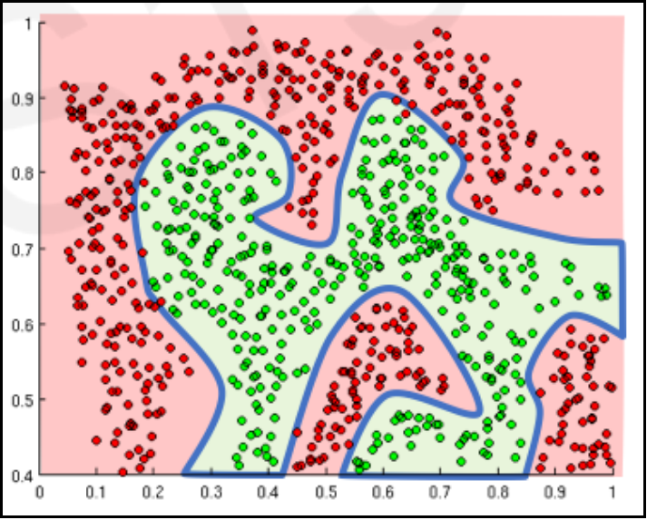
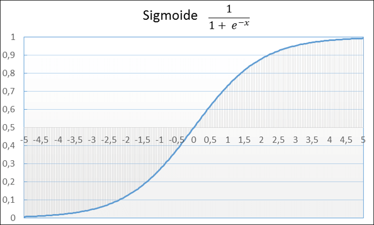
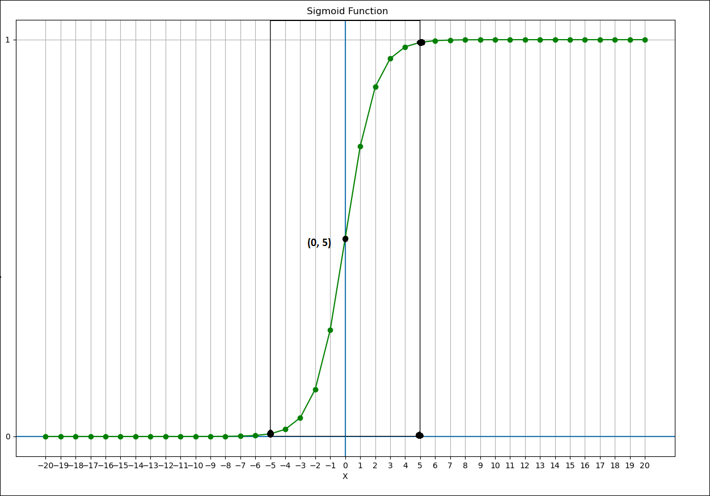

# Activation Functions

## Contents

 - [01 - Introduction to Activation Functions](#intro)
 - [02 - Sigmoid Function](#sigmoid)

<div id="intro"></div>

## 01 - Introduction to Activation Functions

Well guyz, when we are using a Neural Network to learn something it is common to use a **Nonlinear Activation Function**. But what is this kind of function really for?

> **The purpose of the Activation Functions is to introduce nonlinearities in a Neural Network (In the context of Neural Networks of course).**

See the example below for clarity:

  

**NOTE:**  
Now suppose I ask you to separate these red dots from the green ones using a *Linear Function*, would you be able to do that? **NOT!**

You could do something like this, but it wouldn't solve the problem:

  

**NOTE:**  
That is, no matter how many *Linear Functions* you use, it will always generate a line. On the other hand, with *Non-Linear Functions*, you can solve the problem of separating the red dots from the green ones.

Something like that:

  

---

<div id="sigmoid"></div>

## 02 - Sigmoid Function

Well guyz... The *Sigmoid Function* was born with the need to binarize the data. How do you binarize the data? Ok, suppose we have a bank and we want to binarize in order to differentiate customers who are in debt and those who are not in debt with our bank.

Let's assume that the binarization looks like this:

 - **0**, For customers who are **indebted** to the Bank;
 - **1**, For customers who are **ok** with the bank.

Now let's take a look at the aspects of this Sigmoid Function:

  

See? It is a reasonably easy function to understand. Let's apply this in points to some **x** entries to see it better:

[sigmoide.py](src/sigmoide.py)
```python
def f(x):
  from math import e
  return (1)/(1 + (e**-x))

if __name__ =='__main__':
  from matplotlib import pyplot as plt
  import pandas as pd

  df = pd.DataFrame({'x': range(-20, 20+1)})
  df['y'] = [f(n) for n in df.x]

  print(df)

  plt.figure(figsize=(15, 10))
  plt.title('Sigmoid Function')
  plt.xlabel('X')
  plt.ylabel('y = (1)/(1 + (e**-x))')
  plt.xticks(range(-20, 20+1, 1))
  plt.yticks(range(-20, 20+1, 1))
  plt.axhline()
  plt.axvline()
  plt.grid()
  plt.plot(df.x, df.y, color='green', marker='o')
  plt.savefig('../images/sigmoid-01.png', format='png')
  plt.show()
```

**OUTPUT:**  
```python
     x             y
0  -20  2.061154e-09
1  -19  5.602796e-09
2  -18  1.522998e-08
3  -17  4.139938e-08
4  -16  1.125352e-07
5  -15  3.059022e-07
6  -14  8.315280e-07
7  -13  2.260324e-06
8  -12  6.144175e-06
9  -11  1.670142e-05
10 -10  4.539787e-05
11  -9  1.233946e-04
12  -8  3.353501e-04
13  -7  9.110512e-04
14  -6  2.472623e-03
15  -5  6.692851e-03
16  -4  1.798621e-02
17  -3  4.742587e-02
18  -2  1.192029e-01
19  -1  2.689414e-01
20   0  5.000000e-01
21   1  7.310586e-01
22   2  8.807971e-01
23   3  9.525741e-01
24   4  9.820138e-01
25   5  9.933071e-01
26   6  9.975274e-01
27   7  9.990889e-01
28   8  9.996646e-01
29   9  9.998766e-01
30  10  9.999546e-01
31  11  9.999833e-01
32  12  9.999939e-01
33  13  9.999977e-01
34  14  9.999992e-01
35  15  9.999997e-01
36  16  9.999999e-01
37  17  1.000000e+00
38  18  1.000000e+00
39  19  1.000000e+00
40  20  1.000000e+00
```

  

Now it was beautiful!! In addition to all the outputs for **40** x inputs, from -20 to 20; We also have a more beautiful, detailed graph with more entries.

**But what did you notice in this role?**

 - **1st -** If you pay attention to negative values ​​in this function, it converts very quickly to zero (0);
 - **2nd -** The same is true for positive values, it converts very fast to 1.

So we got to where we wanted to binarize our clients with:

 - **0**, For customers who are **indebted** to the Bank;
 - **1**, For customers who are **ok** with the bank.

  

**NOTE:**  
Another interesting thing to note is that if you pay attention to our graph this conversion to **0** or **1** always happens after **-5** or **5**:

  

**NOTE:**  
This interval between the point **(0, 5)** and **-5** and **5** is what we know as the **TRANSITION POINT**. That is, at the time of programming we can create some *witchcraft* to say that:

 - If **x** > **(0, 5)** - Let's binary to **1**;
 - If **x** < **(-0, 5)** - Let's binary to **0**.

  

---

**REFERENCES:**  
[Didática Tech - Inteligência Artificial & Data Science](https://didatica.tech/)  
[Aprenda a função Sigmóide (machine learning)](https://www.youtube.com/watch?v=DlBhJdHQElI&t=22s)  

---

**Rodrigo Leite -** *Software Engineer*  
