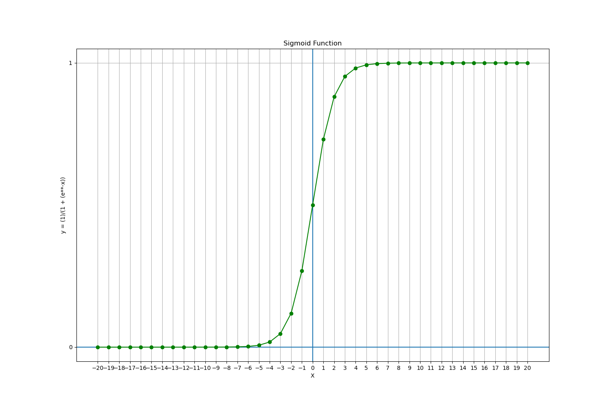

# Funções de Ativação

## Contents

 - [01 - Introdução às Funções de Ativação](#01)
 - [02 - Função Sigmóide](#02)

<div id="01"></div>

## 01 - Introdução às Funções de Ativação

Bem gente, quando estamos utilizando uma *Rede Neural* para aprender algo é comum utilizar uma **Função de Ativação Não-Linear**. Mas para que realmente serve esse tipo de função?

> O objetivo das Funções de Ativação é introduzir não linearidades em uma Rede Neural (No contexto de Redes Neurais é claro).

Veja o exemplo abaixo para ficar mais claro:

  

**NOTE:**  
Agora suponha que eu lhe peça para você separar esses pontos vermelho dos verde utilizando uma *Função Linear*, você conseguiria fazer isso? **NÃO!**  

Você conseguiria fazer algo parecido com isso, mas não resolveria o problema:

  

**NOTE:**  
Ou seja, não importa quantas *Funções Lineares* você utilize, ela sempre vai gerar uma linha. Por outro lado com **Funções Não-Lineares** você consegue resolver o problema de separar os pontos vermelho dos verde.

Algo parecido com isso:

  

---

<div id='02'></div>

## 02 - Função Sigmóide

Bem gente, a **Função Sigmóide** nasceu com a necessidade de binarizar os dados. Como assim binarizar os dados? Ok, suponha que nós temos um banco e queremos binarizar de forma a diferenciar os clientes que estão em débito  e os que não estão em débito no nosso banco.

Vamos supor que a binarização ficou assim:

 - **0**, Para os clientes que estão em ***débito*** com o Banco;
 - **1**, Para os clientes que estão ***ok*** com o banco.

Agora vamos dar uma olhada nos aspectos dessa Função Sigmóide:


Viram? É uma função razoavelmente fácil de entender. Vamos aplicar isso em pontos para algumas entradas de **x** para ver isso melhor:

[sigmoide.py](src/sigmoide.py)
```python
def f(x):
  from math import e
  return (1)/(1 + (e**-x))

if __name__ =='__main__':
  from matplotlib import pyplot as plt
  import pandas as pd

  df = pd.DataFrame({'x': range(-20, 20+1)})
  df['y'] = [f(n) for n in df.x]

  print(df)

  plt.figure(figsize=(15, 10))
  plt.title('Função Sigmóide')
  plt.xlabel('X')
  plt.ylabel('y = (1)/(1 + (e**-x))')
  plt.xticks(range(-20, 20+1, 1))
  plt.yticks(range(-20, 20+1, 1))
  plt.axhline() # Adiciona uma linda na horizontal (h) - (eixo-x)
  plt.axvline() # Adiciona uma linha na vertical (v) - (eixo-y)
  plt.grid()
  plt.plot(df.x, df.y, color='green', marker='o')
  plt.savefig('../images/sigmoide-plot.png', format='png')
  plt.show()
```

**OUTPUT:**  
```python
     x             y
0  -20  2.061154e-09
1  -19  5.602796e-09
2  -18  1.522998e-08
3  -17  4.139938e-08
4  -16  1.125352e-07
5  -15  3.059022e-07
6  -14  8.315280e-07
7  -13  2.260324e-06
8  -12  6.144175e-06
9  -11  1.670142e-05
10 -10  4.539787e-05
11  -9  1.233946e-04
12  -8  3.353501e-04
13  -7  9.110512e-04
14  -6  2.472623e-03
15  -5  6.692851e-03
16  -4  1.798621e-02
17  -3  4.742587e-02
18  -2  1.192029e-01
19  -1  2.689414e-01
20   0  5.000000e-01
21   1  7.310586e-01
22   2  8.807971e-01
23   3  9.525741e-01
24   4  9.820138e-01
25   5  9.933071e-01
26   6  9.975274e-01
27   7  9.990889e-01
28   8  9.996646e-01
29   9  9.998766e-01
30  10  9.999546e-01
31  11  9.999833e-01
32  12  9.999939e-01
33  13  9.999977e-01
34  14  9.999992e-01
35  15  9.999997e-01
36  16  9.999999e-01
37  17  1.000000e+00
38  18  1.000000e+00
39  19  1.000000e+00
40  20  1.000000e+00
```

  

Agora sim ficou bonito!! Além de todas às saídas para **40** entradas de **x**, de -*20* a *20*; Também temos um gráfico mais bonito, detalhado e com mais entradas.

**Mas o que você notou nessa função?**  
 - **1ª -** Se você prestar atenção nessa função para valores negativos, ela converte muito rápido para zero (0);
 - **2ª -** O mesmo acontece para valores positivos, ela converte muito rápido para 1.

Então nós chegamos onde queriamos binarizar nossos cliente com:

 - **0**, Para os clientes que estão em ***débito*** com o Banco;
 - **1**, Para os clientes que estão ***ok*** com o banco.

  

**NOTE:**  
Outra coisa interessante a se notar é que se você prestar atenção no nosso gráfico essa conversão para **0** ou **1** acontece sempre depois de **-5** ou **5**:

  

**NOTE:**  
Esse intervalo entre o ponto **(0, 5)** e **-5** e **5** é o que conhecemos como **PONTO DE TRANSIÇÃO**. Ou seja, na hora da programação nós podemos criar alguma bruxaria para dizer que:

 - Se **x** > **(0, 5)** - *Vamos binarizar para 1*;
 - Se **x** < **(0, 5)** - *Vamos binarizar para 0*.

  

---

**REFERENCES:**  
[Aprenda a função Sigmóide (machine learning)](https://www.youtube.com/watch?v=DlBhJdHQElI&t=22s)  

---

**Rodrigo Leite** *- Software Engineer*
