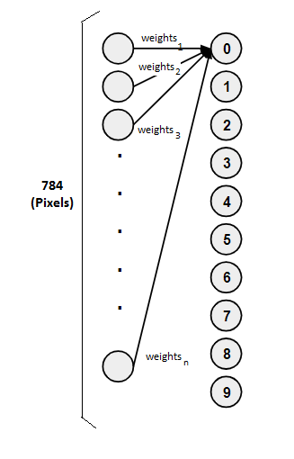
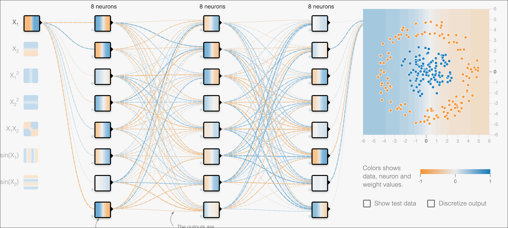
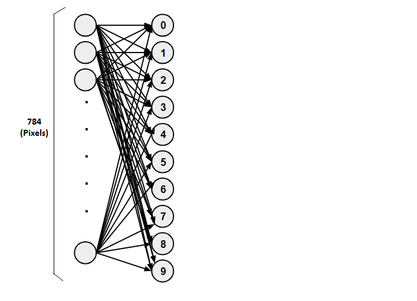
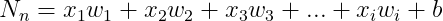
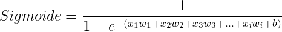
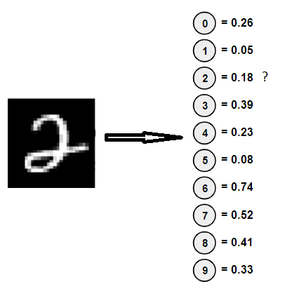
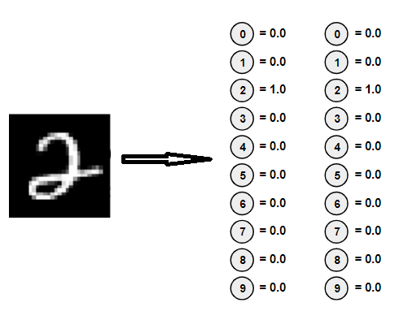

# Introdução às Redes Neurais Artificiais (RNA)

## Contents

 - [01 - História & Introdução às Redes Neurais Artificiais (RNA)](#intro-to-rna)
 - [02 - O primeiro Neurônio Artificial (Perceptron)](#perceptron)
 - [03 - Um exemplo abstrato de Rede Neural Artificial](#03)
   - [03.1 - Redes Neurais Densas](#03-1)

## 01 - História & Introdução às Redes Neurais Artificiais (RNA)

Ok, para começar com **Redes Neurais Artificiais**, nada melhor do que pensar como essa ideia se basea. Na verdade às redes neurais são baseadas na mesma lógica dos neurônios humano.

Veja essa imagem abaixo para ter uma idéia mais visual:

  

Como nós sabemos em um cérebro humano existem **bilhões** de neurônios e sinapses (que faz ligação entre neurônios). Sabendo disso podemos tentar criar **Neurônios Artificiais** seguindo essa lógico, porém, utilizando modelos matemáticos.

---

## 02 - O primeiro Neurônio Artificial (Perceptron)

O primeiro **Neurônio Artificial** criado foi o **[Perceptron](https://en.wikipedia.org/wiki/Perceptron)** em 1958 por [Frank Rosenblatt](https://en.wikipedia.org/wiki/Frank_Rosenblatt):

  

**NOTE:**  
O **[Perceptron](https://en.wikipedia.org/wiki/Perceptron)** tinha a idéia principal de receber diferentes entradas (ou sinais) e solta na saída o sinal (resultado) **1** ou **0**. Esse sinal (resultado) basicamente diz se o neurônio vai está *ativo* ou *não* para prosseguir para outro neurônio. Com o tempo os cientista descobriram que existiam outras possibilidades para os neurônios; Não só *ativos* ou *não*, mas não vamos entrar em detalhes por agora.

A ideia do **[Perceptron](https://en.wikipedia.org/wiki/Perceptron)** era um único *neurônio* que recebia **xi** entradas; Multiplicava essas entrada com seus respectivos pesos; Depois passava por uma *Função de Ativação (Non-Linear)* e recebia uma *saída*.

---

## 03 - Um exemplo abstrato de Rede Neural Artificial

Agora para continuar nossos estudos sobre Redes Neurais, vamos pensar no seguinte problema:

> **Como criar uma *rede neural* para identificar números em uma imagem?**

Por exemplo, nós queremos identificar o número **4**... Mas como identificar números em uma imagem? Bem, imagens em um computador são compostas de vários píxeis.

Veja a abstração (é só um exemplo) abaixo:

  

Na imagem acima:

 - **Os píxeis brancos:** Representam o número 4;
 - **E os píxeis pretos:** O resto da imagem.

**NOTE:**  
Então, para treinar nossa *rede neural* é muito simples. Basta, passar várias imagens de números para a nossa rede neural e ela vai identificar padrões comum para cada número. Por exemplo, nós passamos vários números **4** escritos a mão por várias pessoas diferentes e a nossa rede neural vai identificar padrões comum nos números **4**.

Agora veja essa abstração de *Rede Neural* bem simples abaixo:

  

Na *Rede Neural* (abstração) acima nós temos o seguinte:

 - **1ª -** Os **neurônios de entrada *(784 píxeis)***; Esses neurônios emitem saídas entre **0** e **1**;
 - **2ª -** Os **pesos** *(weights)* de cada neurônio de entrada;
 - **3º -** Os **neurônios** que vão representar os números: **0**, **1**, **2**, **3**, **4**, **5**, **6**, **7**, **8**, **9**; Esses também  emitem saídas entre **0** e **1**.

**NOTE:**  
Nesse exemplo nós fizemos a ligação apenas de todas as entradas com o primeiro neurônio *(representando o número zero)*, mas em uma **rede neural densa** os neurônios da camada acima se conectam com todos os seus *antecessores*.

## 03.1 - Redes Neurais Densas

**O que é uma rede neural densa?**  
O nome sugere que as camadas estão totalmente conectadas (densas) pelos neurônios em uma camada de rede. Cada neurônio em uma camada recebe uma entrada de todos os neurônios presentes na camada anterior - portanto, eles estão densamente conectados.

Em outras palavras, a camada densa é uma camada totalmente conectada, o que significa que todos os neurônios em uma camada estão conectados aos da próxima camada.

  

**Por que usar uma rede neural densa?**  
Uma camada densamente conectada fornece recursos de aprendizado de todas as combinações dos recursos da camada anterior, enquanto uma camada convolucional depende de recursos consistentes com um pequeno campo repetitivo.

Voltando para o nosso exemplo de identificar números com uma Rede Neural. Densamente a nossa Rede Neural ficaria assim:

  

Agora vamos tentar transformar essa *rede neural* (abstração) em matemática:

  

Na equação acima:

 - **Nn** - São os neurônios que vão representar os números: 0 a 9;
 - **xi** - São as entradas (784 píxeis);
 - **wi** - São os pesos (weights);
 - **b** - Uma constante (bias).

Uma outra abstração matemática é a seguinte:

  

**NOTE:**  
Preste atenção que no exemplo acima nós temos apenas 1 neurônio recepto que vai receber **xn** entradas. Mas no nosso exemplo vamos ter 10 neurônios receptores *(0 a 9)*.

**NOTE:**  
Se você prestar atenção nessa equação com calma fica fácil de imaginar que ela é similar a **Equação da Reta** para várias variáveis de entrada de **xn**.  
Sabendo que todos os neurônios vão emitir saídas entre **0** e **1** *(Exemplo: 0.5, 0.8, 0.1, 0.9)* como nós podemos binarizar essas saídas para ficar **0** ou **1**?

Simples, basta utilizar a função Sigmoide!

  

Aplicando na prática fica assim:

  

---

  

Por exemplo, depois de multiplicar todos os píxeis de entrada **xi** com os pesos **wi** e somar tudo para o neurônio que vai representar o número zero (**N0**), quanto mais perto de **1** mais chance de ser o número zero.

## Por que quanto mais perto de 1 mais chance de ser o número zeo?

Para entender melhor isso, suponha que por acaso alguém passou o número 2 para a nossa Rede Neural identificar qual número é na imagem:

  

E como saída nós tivemos o seguinte resultado para todos os neurônios (que representam os números):

  

Ué, por que o neurônio que representa o número 2 só deu **0.18** (18% de probabilidade de ser o número 2)? Bem, inicialmente é comum em uma Rede Neural seus pesos **wi** iniciarem com valores aleatórios e nós vamos calibrando até achar os melhores pesos **wi** para a entrada.

Veja essa outra abstração abaixo:

  

**NOTE:**  
Veja que na primeira coluna foi quando os pesos **wi** da Rede Neural foram iniciados e na segunda onde queremos chegar.

Agora o que nós vamos fazer é medir o erro da nossa Rede Neura. Isso pode ser feito facilmente subtraindo os valores dos neurônios atuais com os que a gente quer obter.

Não entendeu? Veja abaixo:

  

**NOTE:**  
Duas observações bem importantes devem ser feitas acima:

 - **1ª -** O **cost2** tem o índice 2 porque estamos inidicando o número 2 como entrada e só isso;
 - **2ª -** O **tamanho do nosso errado atual** foi de **2.05**; E quanto mais próximo de zero, melhor está calibrada *(os pesos)* nossa Rede Neural está.

Ué, mas por que quanto mais próximo de zero, melhor está calibrada *(os pesos)* nossa Rede Neural?

Então, veja o cenário abaixo:

  

  

Veja que agora nós temos o melhor cenário possível. O tamanho do nosso erro foi zero.

  

Bem, essa abordagen é só uma abstração como seria para o número 2, mas lembre-se que nós precisamor treinar nossa Rede Neural para vários outros números também.

---

**REFERENCES:**  
[Introdução a Redes Neurais e Deep Learning](https://www.youtube.com/watch?v=Z2SGE3_2Grg&feature=emb_title)  
[The Mathematics of Neural Networks](https://medium.com/coinmonks/the-mathematics-of-neural-network-60a112dd3e05)  
[Classification with TensorFlow and Dense Neural Networks](https://heartbeat.fritz.ai/classification-with-tensorflow-and-dense-neural-networks-8299327a818a)  

---

**Rodrigo Leite -** *Software Engineer*
