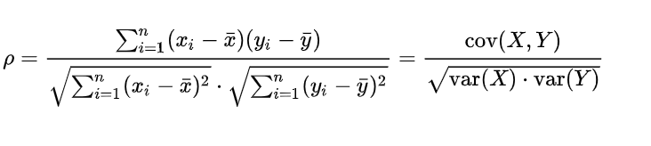
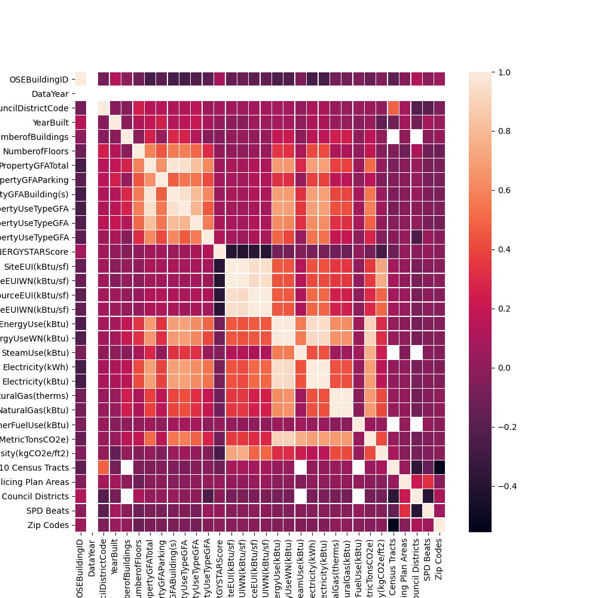

# Pré-Processamento

## Contents

 - [01 - Adequação dos tipos de Dados (int, float, str...)](#01)
 - [02 - Trabalhando com Dados Missing](#02)
 - [03 - Feature selection: Correlação](#03)
 - [04 - Criando uma mapa de calor (heatmap) para ver correlações entre variáveis](#04)

<div id='01'></div>

## 01 - Adequação dos tipos de Dados (int, float, str...)

Nem sempre você vai receber uma amostra (dataset) toda pronta e bonitinha para trabalhar. As vezes é preciso adequar os dados para só depois trabalhar com eles.

Vamos começar com uma amostra (dataset) disponibilizada pelo Kaggle referente ao [consumo de energia de alguns prêdios (SEA Building Energy Benchmarking)](https://www.kaggle.com/city-of-seattle/sea-building-energy-benchmarking).

Ok, depois de baixado vamos fazer alguns passos iniciais com a nossa amostra (dataset):

[first_sample.py](src/first_sample.py)
```python
import pandas as pd
pd.set_option('display.max_columns', 42)

data = pd.read_csv('../datasets/2015-building-energy-benchmarking.csv')
print(data.head())
```

**NOTE:**  
Bem, eu não vou deixar aqui saída porque vão ser muitas colunas (42 como nós configuramos), mas você pode testar no seu computador.

Mas como eu posso ver os tipos de dados de cada coluna da minha amostra de dados (dataset)? Simples, basta utilizar o atributo **dtypes** do Pandas:

[dtypes_pandas.py](src/dtypes_pandas.py)
```python
import pandas as pd
pd.set_option('display.max_columns', 42)

data = pd.read_csv('../datasets/2015-building-energy-benchmarking.csv')
print(data.dtypes)
```

**OUTPUT:**  
```python
OSEBuildingID                                                      int64
DataYear                                                           int64
BuildingType                                                      object
PrimaryPropertyType                                               object
PropertyName                                                      object
TaxParcelIdentificationNumber                                     object
Location                                                          object
CouncilDistrictCode                                                int64
Neighborhood                                                      object
YearBuilt                                                          int64
NumberofBuildings                                                  int64
NumberofFloors                                                   float64
PropertyGFATotal                                                   int64
PropertyGFAParking                                                 int64
PropertyGFABuilding(s)                                             int64
ListOfAllPropertyUseTypes                                         object
LargestPropertyUseType                                            object
LargestPropertyUseTypeGFA                                        float64
SecondLargestPropertyUseType                                      object
SecondLargestPropertyUseTypeGFA                                  float64
ThirdLargestPropertyUseType                                       object
ThirdLargestPropertyUseTypeGFA                                   float64
YearsENERGYSTARCertified                                          object
ENERGYSTARScore                                                  float64
SiteEUI(kBtu/sf)                                                 float64
SiteEUIWN(kBtu/sf)                                               float64
SourceEUI(kBtu/sf)                                               float64
SourceEUIWN(kBtu/sf)                                             float64
SiteEnergyUse(kBtu)                                              float64
SiteEnergyUseWN(kBtu)                                            float64
SteamUse(kBtu)                                                   float64
Electricity(kWh)                                                 float64
Electricity(kBtu)                                                float64
NaturalGas(therms)                                               float64
NaturalGas(kBtu)                                                 float64
OtherFuelUse(kBtu)                                               float64
GHGEmissions(MetricTonsCO2e)                                     float64
GHGEmissionsIntensity(kgCO2e/ft2)                                float64
DefaultData                                                       object
Comment                                                           object
ComplianceStatus                                                  object
Outlier                                                           object
2010 Census Tracts                                               float64
Seattle Police Department Micro Community Policing Plan Areas    float64
City Council Districts                                           float64
SPD Beats                                                        float64
Zip Codes                                                          int64
dtype: object
```

**NOTE:**  
Para a nossa sorte os tipos de dados da nossa amostra estão quase da maneira que nós queremos. Mas só para praticar suponha que nós queremos trocar o tipo da coluna **"DataYear"** que está em `int64` para `object` como faríamos? Simples basta utilizar a função **astype()** do **pandas.DataFrame**:

[astype.py](src/astype.py)
```python
import pandas as pd
pd.set_option('display.max_columns', 42)

data = pd.read_csv('../datasets/2015-building-energy-benchmarking.csv')

data['DataYear'] = data['DataYear'].astype(object)
print(data.dtypes)
```

**OUTPUT:**  
```python
OSEBuildingID                                                      int64
DataYear                                                          object <-----
BuildingType                                                      object
PrimaryPropertyType                                               object
PropertyName                                                      object
TaxParcelIdentificationNumber                                     object
Location                                                          object
CouncilDistrictCode                                                int64
Neighborhood                                                      object
YearBuilt                                                          int64
NumberofBuildings                                                  int64
NumberofFloors                                                   float64
PropertyGFATotal                                                   int64
PropertyGFAParking                                                 int64
PropertyGFABuilding(s)                                             int64
ListOfAllPropertyUseTypes                                         object
LargestPropertyUseType                                            object
LargestPropertyUseTypeGFA                                        float64
SecondLargestPropertyUseType                                      object
SecondLargestPropertyUseTypeGFA                                  float64
ThirdLargestPropertyUseType                                       object
ThirdLargestPropertyUseTypeGFA                                   float64
YearsENERGYSTARCertified                                          object
ENERGYSTARScore                                                  float64
SiteEUI(kBtu/sf)                                                 float64
SiteEUIWN(kBtu/sf)                                               float64
SourceEUI(kBtu/sf)                                               float64
SourceEUIWN(kBtu/sf)                                             float64
SiteEnergyUse(kBtu)                                              float64
SiteEnergyUseWN(kBtu)                                            float64
SteamUse(kBtu)                                                   float64
Electricity(kWh)                                                 float64
Electricity(kBtu)                                                float64
NaturalGas(therms)                                               float64
NaturalGas(kBtu)                                                 float64
OtherFuelUse(kBtu)                                               float64
GHGEmissions(MetricTonsCO2e)                                     float64
GHGEmissionsIntensity(kgCO2e/ft2)                                float64
DefaultData                                                       object
Comment                                                           object
ComplianceStatus                                                  object
Outlier                                                           object
2010 Census Tracts                                               float64
Seattle Police Department Micro Community Policing Plan Areas    float64
City Council Districts                                           float64
SPD Beats                                                        float64
Zip Codes                                                          int64
dtype: object
```

**NOTE:**  
Veja que agora a coluna **"DataYear"** está do tipo `object`.

<div id='02'></div>

## 02 - Trabalhando com Dados Missing

Para esse exemplo de dados missing em uma amostra de dados vamos trabalhar com o dataset [120 years of Olympic history](https://www.kaggle.com/heesoo37/120-years-of-olympic-history-athletes-and-results) referente a história de 120 anos de jogos olímpicos. Essa amostra de dados contém 15 colunas:

[olympic_history.py](src/olympic_history.py)
```python
import pandas as pd
pd.set_option('display.max_columns', 18)

data = pd.read_csv('../datasets/athlete_events.csv')

print(data.head())
print(data.dtypes)
```

**OUTPUT:**  
```python
   ID                      Name Sex   Age  Height  Weight            Team  \
0   1                 A Dijiang   M  24.0   180.0    80.0           China
1   2                  A Lamusi   M  23.0   170.0    60.0           China
2   3       Gunnar Nielsen Aaby   M  24.0     NaN     NaN         Denmark
3   4      Edgar Lindenau Aabye   M  34.0     NaN     NaN  Denmark/Sweden
4   5  Christine Jacoba Aaftink   F  21.0   185.0    82.0     Netherlands

   NOC        Games  Year  Season       City          Sport  \
0  CHN  1992 Summer  1992  Summer  Barcelona     Basketball
1  CHN  2012 Summer  2012  Summer     London           Judo
2  DEN  1920 Summer  1920  Summer  Antwerpen       Football
3  DEN  1900 Summer  1900  Summer      Paris     Tug-Of-War
4  NED  1988 Winter  1988  Winter    Calgary  Speed Skating

                              Event Medal
0       Basketball Men's Basketball   NaN
1      Judo Men's Extra-Lightweight   NaN
2           Football Men's Football   NaN
3       Tug-Of-War Men's Tug-Of-War  Gold
4  Speed Skating Women's 500 metres   NaN

ID          int64
Name       object
Sex        object
Age       float64
Height    float64
Weight    float64
Team       object
NOC        object
Games      object
Year        int64
Season     object
City       object
Sport      object
Event      object
Medal      object
dtype: objec
```

**NOTE:**  
Se você prestou bem atenção vai ver que na nossa amostra de dados (dataset) existem valores NaN. Esse **"NaN"** é particular do Python que resumidamente significa que os dados estão faltando (ou podem ser zero).

E se eu quiser excluir todas as linhas que contém valores **NaN**? Então, para isso o Pandas tem a função **dropna()**:

[dropna.py](src/dropna.py)
```python
import pandas as pd
pd.set_option('display.max_columns', 18)

data = pd.read_csv('../datasets/athlete_events.csv')
dt = data.dropna()

print(dt.head())
```

**OUTPUT:**  
```python
    ID                      Name Sex   Age  Height  Weight     Team  NOC  \
40  16  Juhamatti Tapio Aaltonen   M  28.0   184.0    85.0  Finland  FIN
41  17   Paavo Johannes Aaltonen   M  28.0   175.0    64.0  Finland  FIN
42  17   Paavo Johannes Aaltonen   M  28.0   175.0    64.0  Finland  FIN
44  17   Paavo Johannes Aaltonen   M  28.0   175.0    64.0  Finland  FIN
48  17   Paavo Johannes Aaltonen   M  28.0   175.0    64.0  Finland  FIN

          Games  Year  Season    City       Sport  \
40  2014 Winter  2014  Winter   Sochi  Ice Hockey
41  1948 Summer  1948  Summer  London  Gymnastics
42  1948 Summer  1948  Summer  London  Gymnastics
44  1948 Summer  1948  Summer  London  Gymnastics
48  1948 Summer  1948  Summer  London  Gymnastics

                                     Event   Medal
40             Ice Hockey Men's Ice Hockey  Bronze
41  Gymnastics Men's Individual All-Around  Bronze
42        Gymnastics Men's Team All-Around    Gold
44            Gymnastics Men's Horse Vault    Gold
48        Gymnastics Men's Pommelled Horse    Gold
```

Veja que agora não temos nenhum valor **NaN**. E se eu quiser saber quantas colunas e amostras (linhas) tem meu dataset? Uma maneira muito simples é utilizar o *atributo* **shape()** do Pandas:

[shape.py](src/shape.py)
```python
import pandas as pd
pd.set_option('display.max_columns', 18)

data = pd.read_csv('../datasets/athlete_events.csv')
dt = data.dropna()

print("Full sample: {0}".format(data.shape))
print("Sample without NaN: {0}".format(dt.shape))

```

**OUTPUT:**
```python
Full sample: (271116, 15)
Sample without NaN: (30181, 15)
```

Veja que no exemplo acima nós exibimos 2 exemplos:

 - Amostra completa;
 - Amostra sem dados NaN.

Agora se eu quiser diferenciar as colunas em em "True" ou "False" na minha amostra tem como? Sim, muito simples, basta utilizar a função **isnull()** do Pandas:

[isnull.py](src/isnull.py)
```python
import pandas as pd
pd.set_option('display.max_columns', 18)

data = pd.read_csv('../datasets/athlete_events.csv')
isnull = data.isnull()

print(isnull)
```

**OUTPUT:**  
```python
           ID   Name    Sex    Age  Height  Weight   Team    NOC  Games  \
0       False  False  False  False   False   False  False  False  False
1       False  False  False  False   False   False  False  False  False
2       False  False  False  False    True    True  False  False  False
3       False  False  False  False    True    True  False  False  False
4       False  False  False  False   False   False  False  False  False
...       ...    ...    ...    ...     ...     ...    ...    ...    ...
271111  False  False  False  False   False   False  False  False  False
271112  False  False  False  False   False   False  False  False  False
271113  False  False  False  False   False   False  False  False  False
271114  False  False  False  False   False   False  False  False  False
271115  False  False  False  False   False   False  False  False  False

         Year  Season   City  Sport  Event  Medal
0       False   False  False  False  False   True
1       False   False  False  False  False   True
2       False   False  False  False  False   True
3       False   False  False  False  False  False
4       False   False  False  False  False   True
...       ...     ...    ...    ...    ...    ...
271111  False   False  False  False  False   True
271112  False   False  False  False  False   True
271113  False   False  False  False  False   True
271114  False   False  False  False  False   True
271115  False   False  False  False  False   True
```

Veja que agora o nosso retorno foi:

 - **False =** Quando os valores NÃO são nulos;
 - **True =** Quando os valores são nulos.

**NOTE:**  
E se eu quiser saber o total de dados faltantes por coluna? Bem, agora nós vamos precisar fazer alguns malabarismo com Python e Pandas, mas não é nenhum bixo de sete cabeças:

[isnull_sum.py](src/isnull_sum.py)
```python
import pandas as pd
pd.set_option('display.max_columns', 18)

data = pd.read_csv('../datasets/athlete_events.csv')
isNullSum = data.isnull().sum()

print(isNullSum)
```

**OUTPUT:**
```python
ID             0
Name           0
Sex            0
Age         9474
Height     60171
Weight     62875
Team           0
NOC            0
Games          0
Year           0
Season         0
City           0
Sport          0
Event          0
Medal     231333
```

Veja como foi simples, apenas adicionamos a função **sum()**.

**NOTE:**  
Ta, mas se eu quiser saber quanto porcento % representa esses dados faltantes por coluna? Mais uma vez vamos fazer um malabarismo com Python e Pandas para conseguir aplicar isso:

[percent_missing.py](src/percent_missing.py)
```python
import pandas as pd
pd.set_option('display.max_columns', 18)

data = pd.read_csv('../datasets/athlete_events.csv')
percentMissing = (data.isnull().sum() / len(data['ID'])) * 100

print(percentMissing)
```

**OUTPUT:**  
```python
ID         0.000000
Name       0.000000
Sex        0.000000
Age        3.494445
Height    22.193821
Weight    23.191180
Team       0.000000
NOC        0.000000
Games      0.000000
Year       0.000000
Season     0.000000
City       0.000000
Sport      0.000000
Event      0.000000
Medal     85.326207
dtype: float64
```

Olhando para o resultado acima nós temos que:

 - A coluna **"age"** tem **3%** dos dados missing;
 - A coluna **"Height"** tem **22%** dos dados;
 - A coluna **"Weight"** tem **23%** dos dados missing;
 - E por fim, a coluna **"Medal"** tem **85%** dos dados missing.

Mas como isso foi feito na prática?

 - Primeiro, nós somamos os dados missing por coluna - **data.isnull().sum()**;
 - Depois, dividimos cada coluna pelo o tamanho da nossa amostra - **len(data['ID'])**;
 - E por fim, multiplicamos por **100**, ou seja, **100% dos dados**.

```python
percentMissing = (data.isnull().sum() / len(data['ID'])) * 100
```

Ok, tudo lindo... Mas se eu quiser preencher esses valores missing? Por exemplo, na medalha eu desejo trocar os valors **NaN** por **"Nenhuma"**. Para isso é muito simples basta utilizar a função **fillna()**:

[fillna-v1.py](src/fillna-v1.py)
```python
import pandas as pd
pd.set_option('display.max_columns', 18)

data = pd.read_csv('../datasets/athlete_events.csv')
data['Medal'] = data['Medal'].fillna('Nenhuma')

print(data['Medal'].head(10))
```

**OUTPUT:**  
```python
0    Nenhuma
1    Nenhuma
2    Nenhuma
3       Gold
4    Nenhuma
5    Nenhuma
6    Nenhuma
7    Nenhuma
8    Nenhuma
9    Nenhuma
Name: Medal, dtype: object
```

Agora, vamos pensar um pouco diferente, que tal preencher os valores **NaN** pelo a **média** ou **mediana** daquela coluna? **What?**

Ok, vamos lá... Primeiro, vamos pegar as colunas **Height** e **Weight** e substituir os valores `NaN` pelo a média da respectiva coluna:

[fillna_mean_median.py](src/fillna_mean_median.py)
```python
import pandas as pd
pd.set_option('display.max_columns', 18)

data = pd.read_csv('../datasets/athlete_events.csv')
data['Height'] = data['Height'].fillna(data['Height'].mean())
data['Weight'] = data['Weight'].fillna(data['Weight'].mean())

print(data[['Height', 'Weight']].head(20))
```

**OUTPUT:**  
```python
       Height     Weight
0   180.00000  80.000000
1   170.00000  60.000000
2   175.33897  70.702393
3   175.33897  70.702393
4   185.00000  82.000000
5   185.00000  82.000000
6   185.00000  82.000000
7   185.00000  82.000000
8   185.00000  82.000000
9   185.00000  82.000000
10  188.00000  75.000000
11  188.00000  75.000000
12  188.00000  75.000000
13  188.00000  75.000000
14  188.00000  75.000000
15  188.00000  75.000000
16  188.00000  75.000000
17  188.00000  75.000000
18  183.00000  72.000000
19  183.00000  72.000000
```

Vejam como foi simples, nós substituímos valores **NaN** pelo as `médias` de cada coluna Height e Weight. Para substituir pelo a mediana é só seguir a mesma lógica, porém, utilizar a função **median()**.

Ok, agora vamos avançar para alguns conceitos importantes quando se fala de **dados missing**. Como nós vimos acima é possível ver quanto `porcento %` de cada coluna está missing - **NaN**.

```python
percentMissing = (data.isnull().sum() / len(data['ID'])) * 100
```

Existem várias pesquisas sobre dados missing e o que fazer em cada ocasião. Nós não vamos ver todas, mas vou deixar abaixo algumas dicas importantes:

 - Quando os *dados missing* estão abaixo de **5%** `talvez` seja irrelevante:
   - Ou seja, se a coluna tiver menos de **5%** dos dados faltando não vai fazer tanta diferença;
   - Você pode trocar pelo a **media**, **median** ou algo de seu interesse.
 - Agora quando os *dados missing* estão acima de **30%** já é considero uma quantidade alta de dados faltantes.
 - Agora se por acado os dados missing estão acima de **60%** já é algo que deve ser tomada alguma atitude:
   - Porque se você tem mais de 60% dos dados faltando talvez essa variável no nosso modelo seja quase nula.

**NOTE:**  
Lembrando que esses exemplos acima são só observações e dicas. Tudo vai depender da variável e quão importante ela é. Por exemplo, na previsão de uma casa, quais variáveis tem mais relevância? Números de quartos? A cor da casa?

Existem Cientistas de Dados que dizem que todos os dados são relevantes, ou seja, nós nunca devemos excluir nenhuma variável (coluna).

**NOTE:**  
Mas se pensarmos bem, uma variável (coluna) que tem **60%** dos dados faltando e nós substituímos esses valores pelo a média ou mediana, nós estamos apenas criando dados artificiais e isso pode gerar uma certa poluição no nosso modelo, podendo gerar um resultado não verídico. Isso porque os dados não foram realmente coletados de fato, e sim nós estamos manipulando artificialmente.

Agora vamos voltar a nossa amostra (dataset) referente ao [consumo de energia de prêdios (SEA Building Energy Benchmarking)](https://www.kaggle.com/city-of-seattle/sea-building-energy-benchmarking) e aplicar um Pré-Processamento bem simples. vai ser o seguinte:

 - 1ª) - Vamos tirar a média de dados missing **(NaN)** em cada coluna do nosso Dataset e depois exibir essas médias;
 - 2ª) - Vamos trocar os dados missing **(NaN)** pelo a `mediana` na coluna - **ENERGYSTARScore**;
 - 3ª) - Por fim, vamos tirar a média dos dados missing **(NaN)** de cada coluna do nosso Dataset novamente e depois exibir essas médias.

Vamos ver como fica essa bruxaria em Python?

[test-01.py](src/test-01.py)
```python
import pandas as pd
pd.set_option('display.max_columns', 42)

data = pd.read_csv('../datasets/2015-building-energy-benchmarking.csv')

# Exibe a média de cada coluna.
print((data.isnull().sum() / len(data['OSEBuildingID'])) * 100, '\n')

data['ENERGYSTARScore'] = data['ENERGYSTARScore'].fillna(data['ENERGYSTARScore'].median())

# Exibe a média de cada coluna depois de substituir os NaN da coluna - ENERGYSTARScore
print((data.isnull().sum() / len(data['OSEBuildingID'])) * 100)
```

**OUTPUT:**  
```python
OSEBuildingID                                                     0.000000
DataYear                                                          0.000000
BuildingType                                                      0.000000
PrimaryPropertyType                                               0.000000
PropertyName                                                      0.000000
TaxParcelIdentificationNumber                                     0.059880
Location                                                          0.000000
CouncilDistrictCode                                               0.000000
Neighborhood                                                      0.000000
YearBuilt                                                         0.000000
NumberofBuildings                                                 0.000000
NumberofFloors                                                    0.239521
PropertyGFATotal                                                  0.000000
PropertyGFAParking                                                0.000000
PropertyGFABuilding(s)                                            0.000000
ListOfAllPropertyUseTypes                                         3.802395
LargestPropertyUseType                                            4.071856
LargestPropertyUseTypeGFA                                         4.071856
SecondLargestPropertyUseType                                     53.323353
SecondLargestPropertyUseTypeGFA                                  53.323353
ThirdLargestPropertyUseType                                      83.233533
ThirdLargestPropertyUseTypeGFA                                   83.233533
YearsENERGYSTARCertified                                         96.706587
ENERGYSTARScore                                                  23.353293 <-----
SiteEUI(kBtu/sf)                                                  0.299401
SiteEUIWN(kBtu/sf)                                                0.299401
SourceEUI(kBtu/sf)                                                0.299401
SourceEUIWN(kBtu/sf)                                              0.299401
SiteEnergyUse(kBtu)                                               0.299401
SiteEnergyUseWN(kBtu)                                             0.299401
SteamUse(kBtu)                                                    0.299401
Electricity(kWh)                                                  0.299401
Electricity(kBtu)                                                 0.299401
NaturalGas(therms)                                                0.299401
NaturalGas(kBtu)                                                  0.299401
OtherFuelUse(kBtu)                                                0.299401
GHGEmissions(MetricTonsCO2e)                                      0.299401
GHGEmissionsIntensity(kgCO2e/ft2)                                 0.299401
DefaultData                                                       0.029940
Comment                                                          99.610778
ComplianceStatus                                                  0.000000
Outlier                                                          97.485030
2010 Census Tracts                                               93.293413
Seattle Police Department Micro Community Policing Plan Areas     0.059880
City Council Districts                                           93.622754
SPD Beats                                                         0.059880
Zip Codes                                                         0.000000
dtype: float64

OSEBuildingID                                                     0.000000
DataYear                                                          0.000000
BuildingType                                                      0.000000
PrimaryPropertyType                                               0.000000
PropertyName                                                      0.000000
TaxParcelIdentificationNumber                                     0.059880
Location                                                          0.000000
CouncilDistrictCode                                               0.000000
Neighborhood                                                      0.000000
YearBuilt                                                         0.000000
NumberofBuildings                                                 0.000000
NumberofFloors                                                    0.239521
PropertyGFATotal                                                  0.000000
PropertyGFAParking                                                0.000000
PropertyGFABuilding(s)                                            0.000000
ListOfAllPropertyUseTypes                                         3.802395
LargestPropertyUseType                                            4.071856
LargestPropertyUseTypeGFA                                         4.071856
SecondLargestPropertyUseType                                     53.323353
SecondLargestPropertyUseTypeGFA                                  53.323353
ThirdLargestPropertyUseType                                      83.233533
ThirdLargestPropertyUseTypeGFA                                   83.233533
YearsENERGYSTARCertified                                         96.706587
ENERGYSTARScore                                                   0.000000 <-----ENERGYSTARScore
SiteEUI(kBtu/sf)                                                  0.299401
SiteEUIWN(kBtu/sf)                                                0.299401
SourceEUI(kBtu/sf)                                                0.299401
SourceEUIWN(kBtu/sf)                                              0.299401
SiteEnergyUse(kBtu)                                               0.299401
SiteEnergyUseWN(kBtu)                                             0.299401
SteamUse(kBtu)                                                    0.299401
Electricity(kWh)                                                  0.299401
Electricity(kBtu)                                                 0.299401
NaturalGas(therms)                                                0.299401
NaturalGas(kBtu)                                                  0.299401
OtherFuelUse(kBtu)                                                0.299401
GHGEmissions(MetricTonsCO2e)                                      0.299401
GHGEmissionsIntensity(kgCO2e/ft2)                                 0.299401
DefaultData                                                       0.029940
Comment                                                          99.610778
ComplianceStatus                                                  0.000000
Outlier                                                          97.485030
2010 Census Tracts                                               93.293413
Seattle Police Department Micro Community Policing Plan Areas     0.059880
City Council Districts                                           93.622754
SPD Beats                                                         0.059880
Zip Codes                                                         0.000000
dtype: float64
```

Veja que na variável (coluna) **"ENERGYSTARScore"** depois que nós substituímos os valores nulos **(NaN)** pelo a mediana nossa saída foi de 0% de dados nulos nessa coluna.

<div id="03"></div>

## 03 - Feature selection: Correlação

Ok, agora nós vamos aprender o calculo da correlação, mas afinal, para que serve esse cálculo? Bem, o cálculo da correlação tenta identificar quais variáveis estão conectadas (ou mais relacionadas) uma com a outra.

**NOTE:**  
Suponha que nós temos um a amostra (dataset) de dados de várias pessoas e entre as variáveis (colunas) nós temos as variáveis `salário` e `quantidade de bens`. Se você parar para pensar pode existir uma relação entre essas variáveis, seja essa relação *(correlação)* diretamente ou inversamente proporcional.

**NOTE:**  
Bem, nem tudo são flores! Essas variáveis que existem uma certa relação *(correlação)* é o que nós chamamos de variáveis dependentes. Mas essa relação não é uma coisa boa para o nosso modelo!  

Pensem comigo, se eu tenho 2 variáveis que são diretamente ou inversamente proporcional, por que eu tenho essas variáveis que podem me gerar basicamente o mesmo resultado? Ou seja, eu tenho 2 variáveis, porém com apenas uma já daria para prever (estimar) a outra. Logo, uma das variáveis não está nos ajudando!!!

> Basicamente a vantagem do cálculo da correlação é ver quais variáveis estão mais/muito correlacionadas eliminar uma delas para facilitar o trabalho do nosso modelo.

**NOTE:**  
Outra problema é que essas 2 variáveis cada uma vai ter um peso e no fim nós podemos está dando um peso duplo para a mesma característica.

Agora vamos ver a matemática do [Coeficiente de correlação de Pearson](https://pt.wikipedia.org/wiki/Coeficiente_de_correla%C3%A7%C3%A3o_de_Pearson#:~:text=Em%20estat%C3%ADstica%20descritiva%2C%20o%20coeficiente,ou%20de%20r%C3%A1cio%2Fraz%C3%A3o). A fórmula é a seguinte:

  

Bem, dependendo do resultado da nossa fórmula nós vamos ter uma varição de **1** e **-1**, onde:

 - **1** (máximo da correlação), significa que nós temos o máximo de correlação possível, ou **perfeita positiva**:
   - Ou seja, nossas variáveis estão muito correlacionadas;
   - Também conhecida como correlação perfeita, cada variação em uma altera a mesma coisa na outra positivamente.
 - **-1**, significa que nós temos uma correlação **perfeita negativa**:
   - Aumenta um pouco em uma e a outra diminui aquele mesmo pouco também.

Uma interpretação melhor é a seguinte para saber quão forte é a relação das nossas variáveis:

 - **0.9** - Para mais ou para menos indica uma correlação muito forte.
 - **0.7** a **0.9** - Positivo ou negativo indica uma correlação forte.
 - **0.5** a **0.7** - Positivo ou negativo indica uma correlação moderada.
 - **0.3** a **0.5** - Positivo ou negativo indica uma correlação fraca.
 - **0** a **0.3** - Positivo ou negativo indica uma correlação desprezível.

Bem, graças a Deus primeiramente e ao Python e as comunidades Open-Source, nós não vamos precisar fazer esses cálculos manualmente sempre.  
Vamos ver como é simples aplicar isso na prática em uma amostra de dados real. Para isso nós vamos utilizar o Dataset [Pima Indians Diabetes Database](https://www.kaggle.com/uciml/pima-indians-diabetes-database/data#) que tenta prever se um paciente tem ou não diabetes de acordo com algumas variáveis em junto com a função **corr()** do *Pandas*:

[corr.py](src/corr.py)
```python
import pandas as pd

data = pd.read_csv('../datasets/datasets_228_482_diabetes.csv')
print(data.corr(method = 'pearson'))
```

**OUTPUT:**  
```python
                          Pregnancies   Glucose  BloodPressure  SkinThickness   Insulin       BMI  DiabetesPedigreeFunction       Age   Outcome
Pregnancies                  1.000000  0.129459       0.141282      -0.081672 -0.073535  0.017683                 -0.033523  0.544341  0.221898
Glucose                      0.129459  1.000000       0.152590       0.057328  0.331357  0.221071                  0.137337  0.263514  0.466581
BloodPressure                0.141282  0.152590       1.000000       0.207371  0.088933  0.281805                  0.041265  0.239528  0.065068
SkinThickness               -0.081672  0.057328       0.207371       1.000000  0.436783  0.392573                  0.183928 -0.113970  0.074752
Insulin                     -0.073535  0.331357       0.088933       0.436783  1.000000  0.197859                  0.185071 -0.042163  0.130548
BMI                          0.017683  0.221071       0.281805       0.392573  0.197859  1.000000                  0.140647  0.036242  0.292695
DiabetesPedigreeFunction    -0.033523  0.137337       0.041265       0.183928  0.185071  0.140647                  1.000000  0.033561  0.173844
Age                          0.544341  0.263514       0.239528      -0.113970 -0.042163  0.036242                  0.033561  1.000000  0.238356
Outcome                      0.221898  0.466581       0.065068       0.074752  0.130548  0.292695                  0.173844  0.238356  1.000000
```

**NOTE:**  
 - Vejam que a nossa saída foi o tamanho da correlação entre as nossas variáveis **(Muito parecido com o Grafo de uma Matriz de Adjacência)**.
 - Outro ponto importante a se notar é que a relação de uma variável com ela mesma é **1**:
   - Ou seja, **perfeita positiva**.

<div id='04'></div>

## 04 - Criando uma mapa de calor (heatmap) para ver correlações entre variáveis

Outra maneira bem mais interessante e visual de ver correlações entre as variáveis e criar um **mapa de calor (heatmap)**. Vamos ver isso em Python:

[heatmap.py](src/heatmap.py)
```python
import pandas as pd
import seaborn as sns
import matplotlib.pyplot as plt

data = pd.read_csv('../datasets/datasets_228_482_diabetes.csv')

# Plot.
plt.figure(figsize=(10, 10))
sns.heatmap(data.corr(), annot=True, linewidths=.5)
plt.savefig('../images/plot-01.png', format='png')
plt.show()
```

**OUTPUT:**  
  

**NOTE:**  
Lembram daquela nossa amostra de dados (dataset) dos consumos de energia? Ok, vamos ver agora a correlação entre as variáveis dela também:

[heatmap-v2.py](src/heatmap-v2.py)
```python
import pandas as pd
import seaborn as sns
import matplotlib.pyplot as plt

data = pd.read_csv('../datasets/2015-building-energy-benchmarking.csv')

# Plot.
plt.figure(figsize=(10, 10))
sns.heatmap(data.corr(), linewidths=.2)
plt.savefig('../images/plot-02.png', format='png')
plt.show()
```

**OUTPUT:**  
  

**NOTE:**  
Se você prestar atenção vai ver que ele usou apenas os dados numéricos para ver essa correlação e faz todo sentido já que a fórmula de `Pearson` trabalha com a covariância de números.

---

**REFERÊNCIA:**  
[Como lidar com dados faltantes (NaN) em um Dataset (Python para machine learning - Aula 22)](https://www.youtube.com/watch?v=k1zi4EwIXoc)  
[Didática Tech](https://didatica.tech)  

---

**Rodrigo Leite -** *Software Engineer*
