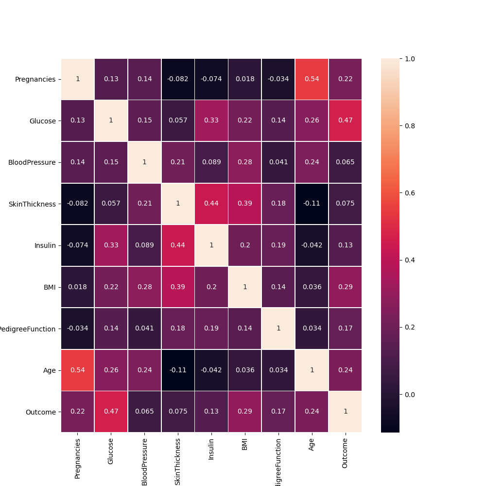

# Feature selection - Correlation

## Contents

 - [01 - Introduction to Correlation](#intro-to-correlation)
 - [02 - Creating a heatmap to see correlations between variables](#heatmap)


<div id="intro-to-correlation"></div>

## 01 - Introduction to Correlation

Okay, now we are going to learn the correlation calculation...

> **But after all, what is this calculation for?**

Well, the correlation calculation tries to identify which variables are connected *(or more related)* to each other. Now let's look at the math for [Pearson's correlation coefficient](https://en.wikipedia.org/wiki/Pearson_correlation_coefficient).

The formula is as follows:

  

Well, depending on the result of our formula we will have a variation of **1** and **-1**, where:

 - **1 (maximum correlation)** - Means that we have as much correlation as possible, or **perfect positive**:
   - That is, our variables are very correlated;
   - Also known as perfect correlation, each variation in one positively alters the same thing.
 - **-1** - Means that we have a **perfect negative** correlation:
   - It increases a little bit in one and the other decreases that same bit too.

A better interpretation is as follows to know how strong the relationship of our variables is:

 - **0.9** - More or less indicates a very strong correlation.
 - **0.7** to **0.9** - Positive or negative indicates a strong correlation.
 - **0.5** to **0.7** - Positive or negative indicates a moderate correlation.
 - **0.3** to **0.5** - Positive or negative indicates a weak correlation.
 - **0** to **0.3** - Positive or negative indicates a negligible correlation.

Well, thanks to God first and to Python and the Open-Source communities, we won't need to do these calculations manually every time.

Let's see how simple it is to apply this in practice to a real data sample. For this we will use the Dataset [Pima Indians Diabetes Database](https://www.kaggle.com/uciml/pima-indians-diabetes-database/) trying to predict whether a patient has diabetes or not according to some variables with the Pandas **corr()** function:

[corr.py](src/corr.py)  
```python
import pandas as pd

data = pd.read_csv('../datasets/datasets_228_482_diabetes.csv')
print(data.corr(method = 'pearson'))
```

**OUTPUT:**  
```python
                          Pregnancies   Glucose  BloodPressure  SkinThickness  ...       BMI  DiabetesPedigreeFunction       Age   Outcome
Pregnancies                  1.000000  0.129459       0.141282      -0.081672  ...  0.017683                 -0.033523  0.544341  0.221898
Glucose                      0.129459  1.000000       0.152590       0.057328  ...  0.221071                  0.137337  0.263514  0.466581
BloodPressure                0.141282  0.152590       1.000000       0.207371  ...  0.281805                  0.041265  0.239528  0.065068
SkinThickness               -0.081672  0.057328       0.207371       1.000000  ...  0.392573                  0.183928 -0.113970  0.074752
Insulin                     -0.073535  0.331357       0.088933       0.436783  ...  0.197859                  0.185071 -0.042163  0.130548
BMI                          0.017683  0.221071       0.281805       0.392573  ...  1.000000                  0.140647  0.036242  0.292695
DiabetesPedigreeFunction    -0.033523  0.137337       0.041265       0.183928  ...  0.140647                  1.000000  0.033561  0.173844
Age                          0.544341  0.263514       0.239528      -0.113970  ...  0.036242                  0.033561  1.000000  0.238356
Outcome                      0.221898  0.466581       0.065068       0.074752  ...  0.292695                  0.173844  0.238356  1.000000

[9 rows x 9 columns]
```

**NOTE:**  
 - See that our output was the size of the correlation between our variables.
 - Another important point to note is that the relationship of a variable to itself is **1**:
   - That is, **perfect positive**.

<div id="heatmap"></div>

## 02 - Creating a heatmap to see correlations between variables

> Another much more interesting and visual way to see correlations between the variables is create a **heatmap**.

Let's see this in Python:

[heatmap.py](src/heatmap.py)
```python
import pandas as pd
import seaborn as sns
import matplotlib.pyplot as plt

data = pd.read_csv('../datasets/datasets_228_482_diabetes.csv')

# Plot.
plt.figure(figsize=(10, 10))
sns.heatmap(data.corr(), annot=True, linewidths=.5)
plt.savefig('../images/heatmap.png', format='png')
plt.show()
```

**OUTPUT:**  



---

**REFERENCES:**  
[Didática Tech - Inteligência Artificial & Data Science](https://didatica.tech/)  

---

**Rodrigo Leite -** *Software Engineer*
