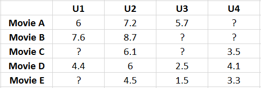
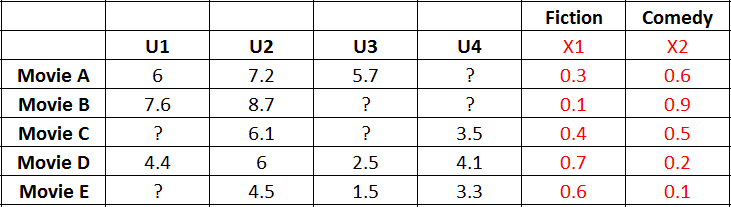

# Método Matrix Factorization/ SVD++ (Teoria)

## Conteúdo

 - [01 - Introdução ao Método Matrix Factorization (para filtragem colaborativa)](#intro)

---

## 01 - Introdução ao Método Matrix Factorization (para filtragem colaborativa)

Vamos começar com a seguinte analogia, imagine que nós temos 4 usuários que deram notas (rating) para 5 filmes. Uma representação em formato de Matriz para essa analogia pode ser vista abaixo:

  

 - **Linhas:**
   - Representam os filmes de **A** a **E**.
 - **Colunas:**
   - Representam os usuários de de **1** a **4**.

**NOTE:**  
Uma observação aqui é que nós não sabemos qual o tipo de cada filme. Por exemplo, comédia, ação, etc... Nós apenas temos a nota (rating) que cada usuário deu para cada filme.

**NOTE:**  
Outra observação é que temos alguns dados **faltantes/missing (?)**, isso pode ocorrer pelo fato do usuário não ter assistido o filme ainda.

> Agora vem a pergunta-chave, como eu posso ***prever*** esses valores **faltantes/missing (?)**?

Existem muitas abordagens para resolver esse problema, mas vamos imaginar que nós vamos ver quais usuários tem mais **similaridade** com o usuário que nós estamos tentando ***prever*** o valor **faltantes/missing (?)** em questão.

> Ok, mas como achar essa **similaridade**? ***Matrix Factorization***

Pegando a nossa Matriz com as notas que cada usuário deu para cada filme, vamos agora adicionar mais 2 features **x1** e **x2**, porém, essas features estarão relacionadas com os filmes e não com os usuários. Por exemplo, as features podem ser uma porcentagem do tipo de cada filme (Ação, Comédia, etc).

Algo parecido com isso:

  

**Mas por que adicionar essas features para os filmes?**  
Porque adicionar features para cada filme fica mais fácil de tentar ***prever*** os valores **faltantes/missing (?)** relacionando quanto porcento (%) cada filme tem em relação a cada feature e quanto porcento cada usuário deu para cada filme.

> Agora vem outra pergunta-chave, como eu posso criar essas features?

 - Nós podemos criar elas manualmente, ou seja, nós mesmo escolhemos (predefinimos) as features.
 - Ou eu posso deixar o próprio algoritmo criar essas features:
   - Essa abordagem vai ter um aspecto de **"Caixa Preta"** para nós porque não vamos saber de fato o que cada feature significa.
   - O próprio algoritmo vai encontrar uma relação para defenir uma característica para o **x1** e uma característica **x2**

**NOTE:**  
Uma observação aqui é que para criar essas features o algoritmo vai precisar de features específicas dos usuários. Algo parecido com isso:

  

Esses **Kn** são características de cada um dos usuários:

 - **K1:**
   - São as características do usuário 1.
 - **K2:**
   - São as características do usuário 2.
 - **K3:**
   - São as características do usuário 3.
 - **K4:**
   - São as características do usuário 4.

Agora nós vamos relacionar essas características dos usuários com as características dos filmes para fazer previsões de valores **faltantes/missing (?)**.  
Por exemplo, imagine que nós temos todos os valores **faltantes/missing (?)** e vamos fazer previsões com base nos valores das features do filme e features dos usuários.

A relação vai ser essa:

  

Ok, agora imagine que nós vamos ***prever*** qual a nota (rating) que o usuário 1 (k1) deu para o filme A. O calculo para isso é simples:

  

**NOTE:**  
Vejam que realmente é **6**, que é o valor que nós tinhamos antes. Sabendo disso nós podemos afirmar que:

> Tendo características para cada um dos usuários a multiplicação entre essas características e as features dos filmes (ou objecto observado) nós dá (prever) a nota (rating) para cada filme.

**NOTE:**  
Uma observação importante aqui é que nós não sabemos quais as *características* dos usuários e as *características* dos filmes. O nosso algoritmo quem vai ter que aprender (generalizar) quais são essas *características* (features).

> Agora vem outra pergunta-chave > Como isso pode ser feito? Gradiente descendente?

Uma abordagem é utilizando **Gradiente descendente**, onde, o algoritmo vai ajustando (derivando) as features até encontrar os melhores valores possíveis ou mais próximos disso.

**NOTE:**  
Outra observação é que nosso algoritmo não vai aprender essas features (características) do nada. Antes nós vamos passar alguns valores e ele vai apenas ignorar os dados **faltantes/missing (?)**. Por exemplo, nós podemos passar para o nosso algoritmo a nossa primeira matriz com as notas (rating) que cada usuário deu para cada filme:

  

Pronto, a partir desse ponto nosso algoritmo deve ser capaz de criar essas características (features) para os usuários e para os filmes.

---

**REFERÊNCIA:**  
[Didática Tech](https://didatica.tech/)

---

**Rodrigo Leite -** *drigols*
