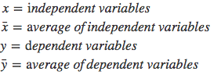
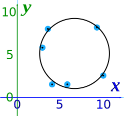
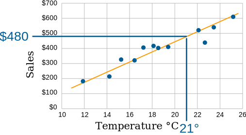

# Regressões

 - [01 - História & Introdução à Regressão](#01)
 - [02 - Método dos Mínimos Quadrados (Sum of Squared Errors: SSE)](#02)
 - [03 - Método dos Mínimos Quadrados Ordinários (Ordinary Least Squares: OLS)](#03)
   - [03.1 - Outliers](#03-1)
   - [03.2 - Interpolação vs Extrapolação](#03-2)
 - [04 - Galton e a Regressão](#04)
 - [05- Regressão vs Classificação](#05)

<div id='01'></div>

## 01 - História & Introdução à Regressão

> A *Regressão* é uma ferramenta estatística para **investigar a relação entre variáveis**.

De fato regressão é uma ferramente frequentemente usado para prever o futuro e entender **quais fatores causam um resultado**.  
Se você quiser descobrir:

 - Como a escolaridade afeta os salários;
 - Adivinhar o vencedor da próxima eleição;
 - Ou descobrir o impacto de uma nova droga...

Há uma boa chance de você usar regressão.

**Mas como surgiu a Regressão?**  
Na virada do século 18, melhorar a navegação oceânica era talvez o problema científico prático mais importante da época. A era dos descobrimentos gerou grandes riquezas e comércio lucrativo, mas as viagens marítimas ainda eram perigosas e sujeitas a imprecisões. A tecnologia aprimorada nessa área valia muito dinheiro.

> Com maior precisão de navegação, os navios - e suas cargas - teriam mais probabilidade de chegar ao local pretendido com segurança e rapidez.

Dadas as enormes recompensas econômicas de uma melhor navegação, a [geodésia](https://en.wikipedia.org/wiki/Geodesy), o estudo da medição da Terra, estava na moda. Naquela época, uma ferramenta fundamental dos geodesistas era o uso dos movimentos de outros planetas e cometas, em relação à Terra, como forma de entender a forma e o comportamento da Terra. Isso levou a um melhor mapeamento e a um melhor conhecimento da localização, o que, por sua vez, tornou mais fácil encontrar o caminho de forma rápida e segura de *Portugal* para a *Índia*.

Foi nesse contexto histórico que os matemáticos **Carl Friedrich Gauss** e **Adrien-Marie Legendre** descobriram independentemente o método dos **mínimos quadrados**, a característica essencial da regressão estatística.

> **Mínimos quadrados é uma forma de usar dados para fazer previsões quantitativas.**

Essas previsões são otimizadas de forma que, para qualquer ponto do conjunto de dados, o erro do modelo multiplicado por ele mesmo seja minimizado. Tanto **Gauss** quanto **Legendre** usaram o método dos mínimos quadrados para entender as órbitas dos cometas, com base em medições inexatas das localizações anteriores dos cometas.

<div id='02'></div>

## 02 - Método dos Mínimos Quadrados (Sum of Squared Errors: SSE)

Vamos começar com um problema real de Regressão e ver como o *método* dos **Mínimos Quadrados (Least Squares)** se aplica na prática.

Suponha que nós temos a seguinte amostra:

  

Ótimo, nós temos uma amostra com:

 - Amostras com experiências de trabalho (em anos);
 - E quanto cada amostra ganha.

Essas amostras são divididas em 2 categorias de variáveis:

 - Variáveis dependentes;
 - Variáveis ​​independentes.

Se você pegar nosso conjunto de dados de exemplo:

 - A coluna **“Years of Experience”** representa **Variáveis Independentes**:
   - **Nossas variáveis ​​independentes são independentes porque não podemos determinar matematicamente os anos de experiência.**
 - E os valores da coluna **“Salary in $1000”** representa **Variáveis ​Dependentes**:
   - **Porque podemos tentar *determinar/prever* os valores da coluna Salary (variável ​Dependente) com base em anos de experiência (variável independente).**

  

**NOTE:**  
Se você olhar os dados, os valores da coluna dependente (Salary in $1000) estão *aumentando/diminuindo* com base nos anos de experiência.

Antes de dar continuidade, vamos transformar todo esse nosso exemplo em código Python:

[set.py](src/set.py)
```python
from matplotlib import pyplot as plt
import pandas as pd

df = pd.DataFrame(
  {
    'Experience': [2, 3, 5, 13, 8, 16, 11, 1, 9],
    'Salary': [15, 28, 42, 64, 50, 90, 58, 8, 54]
  }
)

print(df)

plt.figure(figsize=(10, 7))
plt.scatter(df.Experience, df.Salary, color='g')
plt.title('Years of Experience vs Salary in $1000')
plt.xlabel('Years of Experience')
plt.ylabel('Salary in $1000')
plt.grid()
plt.savefig('../images/plot-01.png', format='png')
plt.show()
```

**OUTPUT:**  
```python
   Experience  Salary
0           2      15
1           3      28
2           5      42
3          13      64
4           8      50
5          16      90
6          11      58
7           1       8
8           9      54
```

  

Para encontrar os erros de cada valor dependente, precisamos usar a fórmula abaixo:

  

**NOTE:**  
Se você sabe o mínimo de Inglês e Matemática vai entender que essa formula é:

 - O Somatório:
   - Da diferença:
     - Do meu ponto (x<sub>i</sub>, y<sub>i</sub>) = y<sub>i</sub>;
     - E a média de todos meus resultados y.
   - Elevado ao quadrado<sup>2</sup>.

Ok, mas como fica isso na prática? Veja o exemplo abaixo:

  

Agora vamos transformar tudo isso em Python para ficar algo mais automatizado:

[error.py](src/error.py)  
```python
from matplotlib import pyplot as plt
import pandas as pd

df = pd.DataFrame(
  {
    'Experience': [2, 3, 5, 13, 8, 16, 11, 1, 9],
    'Salary': [15, 28, 42, 64, 50, 90, 58, 8, 54]
  }
)

df['Error'] = df['Salary'] - df['Salary'].mean()
df['Squared Errors'] = df['Error']**2
print(df)
print("Sum of Squared Errors (SSE): ", sum(df['Squared Errors']))
```

**OUTPUT:**  
```python
   Experience  Salary      Error  Squared Errors
0           2      15 -30.444444      926.864198
1           3      28 -17.444444      304.308642
2           5      42  -3.444444       11.864198
3          13      64  18.555556      344.308642
4           8      50   4.555556       20.753086
5          16      90  44.555556     1985.197531
6          11      58  12.555556      157.641975
7           1       8 -37.444444     1402.086420
8           9      54   8.555556       73.197531
Sum of Squared Errors (SSE):  5226.222222222223
```

  

**NOTE:**  
Vale ressaltar aqui que nós estamos elevando todos os erros ao quadrado<sup>2</sup> porque alguns deles vão ser negativos, e como nós queremos **somar todos os erros** isso acabaria modificando o resultado... Por isso, nós estamos elevando todos os erros ao quadrado<sup>2</sup> para que todos fiquem positivos.

<div id='03'></div>

## 03 - Método dos Mínimos Quadrados Ordinários (Ordinary Least Squares: OLS)

> Até então nós estavamos utilizando uma abordagem, onde nós tiravamos a **variança** de cada ponto em relação a média de todos os resultados **y**.

Agora vamos utilizar uma abordagem que usa uma **reta de melhor ajuste** para ver se conseguimos um efeito melhor. Ou seja, vamos criar uma reta que fique o mais próximo possível de todos os pontos; Tanto os pontos acima da linha quanto os abaixo.

Para isso, nós podemos utilizar a **Equação da Reta** para criar uma linha que passe o mais próximo possível de todos os dados, tanto acima quanto abaixo da linha:

  

**NOTE:**  
Para criar essa reta nós precisamos dos melhores valores possíveis para os termos **m (Coeficiente Angular)** e **b (Coeficiente Linear / Interceptação-y)** *para essa amostra*. Isso porque esses termos (constantes) variam de valores de acordo com os dados que nós temos.

As fórmulas para isso são as seguintes:

  
  

Aparentemente, dependendo do tamanho do nosso conjunto de dados isso é bastante fácil de fazer **(com um computador é claro)**.

Veja a tabela abaixo para ficar mais claro:


Agora nós já temos os dados necessário para aplicar na fórmula que resumidamente vai ficar assim:

  

Agora vamos testar essa bruxaria em Python para praticar um pouco:

[m_b.py](src/m_b.py)
```python
from matplotlib import pyplot as plt
import pandas as pd

df = pd.DataFrame(
  {
    'Experience': [2, 3, 5, 13, 8, 16, 11, 1, 9],
    'Salary': [15, 28, 42, 64, 50, 90, 58, 8, 54]
  }
)

df['(x_i - x_mean)'] = df['Experience'] - df['Experience'].mean()
df['(y_i - y_mean)'] = df['Salary'] - df['Salary'].mean()
df['(x_i - x_mean)(y_i - y_mean)'] = df['(x_i - x_mean)'] * df['(y_i - y_mean)']
df['(x_i - x_mean)^2'] = (df['Experience'] - df['Experience'].mean())**2

print(df)

m = (sum(df['(x_i - x_mean)'] * df['(y_i - y_mean)'])) / sum(df['(x_i - x_mean)^2'])
b = df['Salary'].mean() - (m * df['Experience'].mean())

print("Angular Coefficient (m): {0}\nLinear Coefficient (b): {1}".format(m, b))
```

**OUTPUT:**  
```python
   Experience  Salary  (x_i - x_mean)  (y_i - y_mean)  (x_i - x_mean)(y_i - y_mean)  (x_i - x_mean)^2
0           2      15       -5.555556      -30.444444                    169.135802         30.864198
1           3      28       -4.555556      -17.444444                     79.469136         20.753086
2           5      42       -2.555556       -3.444444                      8.802469          6.530864
3          13      64        5.444444       18.555556                    101.024691         29.641975
4           8      50        0.444444        4.555556                      2.024691          0.197531
5          16      90        8.444444       44.555556                    376.246914         71.308642
6          11      58        3.444444       12.555556                     43.246914         11.864198
7           1       8       -6.555556      -37.444444                    245.469136         42.975309
8           9      54        1.444444        8.555556                     12.358025          2.086420
Angular Coefficient (m): 4.799588900308324
Linear Coefficient (b): 9.180883864337105
```

  

**NOTE:**  
Tivemos uma diferença minúscula nos decimais, mas isso não altera quase nada.

Agora que nós já temos os melhores valores para os coeficientes **m** e **b** para esse conjunto de dados nós podemos aplicar eles na **Equação da Reta**:

  

Tabelando isso para ficar algo mais ilustrativo vamos ter:

  

**NOTE:**  
Agora a *Soma dos Erro Quadrado* foi reduzida significativamente de **5226,19** para **245,38**. Isso porque nós estamos utilizando uma reta de melhor ajuste que tem os melhores valores de **m** e **b** para esse conjunto de dados, não apenas subtraindo o ponto **y<sub>i</sub>** pelo a média de todos os **y**.

Vamos aplicar a tabela a cima em Python para praticar isso também:

[errorOLS.py](src/errorOLS.py)
```python
from matplotlib import pyplot as plt
import pandas as pd

df = pd.DataFrame(
  {
    'Experience': [2, 3, 5, 13, 8, 16, 11, 1, 9],
    'Salary': [15, 28, 42, 64, 50, 90, 58, 8, 54]
  }
)

df['(x_i - x_mean)'] = df['Experience'] - df['Experience'].mean()
df['(y_i - y_mean)'] = df['Salary'] - df['Salary'].mean()
df['(x_i - x_mean)(y_i - y_mean)'] = df['(x_i - x_mean)'] * df['(y_i - y_mean)']
df['(x_i - x_mean)^2'] = (df['Experience'] - df['Experience'].mean())**2

m = (sum(df['(x_i - x_mean)'] * df['(y_i - y_mean)'])) / sum(df['(x_i - x_mean)^2'])
b = df['Salary'].mean() - (m * df['Experience'].mean())

df['y = mx + b'] = [(m*x) + b for x in df['Experience']]
df['y_i - y = mx + b'] = df['Salary'] - df['y = mx + b']
df['(y_i - y = mx + b)^2'] = df['y_i - y = mx + b'] ** 2

newDF = df[['Experience', 'Salary', 'y = mx + b', 'y_i - y = mx + b', '(y_i - y = mx + b)^2']]

print(newDF)
print("Sum of Squared Errors (SSE): ", sum(newDF['(y_i - y = mx + b)^2']))
```

**OUTPUT**
```python
   Experience  Salary  y = mx + b  y_i - y = mx + b  (y_i - y = mx + b)^2
0           2      15   18.780062         -3.780062             14.288866
1           3      28   23.579651          4.420349             19.539489
2           5      42   33.178828          8.821172             77.813069
3          13      64   71.575540         -7.575540             57.388800
4           8      50   47.577595          2.422405              5.868046
5          16      90   85.974306          4.025694             16.206210
6          11      58   61.976362         -3.976362             15.811453
7           1       8   13.980473         -5.980473             35.766054
8           9      54   52.377184          1.622816              2.633532
Sum of Squared Errors (SSE):  245.3155190133606
```

**NOTE:**  
Esses códigos com *Pandas* talvez não fiquem o mais legível possível olhando como um Engenheiro de Software ou seguindo as boas práticas de Clean Code. Mas eu achei interessante trabalhar assim para deixar um pouco mais matemático e também praticar com a biblioteca *Pandas* (muito utilizada em Data Science). Vai da sua criatividade, você pode alterar como desejar... Apenas siga a lógica das fórmulas.

Ué, mas cade a reta de melhor ajuste com a **Equação da Reta** e os melhores valores dos termos (constantes) **m** e **b** para esse conjunto de dados?

[bestFitLine.py](src/bestFitLine.py)
```python
from matplotlib import pyplot as plt
import pandas as pd

df = pd.DataFrame(
  {
    'Experience': [2, 3, 5, 13, 8, 16, 11, 1, 9],
    'Salary': [15, 28, 42, 64, 50, 90, 58, 8, 54]
  }
)

df['(x_i - x_mean)'] = df['Experience'] - df['Experience'].mean()
df['(y_i - y_mean)'] = df['Salary'] - df['Salary'].mean()
df['(x_i - x_mean)(y_i - y_mean)'] = df['(x_i - x_mean)'] * df['(y_i - y_mean)']
df['(x_i - x_mean)^2'] = (df['Experience'] - df['Experience'].mean())**2


m = (sum(df['(x_i - x_mean)'] * df['(y_i - y_mean)'])) / sum(df['(x_i - x_mean)^2'])
b = df['Salary'].mean() - (m * df['Experience'].mean())

regression_line = [(m*x) + b for x in df['Experience']]

plt.figure(figsize=(10, 7))
plt.scatter(df.Experience, df.Salary, color='g')
plt.plot(df.Experience, regression_line, color='b')
plt.title('Years of Experience vs Salary in $1000')
plt.xlabel('Years of Experience')
plt.ylabel('Salary in $1000')
plt.grid()
plt.savefig('../images/plot-02.png', format='png')
plt.show()
```

**OUTPUT:**  

  

**NOTE:**  
 - O método **Ordinary Least Square** parece simples e o cálculo é fácil:
   - Mas, este método OLS funcionará para conjuntos de dados univariados que são variáveis ​​independentes únicas;
   - E variáveis ​​dependentes únicas;
   - E conjuntos de dados multivariados.
 - O conjunto de dados multivariados contém:
   - Um único conjunto de variáveis ​​independentes;
   - E vários conjuntos de variáveis ​​dependentes;
   - Exigindo o uso de um algoritmo de aprendizado de máquina denominado **“Gradient Descent”**.

**NOTE:**  
Vale ressaltar que essa ideia pode ser usada em muitas outras áreas, não apenas em linhas. Por exemplo, veja abaixo para um círculo:

  

Mas as fórmulas (e os passos dados) serão muito diferentes!

<div id='03-1'></div>

## 03.1 - Outliers

**Seja cuidadoso!**  
O método dos Mínimos quadrados é sensível a **outliers**. Um valor estranho puxará a linha em sua direção... Ou seja, se tivermos dados muito distorcidos, eles podem alterar o formato da reta não deixando ela mais ajustada possível.

<div id='03-2'></div>

## 03.2 - Interpolação vs Extrapolação

**Interpolação:**  
Interpolação é quando encontramos um valor dentro de nosso conjunto de pontos de dados:



Aqui, usamos *interpolação* linear para estimar as vendas a 21 °C.

**Extrapolação:**  
Extrapolação é quando encontramos um valor fora de nosso conjunto de pontos de dados:

  

Aqui, usamos a *extrapolação* linear para estimar as vendas a 29 °C (que é maior do que qualquer valor que temos).

**Cuidado:**  
A extrapolação pode dar resultados enganosos porque estamos em um "território desconhecido".

<div id='04'></div>

## 04 - Galton e a Regressão

Embora *Gauss* e *Legendre* tenham sido os criadores da característica principal da regressão, nem Gauss nem Legendre usaram a palavra **“regressão”** para se referir ao seu método. O termo regressão foi aplicado pela primeira vez à estatística pelo polímata **Francis Galton**.  
**Galton** é uma figura importante no desenvolvimento da estatística e da genética.

**Origem da Palavra Regressão:**  
A palavra regressão soa como voltar em alguns aspectos. Se você está tentando parar de fumar, mas depois cede ao desejo de fumar novamente, está passando por um episódio de regressão.  
O termo regressão  apareceu nos primeiros escritos desde o final dos anos 1300 e é derivado do termo latino  **regressus**, que significa retorno.

> É usado em diferentes campos com diferentes significados, mas em qualquer caso, é sempre referido a ação de regredir.

**NOTE:**  
Porém, em estatística, a **regressão** está relacionada ao estudo da relação entre:

 - As variáveis ​​explicativas;
 - E a variável resposta.

Por exemplo, o **nomeador da Regressão Francis Galton**, em 1889 publicou um artigo no qual demonstrava como todas as características de um indivíduo são herdadas por seus descendentes, *mas em média em menor grau*.

> Por exemplo, filhos com pais altos também são altos, mas em média sua altura será comparativamente menor do que a de seus pais.

Este fenômeno é denominado **regressão**. Desde então, esse termo viveu para definir técnicas estatísticas que analisam as relações entre duas ou mais variáveis.

Vamos ver esse Dataset de Galton utilizando o Python e Pandas:

[galtonDataset.py](src/galtonDataset.py)
```python
import pandas as pd

with open('../datasets/Galton_Dataset.txt', 'r') as f:
  data = pd.read_table(f, sep='\s+')

print(data.head(10))
```

**OUTPUT:**  
```python
  Family  Father  Mother Gender  Height  Kids
0      1    78.5    67.0      M    73.2     4
1      1    78.5    67.0      F    69.2     4
2      1    78.5    67.0      F    69.0     4
3      1    78.5    67.0      F    69.0     4
4      2    75.5    66.5      M    73.5     4
5      2    75.5    66.5      M    72.5     4
6      2    75.5    66.5      F    65.5     4
7      2    75.5    66.5      F    65.5     4
8      3    75.0    64.0      M    71.0     2
9      3    75.0    64.0      F    68.0     2
```

O resultado acima mostra um breve resumo dos dados usados ​​por Galton para seu estudo. As colunas (variáveis) representam o seguinte:

 - **Family:** A família à qual a criança pertence, rotulada de 1 a 204 e 136A;
 - **Father:** A altura do pai, em polegadas;
 - **Mother:** A altura da mãe, em polegadas;
 - **Gender:** O gênero da criança, masculino (M) ou feminino (F);
 - **Height:** A altura da criança, em polegadas;
 - **Kids:** O número de crianças na família da criança

A análise de regressão é usada em estatísticas para encontrar tendências nos dados. Por exemplo:

> Você pode supor que existe uma conexão entre quanto você come e quanto você pesa;

Se você tem ganhado peso nos últimos anos, pode prever quanto você pesará em dez anos se continuar a ganhar peso na mesma proporção. 

<div id='05'></div>

## 05 - Regressão vs Classificação

A regressão é uma tarefa de aprendizagem indutiva que tem sido amplamente estudada e é amplamente utilizada em aplicações práticas.

> Ao contrário dos processos de *classificação*, onde você está tentando prever rótulos de classes discretas - **Os modelos de regressão prevêem valores numéricos**.

---

**REFERENCES:**  
[The Discovery of Statistical Regression](https://priceonomics.com/the-discovery-of-statistical-regression/)  
[Going back to the origin of regression](https://subscription.packtpub.com/book/big_data_and_business_intelligence/9781788627306/1/ch01lvl1sec10/going-back-to-the-origin-of-regression)  
[Regressão Linear Simplificada - Mínimo Quadrado Ordinário vs Gradiente de Descida](https://towardsdatascience.com/linear-regression-simplified-ordinary-least-square-vs-gradient-descent-48145de2cf76)  
[Least Squares Regression](https://www.mathsisfun.com/data/least-squares-regression.html)  
[Scatter Plots](https://www.mathsisfun.com/data/scatter-xy-plots.html)  
[Regression - How to program the Best Fit Line](https://pythonprogramming.net/how-to-program-best-fit-line-machine-learning-tutorial/?completed=/how-to-program-best-fit-line-slope-machine-learning-tutorial/)  

---

**Rodrigo Leite -** *Software Engineer*
