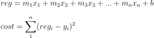
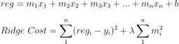
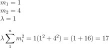
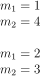
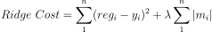

# Ridge Regression (+Regularização L1 & L2)

## Conteúdo

 - [01 - Recapitulando o calculo de Regressão Linear com várias variáveis + Função de Custo](#01)
 - [02 - Introdução ao Algoritmos Ridge Regression](#02)
 - [03 - Ridge Regression na Prática](#03)
 - [04 - Regularização L1 vs L2](#04)

<div id='01'></div>

## 01 - Recapitulando o calculo de Regressão Linear com várias variáveis + Função de Custo

Bem, antes de iniciarmos nossos estudos com o algoritmos de regressão **Ridge Regression**, vamos recapitular como era a fórmula do algoritmo de *Regressão Linear* para várias variáveis:

  

Não podemos deixar de esquercer dessa função que:

 - Os meus **x<sub>i</sub>** representam as variáveis.
 - Os meus **m<sub>i</sub>** ("a" ou pesos "w") representa o Coeficiente Angular:
   - Que altera a inclinação da reta;
   - E que é representado por um valor constante.
 - O meu **b** representa o deslocamento da Reta:
   - Que também é representado por um valor constante.

**NOTE:**  
Lembrando que a lógica por trás da função de custo é esse --> [Função de Custo](https://github.com/drigols/estudos/tree/master/modules/artificial-intelligence-topics/modules/linear-regression-and-gd#02---ideia-por-tr%C3%A1s-do-gradiente-descendente)

<div id='02'></div>

## 02 - Introdução ao Algoritmos Ridge Regression

O Algoritmo **Ridge Regression** segue a mesma lógica do Algoritmo de *Regressão Linear*:

> Ele tenta construir uma reta que melhor explique a relação entre os dados (ou variáveis).

**NOTE:**  
Ué, mas o que muda então? **Função de Custo**!

  

**What?** E o que significa o resto equação para a função de custo?

 - Nós vamos somar a nossa `Função de Custo`:
   - Uma constante **λ (lambda do grego)** que multiplica:
     - Somatório de todos os pesos **m<sub>i</sub>** elevado ao quadrado - **Σ m<sub>i</sub><sup>2</sup>**

**NOTE:**  
 - Vale salientar que a nossa constante **λ (lambda do grego)** é responsável por trazer o somatórios de todos os pesos **m<sub>i</sub>** elevado ao quadrado, para ordem de grandeza do nosso interesse:
   - Por exemplo: 10, 100, 1000...

Ta ok, mas o que isso muda da **Função de Custo** do Algoritmo de **Regressão Linear**?

> O Algoritmo **Ridge Regression** tenta diminuir o tamanho dos pesos (coeficientes).

Mas por que essa alteração toda?

 - Quando nós usamos o **Algoritmo de Regressão Linear** nós estamos interessados na melhor reta que se adéque aos dados;
 - Já quando nós usamos o **Algoritmo Ridge Regression** nós estamos interessados nos menores erros desde que os coeficientes **(m<sub>i</sub>)** também sejam pequenos.

Não entendeu? Ok, suponha que nós temos apenas 2 variáveis **x<sub>1</sub>** e **x<sub>2</sub>** e os pesos (coeficientes angulares) para os menores erros possíveis eram:

 - m<sub>1</sub> = 1;
 - m<sub>2</sub> = 4;
 - Vamos supor também que a nossa constante **λ (lambda do grego)** é **1**.

Como isso ficaria na `segunda parte` da **Função de Custo** para o **Algoritmo Ridge Regression**?

  

Agora suponha que o **Algoritmo Ridge Regression** viu que estava um pouco grande essa saída da `segunda parte` da **Função de Custo (17)** e alterou os pesos dos **m<sub>1</sub>** e **m<sub>2</sub>**, respectivamente para **2** e **3**. Como vai ficar agora a saída da `segunda parte`?

  

Opa, vejam que agora estamos seguindo exatamente o que **Algoritmo Ridge Regression** se propõe a fazer:

> Interessados nos menores erros desde que os coeficientes **(m<sub>i</sub>)** também sejam pequenos.

**NOTE:**  
Isso piorou os erros um pouco, porém, os pesos (coeficientes angulares) **m<sub>i</sub>** melhoraram. Sabendo disto você tem que refletir bem quando escolher entre os Algoritmos de **Regressão Linear** e **Ridge Regression**:

 - **Regressão Linear -** Menores erros possíveis *(de todos)*;
 - **Ridge Regression -** Menores erros possíveis desde que os coeficientes **m<sub>i</sub>** também sejam pequenos.

**NOTE:**  
No fim das contas você vai ter que colocar na balança e pensar o que pesa mais. Outra coisa importante a se saber é que com isso nós estamos impedindo alguns pesos tenham uma relevância muito grande em relação aos outros. Issa tecnica em *Machine Learning* é o que nós chamamos de **Regularização**.

Se você comparar os pesos do exemplo anterior com o último vai ver que antes eles estavam muito distantes:

  

<div id='03'></div>

## 03 - Ridge Regression na Prática

Chegou a hora de colocar em prática (e de maneira fácil é claro) toda essa teoria que aprendemos. Para isso vamos utilizar o mesmo Dataset que utilizamos quando estudamos [Regressão Linear & Gradiente Descendente](https://github.com/drigols/estudos/tree/master/modules/artificial-intelligence-topics/modules/linear-regression-and-gd), referente a dados das casas vendidas no município de **[King County (Washington/USA)](https://www.kaggle.com/harlfoxem/housesalesprediction)**.

[ridge_regression.py](src/ridge_regression.py)
```python
from sklearn.model_selection import train_test_split
from sklearn.linear_model import LinearRegression
from sklearn.linear_model import Ridge
from matplotlib import pyplot as plt
import pandas as pd

# Settings
pd.set_option('display.max_columns', 21)
df = pd.read_csv('../datasets/kc_house_data.csv')
df = df.drop(['id', 'date', 'zipcode', 'lat', 'long'], axis=1)
y = df['price']
x = df.drop(['price'], axis=1)
x_train, x_test, y_train, y_test = train_test_split(x, y, test_size=0.3, random_state=14)

# Linear Regression
model = LinearRegression()
model.fit(x_train, y_train)
r2 = model.score(x_test, y_test)
print('Coeficiente de Determinação R^2 para o Algoritmos de Regressão Linear: {0}'.format(r2))

# Ridge Regression
ridgeModel = Ridge(alpha=1.0) # Alpha = Learning Rate.
ridgeModel.fit(x_train, y_train)
ridgeR2 = ridgeModel.score(x_test, y_test)
print('Coeficiente de Determinação R^2 para o Algoritmos Ridge Regression: {0}'.format(ridgeR2))
```

**OUTPUT:**  
```python
Coeficiente de Determinação R^2 para o Algoritmos de Regressão Linear: 0.653809419628071
Coeficiente de Determinação R^2 para o Algoritmos Ridge Regression: 0.6539029726255619
```

<div id='04'></div>

## 04 - Regularização L1 vs L2

Para entender a diferença da Regularização **L1** e **L2** vamos rever a Função de Custo para o Algoritmo Ridge Regression:

  

Ótimo, nós aprendemos que a `segunda parte` da Função de Custo para o Algoritmo *Ridge Regression* é conhecido também como **Regularização**. Essa `segunda parte`, onde, **nós somamos todos os quadrados dos pesos** é conhecida como - ***Regularização L2***.

Diferente desta abordagem, nós também temos o **L1** que pode ser aplicada ao Algoritmo *Ridge Regression*... A diferença agora é que nós vamos fazer o **somatório dos módulos dos pesos**.

Vai ficar assim:

  

**NOTE:**  
Sabendo disto da para ver que a ***Regularização L2*** dá um peso maior para os nossos coeficientes **(m<sub>i</sub> /pesos w)**. Essa é a diferença crucial... Então cabe a você pensar e decidir quando utilizar **L1** ou **L2** nos seus modelos.

Nós já aprendemos como aplicar na prática ***Regularização L2***, mas e a **L1**? É muito simples, para isso nós utilizamos a classe [Lasso](https://scikit-learn.org/stable/modules/generated/sklearn.linear_model.Lasso.html) da biblioteca Scikit-Learn:

[l1_lasso.py](src/l1_lasso.py)
```python
from sklearn.model_selection import train_test_split
from sklearn.linear_model import LinearRegression
from sklearn.linear_model import Ridge
from sklearn.linear_model import Lasso
from matplotlib import pyplot as plt
import pandas as pd

# Settings
pd.set_option('display.max_columns', 21)
df = pd.read_csv('../datasets/kc_house_data.csv')
df = df.drop(['id', 'date', 'zipcode', 'lat', 'long'], axis=1)
y = df['price']
x = df.drop(['price'], axis=1)
x_train, x_test, y_train, y_test = train_test_split(x, y, test_size=0.3, random_state=14)

# Linear Regression
linearRegressionModel = LinearRegression()
linearRegressionModel.fit(x_train, y_train)
r2 = linearRegressionModel.score(x_test, y_test)
print('Coeficiente de Determinação R^2 para o Algoritmos de Regressão Linear: {0}'.format(r2))

# Ridge Regression - L2
ridgeModel = Ridge(alpha=10)
ridgeModel.fit(x_train, y_train)
ridgeR2 = ridgeModel.score(x_test, y_test)
print('Coeficiente de Determinação R^2 para o Algoritmos Ridge Regression - L2: {0}'.format(ridgeR2))

# Lasso Regression - L1
lassoModel = Lasso(alpha=10, max_iter=1000, tol=0.1)
lassoModel.fit(x_train, y_train)
lassoR2 = lassoModel.score(x_test, y_test)
print('Coeficiente de Determinação R^2 para o Algoritmos Ridge Regression - L1/Lasso: {0}'.format(lassoR2))
```

**OUTPUT:**  
```python
Coeficiente de Determinação R^2 para o Algoritmos de Regressão Linear: 0.653809419628071
Coeficiente de Determinação R^2 para o Algoritmos Ridge Regression - L2: 0.6545037069731695
Coeficiente de Determinação R^2 para o Algoritmos Ridge Regression - L1/Lasso: 0.6538322613120116
```

---

**REFERENCES:**  
[Didatica Tech - MÓDULO I](https://didatica.tech/)

---

**Rodrigo Leite -** *Software Engineer*
