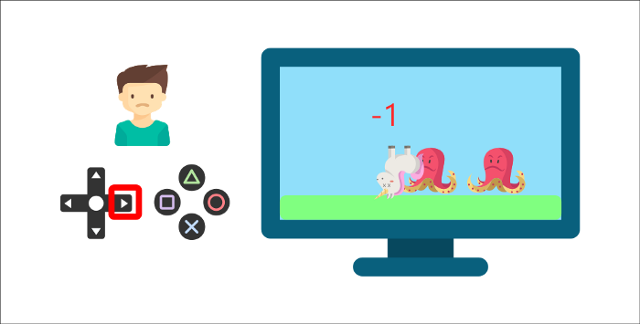
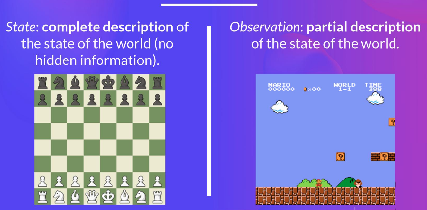
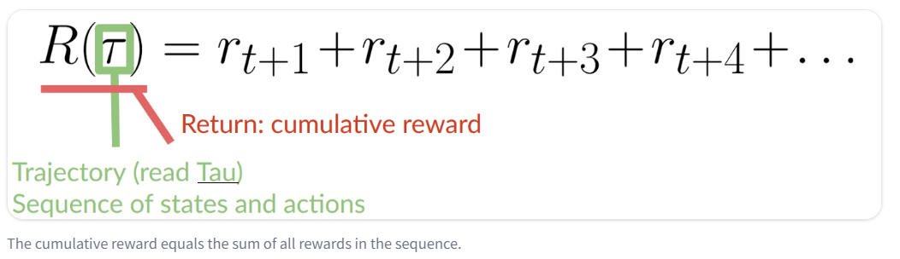
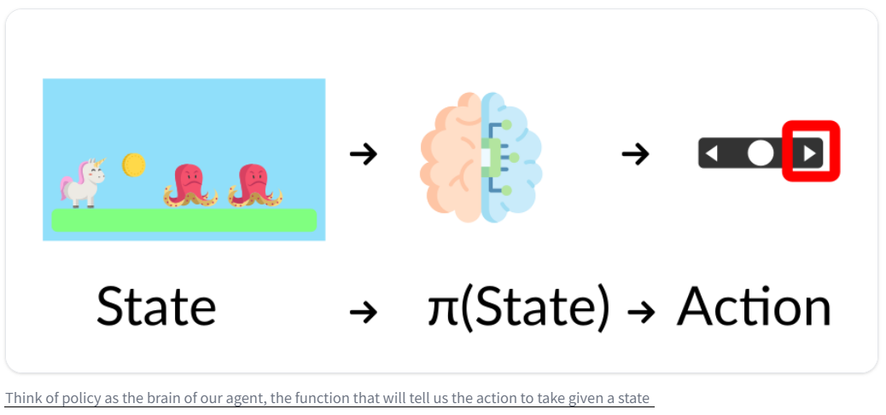
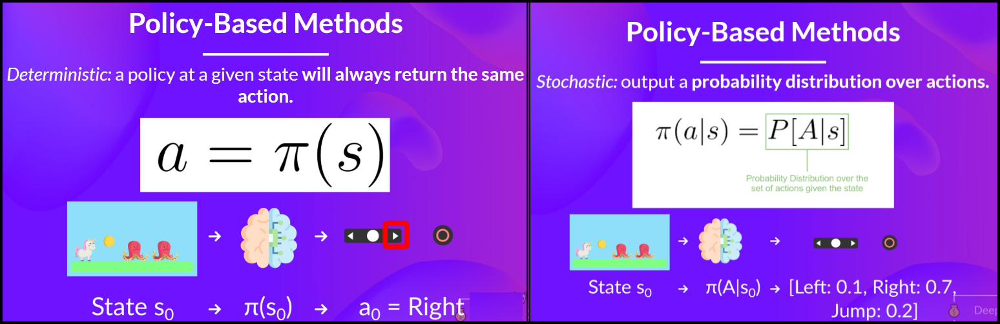

# Reinforcement Learning

## Contents

 - [Intro to Reinforcement Learning](#intro-to-rl)
 - [Observations/States Space](#observations-states-space)
 - [Action Space (Discrete vs. Continuous)](#action-space)
 - [Type of tasks (Episodic Task vs. Continuing Tasks)](#types-of-tasks)
 - [Exploitation/Exploration trade-off](#exploitation-exploration-trade-off)
 - [The RL Components & Process](#rl-components-process)
   - [States](#states)
   - [Actions](#actions)
   - [Rewards](#rewards)
     - [Rewards and the discounting](#rewards-discounting)
 - [Policy (π)](#intro-to-policy)
   - [Policy-Based Methods](#policy-based-methods)
   - [Value-Based Methods](#value-based-methods)
 - [**Settings**](#settings)
 - [**References**](#ref)


<!--- ( Intro to Reinforcement Learning ) --->

---

<div id="intro-to-rl"></div>

## Intro to Reinforcement Learning

Well, to start our studies on *Reinforcement Learning*, the first thing you have to keep in mind is that *Reinforcement Learning* is a technique of **"Unsupervised Learning"**.

> In other words, there is no reference or guideline saying that this is the best *action* to take.

Unlike other types of learning, here the only thing the model will have in terms of *supervision (or feedback)* will be a signal that will be the **reward** it obtained in the system and the goal will be to *maximize the reward* as much as possible.

> In other words, I want to gain the maximum possible rewards.

**NOTE:**  
The idea behind (por trás) *Reinforcement Learning* is that an `agent (an AI)` will learn from the *environment* by **interacting with it** (through trial and error) and **receiving rewards** (negative or positive) as feedback to perform actions.

For example, imagine you place your younger brother in front of a video game he's never played before, hand him a controller, and let him play:

  

Your brother will interact with the environment (the video game) by pressing the *right button* **(action)**. He has a coin, which is a *reward* of **"+1"**. It's positive, he just understood that in this game **he should collect the coins**...

  

So, **he presses to the right again** and touches an enemy, he just died **"-1" reward**...

  

 - By interacting with its *environment* through `trial` and `error`, your little brother has just figured out that in this environment **he needs to collect coins**, **but avoid enemies**.
 - Without any supervision, the child will get better at the game over time. That's how humans and animals learn, *through interactions*.

> *Reinforcement Learning* is just a computational approach to learning from *Actions*.


<!--- ( Observations/States Space ) --->

---

<div id="observations-states-space"></div>

## Observations/States Space

> *"Observations/States"* are the **information our agent gets from the environment**.

 - In the case of a video game, it can be a frame (a screenshot).
 - In the case of the trading agent, it can be the value of a certain stock, etc.

Briefly, we can think of as:




<!--- ( Action Space (Discrete vs. Continuous) ) --->

---

<div id="action-space"></div>

## Action Space (Discrete vs. Continuous)

> The **Action Space** is the *set* of **all possible *actions* in an environment (You can think as "Universal Set (U)" or Probability "Sample Space (Ω)")**.

> **NOTE:**  
> The **Actions** can come from a *"discrete"* or *"continuous space"*:

### Discrete Space

> In the case of a **Discrete Space**, the number of possible actions is **finito**.

For example, in *Super Mario Bros*, we have only 4 possible actions:

 - Left.
 - Right.
 - Up (jumping).
 - Down (crouching).


**NOTE:**  
Again, in Super Mario Bros, we have a finite set of actions since we have only 4 directions.

### Continuous Space

> In the case of a **Continuous Space**, the number of possible actions is **infinito**.

For example, in a *Self Driving Car agent* has an infinite number of possible actions since it can turn left 20°, 21,1°, 21,2°, honk, turn right 20°…


<!--- ( Types of Tasks ) --->

---

<div id="types-of-tasks"></div>

## Type of tasks (Episodic Task vs. Continuing Tasks)

> A *Task* is an **instance** of a *Reinforcement Learning problem*.

We can have two types of tasks:

 - **Episodic Task.**
 - **Continuous Task.**

Briefly, we can think of as:


<!--- ( Exploitation/Exploration trade-off ) --->

---

<div id="exploitation-exploration-trade-off"></div>

## The Exploitation/Exploration trade-off

### Exploitation

> **The technique of "Exploitation" always tries the Action that it already knows has worked the most (or better).**

In summary, suppose a child is crying, the technique of **Exploitation** will always look for an Action that it has already tried and seen that it worked.


Now let's analyze the following situation:

- **1st -** Suppose we were using a technique **(Action)** where the child only stopped crying after 5 minutes of rocking her;
- **2nd -** We discovered another technique **(Action)** where the child stopped crying instantly - For example, calling the mother.

It's obvious that the second option now gives a better **reward**. Therefore, the **Exploitation** technique will use the second option as the standard.

**NOTE:**  
The problem is that this approach will not lead us to an **optimal point**. This is because it always picks the best **Action** it already knows and ignores others that could yield better results **(For example, breastfeeding the child)**.

### Exploration

On the other hand, **Exploration** does the *exploration*. That is, it explores all possible **Actions**, calculating the average and percentage of all of them until finding the one that gives the best **reward**.

> **NOTE:**  
> The problem with **Exploration** is that depending on the problem, this can cost a lot of time and computational resources.

### Exploitation vs. Exploration

Well, the ideal is that when applying these concepts in practice, we carefully consider how much we will allocate for **Exploitation** and how much we will allocate for **Exploration**.


<!--- ( RL Components & Process ) --->

---

<div id="rl-components-process"></div>

## The RL Components & Process

The crucial components of **Reinforcement Learning** are:

 - **Environment.**
 - **Agent.**

For example, see the image below:

  

See that:

 - An **agent** sends *"Actions"* to the **Environment**.
 - And the **environment** sends *"States"* and *Rewards* to the **Agent**.

The **Reinforcement Learning** process is:

  

See that:

 - First, the **Agent** receives the initial State **"S<sub>t</sub> (or S<sub>0</sub>)"** and Reward **"R<sub>t</sub> (or R<sub>0</sub>)"**.
 - Next, the **Agent** sends the **Action "A<sub>t</sub> (or A<sub>0</sub>)"** to the **Environment**.
 - Finally, the **Environment** sends the State **"S<sub>t+1</sub>"** and Reward **"R<sub>t+1</sub>"** to the **Agent**.

For example, let’s imagine an agent learning to play a platform game:


 - Our **Agent** receives **State S<sub>0</sub>** from the **Environment** — We receive the first frame of our game (Environment).
 - Based on that **State S<sub>0</sub>**, the **Agent** takes **Action A<sub>0</sub>** — our Agent will move to the right.
 - The **Environment** goes to a new **State S<sub>1</sub>** — new frame.
 - The **Environment** gives some **Reward R<sub>1</sub>** to the **Agent** — We’re not dead (Positive Reward +1).

**This RL loop outputs a sequence of "State", "Action", "Reward" and next "State":**


> The agent’s goal is to `maximize its cumulative reward`, called the expected return.

---

<div id="states"></div>

## States

Well, to begin understanding what **Actions**, **States**, and **Rewards** are, let's think about a *chess game*:


> Let's imagine that the **states** are the positions in which the pieces are located **at the moment**.

If two people (or even one playing against themselves) are playing at a certain moment of the game, the pieces will be positioned in very specific regions of the two opponents, and this is what we can call or define as a **state**.


> **NOTE:**  
> That is, the position in which the pieces are in this specific scenario.


> **NOTE:**  
> Well, now you'll agree with me that if I move even a single piece, we'll have another state. That is, another specific scenario.

---

<div id="actions"></div>

## Actions

Okay, but what is an **Action** then? In a chess game, an action can be an agent making a move (moving a piece):


Well, now think with me... What happens with each of my actions in a chess game?

> **A new state is created.**

That's easy to understand because with each **action**, we will have a new *specific scenario*. That is, a new state.

---

<div id="rewards"></div>

## Rewards

> So, following our line of thought in a chess game, the **rewards** will be the **feedback** we will have **after each action**.

Look at the scenario below:


> **In this above scenario, was the *reward* *positive* or *negative*?**

 - **It depends:**
   - If you were a *white piece* that moved and was captured - The rewards were negative (-1).
   - Now if you were the *red piece* moving to capture the opponent - The reward was positive (+1).

> **NOTE:**  
> Another observation here is that an agent can take an **action** that returns *zero*. That is, no pieces were lost on either side.

Now think as if you were a **Data Scientist**, how could you *"accumulate"* these **rewards** mathematically?

> **With a *Cost Function*.**

---

<div id="rewards-discounting"></div>

## Rewards and the discounting

> The *"reward"* is fundamental in Reinforcement Learning because it’s **the only feedback** for the agent (positive or negative).

The *"reward"* is necessary to tell the system (agent) which *state-action pairs* are **"good"**, and which are **"bad"**.

For example, the cumulative reward at each time **step t** can be written as:

  

Let's break it down the formula above:

 - Trajectory:
   - In the context of Reinforcement Learning, a *"trajectory"* refers to the sequence of states, actions, and rewards experienced by an agent as it interacts with the environment over a certain period of time.
 - $R(\tau)$
   - This represents the cumulative reward for a **"trajectory 𝜏"**, which is the sum of rewards received along that trajectory.
 - $r_{t+1} + r_{t+2} + r_{t+3} + r_{t+4}$
   - These terms represent the rewards received at specific time steps within the trajectory. For example:
     - $r_{t+1}$ represents the reward received at time step $t+1$ in the trajectory.
     - $r_{t+2}$ represents the reward received at time step $t+2$ in the trajectory.

**NOTE:**  
However, in reality, we can’t just add them like that (No entanto, na realidade, não podemos simplesmente adicioná-los assim).

> **Why?**
> - **EN:** The *rewards* that arrive early (at the start of the game) are more likely to happen as they are more predictable than long-term future rewards.
> - **PT:** As recompensas que chegam mais cedo (no início do jogo) têm maior probabilidade de acontecer, pois são mais previsíveis do que as recompensas futuras a longo prazo.

For example, let’s imagine:

 - Our agent is a *tiny mouse (pequeno rato)* that can move one tile at each time step.
 - And your opponent is the *cat* (that can move too).
 - **NOTE:** The *mouse’s goal* is to *eat the maximum amount of cheese before being eaten by the cat*.

  

 - As we can see in the diagram:
   - it’s more probable to eat the cheese near us.
   - Than the cheese close to the cat (the closer we are to the cat, the more dangerous it is).
 - Consequently:
   - **EN:** The reward near the cat, even if it is bigger (more cheese), will be more *"discounted"* since we’re not really sure we’ll be able to eat it.
   - **PT:** A recompensa perto do gato, mesmo que seja maior (mais queijo), terá mais *"desconto"* já que não temos certeza se conseguiremos comê-lo.

To discount the rewards, we proceed like this:

 - **We define a discount rate called gamma (γ):**
   - It must be between **0** and **1**.
   - Most of the time between **0.95** and **0.99**.
   - The larger the *gamma (γ)*, the smaller the discount:
     - This means our agent cares more about the long-term reward (Isso significa que nosso agente se preocupa mais com a recompensa de longo prazo).
   - On the other hand, the smaller the *gamma (γ)*, the bigger the discount:
     - This means our agent cares more about the short term reward (Isso significa que nosso agente se preocupa mais com a recompensa de curto prazo).
 - **Then, each reward will be discounted by gamma (γ) to the exponent of the time step:**
   - **EN:**  As the time step increases, the cat gets closer to us, so the future reward is less likely to happen.
   - **PT:** À medida que o intervalo de tempo aumenta, o gato se aproxima de nós, então é menos provável que a recompensa futura aconteça.

Our discounted expected cumulative reward is:


<!--- ( Policy ) --->

---

<div id="intro-to-policy"></div>

## Policy (π)

> The **"Policy π"** is the *brain of our Agent*, it’s the function that tells us what action to take given the state we are in - So it defines the agent’s behavior *at a given time*.



 - This Policy is the function we want to learn, our goal is to find the *"optimal policy `π*`"*.
 - The *"policy that maximizes expected return"* when the agent acts according to it - **We find this `π*` through training**.

There are two approaches to train our agent to find this optimal `policy π*`:

 - **Directly:**
   - Directly, by teaching the agent to learn which action to take, given the current state: *"Policy-Based Methods"*.
 - **Indirectly:**
   - Indirectly, teach the agent to learn which state is more valuable and then take the action that leads to the more valuable states: *"Value-Based Methods"*.

---

<div id="policy-based-methods"></div>

## Policy-Based Methods

> In **Policy-Based methods**, we learn a *"policy function directly"*.

 - This function will define a mapping from each state to the best corresponding action.
 - Alternatively, it could define a probability distribution over the set of possible actions at that state.

For example, see the image below:

  

> **NOTE:**  
> As we can see here, the *"policy (deterministic)"* **directly indicates the action to take for each step**.

For this type we have to types of policies:

 - **Deterministic:**
   - A *policy* at a given state will always return the same action.
 - **Stochastic:**
   - Outputs a probability distribution over actions.

For example, see the diagram below to understand more easily:

  

See that:

 - **The Determinist approach:**
   - Always returns the same action.
 - **The Stochastic approach:**
   - Return probability of each action.

---

<div id="value-based-methods"></div>

## Value-based methods

> Comming soon...


<!--- ( Settings ) --->

---

<div id="settings"></div>

## Settings

**CREATE VIRTUAL ENVIRONMENT:**  
```bash
python -m venv ai-environment
```

**ACTIVATE THE VIRTUAL ENVIRONMENT (LINUX):**  
```bash
source ai-environment/bin/activate
```

**ACTIVATE THE VIRTUAL ENVIRONMENT (WINDOWS):**  
```bash
source ai-environment/Scripts/activate
```

**UPDATE PIP:**
```bash
python -m pip install --upgrade pip
```

**INSTALL PYTHON DEPENDENCIES:**  
```bash
pip install -U -v --require-virtualenv -r requirements.txt
```

**Now, Be Happy!!!** 😬


<!--- ( References ) --->

---

<div id="ref"></div>

## References

 - **General:**
   - [Deep Reinforcement Learning Course](https://huggingface.co/learn/deep-rl-course/unit0/introduction)
   - [Didatica Tech](https://didatica.tech/)

---

**R**odrigo **L**eite da **S**ilva - **drigols**
