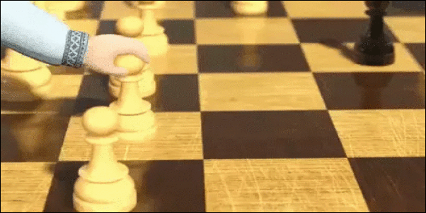
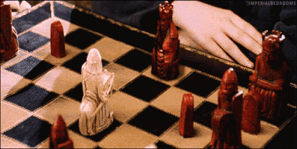

# O que são Ações, Estados e Recompensas

## Conteúdo

 - [01 - Estados](#states)
 - [02 - Ações](#actions)
 - [03 - Recompensas](#rewards)

## 01 - Estados

Bem, para começar a entender o que são **Ações**, **Estados** e **Recompensas** vamos pensar em um *jogo de xadrez*:

  

> Vamos imaginar que os **estados** são as posições em que as peças se encontram **no momento**.

**NOTE:**  
Se duas pessoas (ou até mesmo uma jogando com ela mesmo) estão jogando em determinado momento do jogo as peças vão está posicionadas em regiões bem específicas dos dois oponentes e isso é o que nós podemos chamar ou definir como um **estado**. Ou seja, a posição em que as peças estão nesse cenário específico.

  

**NOTE:**  
Bem, agora vocês vão concordar comigo que se eu mover uma única peça se quer vamos ter outro estado. Ou seja, outro cenário específico.

---

## 02 - Ações

Ok, mas o que é uma **Ação** então? Em um jogo de xadrez uma ação pode ser um agente fazer uma jogada (mover uma peça):

  

**NOTE:**  
Bem, agora pensem comigo... O que acontece a cada ação minha em um jogo de xadrez?

> **Um novo estado é criado.**

Isso é fácil de entender, porque a cada **ação** nós vamos ter um novo *cenário específico*. Ou seja, um novo estado.

---

## 03 - Recompensas

Então, seguindo com a nossa linha de pensamento em um jogo de xadrez as **recompensas** vão ser os **feedbacks** que nós vamos ter depois de cada ação.

Veja o cenário abaixo:

  

Nesse cenário a **recompensas** foi **positiva** ou **negativa**?

 - **Depende:**
   - **Se você foi uma peça branca que se moveu e foi capturada** - A recompensas foi negativa (-1);
   - **Agora se você foi a peça vermelha se movendo para capturar o oponente** - A recompensa foi positiva (+1).

**NOTE:**  
Outra observação aqui é que um agente pode fazer uma **ação** que vai retornar *zero*. Ou seja, nenhuma peça foi perdida de nenhum dos lados.

**NOTE:**  
Agora pense como se você fosse um **Cientista de Dados**, como você poderia *acumular* essas **recompensas** matematicamente?

> **Com uma *Função de Custo*.**

---

**REFERENCES:**  
[Didática Tech - Inteligência Artificial & Data Science](https://didatica.tech/)  

---

**Rodrigo Leite -** *Software Engineer*
