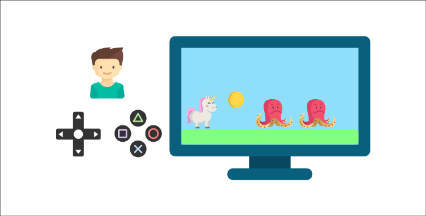

# Introduction to Reinforcement Learning

## Contents

 - [01 - Introduction and Features](#01)
 - [02 - Observations vs States](#02)
   - [02.1 - State s](#02-01)
   - [02.2 - Observation o](#02-02)
 - [03 - Action Space (Discreet vs. Continuous)](#03)
   - [03.1 - Discrete (finite)](#03-01)
   - [03.2 - Continuous (infinite)](#03-02)
 - [04 - Types of Tasks (Episodic vs. Continuous)](#04)
   - [04.1 - Episodic Tasks](#04-01)
   - [04.2 - Continuous Tasks](#04-02)

---

## 01 - Introduction and Features

Well, to start our studies on Reinforcement Learning the first thing you have to put in mind is that Reinforcement Learning is an **unsupervised learning** technique.

> **That is, there is no reference or feedback saying this is the best action to take.**

Unlike the other types of learning here, the only thing the model will have in terms of supervision *(or feedback) *will be a signal that it will be the **reward** that it obtained in the system and the objective will be to maximize the **reward** as much as possible.

> **In other words, I want to earn as many rewards as possible.**

The idea behind Reinforcement Learning is that an agent (an AI) will learn from the environment by interacting with it (by trial and error) and receiving rewards (negative or positive) as feedback for taking actions.

For example, imagine you put your younger brother in front of a video game he's never played, a controller in his hand, and let him play:

  

Your brother will interact with the environment (the video game) by pressing the right button **(action)**. He has a coin, it's a **+1 reward**. It's positive, he just understood that in this game he must get the coins...

  

But then he presses right again and touches an enemy, he just died **-1 reward**...

  

**NOTE:**  
When interacting with your environment through trial and error, your little brother just realized that in this environment he needs to pick up coins, but avoid enemies. Without any supervision, the child will get better and better at the game. This is how humans and animals learn, through interactions.

> **Reinforcement Learning is just a computational approach to learning from actions.**

---

## 02 - Observations vs States

**Observations** and **States** are the information that our agent obtains from the environment:

 - In the case of a video game, it can be a frame (a screenshot);
 - In the case of the commercial agent, it can be the value of a certain share.

There is a distinction to be made between **observation** and **state**:

### 02.1 - State s

It is a complete description of the state of the world *(no hidden information)*. That is, in a fully observed environment.

See the scenario below:

  

**NOTE:**  
In the game of chess, we receive a **state** of the environment, **as we have access to all the information on the board**.

### 02.2 - Observation o

It is a **partial description of the state**. In a partially observed environment.

See the scenario below:

  

**NOTE:**  
In a game like Super Mario, we only see a part of the level close to the player, so we got a **remark (observation)**.

---

## 03 - Action Space (Discreet vs. Continuous)

> The **Action Space** is the set of **all possible actions in an environment**.

Actions can come from a space:

 - Discreet;
 - Or Continuous.

### 03.1 - Discrete (finite)

In a **discrete action space** the number of possible actions is **finite**. For example, see the scenario below:

  

**NOTE:**  
In Super Mario Bros, we have a finite set of actions as we only have 4 directions and jump.

### 03.2 - Continuous (infinite)

Now let's see a **continuous action space** where the number of possible actions is infinite:

  

**NOTE:**  
A **Self-Driving Car** agent has an infinite number of possible actions, as he can turn left **20°**, **21°**, **22°**, **honk**, turn right **20°**, **20.1°**...

**NOTE:**  
Taking this information into account is critical as it will be important when choosing your **RL algorithm**.

---

## 04 - Types of Tasks (Episodic vs. Continuous)

A task is an **instance** of a Reinforcement Learning problem. We can have two types of tasks:

 - Episodic;
 - And Continuous.

### 04.1 - Episodic Tasks

In this case, we have a **starting point** and **an ending point (a terminal state)**. This creates an episode:

 - A list of states;
 - Actions;
 - Rewards;
 - And new states.

For example, think of Super Mario, an episode that starts at the launch of a new Mario level and ends when you get killed or reach the end of the level.

  

### 04.2 - Continuous Tasks

These are tasks that **continue forever (no terminal state)**. In this case, the agent **must learn to choose the best actions and simultaneously interact with the environment**.

For example, an agent who does automated stock trading. For this task, there is no starting point and terminal state. **The agent keeps running until we decide to stop him**.

  

---

**REFERENCES:**  
[Didática Tech - Inteligência Artificial & Data Science](https://didatica.tech/)  
[An Introduction to Deep Reinforcement Learning](https://thomassimonini.medium.com/an-introduction-to-deep-reinforcement-learning-17a565999c0c)  
