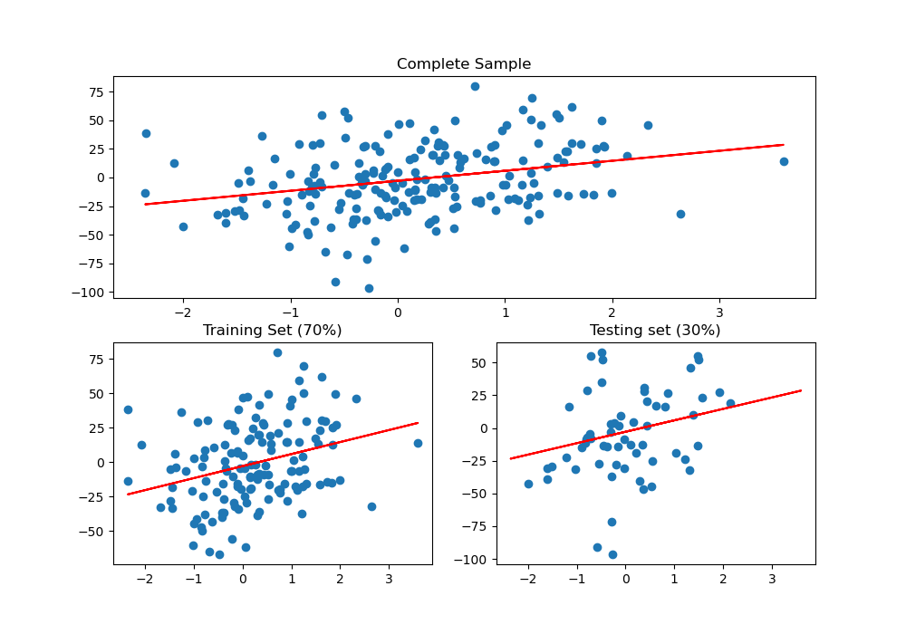

# Dados de Treino vs Dados de Teste

 - [01 - Dados de Treino vs Dados de Teste - Teoria](#01)
 - [02 - Treinando & Testando dados com Scikit-Learn](#02)

<div id='01'></div>

## 01 - Dados de Treino vs Dados de Teste - Teoria

> Uma coisa que vocês tem que entender primeiro é que os modelos de **Machine Learning** aprendem a partir de dados. Sabendo disso é interessante dividir nosso conjunto de dados em **Dados de Treino** & **Dados de Teste**.

**DADOS DE TREINO:**  
Ok, suponha que nós queremos desenvolver um programa (modelo) que identifique se uma imagem **é um cachorro** ou **não é um cachorro**.

De início nós vamos receber um conjunto (amostra) com várias imagens de cachorros, depois nós vamos pegar uma parte desse conjunto (normalmente 70%) e dar para o nosso modelo aprender identificando características comuns entre cachorros.

**DADOS DE TESTE:**  
Ok, Nós reservamos 70% do nosso conjunto de dados (amostra) para o nosso algoritmo aprender e os outros 30%?  
Então, esses são os **Dados de Testes**. Nós vamos passar os dados de testes para o nosso modelo e ver quão bem ele está aprendendo. Por exemplo:

> Isso aqui é um cachorro?

E o nosso modelo vai ter que dar um retorno dizendo se é um cachorro ou não.

**NOTE:**  
Viram como é interessante dividir o conjunto de dados (amostra) em `treino` e `teste`? Outro exemplo, seria identificar uma doença em pacientes, como nós saberíamos se nosso modelo aprendeu (ou está aprendendo) bem se deixar ele aprender com todo o conjunto de dados?

> Por isso, ele vai aprender com uma parte (70% no nosso caso) e vamos reserva outra parte (30% no nosso caso) para testar e ver quão bem ele (nosso modelo) está aprendendo.

<div id='02'></div>

## 02 - Treinando & Testando dados com Scikit-Learn

Vamos ver como fica isso em Python utilizando Scikit-Learn?

[linearRegression.py](src/linearRegression.py)
```python
def createRegression(samples,variavel_numbers, n_noise):
  from sklearn.datasets import make_regression
  x, y = make_regression(n_samples=samples, n_features=variavel_numbers, noise=n_noise)
  return x, y

if __name__ =='__main__':

  from sklearn.linear_model import LinearRegression
  from sklearn.model_selection import train_test_split
  from matplotlib import pyplot as plt

  reg = createRegression(200, 1, 30)
  model = LinearRegression()

  # Divide the data into Training and Testing - 30% for testing.
  x_train, x_test, y_train, y_test = train_test_split(reg[0], reg[1], test_size=0.30)

  # Just the training data is transferred to the fit() function (which finds the best values ​​for m and b).
  model.fit(x_train, y_train)

  a_coeff = model.coef_ # Take Angular Coefficient - m
  l_coeff = model.intercept_ # Take Linear Coefficient - b

  print('Angular Coefficient: {0}\nLinear Coefficient: {1}'.format(a_coeff, l_coeff))

  plt.figure(figsize=(10, 7))
  plt.subplot(211)
  plt.scatter(reg[0], reg[1])
  plt.title('Complete Sample')
  plt.plot(x_train, a_coeff*x_train + l_coeff,color='red')

  plt.subplot(223)
  plt.scatter(x_train, y_train)
  plt.title('Training Set (70%)')
  plt.plot(x_train, a_coeff*x_train + l_coeff,color='red')

  plt.subplot(224)
  plt.scatter(x_test, y_test)
  plt.title('Testing set (30%)')
  plt.plot(x_train, a_coeff*x_train + l_coeff,color='red')

  plt.savefig('../images/plot-01.png', format='png')
  plt.show()
```

**OUTPUT:**  
```python
Angular Coefficient: [8.72779898]
Linear Coefficient: -2.8697889112058537
```



Agora vamos comentar só as partes cruciais que foram utilizadas para dividir os dados em `Treino` e `Teste`. Primeiro nós importamos o método **train_test_split()**.

```python
from sklearn.model_selection import train_test_split
```

Depois nós passamos os seguintes argumentos para esse método:

 - **1ª -** Os dados no eixo-x do conjunto de dados;
 - **2ª -** Os seus correspondentes no eixo-y;
 - **3ª -** Por fim, quanto nós reservamos dos dados para teste: **test_size=0.30 = 30%**.

```python
x_train, x_test, y_train, y_test = train_test_split(reg[0], reg[1], test_size=0.30)
```

**NOTE:**  
Veja que o método **train_test_split()** retorna os dados já separados *(aleatoriamente)* em dados de treino e teste.

Agora por fim, nós vamos treinar o nosso módelo apenas com os dados de treino *(como foi explicado anteriormente)*:

```python
model.fit(x_train, y_train)
```

---

**REFERENCES:**  
[Didatica Tech - MÓDULO - I](https://didatica.tech/)  

---

**Rodrigo Leite -** *Software Engineer*
