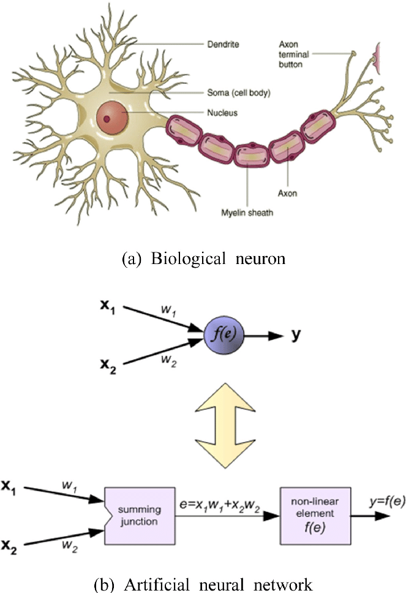
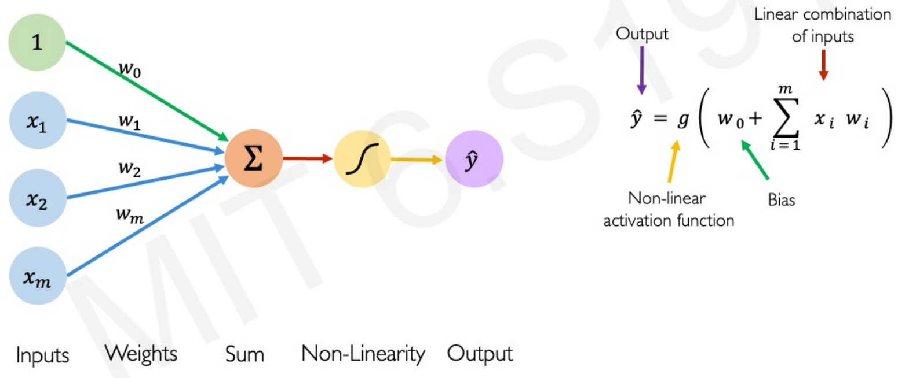
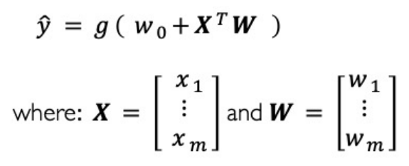
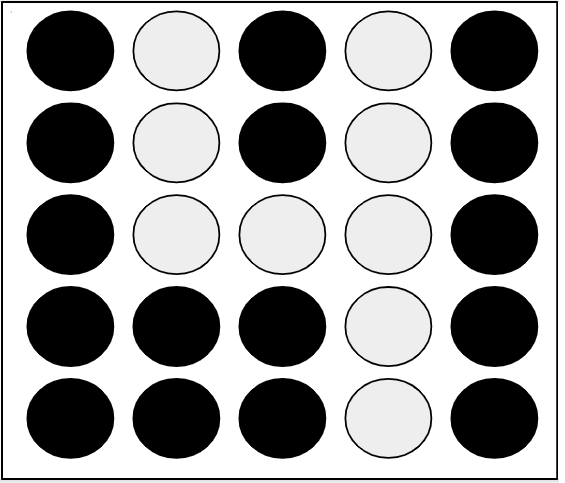
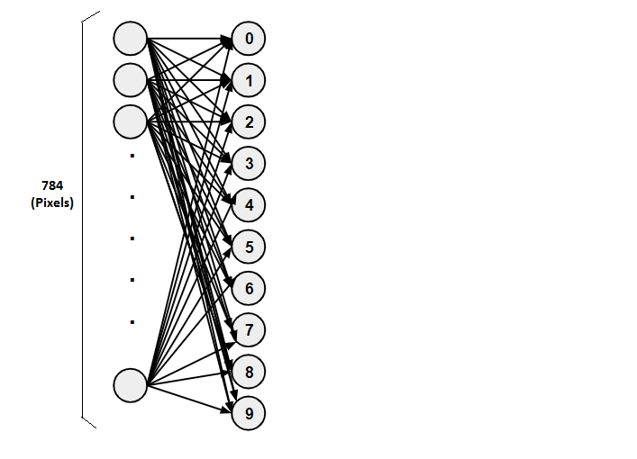
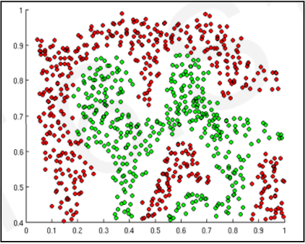
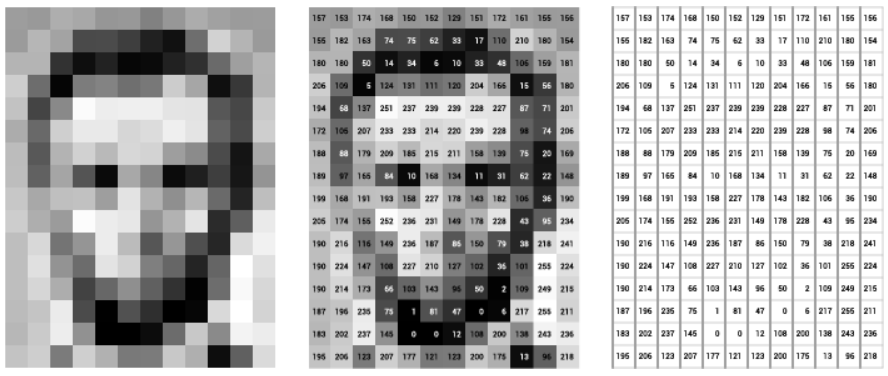

# Artificial Neural Networks & Deep Learning

## Contents

 - [**Fundamentals of Artificial Neural Networks:**](#intro-to-nn)
   - [The First Artificial Neuron (Perceptron)](#perceptron)
   - [How do Artificial Neural Networks learn? (Hypothetical example)](#how-do-learn)
   - [Dense Neural Networks](#intro-to-dnn)
   - [Planning ANN](#planning-implementing-ann)
   - [**Activation Functions:**](#activation-functions)
     - [Sigmoid Function](#sigmoid-function)
     - [ReLU (Rectified Linear Unit)](#relu)
   - [**Overfitting & Underfitting in ANN**](#overfitting-underfitting-ann)
   - [**Regularization**](#regularization)
     - [Dropout](#dropout)
     - [Early Stopping](#early-stopping)
 - [**Deep Computer Vision**](#intro-to-dcv)
   - [Convolutional Neural Networks (CNN)](#intro-to-cnn)
     - [Filter](#intro-cnn-filter)
     - [Stride](#intro-cnn-stride)
     - [Feature Maps](#intro-feature-maps)
     - [Pooling Layer (Max Pooling)](#intro-pooling)
     - [Padding](#intro-to-padding)
     - [Multi-Layers: Feature Maps and Pooling](#multilayer-fm-and-pool)
     - [Math for CNN components](#math-for-cnn-components)
 - **Deep Sequence Modeling**
   - [Recurrent Neural Netowkrs (RNN)](#intro-to-rnn)
     - [Unrolling RNN](#unrolling-rnn)
     - Long Short-Term Memory (LSTM)
     - Liquid State Machine (LSM)
     - Gated Recurrent Unit (GRU)
   - **Autoencoders:**
     - seq2seq
 - **Deep Generative Modeling:**
   - **Generative Adversarial Networks (GAN)**
 - [**References**](#ref)
<!---
[WHITESPACE RULES]
- Same topic = "10" Whitespace character.
- Different topic = "50" Whitespace character.
--->


<!--- ( Fundamentals of Artificial Neural Networks ) --->

---

<div id="intro-to-nn"></div>

## Fundamentals of Artificial Neural Networks

> To begin with **Artificial Neural Networks**, it's essential to understand the inspiration behind them. In fact, ANNs are based on the same logic as human neurons.

Take a look at this image to get a better visual understanding:



As we know, the human brain has **billions** of *neurons* and *synapses (which connect neurons)*. Knowing this, we can try to create **Artificial Neurons** following this logic, but using mathematical models.


---

<div id="perceptron"></div>

## The First Artificial Neuron (Perceptron)

The first **Artificial Neuron** created was the **[Perceptron](https://en.wikipedia.org/wiki/Perceptron)** in 1958 by [Frank Rosenblatt](https://en.wikipedia.org/wiki/Frank_Rosenblatt):


 - The **[Perceptron](https://en.wikipedia.org/wiki/Perceptron)** had the main idea of receiving different inputs (or signals) and outputting the signal (result) **1** or **0**.
 - This signal (result) basically indicates whether the neuron will be *active* or *not* to proceed to another neuron.
 - Over time, scientists discovered that there were other possibilities for neurons; Not only *active* or *not*, but we won't delve into details for now.

**NOTE:**  
The idea of the **[Perceptron](https://en.wikipedia.org/wiki/Perceptron)** was a single *neuron* that received **x<sub>i</sub>** inputs; Multiplied these inputs by their respective weights; Then passed through a *Non-Linear Activation Function* and received an *output*.


---

<div id=""></div>

## Artificial Neural Networks Components

To understand the basics of ANNs, let's take a look at the following components:



Looking at the image above, we can see our ANNs have the following components:

 - **Inputs:**
   - The *"inputs"* are the **x<sub>i</sub>** values.
 - **Weights:**
   - The *"weights"* are the **w<sub>i</sub>** values.
   - Like a graph, the *"weights"* are related to the *"inputs"*.
 - **Sum:**
   - The *"sum"* is the **x<sub>i</sub>** multiplied by the **w<sub>i</sub>**.
 - **Activation Function:**
   - The "activation function (f<sub>i</sub>)" applies *nonlinearity* to the *"sum"*.
 - **Output:**
   - The *"output"* is the predicted **ŷ** value.

Mathematically the formula is:

  

Where:

 - **ŷ:**
   - The predicted value.
   - Passed by the *"Activation Function"*.
 - **g():**
   - The *Activation Function*.
 - **w<sub>0</sub>:**
   - The *Bias*.
 - **X<sup>T</sup>:**
   - The *vector of inputs*.
   - E.g: *x<sub>1</sub>, x<sub>2</sub>, ..., x<sub>i</sub>*.
   - The exponential *"T"* means *transpose the matrix*.
 - **W:**
   - The *vector of weights*.
   - E.g: *w<sub>1</sub>, w<sub>2</sub>, ..., w<sub>i</sub>*.


---

<div id="how-do-learn"></div>

## How do Artificial Neural Networks learn? (Hypothetical example)

To understand how **Artificial Neural Networks** learn, let's consider the following problem:

> **How to create an *Artificial Neural Network* to identify numbers in an image?**

For example, we want to identify the number **4**... But how to identify numbers in an image? Well, images on a computer are composed of various pixels.

Look at the abstraction (it's just an example) below:



In the image above:

- **The white pixels:** Represent the number 4;
- **And the black pixels:** The rest of the image.

**NOTE:**  
So, to train our *neural network* is very simple. Just pass several images of numbers to our neural network and it will identify common patterns for each number. For example, we pass several hand-written numbers **4** by various different people and our neural network will identify common patterns in the numbers **4**.

Now take a look at this very simple abstraction of an **Artificial Neural Network** below:


In the **Artificial Neural Network** (abstraction) above, we have:

- **1st -** The **input neurons *(784 pixels)***; These neurons emit outputs between **0** and **1**;
- **2nd -** The **weights** of each input neuron;
- **3rd -** The **neurons** that will represent the numbers: **0**, **1**, **2**, **3**, **4**, **5**, **6**, **7**, **8**, **9**; These also emit outputs between **0** and **1**.

**NOTE:**  
In this example, we made the connection only from all inputs to the first neuron *(representing the number zero)*, but in a **Dense Neural Network**, the neurons from the layer above connect to all their *predecessors*.


---

<div id="intro-to-dnn"></div>

## Dense Neural Networks

> **What is a Dense Neural Network?**

 - The name suggests that the **"layers"** are fully connected (dense) by neurons in a network layer.
 - Each *neuron* in the current **"layer"** `receives output from all neurons present in the previous layer` - hence they are densely connected.

**NOTE:**  
In other words, *the dense layer is a fully connected layer*, meaning all neurons in one layer are connected to those in the next layer.


> **Why use a Dense Neural Network?**

 - A densely (desamente) connected layer provides learning features of all combinations of the features from the previous layer.
 - While a convolutional layer relies (depende) on consistent features with a small repetitive field.

Returning to our example of identifying numbers with an **Artificial Neural Network**.

**Densely our Artificial Neural Network would look like this:**  
  


---

<div id="planning-implementing-ann"></div>

## Planning ANN

> Here, let's see how to plan some ANN.

### Iris Dataset

Here, let's plan and implement an ANN to [The Iris Dataset](https://scikit-learn.org/stable/auto_examples/datasets/plot_iris_dataset.html). But, first of all, we need to think about how our Neural Network will be structured.

- What are the *Input Neurons (features)*?
- How many *Hidden Layers*?
- What are the *Output Neurons*?

Our Neural Network for our will be something like this:


> Okay, but what are the **Inputs (Features)** and the **Output Neurons**?

- **Features:**
  - sepal length (cm)
  - sepal width (cm)
  - petal length (cm)
  - petal width (cm)
- **Output Neurons - (Classes/Categories of Iris):**
  - Setosa
  - Versicolour
  - Virginica


---

<div id="activation-functions"></div>

## Activation Functions

When we're using an **Artificial Neural Network** to learn something, it's common to apply a **"Non-Linear Activation Function"**.

> **But what does this kind of function do?**

The purpose of **Activation Functions** is to introduce **"nonlinearities"** into an *Artificial Neural Network* (within the context of Neural Networks, of course).

Let's look at the example below to make it clearer:



**NOTE:**  
Now suppose I ask you to separate these red points from the green ones using a Linear Function, could you do that? **NO!**

You might achieve something similar to this, but it wouldn't solve the problem:


 - In other words, no matter how many *Linear Functions* you use, it will always generate a line.
 - On the other hand, with **Non-Linear Functions**, you can solve the problem of separating the red points from the green ones.

Something like this:


That's:

 - *Activation Functions* are a crucial component of *Artificial Neural Networks* **used to introduce nonlinearity into the outputs of network layers**:
   - They are applied to the linear combination of inputs to a layer to produce the output of that layer.
 - Without *Activation Functions*, *Artificial Neural Networks* would be limited to performing linear calculations, which would make them incapable of handling (lidar) most real-world problems.


---

<div id='sigmoid-function'></div>

## Sigmoid Function

> The **Sigmoid Function** was born out of the need to binarize data. *How do you binarize data?*

Okay, suppose we have a bank and we want to binarize in order to differentiate between customers who are in **"debt"** and those who are **"not in debt"** to our bank.

Let's suppose the binarization looked like this:

 - **0**, For customers who are ***in debt*** to the Bank;
 - **1**, For customers who are ***okay*** with the bank.

Now let's take a look at the aspects of this **"Sigmoid Function"**:


Now, let's test the **Sigmoid Function** for some **x<sub>i</sub>** input values to understand how it works:

[sigmoide.py](src/activation-functions/sigmoide.py)
```python
from matplotlib import pyplot as plt
from math import e

import pandas as pd


def f(x):
    return (1) / (1 + (e**-x))


if __name__ == "__main__":

    df = pd.DataFrame({"x": range(-20, 20 + 1)})
    df["y"] = [f(n) for n in df.x]

    plt.figure(figsize=(15, 10))
    plt.title("Sigmoid Function")
    plt.xlabel("X")
    plt.ylabel("y = (1)/(1 + (e^-x))")
    plt.xticks(range(-20, 20 + 1, 1))
    plt.yticks(range(-20, 20 + 1, 1))
    plt.axhline()
    plt.axvline()
    plt.grid()
    plt.plot(df.x, df.y, color="green", marker="o")
    plt.savefig("../images/sigmoide-plot-01.png", format="png")
    plt.show()
```

  

Now it looks beautiful!! In addition to all the outputs for **40** inputs of **x**, from -*20* to *20*; We also have a prettier, more detailed plot with more inputs.

 - **But what did you notice about this function?**  
   - **1st -** If you pay attention to this function for negative values, it converges very quickly to zero (0);
   - **2nd -** The same happens for positive values, it converges very quickly to 1.

So we arrived where we wanted to binarize our clients with:

> - **0**, For customers who are ***in debt*** to the Bank;
> - **1**, For customers who are ***okay*** with the bank.

**NOTE:**  
Another interesting thing to note is that if you pay attention to our graph, this conversion to **0** or **1** always happens after **-5** or **5**:

  

**NOTE:**  
This interval between the point **"-5"** and **"5"** is what we know as the **"TRANSITION POINT"**.

Now, let's see some **Sigmoid Function** tips:

 - **Advantage:**
   - **Easy to understand and implement:**
     - The *sigmoid function* is a relatively simple mathematical function, making it easy to understand and implement in code.
     - This can be beneficial for beginners learning about neural networks.
   - **Output Range:**
     - The *sigmoid function* outputs values in the **range (0, 1)**, which is useful for tasks where you need to `predict probabilities` or `binary classification`.
     - The output can be interpreted as the probability of a particular class being present.
   - **Smoothness (Suavidade):**
     - The *sigmoid function* is smooth (suave) and continuously differentiable, which makes it suitable for gradient-based optimization methods like `Gradient Descent`.
     - **NOTE:** This smoothness aids (auxilia) in stable `convergence` during training.
 - **Disadvantage:**
   - **Vanishing Gradient Problem:**
     - The *sigmoid function* saturates when the input is very large or very small, leading to `vanishing gradients` during backpropagation.
     - This makes training deep networks with many layers using the sigmoid function difficult because the gradients become extremely small, causing slow convergence or convergence to poor local minima.
   - **Output Bias:**
     - The output of the *sigmoid function* is not centered around zero.
     - This can lead to issues like `vanishing gradients` or `slow convergence`, especially in deep networks where *weight* updates are relatively small.
 - **When to USE the sigmoid function:**
   - **As the output layer activation function in binary classification problems:**
     - Since the sigmoid function outputs a value between 0 and 1, it can be interpreted as a probability. This makes it suitable for tasks like predicting whether an email is spam or not spam, or whether an image contains a cat or not.
   - **As an activation function in hidden layers when dealing with data between 0 and 1:**
     - If your data is naturally scaled between 0 and 1, the sigmoid function can work well in hidden layers. However, it's important to be aware of the `vanishing gradient` problem, especially in deep networks.
 - **When NOT TO USE the sigmoid function:**
   - **In deep neural networks:**
     - Due to the `vanishing gradient` problem, sigmoid functions are generally not recommended as activation functions in deep neural networks.
     - Avoid using the *sigmoid function* as an activation function in hidden layers of deep neural networks, especially when dealing with deep architectures or problems with a `large number of classes`.
     - **NOTE:** Other activation functions, such as `ReLU (Rectified Linear Unit)` or `tanh (hyperbolic tangent)`, are better suited for these cases.
   - **In regression problems:**
     - Sigmoid functions are not ideal for regression problems where the output can take any real value.
     - **NOTE:** In these cases, *linear activation functions* are typically preferred.


---

<div id="relu"></div>

## ReLU (Rectified Linear Unit)

The **ReLU (Rectified Linear Unit) Activation Function** have as output a value between **"0"** and the **"maximum input value"**.

For example, see the image below to understand more easily:

  

See that:

 - **The ReLu receives as input "x".**
 - **Return:**
   - **"0" if "x" is less than "0":**
     - This is because.. What's the maximum value between "-x" and "0"? It's "0".
     - Then, we return "0" if "x" is less than "0".
   - **"maximum input value" if "x" is greater than "0":**
     - Here the output will be the input itself (própria entrada).

Now, let's see some **ReLU Function** tips:

 - **Advantage:**
   - **Solves Vanishing Gradient problem:**
     - Unlike *sigmoid* and *tanh functions*, *ReLU* has a constant gradient of 1 for positive inputs. This helps avoid the `Vanishing Gradient` problem, which can hinder training in deep neural networks.
   - **Computationally efficient:**
     - ReLU involves a simple comparison operation (max(0, x)), making it significantly faster to compute compared to *sigmoid* and *tanh functions*, which require more complex calculations.
 - **Disadvantage:**
   - **Dying ReLU Problem:**
     - A common issue with ReLU is the **"dying ReLU"** problem, where some neurons effectively become inactive during training because they always output zero.
     - This typically happens when the input to a neuron is consistently negative, causing the neuron to never activate (the gradient becomes zero).
     - **NOTE:** Once a neuron is "dead," it will never recover since the gradient for negative inputs remains zero.


---

<div id="overfitting-underfitting-ann"></div>

## Overfitting & Underfitting in ANN

When we optimize an **ANN (A.I model)** using **Stochastic Gradient Descent** we have a challenge:

 - Extract patterns from *training data*.
 - And expect them to *generalize to testing data* (i.e., the unseen data).

For example, imagine we need to draw a line to find patterns in our data. Something like this:

  

Looking at the image above we have the following scenarios:

 - **Overfitting:**
   - Overfitting occurs when the *ANN* exceptionally fits well on the training data but poorly (mal) on unseen (não visto) data (validation or test data).
   - **NOTE:** It is as if the ANN *"decorates"* the training data and does not generalize to unseen (não visto) data.
 - **Underfitting:**
   - Here, as the data are not linear (the neural network output are not linear because of activation functions) the ANN does not well fit the data.
   - **NOTE:** In this case, the *ANN* `fails to capture the patterns` in the training data and performs poorly not only on the training data but also on unseen (não visto) data.
 - **Ideal fit:**
   - Here, the *ANN* is well fit to the data:


---

<div id="regularization"></div>

## Regularization

Regularization is a Technique that constrains our optimization problem to discourage complex models.

> **Why do we need it?**  
> Improve generalization of our model on unseen (não visto) data (Melhorar a generalização do nosso modelo em dados não vistos).


---

<div id="dropout"></div>

## Dropout

To understand the **Dropout** technique, imagine we have the following *ANN*:


During the training, the **Dropout** technique **randomly set some activations to "0"**:

 - Typically "drop" 50% of activations in the layer.
 - Forces network to not rely (depender) on any I node.

For example, our ANN now looks like this:

  

> **NOTE:**  
> - Now, to each iteration (epoch), our *ANN* will randomly learn with different neurons.
> - This because, to each iteration (epoch), our *ANN* will randomly set some activations to "0".


---

<div id="early-stopping"></div>

## Early Stopping

We know that **Overfitting** occurs when the *ANN* represent basically the training data more than the testing data.

For example, we can plot performance of our *ANN* on both the cases: **"Training"** and **"Testing data"**:

  

Here, the focus is the middle point where we need to stop the training before **overfitting** and **underfitting**:

  

> **NOTE:**  
> Each point in the plot above is an iteration (epoch) of our ANN.


<!--- ( Deep Computer Vision ) --->

---

<div id="intro-to-dcv"></div>

## Deep Computer Vision

To start with **Deep Computer Vision**, let's get started with the following question:

> **What do computers "see"?**

To understand what computers "see", let's imagine we have the Abraham Lincoln image:

  

 - Computers don't see the image above like we do.
 - **NOTE:** Computers see the pixels in the image above in the format of a matrix.

For example:

  

Now, imagine we have many pictures from United State of American Presidents and need to predict the President by the past image:

  

 - From the pixels in the past image compared to other images, the image is most likely to be of the Lincoln President 0.8 (80%).
 - In other words, the model receives an input image (pixels) and produces the probability that it is one of the already known images.


---

<div id="intro-to-cnn"></div>

## Convolutional Neural Networks (CNN)

To understand the **"Convolutional Neural Network (CNN)"** architecture, let's imagine our **ANN** learned to identify cats from the following image:

  

Now, imagine we past the following cat image to our ANN predict:

  

Now, the question is:

> **A Fully Connected Neural Network can solve this problem? That's, predicts this is a cat?**

**NOT!**  
As our ANN (model) learned from a different image, it cannot predict whether (se) it is a cat or not because the previous (image used to learning) image has different pixels.

> **Ok, but how solve that?**
> Using *"Convolutional Neural Network (CNN)" Architecture.*


---

<div id="intro-cnn-filter"></div>

### Filter

> The **"Convolutional Neural Network (CNN)"** architecture is used to solve this type of problem.

For example, we have an image we have the following pixels 28x28:

  

The **CNN** architecture has a concept known as **"Filter"** that will scan this input matrix (pixels) *selecting some parts of the image at a time (por vez)*.

For example, imagine a **5x5 "Filter"**:

  

 - You can think of these 5x5 as neurons, that's, 25 neurons:
   - These neurons also have Weights and Bias and pass by the Activation Function.
 - See that, different from a Fully Connected Neural Network (That selects all the pixels), here we select only some parts of the image at a time.
 - You can also see that this generates an output neuron.

> **And the rest of the image?**

Well, we follow the same process moving the filter 5x5 to the right or down in the image (pixels). For example:

  

> **NOTE:**  
> The **"Filter"** always uses the same *"Weights"* and *"Bias"* each time it is run on the image, regardless of whether (se) the pixels are different.

Now, let's see a visual approach:

  


---

<div id="intro-cnn-stride"></div>

## Stride

> We call how far the **"Filter"** moves from one position to the next position by **“Stride”**.

For example, the image below show **Stride = 1**:

  

Now, let's see the **Stride = 2**:

  


---

<div id="intro-feature-maps"></div>

## Feature Maps

Well, when our ANN (model) is well-trained (bem treinada), each *"Weight"* and *"Bias"* will have a specific value.

> **That's, the *"Filter"* now has a *"Feature (or Characteristic)"*.**

 - In other words, the “Filter” will always activate when it finds a Feature (or Characteristic) in the image.
 - These Features (or Characteristics) can be:
   - A border.
   - A face.
   - A Curve...

Knowing that we can have many *"Features (or Characteristics)"* in the same image. For example:


> See that for the same image our *"Filter"* **found 3 Features (or Characteristics)**.

 - We call these Features (or Characteristics) **"Feature Maps"**.
 - Each Feature Map will have a specific *Weight* and *Bias*:
   - All 5x5 (depends on the "Filter" size).
 - **NOTE:** Pay attention now we have a `3-dimensional structure`.

**NOTE:**  
See that unlike a **Dense Neural Network**, where all neurons are placed one below the other, here we are taking into account the spatial structure (Width and Height):

  


---

<div id="intro-pooling"></div>

## Pooling Layer (Max Pooling)

> The **Pooling Layer (Max Pooling)** is a technique used to `minimize (or reduce the Matrix dimensionality)` the **"Feature Maps"**.

For example, we have the following **"Feature Maps"**:

  

We can use the same **"Filter"** logic to `minimize (or reduce the Matrix dimensionality)` the **"Feature Maps"** getting only activated neurons to each *Feature (or Characteristic)*.

For example:

  

 - The *Pooling* gets only the max value of the 2x2 (or defined size) selected neurons and saves this value:
   - In other words, **"Max Pooling"**.
 - This process continue until we reduce the Matrix (Feature/Characteristic) dimensionality.

Let's see another example:


> **NOTE:**  
> See that the *Max Pooling* always saves the max value by *Filter*.

Now, let's see a visual approach:

  

Another approach is to use the **"Average Pooling"** technique:


> **NOTE:**  
> Using this approach, we lose some image information. But, we **focus** on the **crucial information (feature/characteristic)**.


---

<div id="intro-to-padding"></div>

## Padding

To understand the **"Padding"** technique, let's imagine we have the following image to works with:

  

> The **"Padding"** technique **adds extra pixels (filled with 0s)** to the edge (border) of the image.

For example:

  

> **But what is the advantage of this approach?**

 - Every time we use the **Filter** to scan the image, the size of the image will go smaller and smaller.
 - We don’t want that, because we wanna preserve the original size of the image to extract some low level features.
 - **NOTE:** Therefore, we will add some extra pixels outside the image!

> **NOTE:**  
> However, this "Padding" feature uses more computational resources as it increases the dimensionality of the Matrix. In other words, you will have to think about whether (se) it is really necessary to pay this cost to benefit from "Padding".


---

<div id="multilayer-fm-and-pool"></div>

## Multi-Layers: Feature Maps and Pooling

We can also have multi-layers by reducing the dimensionality gradually. For example:

  

See that:

 - **We have the input.**
 - **Two layers:**
   - **Layer 1:**
     - *Feature Maps:* 3x24x24
     - *Pooling:* 3x12x12
   - **Layer 2:**
     - *Feature Maps:* 3x8x8
     - *Pooling:* 3x4x4
 - **The output from Feature + Pooling forms a Dense Layer.**
 - **Finally, the Dense Layer is connected to the Output Layer.**


---

<div id="math-for-cnn-components"></div>

## Math for CNN components

> **Here, let's look at some Math used on *"CNN"*.**

### Calculating the "Feature Maps" and "Pooling" dimensionality

> **How do we calculate the dimensionality of the *"Feature Maps"* and *"Pooling"*?**

Well, for this we will consider the following **CNN**:

  

The important components to consider here are:

 - **Input dimensionality:**
   - 28x28 = 28
 - **The Applied Filter:**
   - 5x5 (or 2x2)
 - **Stride:**
   - 1 (or 2)
 - **Padding:**
   - 0 (our case)

The formula is:

  
<!---
\mathbf{FeatureMap/Pooling = (\frac{input\_dim \ + \ (2 \times padding) \ - \ filter\_size}{stride}) + 1}
--->

For example, let's check step-by-step:

  


<!--- (  Deep Sequence Modeling ) --->

---

<div id="intro-to-rnn"></div>

## Recurrent Neural Netowkrs (RNN)

To understand the **Recurrent Neural Network (RNN)** architecture, let's imagine we have the following **ANN**:

  

See that like a normal **ANN** we have:

 - **The *input (X<sub>t</sub>)* layer.**
 - **The *hidden (h<sub>t</sub>)* layer.**
 - **The *output (O<sub>t</sub>)* layer.**

> **And the neurons below the hidden layer that receive values from hidden layer and passing values to them?**

Well...

 - To each epoch, these neurons will save the current **"Hidden Layer (h<sub>t</sub>)"** state to use on the next epoch.
 - That's, after the first epoch, the **"Hidden Layer (h<sub>t</sub>)"** will receive:
   - The **inputs (X<sub>t</sub>) layer**.
   - And the saved neurons below the hidden layer.

> **NOTE:**  
> You can call the *neurons (layer)* below as **"Memory (M<sub>t</sub>)"**.

The **"Memory (M<sub>t</sub>)"** always has the previous **"Hidden Layer (h<sub>t - 1</sub>)"** state:

  


---

<div id="unrolling-rnn"></div>

## Unrolling RNN

> The **"Unrolling RNN"** is used to analyze mathematically our **"RNN"** in each **epoch (Moment in time)"**.

For example, see the image below:

  

See that we have:

 - *State<sub>t</sub>* to each epoch:
   - Previous.
   - Current.
   - Next.
 - The **"W"** are the *"weights"* of each neuron.

Let's, see another example:

  


<!--- ( References ) --->

---

<div id="ref"></div>

## References

 - **General:**
   - [Cursos de Machine Learning com Python - Didática Tech](https://didatica.tech/combo-modulos-i-ii-iii-e-iv/)
   - [MIT Deep Learning 6.S191](http://introtodeeplearning.com/)
 - **Activation Functions:**
   - [Aprenda a função Sigmóide (machine learning)](https://www.youtube.com/watch?v=DlBhJdHQElI&t=22s)
 - **Convolutional Neural Networks (CNN):**
   - [A Comprehensive Guide to Convolutional Neural Networks — the ELI5 way](https://towardsdatascience.com/a-comprehensive-guide-to-convolutional-neural-networks-the-eli5-way-3bd2b1164a53)
   - [What is “stride” in Convolutional Neural Network?](https://medium.com/machine-learning-algorithms/what-is-stride-in-convolutional-neural-network-e3b4ae9baedb)
   - [What is “padding” in Convolutional Neural Network?](https://medium.com/machine-learning-algorithms/what-is-padding-in-convolutional-neural-network-c120077469cc)
 - **Useful Libraries:**
   - **TensorFlow:**
     - [What is Tensorflow?](https://intellipaat.com/blog/what-is-tensorflow/)
     - [TF 2.0 An Introduction to TensorFlow 2.0](https://datahacker.rs/tensorflow-constants-and-variables/)
     - [Tensorboard Tutorial](https://zito-relova.medium.com/tensorboard-tutorial-5d482d270f08)

---

**Rodrigo** **L**eite da **S**ilva - **rodrigols89**
