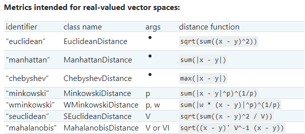

# KNN com Scikit-Learn

## Conteúdo

 - [01 - Métodos matemáticos utilizados no Algoritmo KNN](#01)
 - [02 - Classificando mulheres com câncer de mama com o Algoritmo KNN](#02)
   - [02.1 - Normalizando as colunas (festures) para tentar conseguir uma melhor accuracy](#02-1)
   - [02.2 - Escolhendo o melhor valor de "K" e método matemático com a classe GridSearchCV](#02-2)

---

<div id="01"></div>

## 01 - Métodos matemáticos utilizados no Algoritmo KNN

Agora nós vamos aprender o básico de como implementar classificações com a biblioteca [Scikit-Learn](https://scikit-learn.org/stable/index.html). A primeira coisa que nós devemos saber é que existe **métodos matemáticos** diferentes para resolver esse problema. Isso porque o *Algoritmo KNN* utilizar uma maneira de calcular todas as distâncias entre o dado observado e os demais pontos do nosso conjunto de dados.

Os métodos mais comuns são os seguinte: [sklearn.neighbors.DistanceMetric](https://scikit-learn.org/stable/modules/generated/sklearn.neighbors.DistanceMetric.html)

  

**NOTE:**  
Esses métodos matemáticos podem perfomar melhor de acordo com o conjunto de dados que você tenha, por isso, é interessante você testar sempre que possível a maioria deles.

---

<div id="02"></div>

## 02 - Classificando mulheres com câncer de mama com o Algoritmo KNN

Para esse nosso primeiro exemplo de classificação utilizando o **Algoritmo KNN** nós vamos utilizar o dataset [sklearn.datasets.load_breast_cancer](https://scikit-learn.org/stable/modules/generated/sklearn.datasets.load_breast_cancer.html) que classifica se mulheres tem ou não câncer de mama.

O código completo vai ser o seguinte:

[knn_intro.py](src/knn_intro.py)
```python
from sklearn.model_selection import train_test_split
from sklearn.neighbors import KNeighborsClassifier
from sklearn.datasets import load_breast_cancer
import pandas as pd

pd.set_option('display.max_columns', 30)

df = load_breast_cancer() # Dataset instance.

x = pd.DataFrame(df.data, columns=[df.feature_names])
y = pd.Series(df.target)

x_train, x_test, y_train, y_test = train_test_split(x, y, test_size=0.3, random_state=16)

model = KNeighborsClassifier(n_neighbors=5)
model.fit(x_train, y_train)

result = model.score(x_test, y_test)
print("Accuracy:", result)
```

**OUTPUT:**  
```python
Accuracy: 0.9005847953216374
```

**NOTE:**  
Vejam que nós utilizamos a classe **KNeighborsClassifier** do **Scikit-Learn** no nosso modelo e passamos como argumento **K = 5** *(que é o valor default)*, para o mesmo ver qual é a classe predominante entre os **5 K's** mais próximos.

```python
model = KNeighborsClassifier(n_neighbors=5)
model.fit(x_train, y_train)
```

Por fim, nós pegamos a **accuracy** do nosso modelo que foi de **90%**:

```python
result = model.score(x_test, y_test)
print("Accuracy:", result)
```

**OUTPUT:**  
```python
Accuracy: 0.9005847953216374
```

---

<div id="02-1"></div>

## 02.1 - Normalizando as colunas (festures) para tentar conseguir uma melhor accuracy

É muito importante **normalizar os dados** para esse exemplo, porque se você olhar bem nosso dataset vai ver que temos várias colunas *(features)* com unidades de medidas diferentes. A variável **target** não vai precisar ser normalizada porque ela basicamente vai está sempre em um intervalo entre **0** e **1**.

Agora vamos aplicar a normalização das *colunas (features)* para ver se conseguimos uma melhor **accuracy**:

[knn_normalized.py](src/knn_normalized.py)
```python
from sklearn.model_selection import train_test_split
from sklearn.neighbors import KNeighborsClassifier
from sklearn.datasets import load_breast_cancer
from sklearn.preprocessing import MinMaxScaler
import pandas as pd

pd.set_option('display.max_columns', 30)

df = load_breast_cancer() # Dataset instance.

x = pd.DataFrame(df.data, columns=[df.feature_names])
y = pd.Series(df.target)

# Normalize columns (features).
normalized = MinMaxScaler(feature_range = (0 , 1))
x_norm = normalized.fit_transform(x)

x_train, x_test, y_train, y_test = train_test_split(x_norm, y, test_size=0.3, random_state=16)

model = KNeighborsClassifier(n_neighbors=5)
model.fit(x_train, y_train)

result = model.score(x_test, y_test)
print("Accuracy:", result)
```

**OUTPUT:**  
```
Accuracy: 0.9649122807017544
```

**NOTE:**  
Veja que agora nós conseguimos uma **accuracy** de **96%**. Isso porque as colunas (features) agora estão na mesma **unidade de medida**.

Outra mudança que tivemos nessa implementação foi passar os dados do *eixo-x* já normalizados **(x_norm)** para a função **train_test_split()**.

```python
x_train, y_train, x_test, y_test = train_test_split(x_norm, y, test_sizer=3.0, random_state=16)
```

---

<div id="02-2"></div>

## 02.2 - Escolhendo o melhor valor de "K" e método matemático com a classe GridSearchCV

Agora suponha que nós temos os seguintes problemas para resolver:

 - Qual o **melhor de "K"** para esse conjunto de dados;
 - E qual **método matemáticos** nós vamos utilizar para calcular a distância do meu dado **"x"** em relação aos demais, *para esse conjunto de dados*.

Bem, pode parecer muito complexo, mas com a classe [GridSearchCV](https://scikit-learn.org/stable/modules/generated/sklearn.model_selection.GridSearchCV.html) do biblioteca Scikit-Learn isso fica mais fácil.

Veja o código completo abaixo:

[knn_gridSearchCV.py](src/knn_gridSearchCV.py)
```python
from sklearn.model_selection import train_test_split
from sklearn.neighbors import KNeighborsClassifier
from sklearn.model_selection import GridSearchCV
from sklearn.datasets import load_breast_cancer
from sklearn.preprocessing import MinMaxScaler
import pandas as pd
import numpy as np

pd.set_option('display.max_columns', 30)

df = load_breast_cancer() # Dataset instance.

x = pd.DataFrame(df.data, columns=[df.feature_names])
y = pd.Series(df.target)

# Normalize predict variables.
normalized = MinMaxScaler(feature_range = (0 , 1))
x_norm = normalized.fit_transform(x)

# Defining values for KNN testing (K, Math method, and "p" values for math mathods = minkowski).
k_values = np.array([3, 5, 7, 9, 11]) # K Values.
math_method = ['minkowski', 'chebyshev'] # Math methods.
p_values = np.array([1, 2, 3, 4]) # p values for math methods.
grid_values = {'n_neighbors': k_values, 'metric': math_method, 'p':p_values}

model = KNeighborsClassifier() # Instance.

knnGrid = GridSearchCV(estimator = model, param_grid = grid_values, cv=5)
knnGrid.fit(x_norm, y)

print("Best accuracy:", knnGrid.best_score_)
print("Best K value:", knnGrid.best_estimator_.n_neighbors)
print("Best Math method:", knnGrid.best_estimator_.metric)
print("Best p value:", knnGrid.best_estimator_.p)

```

**OUTPUT:**  
```python
Best accuracy: 0.9701133364384411
Best K value: 3
Best Math method: minkowski
Best p value: 1
```

**NOTE:**  
Veja que agora a nossa **accuracy** aumentou **1%** de **96** para **97**. Isso porque agora nós estamos utilizando o melhor valor de **"K"** e melhor **método matemático** de calcular às distância `para esse conjunto de dados`.

---

**REFERÊNCIA:**  
[Didática Tech - Inteligência Artificial & Data Science](https://didatica.tech) 
