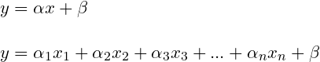
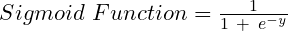
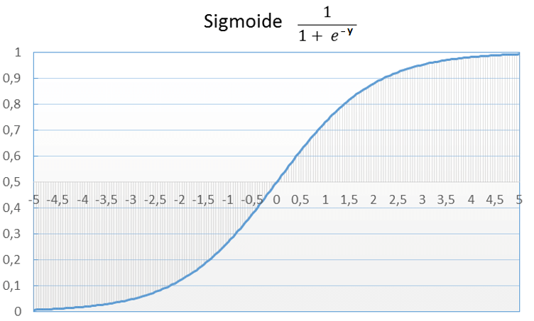
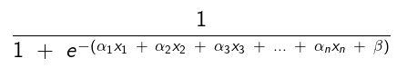
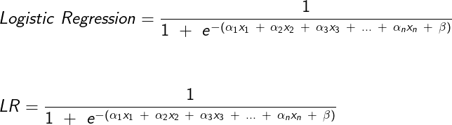

# Logistic Regression

## Contents

 - [Introdução aos problemas de Classificação](#intro-cp)
 - [Revisão Matemática (Equação da Reta + Função Sigmóide)](#math-review)
 - [Introdução à Regressão Logística](#intro-to-lg)
 - **Logistic Regression with Scikit-Learn:**
   - [Classificando desodorantes com o Dataset "Deodorant Instant Liking Data"](#deodorant-problem)
   - [Escolhendo melhores Hiper-parâmetros com a função GridSearchCV](#hyperparameter-tuning)
   - [Classificando mulheres tem câncer de mama com o Dataset "load_breast_cancer" do SkLearn](#load-breast-cancer-problem)


---

<div id="intro-cp"></div>

## Introdução aos problemas de Classificação

Bem, diferente dos problemas de **Regressões**, onde estamos interessados em investigar **relações entre variáveis *quantitativas (numéricas)***. Um problema de **Classificação** tenta prever rótulos de classes discretas. Como assim?

> Bem, resumidamente (e não formal) nós estamos tentando classificar se um rótulo/classe é ou não o que estamos comparando.

Os problemas de classificação são aqueles onde se busca encontrar uma classe, dentro das possibilidades limitadas existentes. Esta classe pode ser:

 - Se um aluno foi **aprovado** ou **reprovado**;
 - Se uma pessoa **possui uma doença** ou **não**;

Sendo que nestes casos ou a previsão será uma ou outra.

> As classes também podem possuir mais de duas opções, como separar pessoas em três grupos, **A**, **B** e **C**, ou **1**, **2** e **3**, ou ainda prever a marca de um determinado carro.

---

<div id="math-review"></div>

## Revisão Matemática (Equação da Reta + Função Sigmóide)

**Mas e a Matemática dos problemas de classificação muda muito em relação aos problemas de *Regressão*?**  
Não necessariamente, mas temos algumas peculiaridades. Vamos começar revisando a *Equação da Reta* para uma ou mais variáveis:

  

Bem, mas agora temos um probleminha... Isso, porque o resultado **y** da **Equação da Reta** nós dá uma reta como saída e nós estamos interessados em **classificar** em determinadas classes existentes. Por exemplo: **SIM** ou **NÃO**.

Uma abordagem interessante para resolver nosso problema seria utilizar a **Função Sigmóide**:

  

Graficamente fica assim:

  

Agora eu vou partir do pressuposto que você já conhece a **Função Sigmóide** que resumidamente:

 - Binariza as saídas entre: **0** ou **1**;
 - E tem um **período** de **transição**;

Ótimo, eu sei que com a **Função Sigmóide** eu posso binariza minha saída, mas como eu aplico isso para o meu problema de Classificação?

---

<div id="intro-to-lg"></div>

## Introdução à Regressão Logística

Então, agora que nós já sabemos qual a finalidade de um **problema de classificação** e revisamos os conceitos matemáticos de **Equação da Reta** e **Função Sigmóide** nós podemos unir tudo isso para resolver **problemas de classificação**. Mas como?

**Primeiro, nós vamos criar uma *reta de melhor ajuste* com os nossos dados:**  


**Agora, vamos utilizar a *Função Sigmóide* para *binzar (classicar)* os dados entre 0 e 1:**  


Vair ficar, mais ou menos assim:

  

**NOTE:**  
Isso é o que nós conhecemos como **Regressão Logística**:

  

---

<div id="deodorant-problem"></div>

## Classificando desodorantes com o Dataset "Deodorant Instant Liking Data"

Para esse exemplo vamos utilizar o Dataset disponibilizado pelo Kaggle [Deodorant Instant Liking Data](https://www.kaggle.com/ramkumarr02/deodorant-instant-liking-data). Esse Dataset faz referência a uma pesquisa com várias pessoas que testaram vários desodorantes e depois nós vamos **classificar se elas gostaram ou não (YES/NO)** de cada desodorante.

O código inicial em Python para esse problema é o seguinte:

[deodorant_instant_liking.py](src/deodorant_instant_liking.py)
```python
def missing_data_percent(df):
  missing = df.isna().sum()
  missing_percent = ( missing / len(df['Product']) ) * 100
  print("\nMissing data percent (%): \n", missing_percent)

if __name__=="__main__":

  from sklearn.linear_model import LogisticRegression
  from sklearn.model_selection import cross_val_score
  from sklearn.model_selection import StratifiedKFold

  import pandas as pd
  pd.set_option('display.max_columns', 64)
  pd.set_option('display.max_rows', 64)

  df = pd.read_csv('../datasets/data_train_reduced.csv')
  # print(df.head(10))
  # print(df.shape)
  # print(df.dtypes)

  missing_data_percent(df)

  # Drop Missing data > 20%
  df.drop(['q8.2','q8.8','q8.9','q8.10','q8.17','q8.18','q8.20'], axis=1, inplace=True)

  # Remove others unuseful columns (variables).
  df.drop(['Respondent.ID'], axis=1, inplace=True)
  df.drop('q1_1.personal.opinion.of.this.Deodorant', axis=1, inplace=True) # Remove 100% Accuracy (Personal Opinion).

  # Replace (fill) 20% missing data per median.
  df['q8.12'].fillna(df['q8.12'].median(), inplace=True)
  df['q8.7'].fillna(df['q8.7'].median(), inplace=True)

  missing_data_percent(df)

  df.drop(['Product'], axis=1, inplace=True) # Drop column "product": ERROR Deodorant J 

  y = df['Instant.Liking']
  x = df.drop('Instant.Liking', axis=1)

  Stratified_K_Fold = StratifiedKFold(n_splits=5,)

  model = LogisticRegression(max_iter=2000)
  result= cross_val_score(model, x, y, cv= Stratified_K_Fold, )

  print('Accuracy:', result.mean())
```

**OUTPUT:**  
```python
Missing data percent (%):
 Respondent.ID                                               0.0
Product.ID                                                  0.0
Product                                                     0.0
Instant.Liking                                              0.0
q1_1.personal.opinion.of.this.Deodorant                     0.0
q2_all.words                                                0.0
q3_1.strength.of.the.Deodorant                              0.0
q4_1.artificial.chemical                                    0.0
q4_2.attractive                                             0.0
q4_3.bold                                                   0.0
q4_4.boring                                                 0.0
q4_5.casual                                                 0.0
q4_6.cheap                                                  0.0
q4_7.clean                                                  0.0
q4_8.easy.to.wear                                           0.0
q4_9.elegant                                                0.0
q4_10.feminine                                              0.0
q4_11.for.someone.like.me                                   0.0
q4_12.heavy                                                 0.0
q4_13.high.quality                                          0.0
q4_14.long.lasting                                          0.0
q4_15.masculine                                             0.0
q4_16.memorable                                             0.0
q4_17.natural                                               0.0
q4_18.old.fashioned                                         0.0
q4_19.ordinary                                              0.0
q4_20.overpowering                                          0.0
q4_21.sharp                                                 0.0
q4_22.sophisticated                                         0.0
q4_23.upscale                                               0.0
q4_24.well.rounded                                          0.0
q5_1.Deodorant.is.addictive                                 0.0
q7                                                          0.0
q8.1                                                        0.0
q8.2                                                       40.0
q8.5                                                        0.0
q8.6                                                        0.0
q8.7                                                       20.0
q8.8                                                       80.0
q8.9                                                       80.0
q8.10                                                      80.0
q8.11                                                       0.0
q8.12                                                      20.0
q8.13                                                       0.0
q8.17                                                      80.0
q8.18                                                      60.0
q8.19                                                       0.0
q8.20                                                      40.0
q9.how.likely.would.you.be.to.purchase.this.Deodorant       0.0
q10.prefer.this.Deodorant.or.your.usual.Deodorant           0.0
q11.time.of.day.would.this.Deodorant.be.appropriate         0.0
q12.which.occasions.would.this.Deodorant.be.appropriate     0.0
Q13_Liking.after.30.minutes                                 0.0
q14.Deodorant.overall.on.a.scale.from.1.to.10               0.0
ValSegb                                                     0.0
s7.involved.in.the.selection.of.the.cosmetic.products       0.0
s8.ethnic.background                                        0.0
s9.education                                                0.0
s10.income                                                  0.0
s11.marital.status                                          0.0
s12.working.status                                          0.0
s13.2                                                       0.0
s13a.b.most.often                                           0.0
s13b.bottles.of.Deodorant.do.you.currently.own              0.0
dtype: float64

Missing data percent (%):
 Product.ID                                                 0.0
Product                                                    0.0
Instant.Liking                                             0.0
q2_all.words                                               0.0
q3_1.strength.of.the.Deodorant                             0.0
q4_1.artificial.chemical                                   0.0
q4_2.attractive                                            0.0
q4_3.bold                                                  0.0
q4_4.boring                                                0.0
q4_5.casual                                                0.0
q4_6.cheap                                                 0.0
q4_7.clean                                                 0.0
q4_8.easy.to.wear                                          0.0
q4_9.elegant                                               0.0
q4_10.feminine                                             0.0
q4_11.for.someone.like.me                                  0.0
q4_12.heavy                                                0.0
q4_13.high.quality                                         0.0
q4_14.long.lasting                                         0.0
q4_15.masculine                                            0.0
q4_16.memorable                                            0.0
q4_17.natural                                              0.0
q4_18.old.fashioned                                        0.0
q4_19.ordinary                                             0.0
q4_20.overpowering                                         0.0
q4_21.sharp                                                0.0
q4_22.sophisticated                                        0.0
q4_23.upscale                                              0.0
q4_24.well.rounded                                         0.0
q5_1.Deodorant.is.addictive                                0.0
q7                                                         0.0
q8.1                                                       0.0
q8.5                                                       0.0
q8.6                                                       0.0
q8.7                                                       0.0
q8.11                                                      0.0
q8.12                                                      0.0
q8.13                                                      0.0
q8.19                                                      0.0
q9.how.likely.would.you.be.to.purchase.this.Deodorant      0.0
q10.prefer.this.Deodorant.or.your.usual.Deodorant          0.0
q11.time.of.day.would.this.Deodorant.be.appropriate        0.0
q12.which.occasions.would.this.Deodorant.be.appropriate    0.0
Q13_Liking.after.30.minutes                                0.0
q14.Deodorant.overall.on.a.scale.from.1.to.10              0.0
ValSegb                                                    0.0
s7.involved.in.the.selection.of.the.cosmetic.products      0.0
s8.ethnic.background                                       0.0
s9.education                                               0.0
s10.income                                                 0.0
s11.marital.status                                         0.0
s12.working.status                                         0.0
s13.2                                                      0.0
s13a.b.most.often                                          0.0
s13b.bottles.of.Deodorant.do.you.currently.own             0.0
dtype: float64
Accuracy: 0.7512
```

**NOTE:**  
Se você entendeu bem o código vai ver que antes nós fizemos um Pré-Processamento removendo as colunas que tinham mais de 20% dos dados ausente e trocamos as que tinham 20% dos dados ausentes pelo a Mediana.

Depois nós aplicamos a validação cruzada StratifiedKFold para tentar encontrar a melhor **Accuracy** do nosso modelo.

---

<div id="hyperparameter-tuning"></div>

## Escolhendo melhores Hiper-parâmetros com a função GridSearchCV

Bem, agora nós vamos utilizar a função GridSearchCV para testar alguns Hiper-parâmetros, para ver se conseguimos uma melhor **accuracy**.

O código vai ficar assim:

[deodorant_instant_liking_gridSearchCV.py](src/deodorant_instant_liking_gridSearchCV.py)
```python
if __name__=="__main__":

  from sklearn.linear_model import LogisticRegression
  from sklearn.model_selection import GridSearchCV
  import pandas as pd
  import numpy as np

  pd.set_option('display.max_columns', 64)
  pd.set_option('display.max_rows', 64)
  df = pd.read_csv('../datasets/data_train_reduced.csv')

  # Drop Missing data > 20%
  df.drop(['q8.2','q8.8','q8.9','q8.10','q8.17','q8.18','q8.20'], axis=1, inplace=True)

  # Remove others unuseful columns (variables).
  df.drop(['Respondent.ID'], axis=1, inplace=True)
  df.drop('q1_1.personal.opinion.of.this.Deodorant', axis=1, inplace=True) # Remove 100% Accuracy (Personal Opinion).

  # Replace (fill) 20% missing data per median.
  df['q8.12'].fillna(df['q8.12'].median(), inplace=True)
  df['q8.7'].fillna(df['q8.7'].median(), inplace=True)

  df.drop(['Product'], axis=1, inplace=True) # Drop column "product": ERROR Deodorant J 

  y = df['Instant.Liking']
  x = df.drop('Instant.Liking', axis=1)

  C_values = np.array([0.01, 0.1, 0.5, 1, 2, 3, 5, 10, 20, 50, 100])
  regularization = ['l1', 'l2']
  grid_values = {'C': C_values, 'penalty': regularization}

  model = LogisticRegression(max_iter=2000)

  logistic_regression_grid = GridSearchCV(estimator = model, param_grid = grid_values, cv = 5)
  logistic_regression_grid.fit(x, y)

  print("Best Accuracy:", logistic_regression_grid.best_score_)
  print("Best C value:", logistic_regression_grid.best_estimator_.C)
  print("Regularization:", logistic_regression_grid.best_estimator_.penalty)
```

**OUTPUT:**  
```python
Best Accuracy: 0.7532000000000001
Best C value: 0.1
Regularization: l2
```

**NOTE:**  
Veja que agora nós temos uma **accuracy** um pouco melhor, mas foi tão pouco que às vezes seja irrelevante. Isso porque nós já estavamos com os valores quase ideais se comparado com os de antes.

---

<div id="load-breast-cancer-problem"></div>

## Classificando mulheres tem câncer de mama com o Dataset "load_breast_cancer" do SkLearn

Bem, como o capítulo diz vamos classificar se mulheres tem ou não câncer de mama com o Dataset [sklearn.datasets.load_breast_cancer](https://scikit-learn.org/stable/modules/generated/sklearn.datasets.load_breast_cancer.html).

O código inicial vai ser o seguinte:

[load_breast_cancer.py](src/load_breast_cancer.py)
```python
from sklearn.datasets import load_breast_cancer
import pandas as pd

pd.set_option('display.max_columns', 30)

df = load_breast_cancer() # Dataset instance.

x = pd.DataFrame(df.data, columns=[df.feature_names])
y = pd.Series(df.target)

print(x.head(10))
```

**OUTPUT:**  
```python
A SAÍDA VAI SER UM POUCO GRANDE, ENTÃO VOU DEIXAR VOCÊ VER NO SEU COMPUTADOR MESMO...
```

Partindo do pressuposto que você já viu e analisou todas as colunas, então agora você pode dar uma olhadinha na variável tardet (variável dependente):

[load_breast_cancer.py](src/load_breast_cancer.py)
```python
print("Target values:\n", y.head(50))
```

**OUTPUT:**  
```python
Target values:
 0     0
1     0
2     0
3     0
4     0
5     0
6     0
7     0
8     0
9     0
10    0
11    0
12    0
13    0
14    0
15    0
16    0
17    0
18    0
19    1
20    1
21    1
22    0
23    0
24    0
25    0
26    0
27    0
28    0
29    0
30    0
31    0
32    0
33    0
34    0
35    0
36    0
37    1
38    0
39    0
40    0
41    0
42    0
43    0
44    0
45    0
46    1
47    0
48    1
49    1
```

A classificação é basicamente a seguinte:

 - **Zero (0)** para quem não tem câncer de mama;
 - **Um (1)** para quem tem câncer de mama.

Agora como eu posso ver as dimensões do meu Dataset?

[load_breast_cancer.py](src/load_breast_cancer.py)
```python
print("Dataframe shape: {0}\nTarget variable shape: {1}".format(x.shape, y.shape))
```

**OUTPUT:**  
```python
Dataframe shape: (569, 30) # 569 statistical sample + 30 columns
Target variable shape: (569,) # Classification result.
```

> Ok, mas como eu consigo a melhor **accuracy** para o meu modelo?

Bem, para isso nós podemos utilizar as funções de validações cruzada em conjunto com a procura dos melhores hiper-parâmetros.

Vai ficar assim:

[load_breast_cancer-v2.py](src/load_breast_cancer-v2.py)
```python
from sklearn.linear_model import LogisticRegression
from sklearn.model_selection import GridSearchCV
from sklearn.datasets import load_breast_cancer
import pandas as pd
import numpy as np

pd.set_option('display.max_columns', 30)

df = load_breast_cancer() # Dataset instance.
x = pd.DataFrame(df.data, columns=[df.feature_names])
y = pd.Series(df.target)

C_value = np.array([0.01, 0.1, 0.5, 1, 2, 3, 5, 10, 20, 50, 100])
regularization = ['l1', 'l2']
grid_values = {'C': C_value, 'penalty': regularization}

model = LogisticRegression(max_iter=2000)

logistic_regression_grid = GridSearchCV(estimator = model, param_grid = grid_values, cv = 5)
logistic_regression_grid.fit(x, y)

print("Best Accuracy:", logistic_regression_grid.best_score_)
print("Best C value:", logistic_regression_grid.best_estimator_.C)
print("Regularization:", logistic_regression_grid.best_estimator_.penalty)
```

**OUTPUT:**  
```python
Best Accuracy: 0.9560937742586555
Best C value: 100.0
Regularization: l2
```

O nosso retorno foi uma **accuracy de 95%** e o **melhor hiper-parâmetro foi 100**. Vejam que foi um pouco grande a diferença do hiper-parâmetro 100 para o seu antecessor (50).

**Será que ele não pode ser melhorado com valores mais próximos de 100?**  
É isso que vamos fazer, rodar o mesmo modelo, porém, com hiper-parâmetros ligeiramente próximos de 100 *(para menos e para mais)*.

[load_breast_cancer-v3.py](src/load_breast_cancer-v3.py)
```python
from sklearn.linear_model import LogisticRegression
from sklearn.model_selection import GridSearchCV
from sklearn.datasets import load_breast_cancer
import pandas as pd
import numpy as np

pd.set_option('display.max_columns', 30)

df = load_breast_cancer() # Dataset instance.
x = pd.DataFrame(df.data, columns=[df.feature_names])
y = pd.Series(df.target)

C_value = np.array([95, 96, 97, 98, 99, 100, 101, 102, 103, 104, 105])
regularization = ['l1', 'l2']
grid_values = {'C': C_value, 'penalty': regularization}

model = LogisticRegression(max_iter=2000)

logistic_regression_grid = GridSearchCV(estimator = model, param_grid = grid_values, cv = 5)
logistic_regression_grid.fit(x, y)

print("Best Accuracy:", logistic_regression_grid.best_score_)
print("Best C value:", logistic_regression_grid.best_estimator_.C)
print("Regularization:", logistic_regression_grid.best_estimator_.penalty)
```

**OUTPUT:**  
```python
Best Accuracy: 0.9578481602235678
Best C value: 97
Regularization: l2
```

**NOTE:**  
Vejam que agora nós temos uma melhor **accuracy** *(com uma diferença insignificante)* e um hiper-parâmetro melhor que foi o 97.

---

**REFERENCES:**  
[Didática Tech - Inteligência Artificial & Data Science](https://didatica.tech/)  
[logistic regression](https://www.kaggle.com/pedrimbh/logistic-regression)  

---

Ro**drigo** **L**eite da **S**ilva - **drigols**
