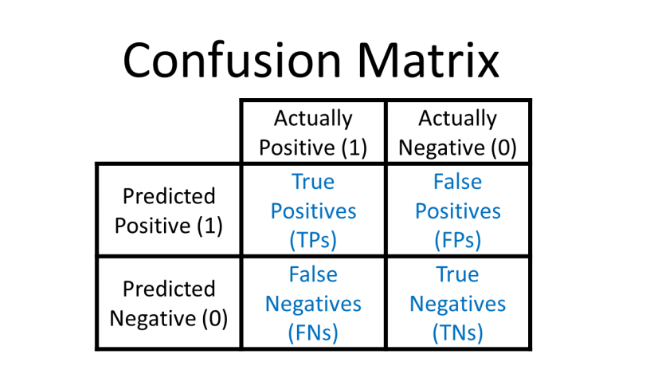

# Confusion Matrix

## Conteúdo

 - [01 - Classificando se mulheres tem câncer de mama ou não + Problema de desbalanceamento das classes](#01)
 - [02 - Introdução a Confusion Matrix](#02)
 - [03 - Confusion Matrix na prática com Scikit-Learn](#03)
 - [04 - Exibindo uma Confusion Matrix em formato de gráfico](#04)
 - [05 - Classificando pessoas obesas com a Função Sigmóide](#05)
   - [05.1 - Transformando nosso gráfico de pessoas obesas em uma Confusion Matrix](#05-1)
   - [05.2 - Mudando o ponto de transição (threshold) para 1](#05-2)
   - [05.3 - True Positive Rate (TPR) x False Positive Rate (FPR)](#05-3)
     - [05.3.1 - True Positive Rate (TPR)](#tpr)
     - [05.3.2 - False Positive Rate (FPR)](#fpr)
     - [05.3.3 - Conclusão TPR x FPR](#conclu)
     - [05.3.4 - Calculando o TPR e FPR para o meu problema de classificação de pessoas obesas com threshold 1](#calculating)
     - [05.3.5 - Transformando os cálculos do TPR e FPR em um gráfico](#graph-tpr-fpr-01)
 - [06 - Um exemplo de melhor cenário possível para os meus TPR e FPR](#06)
 - [07 - Testando diferentes ponto de transição (threshold)](#07)
   - [07.1 - ROC curve (receiver operating characteristic curve)](#07-1)
   - [07.2 - Curva AUC](#07-2)
 - [08 - Curva ROC e AUC na prática com Scikit-Learn](#08)

---

<div id="01"></div>

## 01 - Classificando se mulheres tem câncer de mama ou não + Problema de desbalanceamento das classes

Para entender como funciona o conceito de **Confusion Matrix** vamos pegar o Dataset [sklearn.datasets.load_breast_cancer](https://scikit-learn.org/stable/modules/generated/sklearn.datasets.load_breast_cancer.html) que classifica se mulheres tem ou não câncer de mama.

De início o que nós vamos focar é a variável **target** e contabilizar quantas mulheres do Dataset tem câncer de mama e quantas não tem:

[confusion_matrix-v1.py](src/confusion_matrix-v1.py)
```python
from sklearn.datasets import load_breast_cancer
import pandas as pd

pd.set_option('display.max_columns', 30)

df = load_breast_cancer() # Dataset instance.

x = pd.DataFrame(df.data, columns=[df.feature_names])
y = pd.Series(df.target)

print(y.value_counts())
```

**OUTPUT:**  
```python
1    357
0    212
dtype: int64
```

No código acima nós utilizamos a função **value_counts()** do Pandas para contabilizar quantas classes/rotulos *(1 ou 0)* de cada um tem.

## Problema de desbalanceamento das classes

**NOTE:**  
Bem, se você olhar bem vai ver que as classes não estão muito desbalanceadas, mas suponha que por acaso  tivesse **1010 da classe 1** e **80 da classe 0** qual problema nós teríamos? Bem, na hora de calcular nossa **accuracy** nós teríamos um valor muito bom ou próximo de ótimo, mas na verdade as classes estariam desbalanceadas.

> **Ok, mas como resolver esse problema? Analisando as classes em uma Confusion Matrix.**

---

<div id="02"></div>

## 02 - Introdução a Confusion Matrix

Para entender melhor como funciona o processo do **Algoritmo Confusion Matrix** veja os blocos abaixo:

  

Nos blocos acima:

 - **As colunas representam:**
   - Os valores reais.
 - **As linhas representam:**
   - As previsões (o que o meu modelo preveu).

> **Agora o que acontce se o meu modelo preveu que uma pessoa tinha câncer mama e de fato a pessoa tinha cancer?**

  

Vejam que de fato o meu modelo acertou!

> **Agora suponha que o meu modelo preveu que a pessoa tinha câncer de mama e nos valores reais a pessoa *não* tinha?**

  

**NOTE:**  
Então, vejam que agora o meu modelo errou a previsão.

> **E o que acontece se o meu modelo prever que a pessoa não tinha câncer de mama e a pessoa tivesse?**

  

Mais uma vez meu modelo errou!

> **E por fim, se meu modelo prever que uma pessoa não tenha câncer de mama e ela realmente não tenha?**

  

Veja que agora o meu modelo acertou novamente.

**MAS O QUE O ALGORITMO CONFUSION MATRIX NÓS DÁ COM ESSES BLOCOS?**  

 - Quantos acertos eu tive no total;
 - Quantos valores verdadeiros eu disse que eram verdadeiros;
 - Quantos valores falsos eu disse que eram falsos;
 - etc,...

**NOTE:**  
É sempre bom dar uma atenção especial para o caso **Falso Negativo (False Negatives)**. Por exemplo, suponha **nós prevemos que uma pessoa *não* tinha uma doença "x"** e **ela tinha**. `Esse é o pior caso de todos na classificação de doenças`. Isso porque se nós falarmos que uma pessoa tem uma doença ela pode começar o tratamento e depois dos exames ela pode descobrir que não tem nenhuma doença. Agora se eu prever que ela não tem "x" doença e ela tiver, isso pode ser um grande problema porque talvez a pessoa não inicie nenhum tratamento e a doença se alaste.

> **Agora como eu aplico todo esse conceito na prática?**

---

<div id="03"></div>

## 03 - Confusion Matrix na prática com Scikit-Learn

Ok, para implementar toda essa bruxaria primeiro eu vou deixar o código completo abaixo e depois vou comentar as partes mais importantes:

[confusion_matrix-v2.py](src/confusion_matrix-v2.py)
```python
from sklearn.model_selection import train_test_split
from sklearn.linear_model import LogisticRegression
from sklearn.datasets import load_breast_cancer
from sklearn.metrics import confusion_matrix
import pandas as pd

pd.set_option('display.max_columns', 30)

df = load_breast_cancer() # Dataset instance.
x = pd.DataFrame(df.data, columns=[df.feature_names])
y = pd.Series(df.target)

x_train, x_test, y_train, y_test = train_test_split(x, y, test_size = 0.3, random_state=9)

model = LogisticRegression(C=95, penalty='l2')
model.fit(x_train, y_train)

result = model.score(x_test, y_test)
print("Accuracy:", result)

predicts = model.predict(x_test)
print("Predicts with testing data:\n", predicts)

cm = confusion_matrix(y_test, predicts)
print("Confusion Matrix:\n", cm)
```

**OUTPUT:**  
```python
Accuracy: 0.9532163742690059
Predicts with testing data:
 [1 1 0 1 1 0 0 0 1 0 0 1 1 1 0 1 1 1 1 1 0 1 1 0 1 1 1 1 1 0 0 1 0 1 0 0 0
 1 0 1 0 1 1 1 1 1 1 0 1 0 0 1 1 1 0 1 1 0 1 1 0 0 0 1 1 1 0 1 0 1 1 1 1 1
 0 0 1 1 1 1 1 1 1 0 1 1 1 1 0 1 1 1 1 1 1 0 1 1 1 0 1 0 1 1 1 1 0 0 1 1 1
 1 1 0 1 1 1 1 0 1 0 0 1 1 0 1 1 1 0 0 0 0 0 0 1 1 1 1 1 0 1 0 0 1 1 1 0 0
 1 1 0 1 0 1 1 0 1 1 0 1 1 0 0 0 1 1 0 1 1 1 1]
Confusion Matrix:
 [[ 57   5]
 [  3 106]]
```

Ok, agora vamos para as explicações... A primeira coisa que nós fizemos foi dividir o nosso dataset em **dados de treino** e **dados de teste**, com:

 - 70% para treino;
 - 30% para testes.

```python
x_train, x_test, y_train, y_test = train_test_split(x, y, test_size = 0.3, random_state=9)
```

Depois nós instanciamos a classe **LogisticRegression** e treinamos o nosso modelo com os dados de treino:

```python
model = LogisticRegression(C=95, penalty='l2')
model.fit(x_train, y_train)
```

Agora nós vamos testar a nossa accuracy com os dados de testes para ver quão bem aprendeu nosso modelo:

```python
result = model.score(x_test, y_test)
print("Accuracy:", result)
```

**NOTE:**  
Agora vem uma parte muito importante que é o seguinte, como os meus dados já estão treinados com os dados de treino nós vamos tentar prever (predict) os valores com os nossos dados de teste. Isso porque o nosso modelo ainda não viu esses dados, por isso, vamos tentar prever (predict).

```python
predicts = model.predict(x_test)
print("Predicts with testing data:\n", predicts)
```

**OUTPUT:**  
```python
Predicts with testing data:
 [1 1 0 1 1 0 0 0 1 0 0 1 1 1 0 1 1 1 1 1 0 1 1 0 1 1 1 1 1 0 0 1 0 1 0 0 0
 1 0 1 0 1 1 1 1 1 1 0 1 0 0 1 1 1 0 1 1 0 1 1 0 0 0 1 1 1 0 1 0 1 1 1 1 1
 0 0 1 1 1 1 1 1 1 0 1 1 1 1 0 1 1 1 1 1 1 0 1 1 1 0 1 0 1 1 1 1 0 0 1 1 1
 1 1 0 1 1 1 1 0 1 0 0 1 1 0 1 1 1 0 0 0 0 0 0 1 1 1 1 1 0 1 0 0 1 1 1 0 0
 1 1 0 1 0 1 1 0 1 1 0 1 1 0 0 0 1 1 0 1 1 1 1]
```

**NOTE:**  
Ou seja, para cada amostra em **x_test** a função **predict()** vai tentar classificar (prever) seu resultado.

**NOTE:**  
Outra observação é que a função **score()** faz esse procedimento (até porque nós estamos utilizando os dados de teste com ela), porém, ela nós retorna já calculado quanto porcento (%) a gente acerta - **Accuracy**.

**NOTE:**  
Bem, eu poderia comparar agora o meu o resultado da função **predict()** com o meu **y_test**, mas para isso nós utilizamos a função **confusion_matrix()** que vai nós gerar aquela linda tabelinha que nós estudamos antes:

```python
cm = confusion_matrix(y_test, predicts)
print("Confusion Matrix:\n", cm)
```

**OUTPUT:**  
```python
Confusion Matrix:
 [[ 57   5]
 [  3 106]]
```

---

<div id="04"></div>

## 04 - Exibindo uma Confusion Matrix em formato de gráfico

Para quem entende de programação é fácil entender a saída da nossa **Confusion Matrix**, mas e para mostrar aos usuários ou quem está pagando pelo a nossa análise não seria muito interessante.

Tem alguma maneira de exibir nossa **Confusion Matrix** em algum formato gráfico? Claro, uma das maneiras é com a classe [ConfusionMatrixDisplay](https://scikit-learn.org/stable/modules/generated/sklearn.metrics.ConfusionMatrixDisplay.html), veja abaixo:

[confusion_matrix_display.py](src/confusion_matrix_display.py)
```python
from sklearn.metrics import confusion_matrix, ConfusionMatrixDisplay
from sklearn.model_selection import train_test_split
from sklearn.linear_model import LogisticRegression
from sklearn.datasets import load_breast_cancer
from sklearn.metrics import confusion_matrix
from matplotlib import pyplot as plt
import pandas as pd

pd.set_option('display.max_columns', 30)

df = load_breast_cancer() # Dataset instance.
x = pd.DataFrame(df.data, columns=[df.feature_names])
y = pd.Series(df.target)

x_train, x_test, y_train, y_test = train_test_split(x, y, test_size = 0.3, random_state=9)

model = LogisticRegression(max_iter=10000, C=95, penalty='l2')
model.fit(x_train, y_train)

predicts = model.predict(x_test)
cm = confusion_matrix(y_test, predicts)

cmd = ConfusionMatrixDisplay(confusion_matrix=cm)
cmd.plot()
plt.title("Confusion Matrix Display")
plt.savefig('../images/confusion_matrix_display.png', format='png')
plt.show()
```

**OUTPUT:**  

  

---

<div id="05"></div>

## 05 - Classificando pessoas obesas com a Função Sigmóide

Bem, agora suponha que nós utilizamos a **função Sigmóide** para *classificar (binarizar)* um conjunto de dados referente a probabilidade de pessoas serem obesas em relação ao seu peso.

**NOTE:**  
Imagine, que todas essas **pessoas (amostras)** passaram por uma avaliação médica e os médicos classificaram por cores:

 - **Verde:** Para as pessoas que *NÃO ERAM OBESAS*;
 - **Azul:** Para as pessoas que *ERAM OBESAS*.

Algo parecido com isso:

  

Olhando no gráfico acim nós temos:

 - No **eixo-x** o peso das pessoas;
 - No **eixo-y** a probabilidade de uma pessoa ser obesa.

Vejam também que nós temos um **ponto de transição (threshold)** no **eixo-y**, onde:

 - Se o dado (amostra) for **menor do que 0.5** nós vamos classificar *(binarizar)* como **0**;
 - E se o dado (amostra) for **maior do que 0.5** nós vamos classificar *(binarizar)* como **1**.

Nós também temos uns pontos de dados no **eixo-x** referente a pessoas **não-obesas (verde)** e **obesas (azul)**. Isso, porque quanto maior o peso, maior a probabilidade de uma pessoa ser obesa, visto que nós só estamos analisando os pesos.

**NOTE:**  
Se você prestou bem atenção no gráfico vai ver que temos **2 pessoas (amostras)** que não correspondem a nossa classificação:

 - Uma pessoa que não é obesa classificada (binarizada) como 1;
 - E uma pessoa obesa classificada (binarizada) como 0.

Mas o que pode ter causado isso?

 - **Um dos casos é a altura com relação ao peso:**
   - Por exemplo, essa pessoa que foi classificada como não obesa e ela é obesa, talvez ela não seja muito alta e para a altura dela o peso não seja o ideal.
 - **Outro caso pode ser quão musculosa essa pessoa é:**
   - Por exemplo, essa pessoa que foi classifica como obesa e não é, pode ser que ela seja muito forte/musculosa.

**NOTE:**  
Esses problemas ocorrem porque nós estamos classificando apenas analisando os pesos (weight) das pessoas.

<div id="05-1"></div>

## 05.1 - Transformando nosso gráfico de pessoas obesas em uma Confusion Matrix

Como ficaria esse nosso gráfico se comparado com uma **Confusion Matrix**?

  
  

 - **No primeiro bloco (norte, esquerda):**
   - Quantas pessoas eu preví que eram obesas, e de fato elas eram obesas? *Quatro (4)*.
 - **No segundo bloco (sul, esquerda):**
   - Quantas pessoas eu preví que não eram obesas, e elas eram obesas? *Uma (1)*.
 - **No terceiro bloco (norte, direita):**
   - Quantas pessoas eu preví que eram obesas, e elas não eram obesas? *Uma (1)*.
 - **No quarto bloco (sul, direita):**
   - Quantas pessoas eu preví que não eram obesas, e de fato elas não eram obesas? *Seis (6)*.

<div id="05-2"></div>

## 05.2 - Mudando o ponto de transição (threshold) para 1

Agora vamos considerar um caso extremo, onde, meu **ponto de transição  (threshold)** fosse **1**. Algo parecido com isso:

  

**NOTE:**  

> Nesse caso nós classificamos todas as amostras como - **NÃO OBESAS**.

**NOTE:**  
Prestem muito atenção, quando nós mudamos o **ponto de transição (threshold)** para **1** nós criamos uma abstração, cenário; E agora nós vamos comparar uma situação onde nós prevemos (classificamos) que todas as amostras **NÃO SÃO OBESAS**, em relação ao nosso gráfico real.

Vejam como muda já que nós prevemos (classificamos) todas as pessoas (amostras) como **NÃO OBESAS (verde)**.

  
  

 - **No primeiro bloco (norte, esquerda):**
   - Quantas pessoas eu preví que eram obesas (nenhuma), e de fato elas eram obesas? *Zero (0)*.
 - **No segundo bloco (sul, esquerda):**
   - Quantas pessoas eu preví que não eram obesas, e elas eram obesas? *Cinco (5)*.
 - **No terceiro bloco (norte, direita):**
   - Quantas pessoas eu preví que eram obesas (nenhuma), e elas não eram obesas? *Zero (0)*.
 - **No quarto bloco (sul, direita):**
   - Quantas pessoas eu preví que não eram obesas, e de fato elas não eram obesas? *Cinco (5)*.

<div id="05-3"></div>

## 05.3 - True Positive Rate (TPR) x False Positive Rate (FPR)

> Agora nós vamos calcular a **Taxa dos Verdadeiros Positivos (TPR)** e a **Taxa dos Falsos Positivos (FPR)**.

As formulas são as seguintes:

---

<div id="tpr"></div>

## 05.3.1 - True Positive Rate (TPR)

  

**A fórmula para a Taxa dos Verdadeiros Positivos (TPR) nós diz o seguinte:**
 - Dos valores que são verdadeiros positivos (pessoas obesas / todas elas) quanto porcento (%) foi acertado?
 - Se você prestar atenção vai ver que nós estamos dividindo nossos verdadeiros positivos (TP), ou seja, todos que nós acertamos. Por todos os valores que realmente eram reais (TP + FN):
   - Lembrem que **(FN) False Negatives** são os valores que nós classificamos como não obesos, mas eram obesos, ou seja, também eram verdadeiros, mas não estavam nas nossas contas;
 - Ou seja, quantos positivos eu acertei, em relação a todos os positivos reais.

---

<div id="fpr"></div>

## 05.3.2 - False Positive Rate (FPR)

  

**A fórmula para a Taxa dos Falsos Positivos (FPR) nós diz o seguinte:**
 - O meu **False Negative (FN)** + **True Negative (TN)** me dá todos os valores negativos do problema;
 - E o **False Negative (FN)** me dá todos os valores em que eu falei que eram obesos, mas não eram;
 - Ou seja, quanto porcento (%) é o meu erro em relação a todos os erros do problema?

---

<div id="conclu"></div>

## 05.3.3 - Conclusão TPR x FPR

 - Quanto **maior** o meu **True Positive Rate (TPR)** *melhor*; Ou seja, mais perto de 1.
 - Quanto **menor** o meu **False Positive Rate (FPR)** *melhor*; Ou seja, mais perto de 0.

---

<div id="calculating"></div>

## 05.3.4 - Calculando o TPR e FPR para o meu problema de classificação de pessoas obesas com threshold 1

Para o nosso problema de classificação de pessoas obesas não teríamos o seguinte cenário:

  
  
  

<div id="graph-tpr-fpr-01"></div>

## 05.3.5 - Transformando os cálculos do TPR e FPR em um gráfico

Tem como representar esses cálculos como um gráfico? Claro, veja abaixo:

  

 - Vejam que no **eixo-x** nós temos o nosso **FPR** e no **eixo-y** o nosso **TPR**;
 - Se você olhar bem vai ver um ponto verde nas coordenadas = (0, 0). Esse ponto representa o resultado dos nossos cálculos para **FPR** e **TPR** em suas respectivas coordenadas.

---

<div id="06"></div>

## 06 - Um exemplo de melhor cenário possível para os meus TPR e FPR

Ótimo, nós já aprendemos como calcular os TPR e FPR, e representar eles em um gráfico, mas qual seria o melhor cenário possível para eles em um gráfico? Bem, o melhor cenário possível seria:

 - TPR = 1
 - FPR = 0

Ou no gráfico:

  

**NOTE:**  
Isso de fato confere com a conclusão que nós tinhamos tirado antes:

 - Quanto **maior** o meu **True Positive Rate (TPR)** *melhor*; Ou seja, mais perto de 1.
 - Quanto **menor** o meu **False Positive Rate (FPR)** *melhor*; Ou seja, mais perto de 0.

---

<div id="07"></div>

## 07 - Testando diferentes ponto de transição (threshold)

> Bem, nós podemos ir mudando o nosso ponto de **ponto de transição (threshold)** para encontrar os melhores valores para os meus **TPR = 1** e **FPR = 0**.

Suponha que nós ficamos testando alguns valores de **ponto de transição (threshold)** e colocamos os seus, respectivos, **TPR** e **FPR** em um gráfico. Algo parecido com isso:

  

Agora vamos criar uma reta que vai representar os pontos extremos *(máximos)* para os nossos **TPR** e **FPR**:

  

**NOTE:**  
Vejam que os pontos extremos *(máximos)* são **(FPR/x = 1, TPR/y = 1)**.

Ok, nós já temos alguns pontos referente a cálculos de **TPR** e **FPR**, mas como escolher os melhores?

**Primeiro, você nunca pode esquecer nossa conclusão:**

 - Quanto **maior** o meu **True Positive Rate (TPR)** *melhor*; Ou seja, mais perto de 1.
 - Quanto **menor** o meu **False Positive Rate (FPR)** *melhor*; Ou seja, mais perto de 0.

**NOTE**  
Agora é só ir olhando ponto a ponto e vendo quando o meu **TPR** é mais próximo possível de 1 e ao mesmo tempo o meu **FPR** é mais próximo possível de 0.

Dê mais uma olhadinha no gráfico veja esse caso:

  

**NOTE:**  
Veja que os 2 casos eram bons, porém:

 - Um puxando mais para o eixo-x = FPR;
 - E outro puxando mais para o eixo-y = TPR.

Então, tudo vai depender de qual das Taxas vocês está priorizando: **True Positive Rate (TPR)** ou **False Positive Rate (FPR)**.

---

<div id="07-1"></div>

## 07.1 - ROC curve (Receiver Operating Characteristic curve)

Agora vamos ligar todos esses **ponto de transição (threshold)** que nós criamos, algo parecido com isso:

  

**NOTE:**  
 - Esse procedimento (curva) que nós criamos é conhecido como: **Curva ROC**
 - Mas qual a vantagem que nós temos em criar essa **curva roc**?
   - Ela é bastante interessante para comparar vários Algoritmos de Machine Learning:
     - Por exemplo, se nós tivéssemos aplicando um algoritmo diferente de regressão logística e quisesse comparar com ele;
     - Ou, se você tivesse Algoritmos de Regressão Logística com hiper-parâmetros diferentes e quisesse comparar eles.

---

<div id="07-2"></div>

## 07.2 - AUC (Area Under the ROC Curve)

Agora suponha que nós criamos duas curvas que vão representar 2 Algoritmos quaisquer:

  

> Agora és a questão... Qual dos 2 Algoritmos é o melhor?

**NOTE:**  
Nesse caso o Algoritmos que tiver a **área maior abaixo da curva ROC** será o melhor. Isso é o que nós conhecemos como **AUC (Area Under the ROC Curve)**.

---

<div id="08"></div>

## 08 - Curva ROC e AUC na prática com Scikit-Learn

> Ok, nós já aprendemos como é criada uma **Curva ROC** e o **AUC**, mas como aplicar isso na prática?

Vamos voltar para o nosso Dataset referentes a classificação de mulheres com câncer de mama. O código para o nosso problema vai ser o seguinte:

[roc_auc.py](src/roc_auc.py)
```python
from sklearn.model_selection import train_test_split
from sklearn.linear_model import LogisticRegression
from sklearn.datasets import load_breast_cancer
from sklearn.metrics import roc_auc_score
from sklearn.metrics import roc_curve
from matplotlib import pyplot as plt
import pandas as pd

pd.set_option('display.max_columns', 30)

df = load_breast_cancer() # Dataset instance.
x = pd.DataFrame(df.data, columns=[df.feature_names])
y = pd.Series(df.target)

x_train, x_test, y_train, y_test = train_test_split(x, y, test_size = 0.3, random_state=9)

model = LogisticRegression(max_iter=2000, C=95, penalty='l2')
model.fit(x_train, y_train)

result = model.score(x_test, y_test)
print("Accuracy:", result)

predicts = model.predict_proba(x_test)
print("Predicts Probability:\n", predicts)

probs = predicts[:, 1] # All lines (samples) and first column.

# roc_curve function receive:
# - Real values (y_test);
# - Predicted values (probs = predicts[:, 1]).
# Than, return: TPR, FPR and Thresholds
fpr, tpr, thresholds = roc_curve(y_test, probs)

print("TPR:", tpr)
print("FPR:", fpr)
print("Thresholds:", thresholds)
print("AUC:", roc_auc_score(y_test, probs))

# Create a plot FPR x TPR.
plt.figure(figsize=(10, 7))
plt.scatter(fpr, tpr)
plt.title("FPR x TPR")
plt.xlabel("False Positive Rate (FPR)")
plt.ylabel("True Positive Rate (TPR)")
plt.savefig('../images/fpr-tpr-plot-01.png', format='png')
plt.show()
```

**OUTPUT:**  
```python
Accuracy: 0.9590643274853801
Predicts Probability:
 [[7.79573587e-02 9.22042641e-01]
 [3.70786908e-01 6.29213092e-01]
 [1.00000000e+00 2.18208512e-10]
 [3.23077972e-02 9.67692203e-01]
 [2.84906284e-04 9.99715094e-01]
 [1.00000000e+00 1.97165425e-13]
 [1.00000000e+00 2.04160940e-11]
 [9.99999992e-01 8.39015574e-09]
 [3.30291941e-04 9.99669708e-01]
 [9.99996634e-01 3.36639901e-06]
 [9.99999977e-01 2.26991207e-08]
 [1.35030553e-03 9.98649694e-01]
 [1.45944436e-04 9.99854056e-01]
 [6.24226786e-04 9.99375773e-01]
 [9.98025060e-01 1.97494009e-03]
 [2.29656852e-02 9.77034315e-01]
 [4.45498231e-05 9.99955450e-01]
 [2.69721719e-02 9.73027828e-01]
 [1.55911405e-05 9.99984409e-01]
 [3.71444096e-05 9.99962856e-01]
 [1.00000000e+00 1.58711419e-22]
 [2.46641395e-05 9.99975336e-01]
 [3.10007039e-03 9.96899930e-01]
 [9.99999835e-01 1.64814855e-07]
 [1.76928296e-03 9.98230717e-01]
 [6.62541375e-03 9.93374586e-01]
 [4.40064134e-03 9.95599359e-01]
 [8.79094866e-06 9.99991209e-01]
 [7.60673143e-04 9.99239327e-01]
 [1.00000000e+00 3.49027470e-10]
 [1.00000000e+00 1.05436722e-10]
 [1.31884142e-02 9.86811586e-01]
 [9.42479785e-01 5.75202152e-02]
 [4.29956369e-01 5.70043631e-01]
 [9.99969244e-01 3.07560801e-05]
 [1.00000000e+00 1.62335106e-10]
 [9.99999998e-01 1.57598365e-09]
 [4.55411393e-02 9.54458861e-01]
 [9.99987849e-01 1.21512570e-05]
 [7.77454394e-05 9.99922255e-01]
 [3.19749566e-01 6.80250434e-01]
 [4.35465746e-02 9.56453425e-01]
 [7.63337575e-03 9.92366624e-01]
 [3.94975799e-05 9.99960502e-01]
 [4.02472988e-04 9.99597527e-01]
 [2.95945204e-05 9.99970405e-01]
 [8.12453997e-01 1.87546003e-01]
 [1.00000000e+00 5.43115725e-15]
 [2.20881157e-01 7.79118843e-01]
 [9.99074781e-01 9.25219420e-04]
 [4.92177406e-01 5.07822594e-01]
 [1.03554592e-02 9.89644541e-01]
 [1.63173873e-04 9.99836826e-01]
 [1.59646228e-04 9.99840354e-01]
 [1.00000000e+00 3.76043491e-12]
 [2.88039816e-04 9.99711960e-01]
 [8.65376893e-04 9.99134623e-01]
 [1.00000000e+00 8.96964462e-14]
 [2.94374195e-04 9.99705626e-01]
 [1.98142276e-03 9.98018577e-01]
 [9.30940083e-01 6.90599169e-02]
 [9.90985500e-01 9.01449971e-03]
 [1.00000000e+00 1.22938577e-12]
 [5.61403662e-04 9.99438596e-01]
 [3.99271399e-04 9.99600729e-01]
 [7.33010366e-03 9.92669896e-01]
 [1.00000000e+00 1.04560676e-26]
 [5.51005061e-03 9.94489949e-01]
 [9.01454583e-01 9.85454170e-02]
 [1.23200085e-05 9.99987680e-01]
 [1.35431198e-01 8.64568802e-01]
 [3.63990677e-04 9.99636009e-01]
 [3.80559677e-04 9.99619440e-01]
 [2.00316455e-04 9.99799684e-01]
 [9.99999585e-01 4.15193080e-07]
 [9.91477563e-01 8.52243688e-03]
 [4.22807277e-06 9.99995772e-01]
 [1.86651519e-05 9.99981335e-01]
 [1.14199347e-05 9.99988580e-01]
 [5.30690161e-05 9.99946931e-01]
 [1.74848213e-02 9.82515179e-01]
 [1.66890413e-03 9.98331096e-01]
 [9.93559710e-02 9.00644029e-01]
 [9.99999976e-01 2.36730758e-08]
 [2.35478244e-03 9.97645218e-01]
 [1.80183010e-03 9.98198170e-01]
 [2.41559331e-02 9.75844067e-01]
 [3.91158472e-04 9.99608842e-01]
 [1.00000000e+00 3.43252170e-12]
 [8.54815303e-03 9.91451847e-01]
 [8.39862098e-06 9.99991601e-01]
 [5.73604218e-04 9.99426396e-01]
 [4.04810025e-04 9.99595190e-01]
 [5.17022679e-02 9.48297732e-01]
 [1.41808327e-05 9.99985819e-01]
 [9.99999898e-01 1.02452441e-07]
 [2.66654954e-03 9.97333450e-01]
 [3.64641200e-03 9.96353588e-01]
 [1.69859412e-04 9.99830141e-01]
 [1.00000000e+00 1.31111571e-10]
 [1.54346850e-03 9.98456532e-01]
 [9.99999782e-01 2.18157344e-07]
 [3.24484461e-06 9.99996755e-01]
 [6.90011710e-06 9.99993100e-01]
 [3.89522687e-05 9.99961048e-01]
 [4.52735198e-06 9.99995473e-01]
 [9.99799963e-01 2.00037119e-04]
 [2.30184320e-01 7.69815680e-01]
 [3.10904533e-02 9.68909547e-01]
 [6.46265820e-04 9.99353734e-01]
 [3.28910983e-04 9.99671089e-01]
 [9.84670906e-05 9.99901533e-01]
 [2.74209538e-05 9.99972579e-01]
 [9.99999999e-01 1.19656009e-09]
 [1.63798667e-03 9.98362013e-01]
 [2.29562990e-04 9.99770437e-01]
 [2.42446264e-02 9.75755374e-01]
 [2.00257706e-03 9.97997423e-01]
 [1.00000000e+00 1.12195669e-21]
 [1.87498081e-04 9.99812502e-01]
 [9.99999989e-01 1.11142646e-08]
 [6.82142855e-01 3.17857145e-01]
 [2.41267969e-04 9.99758732e-01]
 [2.86319951e-03 9.97136800e-01]
 [1.00000000e+00 7.75710684e-16]
 [2.19828117e-05 9.99978017e-01]
 [6.36945810e-04 9.99363054e-01]
 [5.03929279e-03 9.94960707e-01]
 [3.24372536e-01 6.75627464e-01]
 [9.99985106e-01 1.48939046e-05]
 [9.99999999e-01 7.25035333e-10]
 [9.99999996e-01 4.20022522e-09]
 [9.99891494e-01 1.08506298e-04]
 [9.99791813e-01 2.08186878e-04]
 [2.47115502e-03 9.97528845e-01]
 [6.59199108e-04 9.99340801e-01]
 [1.94855188e-03 9.98051448e-01]
 [6.31563256e-03 9.93684367e-01]
 [8.89789467e-04 9.99110211e-01]
 [1.00000000e+00 4.72147172e-17]
 [1.21667871e-04 9.99878332e-01]
 [9.99999986e-01 1.44173335e-08]
 [9.95623020e-01 4.37698046e-03]
 [4.41203837e-03 9.95587962e-01]
 [6.24599009e-05 9.99937540e-01]
 [4.85144462e-03 9.95148555e-01]
 [9.99999920e-01 8.02716185e-08]
 [1.00000000e+00 3.63404817e-20]
 [8.02953659e-04 9.99197046e-01]
 [4.23683763e-04 9.99576316e-01]
 [9.52101343e-01 4.78986571e-02]
 [6.94495223e-02 9.30550478e-01]
 [9.86733785e-01 1.32662150e-02]
 [6.70818484e-04 9.99329182e-01]
 [4.90832434e-02 9.50916757e-01]
 [9.88368870e-01 1.16311302e-02]
 [9.50402524e-04 9.99049597e-01]
 [1.35705083e-04 9.99864295e-01]
 [1.00000000e+00 3.54013316e-13]
 [5.30413772e-05 9.99946959e-01]
 [8.33333950e-04 9.99166666e-01]
 [8.73771482e-01 1.26228518e-01]
 [7.92420079e-01 2.07579921e-01]
 [1.00000000e+00 9.81585473e-28]
 [3.56640925e-04 9.99643359e-01]
 [1.88789573e-05 9.99981121e-01]
 [1.00000000e+00 1.23489274e-16]
 [7.72186773e-05 9.99922781e-01]
 [3.08044396e-04 9.99691956e-01]
 [2.77692514e-06 9.99997223e-01]
 [5.78772790e-05 9.99942123e-01]]
TPR: [0.         0.00917431 0.62385321 0.62385321 0.94495413 0.94495413
 0.99082569 0.99082569 1.         1.        ]
FPR: [0.         0.         0.         0.01612903 0.01612903 0.03225806
 0.03225806 0.11290323 0.11290323 1.        ]
Thresholds: [1.99999722e+00 9.99997223e-01 9.98362013e-01 9.98331096e-01
 9.30550478e-01 9.22042641e-01 6.80250434e-01 3.17857145e-01
 2.07579921e-01 9.81585473e-28]
AUC: 0.9923054158034922
```

  

---

**REFERENCES:**  
[Didática Tech - Inteligência Artificial & Data Science](https://didatica.tech/)  
