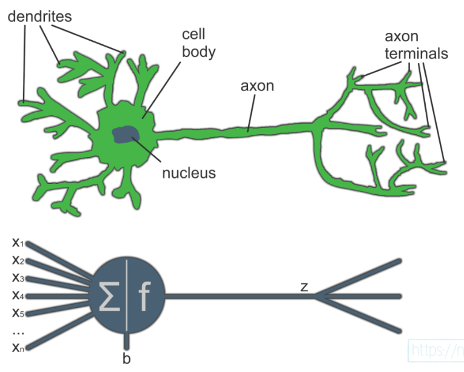
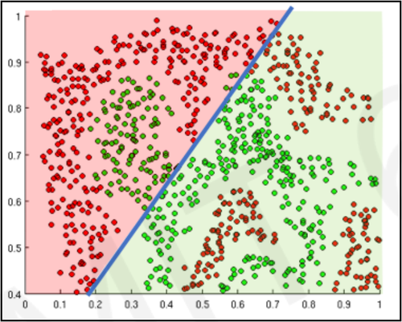

# Artificial Neural Networks & Deep Learning

## Contents

 - **Fundamentals of Artificial Neural Networks:**
   - [Artificial Neural Networks Inspiration](#ann-inspiration)
   - [The First Artificial Neuron (Perceptron)](#intro-to-perceptron)
 - **Neurons:**
   - [Neuron calculation (y = mx + b))](#neuron-calculation)
   - [Implementing calculation for a single neuron from scratch](#single-neuron-calculation)
 - **Layers:**
     - [Dense Neural Networks](#dense-neural-networks)
     - [How to implement a LayerDense() class](#impl-dense-layer-class)
     - [How to count the parameters of an Artificial Neural Network](#counting-ann-parameters)
 - [**Activation Functions**](#activation-functions)
   - [Sigmoid Function](#sigmoid-function)
 - [**References**](#ref)
<!---
[WHITESPACE RULES]
- Same topic = "20" Whitespace character.
- Different topic = "100" Whitespace character.
--->


<!--- ( Fundamentals of Artificial Neural Networks ) --->

---

<div id="ann-inspiration"></div>

## Artificial Neural Networks Inspiration

> *Artificial Neural Networks are inspired by the organic brain, translated to the computer.

  

> **NOTE:**  
> A single neuron by itself is relatively useless, but, when combined with hundreds or thousands (or many more) of other neurons, the interconnectivity produces relationships and results that frequently outperform any other machine learning methods.


---

<div id="intro-to-perceptron"></div>

## The First Artificial Neuron (Perceptron)

The first **Artificial Neuron** created was the **[Perceptron](https://en.wikipedia.org/wiki/Perceptron)** in 1958 by [Frank Rosenblatt](https://en.wikipedia.org/wiki/Frank_Rosenblatt):


 - The **[Perceptron](https://en.wikipedia.org/wiki/Perceptron)** had the main idea of receiving different inputs (or signals) and outputting the signal (result) **1** or **0**.
 - This signal (result) basically indicates whether the neuron will be *active* or *not* to proceed to another neuron.
 - **NOTE:** Over time, scientists discovered that there were other possibilities for neurons; Not only *active* or *not*, but we won't delve into details for now.

> **NOTE:**  
> The idea of the **[Perceptron](https://en.wikipedia.org/wiki/Perceptron)** was a single *neuron* that received **x<sub>i</sub>** inputs; Multiplied these inputs by their respective weights; Then passed through a *Non-Linear Activation Function* and received an *output*.


<!--- ( Neurons ) --->

---

<div id="neuron-calculation"></div>

## Neuron calculation (y = mx + b)

> Here, let's see how neurons are calculated.

The most important components to calculate a neuron are:

 - **Inputs**
 - **Weights**
 - **Bias**

> **NOTE:**  
> Initially, let's pay attention to the **"weight"** and **"bias"** components that *we can use to fit our model to the data (podemos usar para ajustar nosso modelo aos dados.)*.

To understand more easily, let's take a look at the image below:

  

See that:

 - **Each neuron has a specific output:**
   - Calculated by: `output = input * weight + bias`
 - **The "slope of the line formula" can represent that calculation:**
   - `y = mx + b`
 - **weight:**
   - The weight *moves* the *"line slope"* up or down.
 - **bias:**
   - The bias *moves* the *"line intercept"* up or down.

Now let's program this for a single neuron:

  

<!--- ( Numpy ) --->
<details>

<summary>Numpy</summary>

</br>

[neuron_np_calc-01.py](../../examples/neurons/neuron_np_calc-01.py)
```python
import numpy as np

inputs = [1.0, 2.0, 3.0, 2.5]
weights = [0.2, 0.8, -0.5, 1.0]
bias = 2.0

outputs = np.dot(weights, inputs) + bias

print(outputs)
```

**OUTPUT:**  
```bash
2.3
```

</details>


<!--- ( TensorFlow ) --->
<details>

<summary>TensorFlow</summary>

</br>

[neuron_tf_calc-01.py](../../examples/neurons/neuron_tf_calc-01.py)
```python
import os
os.environ['TF_CPP_MIN_LOG_LEVEL'] = '3'

import tensorflow as tf

inputs = tf.constant([1.0, 2.0, 3.0, 2.5])
weights = tf.constant([0.2, 0.8, -0.5, 1.0])
bias = tf.constant(2.0)

# Calculate the "Dot Product" and "add" the bias.
outputs = tf.tensordot(weights, inputs, axes=1) + bias

print(outputs)
print(outputs.numpy())
```

**OUTPUT:**  
```bash
tf.Tensor(4.8, shape=(), dtype=float32)
4.8
```

 - **The main difference here is that in TensorFlow you work with tensors instead of NumPy arrays:**
   - `print(outputs)`
     - Show the *tensor structure*.
   - `print(outputs.numpy())`
     - Show the *tensor value*.

</details>


---

<div id="single-neuron-calculation"></div>

## Implementing calculation for a single neuron from scratch

Here, let's implement a calculation for a single neuron from scratch:


<!--- ( Numpy ) --->
<details>

<summary>Numpy</summary>

</br>

[single-neuron-np-01.py](../../examples/neurons/single-neuron-np-01.py)
```python
import numpy as np

inputs = [1.0, 2.0, 3.0, 2.5]
weights = [0.2, 0.8, -0.5, 1.0]
bias = 2.0

outputs = np.dot(inputs, weights) + bias

print("Neuron Output:", outputs)
```

**OUTPUT:**
```bash
Neuron Output: 4.8
```

**Code Explanation:**

 - **Why don't we need to transpose the weight matrix?**
   - No, in this case, we don't need to transpose the weights matrix, since (como) both `inputs` and `weights` are *one-dimensional* vectors with the same size (4 elements each) the **np.dot()** method simply calculates the dot product between them, which is a scalar number.

</details>

<!--- ( TensorFlow ) --->
<details>

<summary>TensorFlow</summary>

</br>

[single-neuron-tf-01.py](../../examples/neurons/single-neuron-tf-01.py)
```python
import os
os.environ['TF_CPP_MIN_LOG_LEVEL'] = '3'

import tensorflow as tf

inputs = tf.constant([1.0, 2.0, 3.0, 2.5])
weights = tf.constant([0.2, 0.8, -0.5, 1.0])
bias = tf.constant(2.0)

# Calculate the "Dot Product" and "add" the bias.
outputs = tf.tensordot(inputs, weights, axes=1) + bias

print("Neuron Output:", outputs.numpy())
```

**OUTPUT:**
```bash
Neuron Output: 4.8
```

**Code Explanation:**

 - **Why don't we need to transpose the weight matrix?**
   - No, in this case, we don't need to transpose the weights matrix, since (como) both `inputs` and `weights` are *one-dimensional* vectors with the same size (4 elements each) the **np.dot()** method simply calculates the dot product between them, which is a scalar number.

</details>


<!--- ( Layers ) --->

---

<div id="dense-neural-networks"></div>

## Dense Neural Networks

> **What is a Dense Neural Network?**

 - The name suggests that the **"layers"** are fully connected (dense) by neurons in a network layer.
 - Each *neuron* in the current **"layer"** `receives output from all neurons present in the previous layer` - hence they are densely connected.

**NOTE:**  
In other words, *the dense layer is a fully connected layer*, meaning all neurons in one layer are connected to those in the next layer.


> **Why use a Dense Neural Network?**

 - A densely (desamente) connected layer provides learning features of all combinations of the features from the previous layer.
 - While a convolutional layer relies (depende) on consistent features with a small repetitive field.


---
<div id="impl-dense-layer-class"></div>

## How to implement a LayerDense() class

> Here, let's see how to implement a **LayerDense()** *class*.

To start, let's consider the following class:

<!--- ( Python ) --->
<details>

<summary>Python class</summary>

</br>

```python
class LayerDense:

    def __init__(self, n_inputs, n_neurons):
    # Initialize weights and biases
    pass # using pass statement as a placeholder

    def forward(self, inputs):
    # Calculate output values from inputs, weights and biases
    pass # using pass statement as a placeholder
```

</details>

</br>

**Code Explanation:**

 - **weights:**
   - The *"weights"* are often initialized randomly for a model, but not always.
   - **NOTE:** If you wish to load a pre-trained model, you will initialize the parameters to whatever that pretrained model finished with.
 - **Biases:**
   - The *"biases"* are often initialized to 0.
 - **forward() method:**
   - When we pass data through a model from beginning to end, this is called a **"forward pass"**.

To continue the code for the **LayerDense** class, let's add random initialization for the *"weights"* and zeros for the *"biases"*:

<!--- ( NumPy ) --->
<details>

<summary>NumPy</summary>

</br>

[layers.py](../../models/layers.py)
```python
class LayerDenseNP:

    def __init__(self, n_inputs, n_neurons):
        self.weights = 0.01 * np.random.randn(n_inputs, n_neurons)
        self.biases = np.zeros((1, n_neurons))
```

**Code Explanation:**

 - `self.weights = 0.01 * np.random.randn(n_inputs, n_neurons)`
   - Here, the weights are initialized (randomly).
   - `Why multiply by 0.01?`
     - This factor multiplies all randomly generated values, reducing their magnitude to 0.01 times the original value.
     - **NOTE:** This is a common technique known as "small random initialization".
   - `np.random.randn(n_inputs, n_neurons)`
     - `np.random.randn` is a function from the NumPy library in Python that creates a matrix of random numbers.
     - `n_inputs` and `n_neurons` are the dimensions of the matrix:
       - `n_inputs` The number of inputs coming into this layer (e.g., the size of the previous layer).
       - `n_neurons` The number of neurons in this dense layer.
       - **NOTE:** The result is a matrix with `n_inputs rows` and `n_neurons columns`, filled with random values.
 - `self.biases = np.zeros((1, n_neurons))`
   - We’ll initialize the biases with the shape of (1, n_neurons), as a row vector, which will let us easily add it to the result of the dot product later, without additional operations like transposition.

</details>


<!--- ( TensorFlow ) --->
<details>

<summary>TensorFlow</summary>

</br>

[layers.py](../../models/layers.py)
```python
class LayerDenseTF:

    def __init__(self, n_inputs, n_neurons):
        self.layer = tf.keras.layers.Input(shape=(n_inputs,)),
        self.layer = tf.keras.layers.Dense(n_neurons)
```

**Code Explanation:**

 - `self.layer = tf.keras.layers.Input(shape=(n_inputs,))`
   - `tf.keras.layers.Input` is a function from the TensorFlow library that creates an input layer for a neural network.
     - The `shape` argument is a tuple of integers that specifies the shape of the input data.
     - `n_inputs` is the number of inputs coming into this layer (e.g., the size of the previous layer).
 - `self.layer = tf.keras.layers.Dense(n_neurons)`
   - `tf.keras.layers.Dense` is a function from the TensorFlow library that creates a dense layer for a neural network.
   - `n_neurons` is the number of neurons in this dense layer.

</details>


</br>

Now, let's implement the  **forward()** method — Here, we need to update it with the *dot product* + *biases* calculation:


<!--- ( NumPy ) --->
<details>

<summary>NumPy</summary>

</br>

[layers.py](../../models/layers.py)
```python
class LayerDenseNP:

    def __init__(self, n_inputs, n_neurons):
        self.weights = 0.01 * np.random.randn(n_inputs, n_neurons)
        self.biases = np.zeros((1, n_neurons))

    def forward(self, inputs):
        self.output = np.dot(inputs, self.weights) + self.biases


if __name__ == "__main__":

    X, y = spiral_data(samples=100, classes=3)

    # Create Dense Layer with 2 input features and 3 output values
    np_layer = LayerDenseNP(2, 3)
    np_layer.forward(X)
    print("---------- ( NumPy ) ----------")
    print("Weights:\n", np_layer.weights)
    print("\nBiases:\n", np_layer.biases)
    print("\nLayer Output (0-5):\n", np_layer.output[:5])
```

**OUTPUT:**  
```bash
---------- ( NumPy ) ----------
Weights:
 [[ 0.00061946  0.01331959 -0.00786547]
 [-0.02462831 -0.0080792   0.00398273]]

Biases:
 [[0. 0. 0.]]

Layer Output (0-5):
 [[ 0.00000000e+00  0.00000000e+00  0.00000000e+00]
 [-2.27076821e-04 -1.31710312e-04  7.05966796e-05] 
 [-4.14941407e-04 -2.87945500e-04  1.56987180e-04] 
 [-6.59230377e-04 -4.11555339e-04  2.22228759e-04] 
 [-9.90552057e-04 -2.85993681e-04  1.37124868e-04]]
```

</details>


<!--- ( TensorFlow ) --->
<details>

<summary>TensorFlow</summary>

</br>

[layers.py](../../models/layers.py)
```python
class LayerDenseTF:

    def __init__(self, n_inputs, n_neurons):
        self.layer = tf.keras.layers.Input(shape=(n_inputs,)),
        self.layer = tf.keras.layers.Dense(n_neurons)

    def forward(self, inputs):
        self.output = self.layer(inputs)


if __name__ == "__main__":

    X, y = spiral_data(samples=100, classes=3)

    # Create Dense Layer with 2 input features and 3 output values
    tf_layer = LayerDenseTF(2, 3)
    tf_layer.forward(X)
    print("\n---------- ( TensorFlow ) ----------")
    print("Weights:\n", tf_layer.layer.get_weights()[0])
    print("\nBiases:\n", tf_layer.layer.get_weights()[1])
    print("\nLayer Output (0-5):\n", tf_layer.output.numpy()[:5])
```

**OUTPUT:**  
```bash
---------- ( TensorFlow ) ----------
Weights:
 [[ 0.70051754 -0.19958979  0.61595726]
 [ 1.0418012   1.0692909   1.0174973 ]]

Biases:
 [0. 0. 0.]

Layer Output (0-5):
 [[0.         0.         0.        ]   
 [0.00643532 0.01061239 0.00658279]    
 [0.00914041 0.02001456 0.00971682]    
 [0.01706547 0.03119325 0.0176831 ]    
 [0.04405948 0.04249408 0.04282904]]
```

**Code Explanation:**

 - `self.output = self.layer(inputs)`
   - `self.layer(inputs)` returns the output of the layer, given the input.
   - The result is stored in `self.output`.


</details>


---

<div id="counting-ann-parameters"></div>

## Parameter counting of an Artificial Neural Network

Depending on how many layers and how many neurons there are in each layer, the number of parameters of our Artificial Neural Network can change in size.

Here, let's see how to count the parameters of an *Artificial Neural Network (Densely)*.

  

To understand the count above, let's imagine we have the following Artificial Neural Network (Densely):

```bash
10, 8, 8, 8, 2
```

 - **Input Layer to First Hidden Layer:**
   - **Weights:** Each of the 10 input neurons connects to each of the 8 neurons in the first hidden layer. That’s `10 × 8 = 80 weights`.
   - **Biases:** Each neuron in the first hidden layer has one bias. So, `8 biases`.
   - **Total for this layer:** `80 + 8 = 88 parameters`.
 - **First Hidden Layer to Second Hidden Layer:**
   - **Weights:** Each of the 8 neurons in the first hidden layer connects to each of the 8 neurons in the second hidden layer. That’s `8 × 8 = 64 weights`.
   - **Biases:** There are 8 biases for the 8 neurons in the second hidden layer.
   - **Total for this layer:** `64 + 8 = 72 parameters`.
 - **Second Hidden Layer to Third Hidden Layer:**
   - **Weights:** Similarly, `8 × 8 = 64 weights`.
   - **Biases:** `8 biases`.
   - **Total for this layer:** `64 + 8 = 72 parameters`.
 - **Third Hidden Layer to Output Layer:**
   - **Weights:** Each of the 8 neurons in the third hidden layer connects to each of the 2 output neurons. That’s `8 × 2 = 16 weights`.
   - **Biases:** There are `2 biases` for the `2 output neurons`.
   - **Total for this layer:** `16 + 2 = 18 parameters`.

Now, add all the parameters together:

```bash
(10 x 8 + 8) + (8 x 8 + 8) + (8 x 8 + 8) + (8 x 2 + 2)
      |             |             |             |
      |             |             |             |
      88     +      72     +      72     +      18    =   250
```

Thus, the network has a total of `250 parameters`.


<!--- (Activation Functions) --->

---

<div id="activation-functions"></div>

## Activation Functions

> In Neural Networks, *Activation Functions* are used to mimic (imitar) a neuron “firing” or “not firing” based on input information.

When we're using an **Artificial Neural Network** to learn something, it's common to apply a **"Non-Linear Activation Function"**.

> **But what does this kind of function do?**

The purpose of **Activation Functions** is to introduce **"nonlinearities"** into an *Artificial Neural Network* (within the context of Neural Networks, of course).

Let's look at the example below to make it clearer:


Now suppose I ask you to separate these red points from the green ones using a Linear Function, could you do that? **NO!**

You might achieve something similar to this, but it wouldn't solve the problem:



 - In other words, no matter how many *Linear Functions* you use, it will always generate a line.
 - On the other hand, with **Non-Linear Functions**, you can solve the problem of separating the red points from the green ones.

Something like this:


That's:

 - *Activation Functions* are a crucial component of *Artificial Neural Networks* **used to introduce nonlinearity into the outputs of network layers**:
   - They are applied to the linear combination of inputs to a layer to produce the output of that layer.
 - Without *Activation Functions*, *Artificial Neural Networks* would be limited to performing linear calculations, which would make them incapable of handling (lidar) most real-world problems.


---

<div id="sigmoid-function"></div>

## Sigmoid Function

x


---

<div id=""></div>

## x

x


<!--- ( References ) --->

---

<div id="ref"></div>

## References

 - **General:**
   - [Neural Networks from Scratch in Python Book](https://nnfs.io/)

---

**Rodrigo** **L**eite da **S**ilva - **rodrigols89**

<!---


<!--- () ->
<details>

<summary>Title here...</summary>

</br>

[](../../examples/)
```python

```

**OUTPUT:**  
```bash

```

</details>


--->
