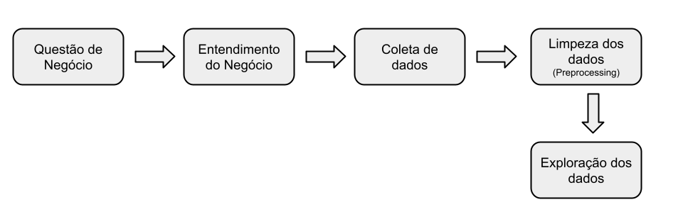
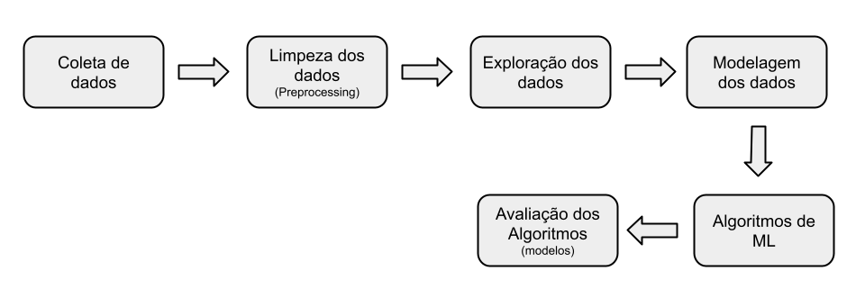
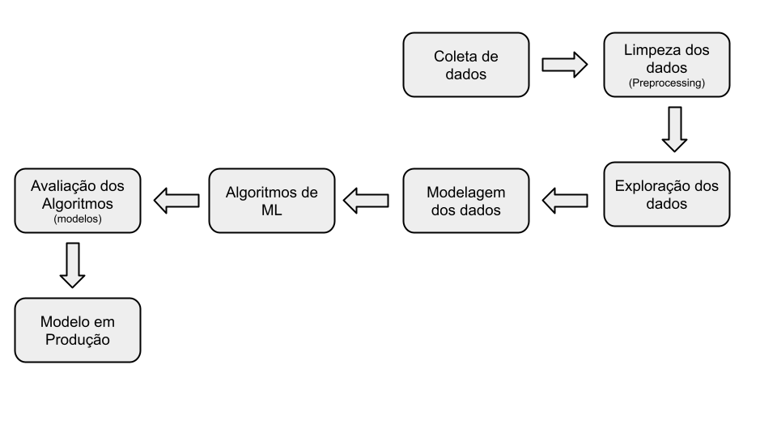
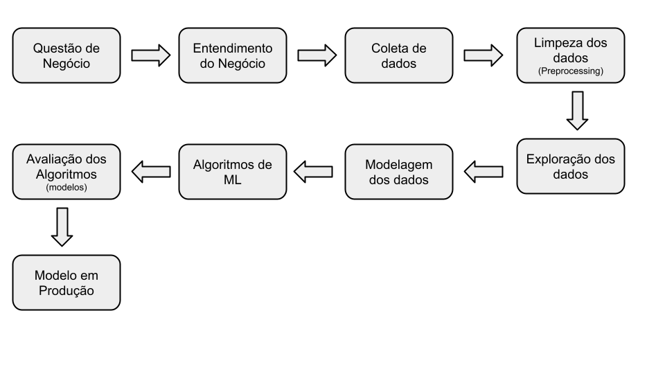

# Tipos (etapas) de Projectos de Data Science

## Conteúdo

 - [01 - Etapas de um Projecto de Data Science](#steps)
 - **02 - Tipos de Projetos de Data Science:**
   - [02.1 - Projeto de Insights](#insights)
   - [02.2 - Projeto de Data Engineering](#engineering)
   - [02.3 - Projeto de Machine Learning](#ml)
   - [02.4 - Projeto de End-to-End](#ete)
   - [02.5 - Projeto de Data Science](#ds)

---

## 01 - Etapas de um Projecto de Data Science

Todo projeto de **Data Science** tem suas etapas (ou pipelines). Sabendo disso, vou lista algumas etapas abaixo que seguem as experiências do [Meigarom do canal Seja Um Data Scientist](https://www.youtube.com/c/SejaUmDataScientist/videos):

 - **Questão de Negócio:**
   - Nessa etapa é feita uma requisição para que seja resolvido um problema ou feito algum tipo de inovação em um projeto.
 - **Entendimento do Negócio:**
   - Nessa etapa do projeto é dado um passo para o lado com o objetivo de tentar entender qual a causa raiz do problema:
     - Na etapa *Entendimento do Negócio* você não sai já criando implementações → Primeiro você ENTENDE qual problema você tem para resolver;
     - Muitas vezes as pessoas não chegam para você com um problema real. Elas chegam com uma solução que elas *ACHAM QUE RESOLVEM O PROBLEMA DELAS*.
     - Ou seja, muitas vezes as pessoas *não indicam as melhores soluções* para os próprios problemas delas.
 - **Coleta de dados:**
   - Na etapa de *coleta de dados* você tem que se preocupar em saber de onde você vai extrair os dados:
     - API?
     - Banco de Dados?
       - SQL?
       - NoSQL?
     - Site?
     - Em que formato vão vir esses dados?
       - Imagens?
       - Áugios?
       - Textos?
       - Números?
 - **Limpeza dos dados (Preprocessing):**
   - Durante a limpeza dos dados (ou preprocessing) você tem que se preocupar:
     - Aplicar Feature Engineering;
     - Se tem dados missing;
 - **Exploração dos dados:**
   - A *Análise exploratória dos dados* é importante para você ganhar mais conhecimento sobre os dados e gerar insights iniciais (que podem ou não ser entregues agora): 
     - Análise estatística dos dados;
     - Correlação entre esses dados (features);
     - Escolher quais algoritmos de Machine Learning você vai utilizar.
 - **Modelagem dos dados:**
   - A etapa de *modelagem de dados* é responsável por preparar os dados para serem utilizados por Algoritmos de *Machine Learning*.
 - **Algoritmos de ML:**
  - Dependendo do problema nessa etapa você treinar seus modelos de *Machine Learning* que podem ser:
    - Supervised Learning;
    - Unsupervised Learning;
    - Neural Networks;
    - Reinforcement Learning...
 - **Avaliação dos Algoritmos (modelos):**
   - Nessa etapa você vai avaliar quão bem seu modelo aprendeu (performou).
 - **Modelo em Produção:**
   - Na etapa de produção você vai disponibilizar o modelo para que fique acessível por diversas pessoas para que assim elas possam tomar decisões a partir do conhecimento (insights) gerado pelo modelo.

**NOTE:**  
Ótimo, já entendemos quais as etapas básicas de projetos de *Data Science*, mas será que todos os projetos de *Data Science* seguem todas essas etapas? Não e vamos lista alguns exemplos de etapas por projeto (mas nada impede que seja alterada alguma etapa dependendo da raiz do problema).

---

## 02.1 - Projeto de Insights

Um **Projeto de Insights** segue o seguinte ciclo *(mas nada impede que ele seja alterado dependendo do problema)*:

  

**NOTE:**  
Se você estiver iniciando na carreira uma boa abordagem para fazer um projeto de Portfólio seria:

 - Simula um problema de negócio;
 - Identifica a causa raiz desse problema;
 - Coleta de dados (Por exemplo, Kaggle);
 - Trata os dados;
 - Levanta Hipóteses sobre o comportamento do negócio;
 - Fazer uma análise exploratório de dados para validar/rejeitar as Hipóteses;
 - Escrever os insights e sua proposta de solução do problema.

**NOTE:**  
 - A **Análise exploratória de dados** para esse tipo de projeto pode ser tão grande quanto você quiser.
 - Outra observação é que esse tipo de projeto não utiliza Machine Learning, visto que nem todo projeto precisa utilizar Machine Learning para resolver um problema.
 - Porém, nada impede que ele realmente precise utilizar Machine Learning (mas talvez seja necessário mudar de projeto de insight para projeto de Machine Learning).

---

## 02.2 - Projeto de Data Engineering

Um **Projeto de Data Engineering** segue o seguinte ciclo *(mas nada impede que ele seja alterado dependendo do problema)*:

  

**NOTE:**  
Se você estiver iniciando na carreira uma boa abordagem para fazer um projeto de Portfólio seria:

 - Criar uma Pipeline de dados;
 - Coletar dados de fontes externas (Por exemplo de um site com Web Scraping);
 - Salvar os dados em um Banco de Dados Local:
   - SQL;
   - NoSQL.
 - Atualizar esses dados com frequência;
 - Limpar os dados;
 - Explorar os dados.

---

## 02.3 - Projeto de Machine Learning

Um **Projeto de Machine Learningg** segue o seguinte ciclo *(mas nada impede que ele seja alterado dependendo do problema)*:

  

**NOTE:**  
Se você estiver iniciando na carreira uma boa abordagem para fazer um projeto de Portfólio seria:

 - Escolher dados (próximos do real);
 - Aplica um Pré-Processamento nos dados (limpeza dos dados);
 - Exploração dos dados (para gerar insights);
 - Modelagem dos dados (prepara os dados para serem consumidos pelos modelos);
 - Aplica Algoritmos de Machine Learning;
 - Avalia o desempenho dos modelos (quão bem eles aprenderam);
 - Responda os problemas de negócios com os seus insights:
   - Agora vem a pergunta-chave → “Como você pode converter a performance de um modelo de ML em performance de negócio?”
     - Por exemplo, você tem um modelo com 90% de accuracy, mas quanto de lucro esses 90% representam se comparado com o meu negócio (ou problema?
     - Outro exemplo, é que você criou um modelo de previsão de vendas com 90% de accuracy. Então, seu chefe faz a seguinte pergunta, “Mas quanto de dinheiro isso vai trazer a mais no final do mês?”

**NOTE:**  
São esses insights que você deve responder com dados.

---

## 02.4 - Projeto de End-to-End

Um **Projeto de End-to-End** segue o seguinte ciclo *(mas nada impede que ele seja alterado dependendo do problema)*:

  

**NOTE:**  
Se você estiver iniciando na carreira uma boa abordagem para fazer um projeto de Portfólio seria:

 - Coletar, Limpar e Explorar um conjunto de dados que seja próximo do real
 - Modelar, aplicar e avaliar a performance dos modelos
 - Publica o modelo em produção

---

## 02.5 - Projeto de Data Science

Um **Projeto de Data Science** segue o seguinte ciclo *(mas nada impede que ele seja alterado dependendo do problema)*:

  

**NOTE:**  
Se você estiver iniciando na carreira uma boa abordagem para fazer um projeto de Portfólio seria:

 - A dica inicial aqui é que em cada etapa desse projeto (ou dos outros também) você deve iniciar com o mais simples e rápido possível para chegar a uma solução final e entregar os primeiro insights rápido.
   - Depois você vai incrementando e testando novas hipóteses.
   - Essa abordagem é muito conhecida também como *cíclica*, onde, nós vamos dando várias voltas em cada etapa a fim de melhorar sempre os nossos resultado incrementalmente.

---

**REFERÊNCIAS:**  
[Os 5 Tipos de Projetos OBRIGATÓRIOS para o Portfólio de Data Science!](https://www.youtube.com/watch?v=LJrK4B7bNWA)  
[Exemplos reais dos projetos acima](https://sejaumdatascientist.com/os-5-projetos-de-data-science-que-fara-o-recrutador-olhar-para-voce/x)

---

**Rodrigo Leite -** *drigols*
