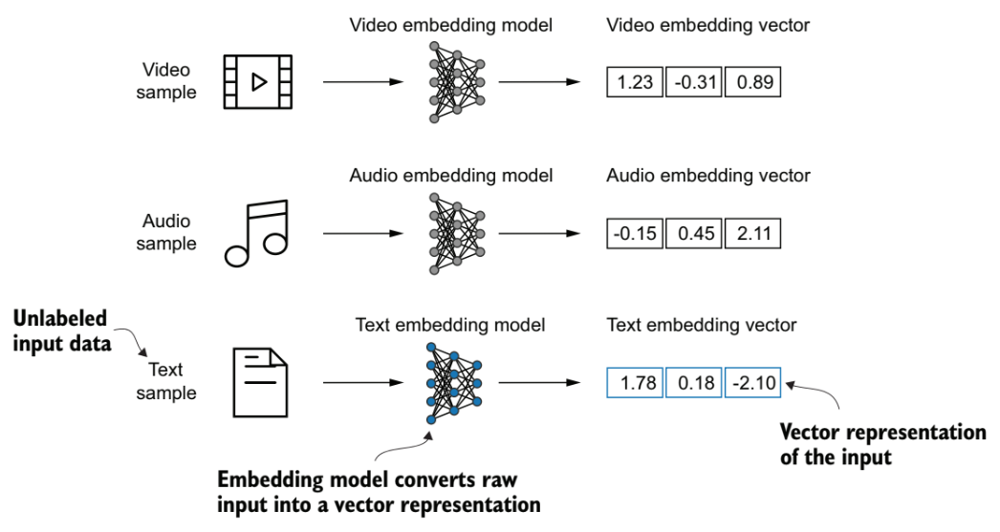
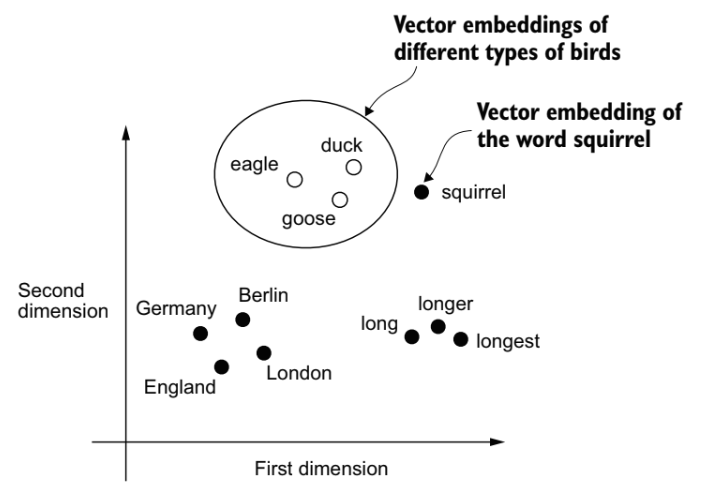
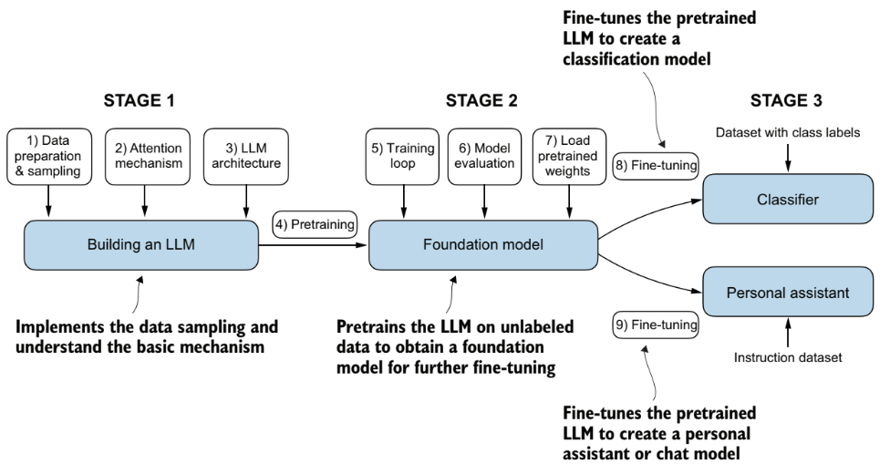
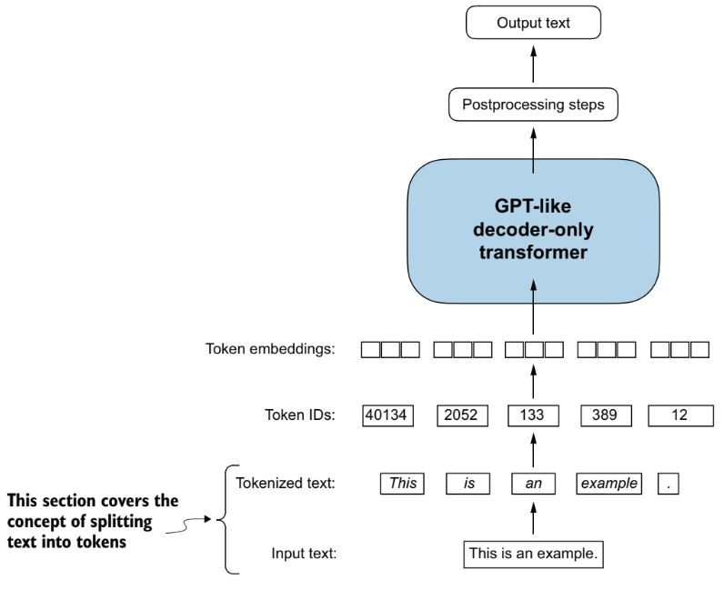

# Large Language Models

## Contents

 - **Fundamentals of Large Language Models:**
   - [What is an LLM?](#what-is-an-llm)
   - [Transformer Architecture](#transformer-architecture)
   - [Understanding word embeddings](#understanding-word-embeddings)
   - [Word2Vec Idea](#word2vec-idea)
 - [**Build a Large Language Model (Step by Step):**](#build-a-llm-sbs)
   - **STAGE 01:**
     - **Data Preparation & Sampling:**
       - [Tokenizing text](#tokenizing-text)


   - **STAGE 02:**
   - **STAGE 03:**
 - [**References**](#ref)
<!---
[WHITESPACE RULES]
- Same topic = "20" Whitespace character.
- Different topic = "100" Whitespace character.
--->


<!--- ( Fundamentals of Large Language Models ) --->

---

<div id="what-is-an-llm"></div>

## What is an LLM?

 - An ***LLM*** is a neural network designed to *understand*, *generate*, and *respond* to human like text.
 - These models are deep neural networks trained on massive amounts of text data, sometimes encompassing (abrangendo) large portions of the entire publicly available text on the internet.


---

<div id="transformer-architecture"></div>

## Transformer Architecture

Most modern LLMs rely on the **Transformer Architecture**, which is a deep neural network architecture introduced in the 2017 paper [“Attention Is All You Need”](https://arxiv.org/abs/1706.03762).

> **NOTE:**  
> To understand LLMs, it is interesting to understand the original transformer, which was developed for machine translation, translating texts from English to German and French.


---

<div id="understanding-word-embeddings"></div>

## Understanding word embeddings

 - Deep neural network models, including LLMs, cannot process raw text directly.
 - Since text is categorical, it isn’t compatible with the mathematical operations used to implement and train neural networks.
 - Therefore, we need a way to represent words as continuous-valued vectors.

> **NOTE:**  
> The concept of converting data into a vector format is often referred to as **embedding**.

Using a specific neural network layer or another pretrained neural network model, we can embed different data types — For example, video, audio, and text:

  

> **NOTE:**  
> However, it’s important to note that different data formats require distinct embedding models. For example, an embedding model designed for text would not be suitable for embedding audio or video data.


---

<div id="word2vec-idea"></div>

## Word2Vec Idea

> The main idea behind **Word2Vec** is that words that appear in similar contexts tend to have similar meanings.

Consequently, when projected into two-dimensional word embeddings for visualization purposes, similar terms are clustered together.

For example:

  


<!--- ( Build a Large Language Model (Step by Step) ) --->

---

<div id="build-a-llm-sbs"></div>

## Build a Large Language Model (Step by Step)

Here, we will implement a simple Large Language Model (LLM) by following the following steps (stages):




---

<div id="tokenizing-text"></div>

## Tokenizing text

> Here, let’s discuss how we can split input text into individual tokens, a required preprocessing step for creating *embeddings* for an *LLM*.

These tokens are either individual words or special characters, including punctuation characters, as shown below:



To start, let's create some useful functions to *read* and *print* `.txt` files:

<!--- ( Python (From Scratch) ) --->
<details>

<summary>Python (From Scratch)</summary>

</br>

First, let's create a function to *read* a `.txt` file:

[utils.py](../../algorithms/utils.py)
```python
import re


def read_txt(file_path):
    with open(file_path, "r", encoding="utf-8") as f:
        text = f.read()
        print("The text read successfully.")
        print("Total number of characters:", len(text))
        print("Text type:", type(text), "\n")
    return text


if __name__ == "__main__":

    file_path = "datasets/the-verdict.txt"
    text = read_txt(file_path)
```

**OUTPUT:**
```bash
The text read successfully.
Total number of characters: 20479
Text type: <class 'str'>
```

Now, let's create a function to *print* a `.txt` file:

[utils.py](../../algorithms/utils.py)
```python
import re


def read_txt(file_path):
    with open(file_path, "r", encoding="utf-8") as f:
        text = f.read()
        print("The text read successfully.")
        print("Total number of characters:", len(text))
        print("Text type:", type(text), "\n")
    return text


def print_txt(txt):
    print(txt)


if __name__ == "__main__":

    file_path = "datasets/the-verdict.txt"
    text = read_txt(file_path)

    print_txt(text)
```

**OUTPUT:**  
```bash
I HAD always thought Jack Gisburn rather a cheap genius--though a good fellow enough--so it was no great surprise to me to hear that, in the height of his glory, he had dropped his 
painting, married a rich widow, and established himself in a villa on the Riviera. (Though I rather thought it would have been Rome or Florence.)

.
.
.

He stood up and laid his hand on my shoulder with a laugh. "Only the irony of it is that I _am_ still painting--since Grindle's doing it for me! The Strouds stand alone, and happen 
once--but there's no exterminating our kind of art."
```

> **NOTE:**  
> We can use slicing to select a specific section of the text.

```python
    file_path = "datasets/the-verdict.txt"
    text = read_txt(file_path)

    print(text[:353])
```

**OUTPUT:**
```bash
I HAD always thought Jack Gisburn rather a cheap genius--though a good fellow enough--so it was no great surprise to me to hear that, in the height of his glory, he had dropped his 
painting, married a rich widow, and established himself in a villa on the Riviera. (Though I rather thought it would have been Rome or Florence.)

"The height of his glory"
```

</details>

</br>

Now, Our goal is to tokenize this text into individual tokens:

<!--- ( Python (From Scratch) ) --->
<details>

<summary>Python (From Scratch)</summary>

</br>

[utils.py](../../algorithms/utils.py)
```python
def tokenizer_txt(text):
    text_tokenized = re.split(r'([,.:;?_!"()\']|--|\s)', text)
    text_tokenized = [item.strip() for item in text_tokenized if item.strip()]
    print("Text tokenized successfully.")
    print("Total number of tokens (without whitespaces):", len(text_tokenized), "\n")
    return text_tokenized


if __name__ == "__main__":

    file_path = "datasets/the-verdict.txt"
    text = read_txt(file_path)

    tokens = tokenizer_txt(text)
```

**OUTPUT:**  
```bash
Text tokenized successfully.
Total number of tokens (without whitespaces): 4690
```

> **NOTE:**  
> This print statement outputs 4690, which is the number of tokens in this text (without whitespaces).

For example, let’s print the first 30 tokens for a quick visual check:

```python
file_path = "datasets/the-verdict.txt"
text = read_txt(file_path)

tokens = tokenizer_txt(text)

print(tokens[:30])
```

**OUTPUT:**  
```bash
['I', 'HAD', 'always', 'thought', 'Jack', 'Gisburn', 'rather', 'a', 'cheap', 'genius', '--', 'though', 'a', 'good', 'fellow', 'enough', '--', 'so', 'it', 'was', 'no', 'great', 'surprise', 'to', 'me', 'to', 'hear', 'that', ',', 'in']
```

</details>


<!--- () ->
<details>

<summary>Title here...</summary>

</br>

[](../../examples/)
```python

```

**OUTPUT:**  
```bash

```

</details>


<!--- ( References ) --->

---

<div id="ref"></div>

## References

 - **A.I used:**
   - [ChatGPT](https://chatgpt.com/)
   - [Grok](https://grok.com/)
   - [Claude3](https://claude.ai/)
 - **General:**
   - [Neural Networks from Scratch in Python Book](https://nnfs.io/)

---

**Rodrigo** **L**eite da **S**ilva - **rodrigols89**

<!---


<!--- () ->
<details>

<summary>Title here...</summary>

</br>

[](../../examples/)
```python

```

**OUTPUT:**  
```bash

```

</details>


--->
