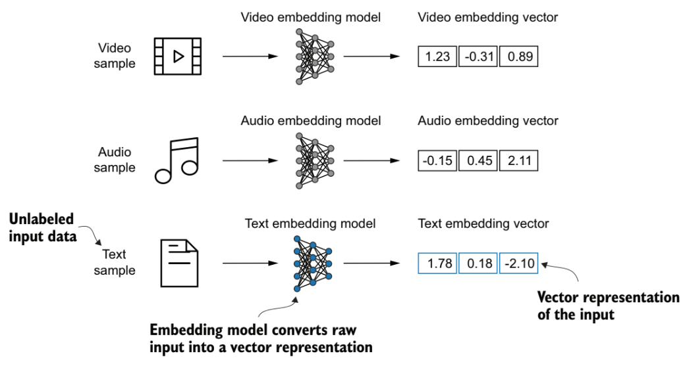
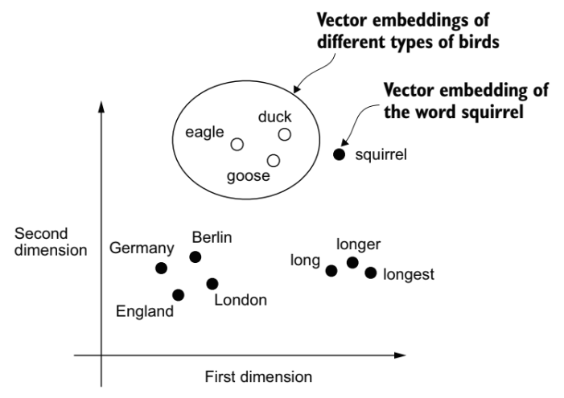
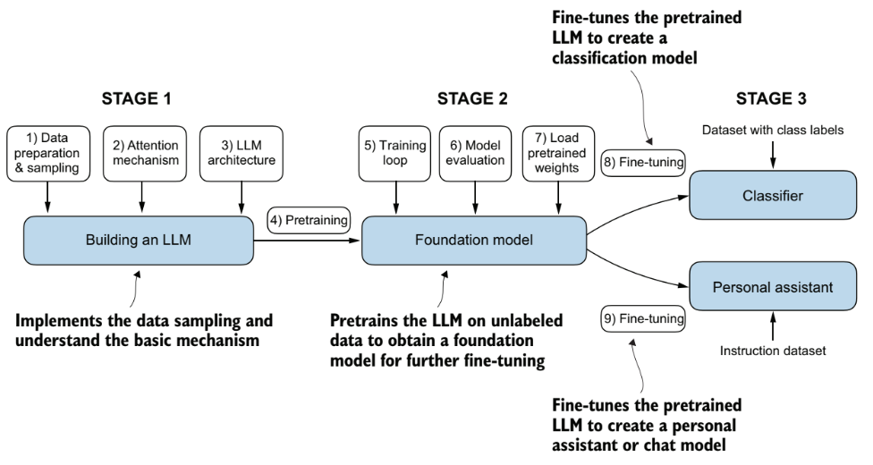
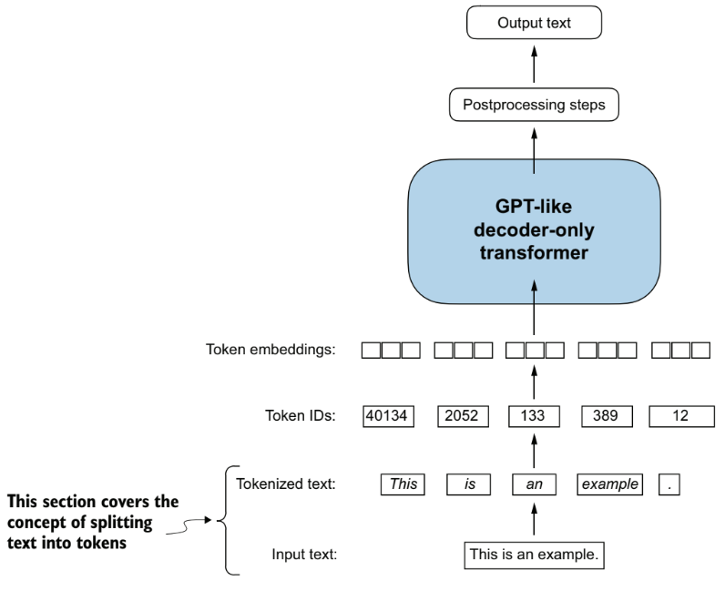

# Large Language Models

## Contents

 - **Fundamentals of Large Language Models:**
   - [What is an LLM?](#what-is-an-llm)
   - [Transformer Architecture](#transformer-architecture)
   - [Understanding word embeddings](#understanding-word-embeddings)
   - [Word2Vec Idea](#word2vec-idea)
 - [**Build a Large Language Model (Step by Step):**](#build-a-llm-sbs)
   - **STAGE 01:**
     - **Data Preparation & Sampling:**
       - [Tokenizing text](#tokenizing-text)


   - **STAGE 02:**
   - **STAGE 03:**
 - [**References**](#ref)
<!---
[WHITESPACE RULES]
- Same topic = "20" Whitespace character.
- Different topic = "100" Whitespace character.
--->


<!--- ( Fundamentals of Large Language Models ) --->

---

<div id="what-is-an-llm"></div>

## What is an LLM?

 - An ***LLM*** is a neural network designed to *understand*, *generate*, and *respond* to human like text.
 - These models are deep neural networks trained on massive amounts of text data, sometimes encompassing (abrangendo) large portions of the entire publicly available text on the internet.


---

<div id="transformer-architecture"></div>

## Transformer Architecture

Most modern LLMs rely on the **Transformer Architecture**, which is a deep neural network architecture introduced in the 2017 paper [“Attention Is All You Need”](https://arxiv.org/abs/1706.03762).

> **NOTE:**  
> To understand LLMs, it is interesting to understand the original transformer, which was developed for machine translation, translating texts from English to German and French.


---

<div id="understanding-word-embeddings"></div>

## Understanding word embeddings

 - Deep neural network models, including LLMs, cannot process raw text directly.
 - Since text is categorical, it isn’t compatible with the mathematical operations used to implement and train neural networks.
 - Therefore, we need a way to represent words as continuous-valued vectors.

> **NOTE:**  
> The concept of converting data into a vector format is often referred to as **embedding**.

Using a specific neural network layer or another pretrained neural network model, we can embed different data types — For example, video, audio, and text:

  

> **NOTE:**  
> However, it’s important to note that different data formats require distinct embedding models. For example, an embedding model designed for text would not be suitable for embedding audio or video data.


---

<div id="word2vec-idea"></div>

## Word2Vec Idea

> The main idea behind **Word2Vec** is that words that appear in similar contexts tend to have similar meanings.

Consequently, when projected into two-dimensional word embeddings for visualization purposes, similar terms are clustered together.

For example:

  


<!--- ( Build a Large Language Model (Step by Step) ) --->

---

<div id="build-a-llm-sbs"></div>

## Build a Large Language Model (Step by Step)

Here, we will implement a simple Large Language Model (LLM) by following the following steps (stages):




---

<div id="tokenizing-text"></div>

## Tokenizing text

Here, let’s discuss how we split input text into individual tokens, a required preprocessing step for creating embeddings for an LLM. These tokens are either individual words or special characters, including punctuation characters, as shown below:



Now, let's see how to implement this in practice. But, first, let's see how reading text:

<!--- ( TensorFlow ) --->
<details>

<summary>TensorFlow</summary>

</br>

[utils.py](../../algorithms/utils.py)
```python
def read_txt_line_by_line(file_path):
    txt = tf.data.TextLineDataset(file_path)
    return txt
```

Now if we need to print lane by lane we can use the **print_txt_line_by_line(txt)** function: 

[utils.py](../../algorithms/utils.py)
```python
import os
import sys

# Add the root directory 'aicodes' to sys.path
sys.path.append(os.path.abspath(os.path.join(os.path.dirname(__file__), "..")))
os.environ["TF_CPP_MIN_LOG_LEVEL"] = "3"  # Hide TensorFlow warnings

import tensorflow as tf


def read_txt_line_by_line(file_path):
    txt = tf.data.TextLineDataset(file_path)
    return txt


def print_txt_line_by_line(txt):
    for linha in txt:
        print(linha.numpy().decode('utf-8'))


if __name__ == "__main__":

    file_path = "datasets/the-verdict.txt"
    text = read_txt_line_by_line(file_path)
    print_txt_line_by_line(text)
```

**OUTPUT:**  
```bash
I HAD always thought Jack Gisburn rather a cheap genius--though a good fellow enough--so it was no great surprise to me to hear that, in the height of his glory, he had dropped his 
painting, married a rich widow, and established himself in a villa on the Riviera. (Though I rather thought it would have been Rome or Florence.)

.
.
.

He stood up and laid his hand on my shoulder with a laugh. "Only the irony of it is that I _am_ still painting--since Grindle's doing it for me! The Strouds stand alone, and happen 
once--but there's no exterminating our kind of art."
```

</details>

Ok, we know how to read and print text line by line. Now, Our goal is to tokenize this text into individual tokens:

<!--- ( TensorFlow ) --->
<details>

<summary>TensorFlow</summary>

</br>

**NOTE:**  
To do this first, we need to install `pip install tensorflow-text`:

[utils.py](../../algorithms/utils.py)
```python

```


**OUTPUT:**  
```bash

```

</details>


<!--- () ->
<details>

<summary>Title here...</summary>

</br>

[](../../examples/)
```python

```

**OUTPUT:**  
```bash

```

</details>


<!--- ( References ) --->

---

<div id="ref"></div>

## References

 - **A.I used:**
   - [ChatGPT](https://chatgpt.com/)
   - [Grok](https://grok.com/)
   - [Claude3](https://claude.ai/)
 - **General:**
   - [Neural Networks from Scratch in Python Book](https://nnfs.io/)

---

**Rodrigo** **L**eite da **S**ilva - **rodrigols89**

<!---


<!--- () ->
<details>

<summary>Title here...</summary>

</br>

[](../../examples/)
```python

```

**OUTPUT:**  
```bash

```

</details>


--->
