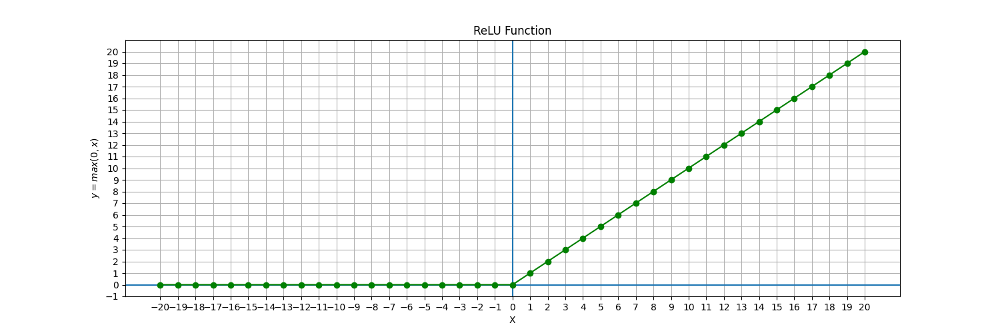

# Artificial Neural Networks & Deep Learning

## Contents

 - **Fundamentals of Artificial Neural Networks:**
   - [Artificial Neural Networks Inspiration](#ann-inspiration)
   - [The First Artificial Neuron (Perceptron)](#intro-to-perceptron)
 - **Neurons:**
   - [Neuron calculation (y = mx + b))](#neuron-calculation)
 - **Layers:**
     - [Dense Neural Networks](#dense-neural-networks)
     - [How to implement a Dense Layer](#impl-dense-layer)
     - [How to count the parameters of an Artificial Neural Network](#counting-ann-parameters)
 - [**Activation Functions**](#activation-functions)
   - [Sigmoid Function](#sigmoid-function)
   - [Rectified Linear Unit (ReLU) Function](#relu-function)
   - [Softmax Function](#softmax-function)
 - **Implementations:**
 - [**Project Settings**](#settings)
 - [**References**](#ref)
<!---
[WHITESPACE RULES]
- Same topic = "20" Whitespace character.
- Different topic = "100" Whitespace character.
--->


<!--- ( Fundamentals of Artificial Neural Networks ) --->

---

<div id="ann-inspiration"></div>

## Artificial Neural Networks Inspiration

> Artificial Neural Networks are inspired by the organic brain, translated to the computer.

  

> **NOTE:**  
> A single neuron by itself is relatively useless, but, when combined with hundreds or thousands (or many more) of other neurons, the interconnectivity produces relationships and results that frequently outperform any other machine learning methods.


---

<div id="intro-to-perceptron"></div>

## The First Artificial Neuron (Perceptron)

The first **Artificial Neuron** created was the **[Perceptron](https://en.wikipedia.org/wiki/Perceptron)** in 1958 by [Frank Rosenblatt](https://en.wikipedia.org/wiki/Frank_Rosenblatt):


 - The **[Perceptron](https://en.wikipedia.org/wiki/Perceptron)** had the main idea of receiving different inputs (or signals) and outputting the signal (result) **1** or **0**.
 - This signal (result) basically indicates whether the neuron will be *active* or *not* to proceed to another neuron.
 - **NOTE:** Over time, scientists discovered that there were other possibilities for neurons; Not only *active* or *not*, but we won't delve into details for now.

> **NOTE:**  
> The idea of the **[Perceptron](https://en.wikipedia.org/wiki/Perceptron)** was a single *neuron* that received **x<sub>i</sub>** inputs; Multiplied these inputs by their respective weights; Then passed through a *Non-Linear Activation Function* and received an *output*.


<!--- ( Neurons ) --->

---

<div id="neuron-calculation"></div>

## Neuron calculation (y = mx + b)

> Here, let's see how neurons are calculated.

The most important components to calculate a neuron are:

 - **Inputs**
 - **Weights**
 - **Bias**

> **NOTE:**  
> Initially, let's pay attention to the **"weight"** and **"bias"** components that *we can use to fit our model to the data (podemos usar para ajustar nosso modelo aos dados.)*.

To understand more easily, let's take a look at the image below:

  

See that:

 - **Each neuron has a specific output:**
   - Calculated by: `output = input * weight + bias`
 - **The "slope of the line formula" can represent that calculation:**
   - `y = mx + b`
 - **weight:**
   - The weight *moves* the *"line slope"* up or down.
 - **bias:**
   - The bias *moves* the *"line intercept"* up or down.

Now let's program this for a single neuron:

  

<!--- ( Numpy ) --->
<details>

<summary>Numpy</summary>

</br>

[neuron_np_calc-01.py](src/neurons/neuron_np_calc-01.py)
```python
import numpy as np

inputs = [1.0, 2.0, 3.0, 2.5]
weights = [0.2, 0.8, -0.5, 1.0]
bias = 2.0

outputs = np.dot(weights, inputs) + bias

print(outputs)
```

**OUTPUT:**  
```bash
4.8
```

**Code Explanation:**

 - **Why don't we need to transpose the weight matrix?**
   - No, in this case, we don't need to transpose the weights matrix, since (como) both `inputs` and `weights` are *one-dimensional* vectors with the same size (4 elements each) the **np.dot()** method simply calculates the dot product between them, which is a scalar number.

</details>


<!--- ( TensorFlow ) --->
<details>

<summary>TensorFlow</summary>

</br>

[neuron_tf_calc-01.py](src/neurons/neuron_tf_calc-01.py)
```python
import os
os.environ['TF_CPP_MIN_LOG_LEVEL'] = '3'

import tensorflow as tf

inputs = tf.constant([1.0, 2.0, 3.0, 2.5])
weights = tf.constant([0.2, 0.8, -0.5, 1.0])
bias = tf.constant(2.0)

# Calculate the "Dot Product" and "add" the bias.
outputs = tf.tensordot(weights, inputs, axes=1) + bias

print(outputs)
print(outputs.numpy())
```

**OUTPUT:**  
```bash
tf.Tensor(4.8, shape=(), dtype=float32)
4.8
```

**Code Explanation:**

 - **Why don't we need to transpose the weight matrix?**
   - No, in this case, we don't need to transpose the weights matrix, since (como) both `inputs` and `weights` are *one-dimensional* vectors with the same size (4 elements each) the **tf.tensordot()** method simply calculates the dot product between them, which is a scalar number.
 - **The main difference here is that in TensorFlow you work with tensors instead of NumPy arrays:**
   - `print(outputs)`
     - Show the *tensor structure*.
   - `print(outputs.numpy())`
     - Show the *tensor value*.

</details>


<!--- ( Layers ) --->

---

<div id="dense-neural-networks"></div>

## Dense Neural Networks

> **What is a Dense Neural Network?**

 - The name suggests that the **"layers"** are fully connected (dense) by neurons in a network layer.
 - Each *neuron* in the current **"layer"** `receives output from all neurons present in the previous layer` - hence they are densely connected.

**NOTE:**  
In other words, *the dense layer is a fully connected layer*, meaning all neurons in one layer are connected to those in the next layer.

  

> **Why use a Dense Neural Network?**

 - A densely (desamente) connected layer provides learning features of all combinations of the features from the previous layer.
 - While a convolutional layer relies (depende) on consistent features with a small repetitive field.


---

<div id="impl-dense-layer"></div>

## How to implement a Dense Layer

Here, let's implement the following Dense Neural Network:

  

To start, let's prepare the *input layer*:

<details>

<summary>TensorFlow</summary>

</br>

[dense_layer-v1.py](src/layer/dense_layer-v1.py)
```python
import os
import tensorflow as tf

os.environ["TF_CPP_MIN_LOG_LEVEL"] = "3"  # Hide TensorFlow warnings


# Input size.
n_inputs = 5

# Tensor of input.
inputs = tf.keras.Input(shape=(n_inputs,), name="input_layer")
```

</details>

</br>

Continuing, let's create the hidden layers:

<details>

<summary>TensorFlow</summary>

</br>

[dense_layer-v1.py](src/layer/dense_layer-v1.py)
```python
# Hidden layers.
hidden1 = tf.keras.layers.Dense(4, name="hidden_layer_1")(inputs)
hidden2 = tf.keras.layers.Dense(4, name="hidden_layer_2")(hidden1)
hidden3 = tf.keras.layers.Dense(4, name="hidden_layer_3")(hidden2)
```

**Code Explanation:**

 - **Here we:**
   - Pass the number of neurons in the hidden layer: `Dense(3)`.
   - Connect with the previous layer.

</details>

</br>

Continuing, let's connect the *last hidden layer* with the *output layer*:

<details>

<summary>TensorFlow</summary>

</br>

[dense_layer-v1.py](src/layer/dense_layer-v1.py)
```python
# Output layer.
output = tf.keras.layers.Dense(1, name="output_layer")(hidden3)
```

</details>

</br>

Now, let's make the model (connect the layers):

<details>

<summary>TensorFlow</summary>

</br>

[dense_layer-v1.py](src/layer/dense_layer-v1.py)
```python
# Make the model (connect the layers).
model = tf.keras.Model(inputs=inputs, outputs=output)
model.summary()  # Visualize the model architecture.
```

**OUTPUT:**
```bash
Model: "functional"
┏━━━━━━━━━━━━━━━━━━━━━━━━━━━━━━━━━━━━━━┳━━━━━━━━━━━━━━━━━━━━━━━━━━━━━┳━━━━━━━━━━━━━━━━━┓
┃ Layer (type)                         ┃ Output Shape                ┃         Param # ┃
┡━━━━━━━━━━━━━━━━━━━━━━━━━━━━━━━━━━━━━━╇━━━━━━━━━━━━━━━━━━━━━━━━━━━━━╇━━━━━━━━━━━━━━━━━┩
│ input_layer (InputLayer)             │ (None, 5)                   │               0 │
├──────────────────────────────────────┼─────────────────────────────┼─────────────────┤
│ hidden_layer_1 (Dense)               │ (None, 4)                   │              24 │
├──────────────────────────────────────┼─────────────────────────────┼─────────────────┤
│ hidden_layer_2 (Dense)               │ (None, 4)                   │              20 │
├──────────────────────────────────────┼─────────────────────────────┼─────────────────┤
│ hidden_layer_3 (Dense)               │ (None, 4)                   │              20 │
├──────────────────────────────────────┼─────────────────────────────┼─────────────────┤
│ output_layer (Dense)                 │ (None, 1)                   │               5 │
└──────────────────────────────────────┴─────────────────────────────┴─────────────────┘
 Total params: 69 (276.00 B)
 Trainable params: 69 (276.00 B)
 Non-trainable params: 0 (0.00 B)
```

**Code Explanation:**

 - 📌 **Why do we need this?**
   - **Defines the complete architecture:**
     - Tells TensorFlow how data flows from input to output.
   - **Creates a trainable model:**
     - Without this line, you would just have disconnected layers.
     - TensorFlow wouldn't know how to train or infer.
   - `.fit()`, `.predict()`, `.evaluate()`:
     - These functions only work with a built Model.
   - `.summary()`
     - Shows the layers and their parameters with this structure.

</details>

</br>

In the first part we defined the size of the input neurons, now we will create values ​​that will be passed as input to the model:

<details>

<summary>TensorFlow</summary>

</br>

[dense_layer-v1.py](src/layer/dense_layer-v1.py)
```python
# Make random input (tensor) data (one sample with 5 features).
input_data = tf.random.normal((1, n_inputs))
```

</details>

</br>

Continuing, let's apply the **forward pass**:

<details>

<summary>TensorFlow</summary>

</br>

[dense_layer-v1.py](src/layer/dense_layer-v1.py)
```python
result = model(input_data)  # Apply forward pass.

print("Tensor:", result)
print("Tensor value:", result.numpy())
```

**OUTPUT:**
```bash
Tensor: tf.Tensor([[1.5610214]], shape=(1, 1), dtype=float32)
Tensor value: [[1.5610214]]
```

</details>


---

<div id="counting-ann-parameters"></div>

## Parameter counting of an Artificial Neural Network

Depending on how many layers and how many neurons there are in each layer, the number of parameters of our Artificial Neural Network can change in size.

Here, let's see how to count the parameters of an *Artificial Neural Network (Densely)*.

  

To understand the count above, let's imagine we have the following Artificial Neural Network (Densely):

```bash
10, 8, 8, 8, 2
```

 - **Input Layer to First Hidden Layer:**
   - **Weights:** Each of the 10 input neurons connects to each of the 8 neurons in the first hidden layer. That’s `10 × 8 = 80 weights`.
   - **Biases:** Each neuron in the first hidden layer has one bias. So, `8 biases`.
   - **Total for this layer:** `80 + 8 = 88 parameters`.
 - **First Hidden Layer to Second Hidden Layer:**
   - **Weights:** Each of the 8 neurons in the first hidden layer connects to each of the 8 neurons in the second hidden layer. That’s `8 × 8 = 64 weights`.
   - **Biases:** There are 8 biases for the 8 neurons in the second hidden layer.
   - **Total for this layer:** `64 + 8 = 72 parameters`.
 - **Second Hidden Layer to Third Hidden Layer:**
   - **Weights:** Similarly, `8 × 8 = 64 weights`.
   - **Biases:** `8 biases`.
   - **Total for this layer:** `64 + 8 = 72 parameters`.
 - **Third Hidden Layer to Output Layer:**
   - **Weights:** Each of the 8 neurons in the third hidden layer connects to each of the 2 output neurons. That’s `8 × 2 = 16 weights`.
   - **Biases:** There are `2 biases` for the `2 output neurons`.
   - **Total for this layer:** `16 + 2 = 18 parameters`.

Now, add all the parameters together:

```bash
(10 x 8 + 8) + (8 x 8 + 8) + (8 x 8 + 8) + (8 x 2 + 2)
      |             |             |             |
      |             |             |             |
      88     +      72     +      72     +      18    =   250
```

Thus, the network has a total of `250 parameters`.


<!--- (Activation Functions) --->

---

<div id="activation-functions"></div>

## Activation Functions

> An **Activation Function** in the context of *Artificial Neural Networks* is used to modify the output of a neuron (or layer of neurons).

In general, *activation functions* are used in:

 - *Hidden layers*.
 - *Output layer*.

The choice of *activation function* depends on the type of problem and the layer in question. In general terms:

 - **Hidden layers:**
   - Functions like *ReLU*, *tanh* or *sigmoid* are often (frequentemente) used to introduce non-linearity, regardless of whether the problem is regression or classification.
 - **Output layer:**
   - **Regression problems:**
     - Typically linear activation (or no activation) is used to allow the output to be a continuous value and not limited to a specific range.
   - **Classification problems:**
     - **Binary classification (two classes, like "yes" or "no"):** The sigmoid function is commonly used, as it maps the output to the interval (0, 1), interpretable as a probability.
     - **Multi-class classification (more than two classes):** The softmax function is often used, as it maps the output to the interval (0, 1) and interpretable as a probability distribution.

### Applying non-linearity

Here, the purpose of **Activation Functions** is to introduce **"nonlinearities"** into an *Artificial Neural Network* (within the context of Neural Networks, of course).

For example, let's look at the example below to make it clearer:


Now suppose I ask you to separate these red points from the green ones using a Linear Function, could you do that? **NO!**

You might achieve something similar to this, but it wouldn't solve the problem:


> **NOTE:**  
> No matter (não importa) how many *Linear Functions* you use, it will always generate a line.

On the other hand, with **Non-Linear Functions**, you can solve the problem of separating the red points from the green ones.

Something like this:


That's:

 - *Activation Functions* are a crucial component of *Artificial Neural Networks* **used to introduce nonlinearity into the outputs of network layers**:
   - They are applied to the linear combination of inputs to a layer to produce the output of that layer.
 - Without *Activation Functions*, *Artificial Neural Networks* would be limited to performing linear calculations, which would make them incapable of handling (lidar) most real-world problems.


---

<div id="sigmoid-function"></div>

## Sigmoid Function

The **Sigmoid Activation Function**, also known as the *"logistic function"*, is widely (amplamente) used in *Artificial Neural Networks*, especially in binary classification problems.


 - **Advantages:**
   - It transforms the weighted sum of a neuron's inputs into an output value that varies continuously between **0** and **1**.
   - This feature allows the *Sigmoid Function* to capture subtle variations in neuron activations, which is essential for learning complex patterns in data:
     - For this reason, it is considered *“granular”*, as it provides a continuous and smooth output, allowing the neural network to adjust its weights more precisely during training.
 - **Disadvantages:** However, the *Sigmoid Function* has some limitations.
   - For *very high* or *very low input values*, the function tends to saturate, i.e., the derivative approaches zero (a derivada aproxima-se de zero).

Now, let's test the **Sigmoid Function** for some **x<sub>i</sub>** input values to understand how it works:

<!--- ( TensorFlow ) --->
<details>

<summary>TensorFlow</summary>

</br>

> **NOTE:**  
> The TensorFlow already has a **Sigmoid Function** built-in.

[sigmoid-v01.py](src/activation_functions/sigmoid-v01.py)
```python
import os
import sys

# Add the root directory 'aicodes' to sys.path
sys.path.append(os.path.abspath(os.path.join(os.path.dirname(__file__), "..")))
os.environ["TF_CPP_MIN_LOG_LEVEL"] = "3"  # Hide TensorFlow warnings

from matplotlib import pyplot as plt

import pandas as pd
import tensorflow as tf


def sigmoid(x):
    x = tf.convert_to_tensor(x, dtype=tf.float32)
    return tf.nn.sigmoid(x)


if __name__ == "__main__":

    # Sigmoid Function.
    df_sigmoid = pd.DataFrame({"x": range(-20, 20 + 1)})
    df_sigmoid["y"] = sigmoid(df_sigmoid["x"])
    print(df_sigmoid)

    plt.figure(figsize=(15, 5))  # Width, height.
    plt.title("Sigmoid Function")
    plt.xlabel("X")
    plt.ylabel(r"$y = \frac{1}{1 + e^{-x}}$")
    plt.xticks(range(-20, 20 + 1, 1))
    plt.yticks(range(-20, 20 + 1, 1))
    plt.axhline()
    plt.axvline()
    plt.grid()
    plt.plot(df_sigmoid.x, df_sigmoid.y, color="green", marker="o")
    plt.savefig("docs/ann-dp/images/sigmoide-plot-01.png")
    plt.show()
```

**Code Explanation:**

 - `x = tf.convert_to_tensor(x, dtype=tf.float32)`
   - Converts the input `x` to a TensorFlow tensor with the specified data type (in this case, `tf.float32`).
   - **NOTE:** This is because TensorFlow expects to receive *floating point (tensor)* values.
 - `tf.nn.sigmoid(x)`
   - Applies the *Sigmoid Activation Function* to the input tensor `x`.

</details>

</br>

  

> **But what did you notice about this function?**  

 - **1st -** If you pay attention to this function for negative values, it converges very quickly to zero (0);
 - **2nd -** The same happens for positive values, it converges very quickly to 1.

> **NOTE:**  
> Another interesting thing to note is that if you pay attention to our graph, this conversion to **0** or **1** always happens after **-5** or **5**:

  

Now, let's code the **Sigmoid Function** in the output of our layer:

<!--- ( TensorFlow ) --->
<details>

<summary>TensorFlow</summary>

</br>

To start, let's add the **activation** attribute to the **Layer** class:

[dense_layer_w_sigmoid.py](src/layer/dense_layer_w_sigmoid.py)
```python
# Hidden layers.
hidden1 = tf.keras.layers.Dense(4, activation='sigmoid', name="hidden_layer_1")(inputs)
hidden2 = tf.keras.layers.Dense(4, activation='sigmoid', name="hidden_layer_2")(hidden1)
hidden3 = tf.keras.layers.Dense(4, activation='sigmoid', name="hidden_layer_3")(hidden2)

# Output layer.
output = tf.keras.layers.Dense(1, activation='sigmoid', name="output_layer")(hidden3)
```

> **NOTE:**  
> See that we can define the Activation Function of the output layer as **"sigmoid"**.

Finally, let's see in the practice:

[layers.py](../../models/layers.py)
```python


if __name__ == "__main__":

    X, y = spiral_data(samples=100, classes=3)

    # Create Dense Layer with 2 input features and 3 output values.
    tf_layer = LayerDense(2, 3, activation="sigmoid")
    tf_layer.forward(X)
    print("\n---------- ( TensorFlow ) ----------")
    print("Weights:\n", tf_layer.layer.get_weights()[0])
    print("\nBiases:\n", tf_layer.layer.get_weights()[1])
    print("\nLayer Output (0-5):\n", tf_layer.output.numpy()[:5])
```

**OUTPUT:**  
```bash
---------- ( TensorFlow ) ----------
Weights:
 [[-1.0946416   0.6602075  -0.03609169]
 [-0.25376886 -0.8344916  -0.6310997 ]]

Biases:
 [0. 0. 0.]

Layer Output (0-5):
 [[0.5        0.5        0.5       ]   
 [0.5015264  0.49733442 0.49894997]    
 [0.49868715 0.49580443 0.4968117 ]    
 [0.49553132 0.49560523 0.49538186]    
 [0.49553478 0.49287346 0.49366063]    
 [0.49319607 0.4920952  0.49220335]    
 [0.50931907 0.48403588 0.4937821 ]    
 [0.48171744 0.5007704  0.49292684]    
 [0.47877368 0.5017338  0.4923159 ]    
 [0.48163885 0.5226069  0.506673  ]    
 [0.4826308  0.4878276  0.4851456 ]    
 [0.4733398  0.49693647 0.48704207]    
 [0.4674711  0.5216571  0.5002022 ]    
 [0.4637881  0.5089449  0.49064985]    
 [0.46305227 0.50263    0.48636368]    
 [0.46030504 0.503132   0.48553875]    
 [0.45658308 0.5286349  0.50008726]    
 [0.45238444 0.5251056  0.4961056 ]    
 [0.4533883  0.50129855 0.48150688]    
 [0.44686136 0.5282685  0.49579975]    
 [0.44432953 0.5309535  0.49643987]    
 [0.44715554 0.54459196 0.5062715 ]    
 [0.46458417 0.55806935 0.52210766]    
 [0.4435376  0.550436   0.50847644]    
 [0.44538543 0.5565227  0.51313007]    
 [0.4340395  0.5481928  0.50306344]    
 [0.5254694  0.5488026  0.5413136 ]    
 [0.53153294 0.5468491  0.54257566]    
 [0.4920682  0.57042116 0.54133075]    
 [0.5078753  0.5665443  0.5453425 ]    
 [0.4923575  0.575107   0.544446  ]    
 [0.47191274 0.5819902  0.5404637 ]    
 [0.5288498  0.56169957 0.5508663 ]
 [0.5313145  0.56252426 0.5524003 ]
 [0.56050634 0.5394428  0.5498874 ]
 [0.5883943  0.5010032  0.53748286]
 [0.57956153 0.52163696 0.5466803 ]
 [0.5655272  0.5431933  0.55432844]
 [0.5990171  0.4931905  0.5371085 ]
 [0.6074019  0.44026843 0.50724375]
 [0.60775924 0.48136303 0.533438  ]
 [0.5550933  0.5648723  0.5636547 ]
 [0.6060849  0.50006115 0.54444146]
 [0.5991113  0.5186596  0.5530827 ]
 [0.5947276  0.5296253  0.5580691 ]
 [0.6234273  0.43185928 0.50884914]
 [0.6165741  0.40667742 0.4895377 ]
 [0.6199167  0.4960519  0.54790825]
 [0.62467295 0.4081815  0.49407268]
 [0.633474   0.42390314 0.50817144]
 [0.61607426 0.3869971  0.47637135]
 [0.6364757  0.47464916 0.5417743 ]
 [0.6284538  0.39112732 0.4845402 ]
 [0.6224639  0.38020656 0.4746482 ]
 [0.6479585  0.42622438 0.5161658 ]
 [0.6386225  0.3894765  0.48796967]
 [0.42704    0.41009942 0.41320416]
 [0.575959   0.35164076 0.43554533]
 [0.50543517 0.3607512  0.41295183]
 [0.5375236  0.34988615 0.41860002]
 [0.5385213  0.34743282 0.41734636]
 [0.41828564 0.40426323 0.40593165]
 [0.5319544  0.3442915  0.41257212]
 [0.44283843 0.38063732 0.40085348]
 [0.607746   0.33773115 0.4393771 ]
 [0.4693848  0.36049005 0.39839634]
 [0.4762354  0.3548773  0.39742687]
 [0.32012868 0.59740674 0.4844023 ]
 [0.33682445 0.4893938  0.42390713]
 [0.404986   0.3945221  0.39433774]
 [0.34656188 0.46179065 0.41128126]
 [0.30910674 0.57014793 0.4615013 ]
 [0.3132267  0.62526643 0.49959207]
 [0.36872056 0.4201578  0.3952348 ]
 [0.32826987 0.47847158 0.41331866]
 [0.3422288  0.44947645 0.40181422]
 [0.29691207 0.59283334 0.47019204]
 [0.29662973 0.61429036 0.4841618 ]
 [0.31834033 0.6670414  0.5308274 ]
 [0.32804096 0.6794138  0.5442002 ]
 [0.34729776 0.6930413  0.5628582 ]
 [0.29921445 0.51164806 0.42010432]
 [0.3233049  0.6864772  0.54709023]
 [0.35597795 0.7040604  0.5748108 ]
 [0.48293912 0.69884425 0.6230729 ]
 [0.36595285 0.7112058  0.5844722 ]
 [0.41538018 0.71526647 0.6081596 ]
 [0.43934095 0.7146161  0.617286  ]
 [0.5041479  0.7002122  0.63222843]
 [0.5273821  0.69325566 0.6363328 ]
 [0.37130395 0.7236211  0.59611017]
 [0.26969948 0.65402716 0.49746194]
 [0.5182271  0.70314336 0.6396643 ]
 [0.6866728  0.5712768  0.6237022 ]
 [0.52366644 0.7050582  0.6430694 ]
 [0.4811128  0.72141206 0.63847446]
 [0.5070622  0.7152734  0.64394563]
 [0.71261054 0.5412784  0.6176692 ]
 [0.71129555 0.5480435  0.62109977]
 [0.75436366 0.40085217 0.55237794]
 [0.5        0.5        0.5       ]
 [0.5027746  0.499386   0.5007596 ]
 [0.50545394 0.49913546 0.50170904]
 [0.5070434  0.50124216 0.5036944 ]
 [0.5082418  0.5033453  0.5055159 ]
 [0.51269954 0.48945054 0.49859646]
 [0.51417786 0.5023266  0.5073278 ]
 [0.51825565 0.49929476 0.5071031 ]
 [0.518728   0.5033903  0.5098804 ]
 [0.5081099  0.4760041  0.48821113]
 [0.5281834  0.49117935 0.5060973 ]
 [0.53033614 0.4938664  0.5086844 ]
 [0.53040063 0.47463754 0.49657303]
 [0.5313642  0.4707584  0.4945195 ]
 [0.5259062  0.463804   0.48785424]
 [0.5376696  0.46792445 0.4953441 ]
 [0.5347339  0.46102747 0.4897545 ]
 [0.5217226  0.45446196 0.48019844]
 [0.53743285 0.45525834 0.48721352]
 [0.53698474 0.45162863 0.48472035]
 [0.4976735  0.45253804 0.4690588 ]
 [0.53050965 0.44407076 0.47722456]
 [0.46733838 0.46775725 0.46617356]
 [0.528388   0.43851307 0.47280207]
 [0.5032624  0.44072184 0.4638549 ]
 [0.45679426 0.46946582 0.46288863]
 [0.4898208  0.44182464 0.459033  ]
 [0.4648977  0.45606315 0.45779163]
 [0.44196174 0.47739407 0.46171486]
 [0.49484515 0.43219277 0.45496848]
 [0.4280274  0.4910994  0.46449277]
 [0.4411423  0.46821442 0.45560777]
 [0.42083427 0.49527353 0.4640851 ]
 [0.41865563 0.49461526 0.4627529 ]
 [0.4260249  0.47771174 0.4552565 ]
 [0.40230635 0.5470226  0.48883942]
 [0.4400894  0.45383427 0.446135  ]
 [0.41546813 0.58601725 0.5195009 ]
 [0.412342   0.4831988  0.45293447]
 [0.4492918  0.6032212  0.5448879 ]
 [0.40993452 0.4788491  0.44919628]
 [0.43214095 0.60661346 0.5399712 ]
 [0.41050178 0.6015918  0.5275466 ]
 [0.39663675 0.59467167 0.5170771 ]
 [0.37771592 0.54769486 0.47859573]
 [0.4364731  0.6182274  0.5494305 ]
 [0.3890891  0.60050243 0.51762927]
 [0.37608448 0.5863658  0.50271004]
 [0.51446235 0.6083512  0.5748377 ]
 [0.45051694 0.6283456  0.56194603]
 [0.40911874 0.6268939  0.5437104 ]
 [0.5105733  0.61707497 0.5789262 ]
 [0.46439913 0.63368326 0.571173  ]
 [0.42746502 0.6384     0.5591409 ]
 [0.48631498 0.6329291  0.5795473 ]
 [0.5148959  0.62431496 0.5853826 ]
 [0.5811398  0.5827089  0.5856206 ]
 [0.46790546 0.6444822  0.5798083 ]
 [0.5390733  0.61870635 0.5914514 ]
 [0.607093   0.5645762  0.58507115]
 [0.59293693 0.58269906 0.59048665]
 [0.57687265 0.5998003  0.59465814]
 [0.66457754 0.46649277 0.5493267 ]
 [0.6672528  0.4649695  0.54960144]
 [0.5386772  0.63294375 0.600525  ]
 [0.66939825 0.47486734 0.55678344]
 [0.6754014  0.45933062 0.54983866]
 [0.6706751  0.48566306 0.56409013]
 [0.6744073  0.3743322  0.49425992]
 [0.6863586  0.4203855  0.53024626]
 [0.5970022  0.3207758  0.42295593]
 [0.6906961  0.43268993 0.54021657]
 [0.67490464 0.3522175  0.47942966]
 [0.6956358  0.4053288  0.5249592 ]
 [0.64349234 0.32075584 0.44298497]
 [0.66996473 0.33378375 0.46426407]
 [0.6977715  0.3732699  0.5047568 ]
 [0.64869183 0.31405127 0.4404903 ]
 [0.6748694  0.32651728 0.46140057]
 [0.6093481  0.3001516  0.4133582 ]
 [0.611396   0.29795918 0.41262218]
 [0.42626512 0.34872225 0.37362552]
 [0.4470921  0.33406752 0.37219745]
 [0.54940933 0.29552072 0.38559836]
 [0.46438232 0.32096824 0.37016797]
 [0.46930897 0.31658345 0.36910734]
 [0.56249547 0.287159   0.3847385 ]
 [0.3830696  0.366414   0.36765742]
 [0.48460612 0.30394363 0.36633953]
 [0.49296117 0.29877713 0.36595553]
 [0.40099597 0.34482497 0.3610954 ]
 [0.27658516 0.51648587 0.411984  ]
 [0.260756   0.58999735 0.44987738]
 [0.25819033 0.601232   0.45579824]
 [0.40655878 0.33157146 0.3547084 ]
 [0.35867465 0.3676125  0.35841507]
 [0.28272325 0.4730295  0.38867876]
 [0.2796085  0.47535396 0.38856226]
 [0.25270876 0.556262   0.42419264]
 [0.24997404 0.56048185 0.42536166]
 [0.5        0.5        0.5       ]
 [0.49754244 0.49978012 0.49884564]
 [0.49574995 0.49850005 0.49729764]
 [0.4935614  0.4978383  0.49597573]
 [0.49011537 0.50877357 0.5014473 ]
 [0.48625755 0.50856924 0.49972308]
 [0.4882975  0.5153167  0.5048239 ]
 [0.4812262  0.5131292  0.5005183 ]
 [0.48243707 0.5194059  0.5049814 ]
 [0.48171532 0.52264345 0.50672776]
 [0.47981453 0.5252156  0.50756645]
 [0.47871622 0.52812445 0.50895095]
 [0.4828408  0.532079   0.51315874]
 [0.48854294 0.53460085 0.5171111 ]
 [0.46047205 0.51343685 0.49210495]
 [0.46516454 0.5349314  0.507642  ]
 [0.47640854 0.5426506  0.5171961 ]
 [0.47125852 0.5446716  0.516347  ]
 [0.4985087  0.54419786 0.5273    ]
 [0.50694233 0.54285896 0.52992636]
 [0.5354782  0.52348393 0.52947295]
 [0.5204747  0.5395348  0.5333992 ]
 [0.55243766 0.50744396 0.52642196]
 [0.5283864  0.5387243  0.5361494 ]
 [0.48608115 0.5623805  0.5337369 ]
 [0.54321164 0.5305279  0.53710973]
 [0.5062623  0.56010944 0.5405872 ]
 [0.5725028  0.49031594 0.5240517 ]
 [0.5630284  0.43371576 0.4841486 ]
 [0.5815488  0.46755728 0.5135175 ]
 [0.57860285 0.49451524 0.5292655 ]
 [0.5828576  0.44305652 0.49849916]
 [0.5821387  0.43508917 0.4930942 ]
 [0.5916802  0.47365388 0.5216819 ]
 [0.57805645 0.42104375 0.48232484]
 [0.5976678  0.46739447 0.52029014]
 [0.60038793 0.4664219  0.52084327]
 [0.51795375 0.40532658 0.44719213]
 [0.606137   0.453672   0.51524055]
 [0.59314096 0.41309106 0.48358968]
 [0.59939533 0.5040107  0.5440485 ]
 [0.58279544 0.39832324 0.46955234]
 [0.5962568  0.40309072 0.478406  ]
 [0.4861085  0.40308094 0.43276793]
 [0.51704514 0.38908416 0.43627155]
 [0.6060577  0.3990885  0.48000038]
 [0.46712056 0.4063069  0.4271261 ]
 [0.5096636  0.38434047 0.43017614]
 [0.4786664  0.39505205 0.4245804 ]
 [0.5636648  0.37137952 0.4437255 ]
 [0.41572458 0.43755764 0.4258039 ]
 [0.5494704  0.36682352 0.43483156]
 [0.44854245 0.40377292 0.41796   ]
 [0.35886195 0.52476114 0.45578322]
 [0.48673114 0.3772373  0.41628367]
 [0.36340412 0.49793693 0.44104928]
 [0.3487306  0.5379274  0.45951295]
 [0.41295737 0.42005685 0.4136815 ]
 [0.4382279  0.39616486 0.4089233 ]
 [0.33890465 0.57652444 0.47961006]
 [0.38270915 0.44477785 0.4164312 ]
 [0.35112655 0.49367785 0.43296894]
 [0.3496344  0.49179474 0.4311383 ]
 [0.37806278 0.44075847 0.41196167]
 [0.33957735 0.50480914 0.4346795 ]
 [0.3339909  0.51402944 0.43785915]
 [0.36963952 0.66060466 0.54967606]
 [0.32119605 0.5465424  0.45226493]
 [0.35547483 0.6596227  0.542713  ]
 [0.34532154 0.6560397  0.53563815]
 [0.36978564 0.672624   0.5581674 ]
 [0.3123399  0.61275923 0.4908057 ]
 [0.3777447  0.68047774 0.5671946 ]
 [0.31251732 0.6311755  0.5032396 ]
 [0.3664098  0.68283224 0.5639488 ]
 [0.3897578  0.69017994 0.579271  ]
 [0.34208202 0.67834914 0.5498917 ]
 [0.3457165  0.6834319  0.55518484]
 [0.37041706 0.6945541  0.5741494 ]
 [0.482673   0.68856966 0.6157804 ]
 [0.67096937 0.5482236  0.60264975]
 [0.6589982  0.5701333  0.61072636]
 [0.63899213 0.59825724 0.6194213 ]
 [0.5976651  0.6391781  0.6281124 ]
 [0.59393466 0.644436   0.6299839 ]
 [0.66991466 0.5682896  0.6144039 ]
 [0.44749177 0.7112138  0.618034  ]
 [0.67896736 0.56163806 0.6143979 ]
 [0.62242764 0.63136554 0.63318306]
 [0.69019264 0.5505295  0.6127641 ]
 [0.73375875 0.42488545 0.5567738 ]
 [0.7247937  0.47895205 0.5859138 ]
 [0.6252605  0.639235   0.6392948 ]
 [0.74048734 0.4207075  0.5576512 ]
 [0.6948642  0.56176513 0.6216876 ]
 [0.71191216 0.29559255 0.45668828]
 [0.66175437 0.26766592 0.41161045]
 [0.75000477 0.37615556 0.53371096]
 [0.7460363  0.3380087  0.50537264]
 [0.73419774 0.3053347  0.47541052]]
```

</details>


---

<div id="relu-function"></div>

## Rectified Linear Unit (ReLU) Function

The **Rectified Linear Unit (ReLU) Activation Function** have as output a value between **"0"** and the **"maximum input value"**.

For example, see the image below to understand more easily:

  

See that:

 - **The ReLu receives as input "x".**
 - **Return:**
   - **"0" if "x" is less than "0":**
     - This is because.. What's the maximum value between "-x" and "0"? It's "0".
     - Then, we return "0" if "x" is less than "0".
   - **"maximum input value" if "x" is greater than "0":**
     - Here the output will be the input itself (própria entrada).

To understand the aplication of the **Rectified Linear Unit (ReLU)**, let's consider a situation
where:

 - The *neurons have no activation function*.
 - Which would be the same as having an activation function of **y=x**.

The result of training this model will look like:

  

Now, using the **Rectified Linear Unit (ReLU)**, the result of training this model will look like:

  

Now, let's test the **Rectified Linear Unit (ReLU)** for some **x<sub>i</sub>** input values to understand how it works:

<!--- ( TensorFlow ) --->
<details>

<summary>TensorFlow</summary>

</br>

> **NOTE:**  
> The TensorFlow already has a **Rectified Linear Unit (ReLU)** built-in.

[activations.py](../../algorithms/activations.py)
```python
import os
import sys

# Add the root directory 'aicodes' to sys.path
sys.path.append(os.path.abspath(os.path.join(os.path.dirname(__file__), "..")))
os.environ["TF_CPP_MIN_LOG_LEVEL"] = "3"  # Hide TensorFlow warnings

from matplotlib import pyplot as plt

import pandas as pd
import tensorflow as tf


def relu(x):
    return tf.nn.relu(x)


if __name__ == "__main__":

    # ReLU Function.
    df_relu = pd.DataFrame({"x": range(-20, 20 + 1)})
    df_relu["y"] = relu(df_relu["x"])

    plt.figure(figsize=(15, 5))  # Width, height.
    plt.title("ReLU Function")
    plt.xlabel("X")
    plt.ylabel(r"$y = max(0, x)$")
    plt.xticks(range(-20, 20 + 1, 1))
    plt.yticks(range(-20, 20 + 1, 1))
    plt.axhline()
    plt.axvline()
    plt.grid()
    plt.plot(df_relu.x, df_relu.y, color="green", marker="o")
    plt.savefig("docs/ann-dp/images/relu-plot-01.png")
    plt.show()
```

</details>

  

Now, let's code the **Rectified Linear Unit (ReLU)** in the output of our layer:

<!--- ( TensorFlow ) --->
<details>

<summary>TensorFlow</summary>

</br>

To start, let's add the **activation** attribute to the **Layer** class:

[layers.py](../../models/layers.py)
```python
class LayerDense:

    def __init__(self, n_inputs, n_neurons, activation=None):
        self.layer = (tf.keras.layers.Input(shape=(n_inputs,)),)
        self.layer = tf.keras.layers.Dense(n_neurons, activation=activation)
        self.activation = activation
```

**Code Explanation:**

 - The `tf.keras.layers.Dense()` function already has the **activation** parameter:
   - That's, the layer (dense) output is automatically activated using the specified activation function.
 - **NOTE:** The default parameter is *"linear"*.

Finally, let's see in the practice:

[layers.py](../../models/layers.py)
```python
import os
import sys

# Add the root directory 'aicodes' to sys.path
sys.path.append(os.path.abspath(os.path.join(os.path.dirname(__file__), "..")))
os.environ["TF_CPP_MIN_LOG_LEVEL"] = "3"  # Hide TensorFlow warnings

import numpy as np
import tensorflow as tf

from datasets.synthetic import spiral_data


class LayerDense:

    def __init__(self, n_inputs, n_neurons, activation=None):
        self.layer = (tf.keras.layers.Input(shape=(n_inputs,)),)
        self.layer = tf.keras.layers.Dense(n_neurons, activation=activation)
        self.activation = activation

    def forward(self, inputs):
        self.output = self.layer(inputs)


if __name__ == "__main__":

    X, y = spiral_data(samples=100, classes=3)

    # Create Dense Layer with 2 input features and 3 output values.
    tf_layer = LayerDense(2, 3, activation="relu")
    tf_layer.forward(X)
    print("\n---------- ( TensorFlow ) ----------")
    print("Weights:\n", tf_layer.layer.get_weights()[0])
    print("\nBiases:\n", tf_layer.layer.get_weights()[1])
    print("\nLayer Output (0-5):\n", tf_layer.output.numpy())
```

**OUTPUT:**  
```bash
---------- ( TensorFlow ) ----------
Weights:
 [[ 0.7339319  -1.0058712  -0.25294042]
 [ 0.56281424 -0.35224497 -0.9831151 ]]

Biases:
 [0. 0. 0.]

Layer Output (0-5):
 [[0.         0.         0.        ]   
 [0.00814996 0.         0.        ]    
 [0.01523877 0.         0.        ]    
 [0.01763386 0.         0.        ]    
 [0.02206929 0.         0.        ]    
 [0.04626591 0.         0.        ]    
 [0.05589052 0.         0.        ]    
 [0.06537197 0.         0.        ]    
 [0.06149905 0.         0.        ]    
 [0.08171573 0.         0.        ]    
 [0.09064206 0.         0.        ]    
 [0.06745742 0.         0.        ]    
 [0.10362987 0.         0.        ]    
 [0.07142602 0.         0.00480506]    
 [0.12933613 0.         0.        ]    
 [0.12883024 0.         0.        ]    
 [0.         0.00205125 0.13752246]    
 [0.10967073 0.         0.        ]    
 [0.         0.07732398 0.18164688]    
 [0.03762956 0.         0.08494531]    
 [0.14942181 0.         0.        ]    
 [0.0132368  0.         0.12109685]    
 [0.12847862 0.         0.        ]    
 [0.18296331 0.         0.        ]    
 [0.16390254 0.         0.        ]    
 [0.         0.         0.20221433]    
 [0.         0.         0.20648968]    
 [0.         0.14878055 0.27648997]    
 [0.         0.         0.20624149]    
 [0.         0.         0.20136221]    
 [0.         0.09480763 0.29470786]    
 [0.         0.         0.24698189]    
 [0.         0.25064874 0.3197691 ]
 [0.         0.2207594  0.33724394]
 [0.         0.3563482  0.25467762]
 [0.         0.36514705 0.26672804]
 [0.         0.29724222 0.35420194]
 [0.         0.07607711 0.3499607 ]
 [0.         0.         0.25448033]
 [0.         0.41542095 0.26786834]
 [0.         0.23001094 0.4100247 ]
 [0.         0.437597   0.2770958 ]
 [0.         0.35996076 0.40711758]
 [0.         0.38064656 0.40999004]
 [0.         0.42997667 0.06998995]
 [0.         0.35119212 0.        ]
 [0.         0.4813366  0.16238238]
 [0.         0.4788485  0.12378763]
 [0.         0.37235364 0.        ]
 [0.         0.5202968  0.34398952]
 [0.         0.390313   0.        ]
 [0.         0.52956575 0.16529293]
 [0.         0.39317855 0.        ]
 [0.         0.35821134 0.        ]
 [0.         0.37444365 0.        ]
 [0.4372776  0.         0.        ]
 [0.11832038 0.05371486 0.        ]
 [0.         0.28434256 0.        ]
 [0.2826336  0.         0.        ]
 [0.46150026 0.         0.        ]
 [0.5511891  0.         0.        ]
 [0.05909802 0.13911632 0.        ]
 [0.5502643  0.         0.        ]
 [0.24439865 0.         0.        ]
 [0.5784549  0.         0.        ]
 [0.6018037  0.         0.        ]
 [0.61659133 0.         0.        ]
 [0.5268271  0.         0.        ]
 [0.51827854 0.         0.        ]
 [0.5844483  0.         0.        ]
 [0.53825337 0.         0.        ]
 [0.5752725  0.         0.        ]
 [0.66518134 0.         0.        ]
 [0.61805546 0.         0.        ]
 [0.64856863 0.         0.        ]
 [0.62788516 0.         0.        ]
 [0.68684983 0.         0.        ]
 [0.6863846  0.         0.        ]
 [0.7142684  0.         0.        ]
 [0.69989973 0.         0.        ]
 [0.545826   0.         0.        ]
 [0.6074997  0.         0.        ]
 [0.         0.         0.5885943 ]
 [0.53815794 0.         0.        ]
 [0.         0.         0.60306823]
 [0.12781377 0.         0.42023978]
 [0.         0.4447172  0.8784502 ]
 [0.53278357 0.         0.        ]
 [0.         0.00533356 0.7532689 ]
 [0.06690472 0.         0.5033426 ]
 [0.         0.6238042  0.91718435]
 [0.         0.97931135 0.49777657]
 [0.         0.97439986 0.6558218 ]
 [0.         0.11516046 0.84874094]
 [0.         0.4751147  0.9590546 ]
 [0.         0.63768595 0.9706345 ]
 [0.         0.3956162  0.9655551 ]
 [0.         0.77681756 0.96364564]
 [0.         0.8808116  0.9258389 ]
 [0.         0.8255415  0.9705648 ]
 [0.         0.         0.        ]
 [0.         0.01018175 0.00815447]
 [0.         0.02152966 0.01154509]
 [0.         0.03220901 0.01515918]
 [0.         0.03497308 0.0383978 ]
 [0.         0.05381667 0.0292759 ]
 [0.         0.05626529 0.05488683]
 [0.         0.07272857 0.02283528]
 [0.         0.0526754  0.08183311]
 [0.         0.09542195 0.06376588]
 [0.         0.10097227 0.02382739]
 [0.         0.11189368 0.02846948]
 [0.         0.1057586  0.        ]
 [0.         0.09155608 0.        ]
 [0.         0.14504583 0.04427584]
 [0.03154042 0.01456761 0.        ]
 [0.         0.13730673 0.        ]
 [0.         0.05780005 0.        ]
 [0.13956806 0.         0.        ]
 [0.         0.12517379 0.        ]
 [0.         0.07468665 0.        ]
 [0.1249677  0.         0.        ]
 [0.05332073 0.013001   0.        ]
 [0.         0.19583741 0.        ]
 [0.00280458 0.07754768 0.        ]
 [0.2317988  0.         0.        ]
 [0.15040423 0.         0.        ]
 [0.21141598 0.         0.        ]
 [0.25325653 0.         0.        ]
 [0.2399579  0.         0.        ]
 [0.20033309 0.         0.        ]
 [0.27213258 0.         0.        ]
 [0.26138368 0.         0.        ]
 [0.22007358 0.         0.        ]
 [0.30289215 0.         0.        ]
 [0.25867477 0.         0.        ]
 [0.33418807 0.         0.        ]
 [0.25502598 0.         0.        ]
 [0.32241303 0.         0.        ]
 [0.3287576  0.         0.        ]
 [0.16256638 0.         0.08738801]
 [0.25329834 0.         0.        ]
 [0.3571783  0.         0.        ]
 [0.39648807 0.         0.        ]
 [0.3841539  0.         0.        ]
 [0.13456868 0.         0.15342093]
 [0.35924116 0.         0.        ]
 [0.33871138 0.         0.        ]
 [0.         0.         0.397808  ]
 [0.         0.27990577 0.5022233 ]
 [0.39501894 0.         0.        ]
 [0.24270533 0.         0.06794396]
 [0.         0.00286855 0.44496495]
 [0.13100496 0.         0.21013224]
 [0.31419775 0.         0.        ]
 [0.         0.0244545  0.48157063]
 [0.17488678 0.         0.18277055]
 [0.         0.2787638  0.5804684 ]
 [0.         0.2752544  0.58954   ]
 [0.         0.34171948 0.60484976]
 [0.         0.6063536  0.49701145]
 [0.         0.6254686  0.4892708 ]
 [0.         0.60303056 0.54555064]
 [0.         0.6499801  0.49715945]
 [0.         0.6215364  0.5642228 ]
 [0.         0.5335025  0.6408409 ]
 [0.         0.64805925 0.5734834 ]
 [0.         0.71946985 0.42090526]
 [0.         0.6195219  0.63657033]
 [0.         0.7427122  0.38348097]
 [0.         0.6115582  0.        ]
 [0.         0.7339074  0.21900254]
 [0.         0.74144363 0.57110333]
 [0.         0.773061   0.5207777 ]
 [0.         0.58023095 0.        ]
 [0.         0.511087   0.        ]
 [0.         0.33883533 0.        ]
 [0.         0.47376442 0.        ]
 [0.4434266  0.         0.        ]
 [0.0344029  0.2274366  0.        ]
 [0.         0.41566998 0.        ]
 [0.04268626 0.22494206 0.        ]
 [0.52310264 0.         0.        ]
 [0.         0.74829096 0.00893351]
 [0.39376563 0.         0.        ]
 [0.5982389  0.         0.        ]
 [0.6381522  0.         0.        ]
 [0.78709173 0.         0.        ]
 [0.         0.6193069  0.        ]
 [0.7622244  0.         0.        ]
 [0.81167096 0.         0.        ]
 [0.7521391  0.         0.        ]
 [0.7583774  0.         0.        ]
 [0.86435986 0.         0.        ]
 [0.44641978 0.         0.        ]
 [0.820804   0.         0.        ]
 [0.881054   0.         0.        ]
 [0.90361476 0.         0.        ]
 [0.8587892  0.         0.        ]
 [0.81835455 0.         0.        ]
 [0.         0.         0.        ]
 [0.00689977 0.         0.        ]
 [0.01638151 0.         0.        ]
 [0.02028112 0.         0.        ]
 [0.03625076 0.         0.        ]
 [0.0334788  0.         0.        ]
 [0.03673832 0.         0.        ]
 [0.00202903 0.         0.04250396]
 [0.07442725 0.         0.        ]
 [0.06156047 0.         0.        ]
 [0.03886188 0.         0.02395102]
 [0.0566106  0.         0.0091674 ]
 [0.03704702 0.         0.03963776]
 [0.         0.         0.09688463]
 [0.         0.02036802 0.12906818]
 [0.13533731 0.         0.        ]
 [0.         0.04322121 0.15494028]
 [0.         0.02118303 0.15520394]
 [0.         0.11288191 0.18446794]
 [0.         0.07474839 0.19035636]
 [0.         0.09461047 0.2032468 ]
 [0.         0.19324966 0.195138  ]
 [0.         0.23066142 0.1645535 ]
 [0.         0.05776029 0.22127923]
 [0.         0.15928671 0.24538907]
 [0.         0.22069342 0.23874065]
 [0.         0.27353594 0.09766146]
 [0.         0.2643238  0.04401685]
 [0.         0.26359662 0.2552284 ]
 [0.         0.30928072 0.19727501]
 [0.         0.29560414 0.25938222]
 [0.         0.22930469 0.31335002]
 [0.         0.3057986  0.03607487]
 [0.         0.35187095 0.22484486]
 [0.         0.3428922  0.07991274]
 [0.         0.37519053 0.22586124]
 [0.         0.38522556 0.23731427]
 [0.         0.37083015 0.08094218]
 [0.         0.33709383 0.        ]
 [0.         0.13582136 0.        ]
 [0.         0.37907913 0.03866949]
 [0.         0.19676338 0.        ]
 [0.         0.44569725 0.17545669]
 [0.01671212 0.12603089 0.        ]
 [0.15336612 0.         0.        ]
 [0.         0.44648457 0.08723111]
 [0.07234325 0.07312504 0.        ]
 [0.15977353 0.         0.        ]
 [0.         0.4153335  0.        ]
 [0.17860551 0.         0.        ]
 [0.3231166  0.         0.        ]
 [0.3982543  0.         0.        ]
 [0.248943   0.         0.        ]
 [0.05488946 0.11685643 0.        ]
 [0.48886275 0.         0.        ]
 [0.34244472 0.         0.        ]
 [0.46347    0.         0.        ]
 [0.53250647 0.         0.        ]
 [0.53827006 0.         0.        ]
 [0.14060274 0.03771609 0.        ]
 [0.4523584  0.         0.        ]
 [0.33273795 0.         0.        ]
 [0.55989623 0.         0.        ]
 [0.5882793  0.         0.        ]
 [0.560132   0.         0.        ]
 [0.52624035 0.         0.        ]
 [0.6053352  0.         0.        ]
 [0.         0.         0.48175853]
 [0.32260668 0.         0.09185632]
 [0.3194669  0.         0.10311385]
 [0.4862208  0.         0.        ]
 [0.29372928 0.         0.14893284]
 [0.40580702 0.         0.01265598]
 [0.49528047 0.         0.        ]
 [0.09138656 0.         0.3850302 ]
 [0.         0.         0.6306365 ]
 [0.30466878 0.         0.17103647]
 [0.10650986 0.         0.38968155]
 [0.179373   0.         0.32325122]
 [0.4774233  0.         0.        ]
 [0.         0.         0.6335557 ]
 [0.         0.         0.55270475]
 [0.         0.8692896  0.33807287]
 [0.         0.         0.6820229 ]
 [0.         0.44754988 0.85915935]
 [0.         0.2497488  0.82944006]
 [0.         0.92392343 0.44177598]
 [0.         0.27589038 0.8549231 ]
 [0.         0.8457562  0.7853992 ]
 [0.         0.6938219  0.8903698 ]
 [0.         0.7262645  0.8921189 ]
 [0.         0.944156   0.706318  ]
 [0.         0.7288447  0.9166891 ]
 [0.         0.9538394  0.2634833 ]
 [0.         1.0094326  0.5902345 ]
 [0.         0.9976782  0.705769  ]
 [0.         0.95754385 0.19842242]
 [0.         0.37625122 0.        ]
 [0.         1.0478446  0.65134114]
 [0.         0.68004566 0.        ]]
```

</details>


---

<div id="softmax-function"></div>

## Softmax Function

The **Softmax Function** is a widely used *activation function* in neural networks, particularly in the *output layer of multi-class classification models*. It transforms a vector of raw scores (logits) into a probability distribution, where each value is between 0 and 1 and the total sums to 1.

  
<!---
S_{i,j} = \frac{e^{z_{i,j}}}{\sum_{l=1}^{L} e^{z_{i,j}}}
--->

For example, let's see some use cases of the **Softmax Function**:

 - **Neural Networks:**
   - The softmax function is typically applied in the output layer of a neural network for multi-class classification problems.
   - **NOTE:** For example, in a digit recognition task (classifying digits 0-9), the network outputs a vector of 10 logits, and softmax converts these into probabilities for each digit.
 - **Prediction:**
   - After applying softmax, the class with the highest probability is usually chosen as the predicted class.
   - **NOTE:** For instance, if the probabilities are [0.1, 0.7, 0.2] for three classes, the second class is predicted.
 - **Training:**
   - During model training, softmax is paired with a loss function like categorical cross-entropy.
   - This measures the difference between the predicted probabilities and the true class labels, guiding the model to adjust its weights via backpropagation.


Now, let's test the **Rectified Linear Unit (ReLU)** for some **x<sub>i</sub>** input values to understand how it works:

<!--- ( TensorFlow ) --->
<details>

<summary>TensorFlow</summary>

</br>

> **NOTE:**  
> The TensorFlow already has a **Rectified Linear Unit (ReLU)** built-in.

[activations.py](../../algorithms/activations.py)
```python
import os
import sys

# Add the root directory 'aicodes' to sys.path
sys.path.append(os.path.abspath(os.path.join(os.path.dirname(__file__), "..")))
os.environ["TF_CPP_MIN_LOG_LEVEL"] = "3"  # Hide TensorFlow warnings

from matplotlib import pyplot as plt

import pandas as pd
import tensorflow as tf


def softmax(x):
    x = tf.convert_to_tensor(x, dtype=tf.float32)
    return tf.nn.softmax(x)


if __name__ == "__main__":

    # Softmax Function.
    df_softmax = pd.DataFrame({"x": range(-20, 20 + 1)})
    df_softmax["y"] = softmax(df_softmax["x"])

    plt.figure(figsize=(15, 5))  # Width, height.
    plt.title("Softmax Function")
    plt.xlabel("X")
    plt.ylabel(r'$S_{i,j} = \frac{e^{z_{i,j}}}{\sum_{l=1}^{L} e^{z_{i,j}}}$')
    plt.xticks(range(-20, 20 + 1, 1))
    plt.yticks(range(-20, 20 + 1, 1))
    plt.axhline()
    plt.axvline()
    plt.grid()
    plt.plot(df_softmax.x, df_softmax.y, color="green", marker="o")
    plt.savefig("docs/ann-dp/images/softmax-plot-01.png")
    plt.show()
```

</details>

  

Now, let's code the **Softmax Function** in the output of our layer:

<!--- ( TensorFlow ) --->
<details>

<summary>TensorFlow</summary>

</br>

To start, let's add the **activation** attribute to the **Layer** class:

[layers.py](../../models/layers.py)
```python
class LayerDense:

    def __init__(self, n_inputs, n_neurons, activation=None):
        self.layer = (tf.keras.layers.Input(shape=(n_inputs,)),)
        self.layer = tf.keras.layers.Dense(n_neurons, activation=activation)
        self.activation = activation
```

**Code Explanation:**

 - The `tf.keras.layers.Dense()` function already has the **activation** parameter:
   - That's, the layer (dense) output is automatically activated using the specified activation function.
 - **NOTE:** The default parameter is *"linear"*.

Finally, let's see in the practice:

[layers.py](../../models/layers.py)
```python
import os
import sys

# Add the root directory 'aicodes' to sys.path
sys.path.append(os.path.abspath(os.path.join(os.path.dirname(__file__), "..")))
os.environ["TF_CPP_MIN_LOG_LEVEL"] = "3"  # Hide TensorFlow warnings

import numpy as np
import tensorflow as tf

from datasets.synthetic import spiral_data


class LayerDense:

    def __init__(self, n_inputs, n_neurons, activation=None):
        self.layer = (tf.keras.layers.Input(shape=(n_inputs,)),)
        self.layer = tf.keras.layers.Dense(n_neurons, activation=activation)
        self.activation = activation

    def forward(self, inputs):
        self.output = self.layer(inputs)


if __name__ == "__main__":

    X, y = spiral_data(samples=100, classes=3)

    # Create Dense Layer with 2 input features and 3 output values.
    tf_layer = LayerDense(2, 3, activation="softmax")
    tf_layer.forward(X)
    print("\n---------- ( TensorFlow ) ----------")
    print("Weights:\n", tf_layer.layer.get_weights()[0])
    print("\nBiases:\n", tf_layer.layer.get_weights()[1])
    print("\nLayer Output (0-5):\n", tf_layer.output.numpy())
```

**OUTPUT:**  
```bash
---------- ( TensorFlow ) ----------
Weights:
 [[-0.9386723   0.52760375  0.6610637 ]
 [ 0.09589303 -0.86951226  0.55106294]]

Biases:
 [0. 0. 0.]

Layer Output (0-5):
 [[0.33333334 0.33333334 0.33333334]   
 [0.3334049  0.33089867 0.33569643]    
 [0.33049145 0.33049506 0.33901346]    
 [0.33280903 0.3264336  0.34075743]    
 [0.32013115 0.33771944 0.3421494 ]    
 [0.3237468  0.32844344 0.3478097 ]    
 [0.31925043 0.33026212 0.35048738]    
 [0.31619573 0.3305957  0.35320857]    
 [0.3218381  0.32183433 0.35632753]    
 [0.30301088 0.34687877 0.3501104 ]    
 [0.29953966 0.35440287 0.34605753]    
 [0.30189562 0.33557016 0.3625342 ]    
 [0.3024469  0.33047912 0.367074  ]    
 [0.31361154 0.31520653 0.37118194]    
 [0.2880692  0.36842155 0.34350926]    
 [0.2842161  0.3688237  0.3469602 ]    
 [0.28833297 0.33551648 0.37615055]    
 [0.27769032 0.3565059  0.36580378]    
 [0.27446187 0.35852867 0.36700946]    
 [0.29918024 0.39323157 0.30758813]    
 [0.2955667  0.31163213 0.39280117]    
 [0.26694024 0.38627166 0.34678814]    
 [0.2937857  0.4030256  0.30318868]    
 [0.2647466  0.3979761  0.3372773 ]    
 [0.2670591  0.40580568 0.32713524]    
 [0.2705289  0.41202912 0.317442  ]    
 [0.2984221  0.4130321  0.28854573]    
 [0.27404982 0.4201914  0.30575874]    
 [0.35137597 0.38610896 0.26251504]    
 [0.33944446 0.3972701  0.26328543]    
 [0.2944441  0.4251625  0.28039345]    
 [0.28124586 0.43206254 0.28669158]    
 [0.39350903 0.35806215 0.24842893]
 [0.26805973 0.4402926  0.29164767]
 [0.4072946  0.34903908 0.24366629]
 [0.30979466 0.4301512  0.26005414]
 [0.3845892  0.3756224  0.23978843]
 [0.26349452 0.45349354 0.28301194]
 [0.39778984 0.36778948 0.2344207 ]
 [0.30448592 0.44268444 0.25282964]
 [0.35591522 0.40874463 0.23534018]
 [0.4518683  0.31787542 0.23025632]
 [0.49148938 0.24973541 0.25877526]
 [0.44905058 0.32664397 0.22430544]
 [0.49795514 0.25547528 0.2465697 ]
 [0.47023886 0.21381852 0.31594262]
 [0.4897942  0.28402627 0.22617957]
 [0.504318   0.26378998 0.23189196]
 [0.5100771  0.2577654  0.23215745]
 [0.46176785 0.32763892 0.21059313]
 [0.52261263 0.22952981 0.24785763]
 [0.5073952  0.20541191 0.28719282]
 [0.49947762 0.1994313  0.30109102]
 [0.52355474 0.25993136 0.21651387]
 [0.50627714 0.28870326 0.20501964]
 [0.52205104 0.19690426 0.28104478]
 [0.468241   0.1863347  0.34542426]
 [0.5498839  0.21538821 0.23472787]
 [0.3753866  0.19163975 0.4329736 ]
 [0.52447253 0.18475214 0.2907753 ]
 [0.514687   0.18022273 0.3050902 ]
 [0.54123867 0.18349738 0.27526388]
 [0.31327263 0.19968772 0.48703957]
 [0.35721573 0.18585202 0.4569323 ]
 [0.22013865 0.24761872 0.53224254]
 [0.21824072 0.24632098 0.53543824]
 [0.23429658 0.22970095 0.5360025 ]
 [0.23106068 0.22936988 0.5395694 ]
 [0.20692912 0.24825494 0.54481596]
 [0.38593405 0.16954577 0.44452018]
 [0.15343669 0.53013855 0.31642473]
 [0.14175554 0.4198973  0.4383472 ]
 [0.16128665 0.30838048 0.53033286]
 [0.17491359 0.27355337 0.55153304]
 [0.1401666  0.381151   0.47868243]
 [0.18347889 0.25220275 0.56431836]
 [0.14211608 0.34845662 0.5094273 ]
 [0.14415206 0.33133334 0.5245146 ]
 [0.13190268 0.39055812 0.47753924]
 [0.12944184 0.5176901  0.35286802]
 [0.13171686 0.54397064 0.32431257]
 [0.16556245 0.255754   0.5786836 ]
 [0.12831077 0.54905623 0.322633  ]
 [0.14966789 0.6006994  0.24963261]
 [0.227716   0.5914264  0.18085758]
 [0.11624568 0.47531638 0.40843794]
 [0.1978927  0.61164385 0.19046345]
 [0.23190804 0.59518135 0.1729106 ]
 [0.11602439 0.54907393 0.3349017 ]
 [0.15296623 0.62684613 0.22018759]
 [0.11687662 0.57638836 0.306735  ]
 [0.42991638 0.4342148  0.13586876]
 [0.21218483 0.6180583  0.16975684]
 [0.22592969 0.61131525 0.16275504]
 [0.19574368 0.63172317 0.17253311]
 [0.4915907  0.3812666  0.12714265]
 [0.35776728 0.50781703 0.13441569]
 [0.23390657 0.61334205 0.15275139]
 [0.691577   0.16900145 0.13942148]
 [0.497548   0.381015   0.12143694]
 [0.33333334 0.33333334 0.33333334]
 [0.33491704 0.33459288 0.33049014]
 [0.3402085  0.3304959  0.32929564]
 [0.33942178 0.33578405 0.32479423]
 [0.33880234 0.33905867 0.32213897]
 [0.33668283 0.34316528 0.3201519 ]
 [0.34713238 0.33637556 0.3164921 ]
 [0.3510313  0.33496508 0.31400353]
 [0.35889894 0.31144673 0.32965437]
 [0.36334175 0.3241279  0.31253037]
 [0.36656818 0.32341444 0.31001735]
 [0.3681578  0.3257726  0.30606955]
 [0.37460113 0.30340973 0.32198912]
 [0.37383223 0.325531   0.30063674]
 [0.38358626 0.30892086 0.3074929 ]
 [0.378498   0.3267341  0.29476795]
 [0.38995224 0.295574   0.31447378]
 [0.34830168 0.286985   0.36471334]
 [0.3232166  0.29565182 0.3811316 ]
 [0.34965506 0.28184822 0.36849672]
 [0.38829577 0.27576572 0.33593848]
 [0.40431523 0.2787387  0.31694597]
 [0.4115221  0.28057477 0.30790317]
 [0.33371672 0.27844784 0.3878354 ]
 [0.36784047 0.2657574  0.3664021 ]
 [0.27276266 0.32148695 0.40575036]
 [0.38112453 0.25909963 0.3597758 ]
 [0.3494247  0.26340425 0.38717106]
 [0.2767128  0.30590582 0.41738144]
 [0.33068082 0.2658067  0.40351248]
 [0.2903269  0.28722444 0.42244872]
 [0.27641878 0.29659596 0.42698523]
 [0.31096083 0.2683719  0.42066723]
 [0.29706427 0.27428472 0.42865103]
 [0.22986588 0.3667078  0.4034264 ]
 [0.34486556 0.24690518 0.40822923]
 [0.2808896  0.27792263 0.4411878 ]
 [0.25918776 0.29517692 0.44563526]
 [0.21619406 0.40969026 0.37411568]
 [0.25264367 0.29578298 0.45157328]
 [0.2481707  0.29761946 0.4542099 ]
 [0.23259284 0.31612203 0.45128518]
 [0.20542595 0.4077764  0.38679767]
 [0.22118443 0.4661456  0.31267   ]
 [0.23742272 0.4774933  0.28508404]
 [0.20889409 0.46302146 0.3280845 ]
 [0.19818604 0.44322035 0.35859364]
 [0.1973027  0.45196447 0.3507328 ]
 [0.23756659 0.49142426 0.27100924]
 [0.23724231 0.49474657 0.26801112]
 [0.19711444 0.4773193  0.32556626]
 [0.21287347 0.49827042 0.28885606]
 [0.18627948 0.46705237 0.3466682 ]
 [0.20378672 0.5020267  0.29418662]
 [0.17988063 0.46431488 0.35580453]
 [0.24813637 0.5100877  0.24177594]
 [0.23267448 0.51743466 0.24989086]
 [0.18797804 0.50774246 0.30427945]
 [0.17725793 0.49552652 0.3272156 ]
 [0.3846968  0.42236185 0.19294131]
 [0.48337424 0.3295521  0.18707366]
 [0.33916548 0.46473062 0.19610392]
 [0.25457093 0.5253195  0.22010949]
 [0.37709528 0.43646893 0.18643586]
 [0.44980466 0.37120974 0.17898557]
 [0.3664524  0.44937158 0.184176  ]
 [0.53219754 0.28955933 0.17824315]
 [0.40121418 0.4221503  0.17663552]
 [0.5874374  0.21825877 0.19430384]
 [0.5714464  0.16822642 0.26032722]
 [0.472087   0.36045125 0.16746172]
 [0.44903255 0.38454527 0.16642213]
 [0.5967987  0.221827   0.18137431]
 [0.58726233 0.24019483 0.17254287]
 [0.57068557 0.26398614 0.16532825]
 [0.60476464 0.1622809  0.23295446]
 [0.6208378  0.19311947 0.18604274]
 [0.62500244 0.18927309 0.18572444]
 [0.6223308  0.20414622 0.17352308]
 [0.6331041  0.18084106 0.1860549 ]
 [0.52033377 0.13998446 0.33968174]
 [0.52630985 0.13821831 0.33547187]
 [0.37063    0.1499712  0.4793988 ]
 [0.5235706  0.13495252 0.3414769 ]
 [0.5002278  0.13414516 0.36562702]
 [0.21804924 0.19126552 0.5906852 ]
 [0.5438922  0.12981519 0.32629263]
 [0.51191825 0.12903067 0.3590511 ]
 [0.3347414  0.14641072 0.5188478 ]
 [0.16316108 0.2288134  0.6080256 ]
 [0.20815817 0.18513264 0.60670924]
 [0.4342711  0.12850735 0.43722156]
 [0.34968197 0.1374972  0.51282084]
 [0.19841081 0.18396719 0.617622  ]
 [0.18722959 0.18928649 0.6234839 ]
 [0.14599356 0.23215406 0.62185246]
 [0.0997705  0.46250263 0.43772689]
 [0.17472085 0.19130835 0.6339708 ]
 [0.12381357 0.26678905 0.6093974 ]
 [0.1142491  0.2932852  0.5924657 ]
 [0.33333334 0.33333334 0.33333334]
 [0.32990375 0.33481127 0.33528498]
 [0.32736033 0.33414388 0.3384958 ]
 [0.32650906 0.33158466 0.34190628]
 [0.32166144 0.3450199  0.33331862]
 [0.316442   0.3402689  0.34328902]
 [0.31280863 0.34344184 0.34374955]
 [0.3093898  0.34596804 0.34464222]
 [0.31340852 0.35803944 0.32855198]
 [0.30287227 0.3478083  0.34931934]
 [0.30142045 0.35979643 0.33878312]
 [0.3079759  0.36776003 0.3242641 ]
 [0.31044337 0.3708769  0.3186797 ]
 [0.29613146 0.37181723 0.3320513 ]
 [0.29317874 0.37471184 0.33210942]
 [0.2961546  0.38018072 0.3236647 ]
 [0.31482425 0.380743   0.30443278]
 [0.3035519  0.38661534 0.30983272]
 [0.35108444 0.36334    0.2855755 ]
 [0.28645816 0.39303082 0.32051095]
 [0.36175835 0.3590567  0.27918497]
 [0.36289227 0.3604606  0.27664712]
 [0.28090724 0.40311942 0.3159733 ]
 [0.36147165 0.3664467  0.27208164]
 [0.33755088 0.38723406 0.27521506]
 [0.38205826 0.35220575 0.26573595]
 [0.33609378 0.39281264 0.27109358]
 [0.4189856  0.31453058 0.26648378]
 [0.42033893 0.31640837 0.26325268]
 [0.44069332 0.27371022 0.2855965 ]
 [0.43778592 0.29699588 0.26521823]
 [0.44145823 0.2955131  0.26302868]
 [0.4507612  0.26083562 0.28840315]
 [0.37783575 0.37503174 0.24713248]
 [0.44315028 0.24279939 0.3140503 ]
 [0.4626808  0.25518522 0.28213406]
 [0.46799886 0.26184392 0.27015725]
 [0.46620968 0.24390216 0.2898881 ]
 [0.46995324 0.27959588 0.25045085]
 [0.47298977 0.23856874 0.28844154]
 [0.4836305  0.25464138 0.26172814]
 [0.47184598 0.22806159 0.3000924 ]
 [0.4913733  0.25222197 0.25640476]
 [0.4783389  0.22314142 0.29851967]
 [0.3993034  0.21576    0.38493663]
 [0.42265135 0.21142277 0.36592594]
 [0.41664535 0.20966567 0.373689  ]
 [0.31399563 0.23177202 0.45423242]
 [0.3922057  0.20843726 0.3993571 ]
 [0.43265787 0.20215541 0.36518666]
 [0.50436294 0.20785311 0.287784  ]
 [0.37502292 0.2054341  0.41954306]
 [0.34999225 0.2091843  0.44082347]
 [0.4388943  0.19337374 0.36773193]
 [0.42923507 0.19198279 0.37878215]
 [0.24410604 0.253272   0.5026219 ]
 [0.25641885 0.24100642 0.50257474]
 [0.1718605  0.393363   0.43477646]
 [0.333649   0.20153387 0.46481714]
 [0.1760441  0.34960613 0.47434983]
 [0.16835445 0.37487683 0.4567687 ]
 [0.16945021 0.35912558 0.4714242 ]
 [0.30512086 0.20249973 0.49237946]
 [0.167908   0.34821275 0.48387924]
 [0.21381901 0.25407797 0.53210294]
 [0.17127801 0.32287145 0.5058505 ]
 [0.16298015 0.3431916  0.49382824]
 [0.17145327 0.31047997 0.5180668 ]
 [0.14858772 0.484044   0.36736828]
 [0.19884975 0.25411445 0.5470358 ]
 [0.17522876 0.56093353 0.2638377 ]
 [0.14680465 0.5158567  0.3373386 ]
 [0.1532862  0.54480034 0.30191344]
 [0.14040662 0.5056885  0.35390487]
 [0.15627159 0.56252766 0.28120074]
 [0.15300225 0.56341684 0.28358093]
 [0.17558955 0.58513176 0.23927869]
 [0.2907387  0.533366   0.1758953 ]
 [0.13412301 0.5337876  0.33208933]
 [0.16098568 0.59118974 0.2478246 ]
 [0.1919895  0.5975478  0.21046263]
 [0.13739514 0.57124466 0.2913602 ]
 [0.34497213 0.49745008 0.15757781]
 [0.35506687 0.49026456 0.15466858]
 [0.1562935  0.60916424 0.2345422 ]
 [0.28822127 0.5500124  0.16176628]
 [0.40971306 0.44559625 0.14469074]
 [0.5514605  0.310236   0.13830341]
 [0.6613495  0.14826839 0.19038211]
 [0.66711754 0.17059883 0.16228369]
 [0.6718409  0.1635884  0.16457076]
 [0.5408345  0.32728472 0.13188082]
 [0.50743294 0.36164734 0.13091977]
 [0.6195862  0.24892777 0.13148595]
 [0.6673709  0.19330838 0.13932066]
 [0.6684988  0.19467318 0.13682802]
 [0.6243749  0.11562687 0.25999826]
 [0.67954236 0.12421913 0.19623859]
 [0.69378877 0.16467695 0.1415343 ]
 [0.7023398  0.13909575 0.15856437]]
```

**Output Explanation:**

 - To each row of the output matrix, we are assigning a probability to each class.
 - The sum of each class (in each row) is equal to 1, that is, 100%.
 - **NOTE:** The class with the highest probability is the predicted class.

</details>


 - **Implementations:**

<!--- ( Implementations ) --->

---

<div id="tf-ann"></div>

## Implementing a Artificial (Dense) Neural Network


<!--- ( Project Settings ) --->

---

<div id="settings"></div>

## Project Settings

> **NOTE:**  
> *Python==3.12.7* is required for TensorFlow.

**CREATE VIRTUAL ENVIRONMENT:**  
```bash
python -m venv environment
```

**ACTIVATE THE VIRTUAL ENVIRONMENT (LINUX):**  
```bash
source environment/bin/activate
```

**ACTIVATE THE VIRTUAL ENVIRONMENT (WINDOWS):**  
```bash
source environment/Scripts/activate
```

**UPDATE PIP:**
```bash
python -m pip install --upgrade pip
```

**INSTALL PYTHON DEPENDENCIES:**  
```bash
pip install -U -v --require-virtualenv -r requirements.txt
```

**UPDATE DEPENDENCIES:**
```bash
pip freeze > requirements.txt --require-virtualenv
```

**Now, Be Happy!!!** 😬


<!--- ( References ) --->

---

<div id="ref"></div>

## References

 - **A.I used:**
   - [ChatGPT](https://chatgpt.com/)
   - [Grok](https://grok.com/)
   - [Claude3](https://claude.ai/)
 - **General:**
   - [Neural Networks from Scratch in Python Book](https://nnfs.io/)

---

**Rodrigo** **L**eite da **S**ilva - **rodrigols89**

<!---


<!--- () ->
<details>

<summary>Title here...</summary>

</br>

[](../../examples/)
```python

```

**OUTPUT:**  
```bash

```

</details>


--->
