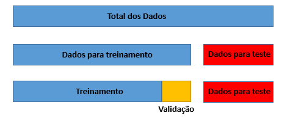
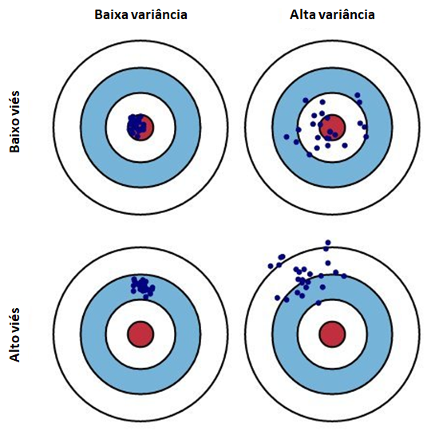

# Overfitting & Underfitting

## Conteúdo

 - [01 - Introdução](#intro)
 - [02 - Generalização](#generalization)
 - [03 - Sets de Treinamento, Validação & Teste](#training-validation-testing)
 - [04 - Tipos de erros de aprendizado em modelos de Machine Learning (Variância=overfitting & Bias=underfitting)](#variance-bias)
   - [04.1 - Erro irredutível](#04-1)
   - [04.2 - Erro de variância (Overfitting)](#04-2)
   - [04.3 - Erro de bias (Underfitting)](#04-3)
   - [04.4 - Demonstração visual de Erro de variância (Overfitting) & Erro de bias (Underfitting)](#04-4)
   - [04.5 - Erro Total do modelo](#04-5)
   - [04.6 - Bias-Variance Tradeoff](#04-6)
   - [04.7 - Variance & Bias em modelos Lineares & Não-Lineares](#04-7)
   - [04.8 - Como encontrar o ajuste correto?](#04-8)
   - [04.9 - Conclusão](#04-9)
 - [05 - Overfitting](#overfitting)
 - [06 - Underfitting](#underfitting)

---

<div id="intro"></div>

## 01 - Introdução

> **Overfitting** e **Underfitting** são as duas maiores causas de *má generalização* dos algoritmos de Machine Learning.

**NOTE:**  
Para entender estes dois conceitos primeiro vamos **revisar** e **entender** outros tópicos (conceitos).

---

<div id="generalization"></div>

## 02 - Generalização

> **Generalização** refere-se a quão bem um modelo de Machine Learning aprendeu. Isto se verifica observando os resultados que o modelo produz no **set de teste**, em contraposição ao **set de treinamento**.

**NOTE:**  
O objetivo de um bom modelo de Machine Learning é generalizar bem a partir dos dados de treinamento para qualquer dado no domínio do problema. Isso nos permite fazer previsões sobre dados que o modelo nunca viu.

---

<div id="training-validation-testing"></div>

## 03 - Sets de Treinamento, Validação & Teste

Os dados usados ​​para construir um modelo de Machine Learning são em geral, divididos em três conjuntos (sets):

 - Treinamento;
 - Validação;
 - Teste.

Veja a imagem abaixo para entender visualmente como funciona:

  

**NOTE:**  
Idealmente, o modelo deve ser avaliado em amostras que não foram usadas para construir (dados de treino) ou ajustar o modelo (dados de validação), de modo que forneçam um resultado imparcial de eficácia do modelo - Ou seja, os **dados de teste**.

Quando uma grande quantidade de dados está à mão, um conjunto de amostras pode ser reservado para avaliar o modelo final:
 - O set de treinamento é usado para criar o modelo;
 - O set de validação é usado para qualificar o desempenho do(s) modelo(s);
 - O set de teste só deve ser tocado para avaliação final do modelo (hold out method).

Na prática, o set de treinamento consiste nos atributos de entrada, por exemplo:
 - Área;
 - Garagens;
 - CEP de um apartamento;
 - E a correspondente resposta  obtida, por exemplo, o preço do apartamento, que é o **target**.

**NOTE:**  
O modelo é executado no set de treinamento e produz um resultado, que é então comparado com o **target** conhecido, para cada observação de entrada no set de treinamento. Com base no resultado da comparação e no algoritmo de aprendizado específico utilizado, os parâmetros do modelo são ajustados (set de validação). O ajuste do modelo pode incluir seleção e transformações de variáveis, estimativa de parâmetros, etc.. 

**NOTE:**  
Finalmente, o set de teste, que não foi tocado durante o treinamento (e a validação), é usado para fornecer uma avaliação imparcial de um modelo final ajustado no conjunto de dados de treinamento.

---

<div id="variance-bias"></div>

## 04 - Tipos de erros de aprendizado em modelos de Machine Learning (Variância=overfitting & Bias=underfitting)

Os erros de previsão para qualquer algoritmo de Machine Learning podem ser dividido em três partes:

 - Erro irredutível
 - Erro de variância (Overfitting)
 - Erro de bias (underfitting)

<div id="04-1"></div>

## 04.1 - Erro irredutível

Também chamado de **ruído** não pode ser reduzido, independentemente do algoritmo usado. É o erro introduzido por exemplo, por medições incorretas na coleta de dados.

<div id="04-2"></div>

## 04.2 - Erro de variância (Overfitting)

A **Variância** é a variabilidade da previsão do modelo para um determinado ponto de dados ou um valor que nos diz a propagação de nossos dados. O modelo com alta variância presta muita atenção aos dados de treinamento e não generaliza sobre os dados que não viu antes. Como resultado, esses modelos funcionam muito bem nos dados de treinamento, mas apresentam altas taxas de erro nos dados de teste.

> A este erro dá-se o nome de **Overfitting**.

<div id="04-3"></div>

## 04.3 - Erro de bias (Underfitting)

O **Bias** é a diferença entre a previsão média do nosso modelo e o valor correto que estamos tentando prever. O modelo com alto viés presta muito pouca atenção aos dados de treinamento e simplifica demais o modelo. Isso sempre leva a um alto erro nos dados de treinamento e teste.

>  A este erro dá-se o nome de **Underfitting**.

<div id="04-4"></div>

## 04.4 - Demonstração visual de Erro de variância (Overfitting) & Erro de bias (Underfitting)

Observando a ilustração abaixo, podemos descrever os diferentes tipos de **Bias** e **Variância** que um modelo de Machine Learning pode apresentar:

  

**NOTE:**  
Na imagem acima, analogamente o centro do alvo é o modelo que realiza as previsões perfeitamente corretas. Conforme nos afastamos do centro do alvo, as previsões ficam cada vez piores.

**Baixo Viés e Baixa Variância:**  
É o modelo ideal e o que desejamos obter, com uma boa acurácia e precisão nas previsões.

**Baixo Viés e Alta Variância:**  
O modelo está superestimando (overfitting) nos dados de treino e não generaliza bem com dados novos.

**Alto Viés e Baixa Variância:**  
O modelo está subestimando (underfitting) nos dados de treino e não captura a relação verdadeira entre as variáveis preditoras e a variável resposta.

**Alto Viés e Alta Variância:**  
O modelo está inconsistente e com um acurácia muito baixa nas previsões.

<div id="04-5"></div>

## 04.5 - Erro Total do modelo

Resumidamente, podemos descrever o Erro Total do modelo da seguinte forma:

```py
Erro Total = Variância + Bias² + Erros Irredutíveis
```

<div id="04-6"></div>

## 04.6 - Bias-Variance Tradeoff

Para termos o modelo mais próximo do ideal, devemos fazer algumas escolhas:

 - Se aumentarmos a Variância, inevitavelmente reduziremos o Viés;
 - E o contrário também é verdadeiro, reduzindo a Variância, aumentamos o Viés em relação à complexidade do modelo;

**NOTE:**  
A medida que mais e mais parâmetros são adicionados a um modelo, a complexidade dele aumenta e a variância se torna a principal preocupação, enquanto o viés diminui constantemente.

Por exemplo, podemos ver na imagem abaixo:

  

Veja que:

 - Quanto maior a complexidade do modelo (eixo-x), ou seja, mais parâmetros são adicionados:
   - Maior é o Erro da Variância;
   - Menor é o Erro do Bias.

**NOTE:**  
Então o melhor a se fazer é encontrarmos o equilíbrio entre esses dois erros, que melhor atenda ao modelo em treinamento, conforme mostrado na imagem abaixo:

  

<div id="04-7"></div>

## 04.7 - Variance & Bias em modelos Lineares & Não-Lineares

 - **Modelos Lineares:**
   - Frequentemente, esses algoritmos tem **Baixa Variância** e **Alta Viés**.
 - **Modelos Não-Lineares:**
   - Frequentemente, esses algoritmos tem **Alta Variância** e **Baixo Viés**.

<div id="04-8"></div>

## 04.8 - Como encontrar o ajuste correto?

 - Bagging e outras técnicas de reamostragem podem ser usadas para reduzir a variação nas previsões do modelo;
 - Usar mais dados no treinamento também ajuda, para aumentar a aprendizagem do modelo para os padrões existentes;
 - Quanto a parametrização de algoritmos de Machine Learning, costuma ser uma batalha para equilibrar o Variância e o Viés;
 - Abaixo, dois exemplos de **trade-off** do **Variância-Bias** específicos (escolha entre os melhores parâmetros para o ajuste ideal):
   - O algoritmo de KNN, tem baixo Viés e alta Variância, mas o trade-off pode ser alterado aumentando o valor de k que aumenta o número de vizinhos que contribuem para a previsão e, por sua vez, aumenta Viés do modelo;
   - O algoritmo do Support Vector Machine (SVM) tem baixo Viés e alta Variância, mas a compensação pode ser alterada aumentando o parâmetro C que influencia o número de violações da margem permitida nos dados de treinamento, o que aumenta a Viés, mas diminui a Variância.

<div id="04-9"></div>

## 04.9 - Conclusão

Encontrar o equilíbrio entre **Variância** e **Bias** é um processo iterativo, treinando o modelo várias vezes com diferentes combinações de features, hiperparâmetros e com diferentes conjuntos de dados para treinamento.

**NOTE:**  
Reduzir o **Variância** e o **Bias** é vital para um modelo robusto e de alto desempenho preditivo.

---

<div id="overfitting"></div>

## 05 - Overfitting

> Um cenário de **Overfitting** ocorre quando, nos dados de treino, o modelo tem um desempenho excelente, porém quando utilizamos os dados de teste o resultado é ruim.

**NOTE:**  
Podemos entender que, neste caso, o modelo aprendeu tão bem as relações existentes no treino, que acabou apenas decorando o que deveria ser feito, e ao receber as informações das variáveis preditoras nos dados de teste, o modelo tenta aplicar as mesmas regras decoradas, porém com dados diferentes esta regra não tem validade, e o desempenho é afetado. É comum ouvirmos que neste cenário o modelo treinado não tem capacidade de generalização.

---

<div id="underfitting"></div>

## 06 - Underfitting

> Um cenário de **Underfitting** ocorre quando o desempenho do modelo já é ruim no próprio treinamento. O modelo não consegue encontrar relações entre as variáveis e o teste nem precisa acontecer. Este modelo já pode ser descartado, pois não terá utilidade.

---

**REFERÊNCIAS:**  
[O que é bias-variance tradeoff](https://medium.com/data-hackers/o-que-%C3%A9-bias-variance-tradeoff-a5bc19866e4b)  

---

**Rodrigo Leite -** *drigols*
