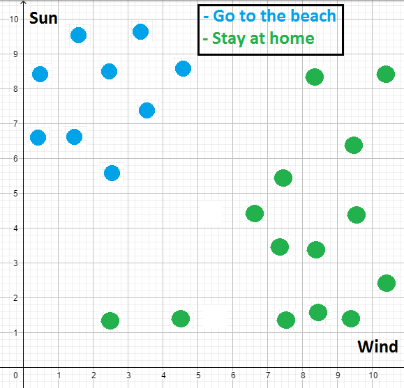
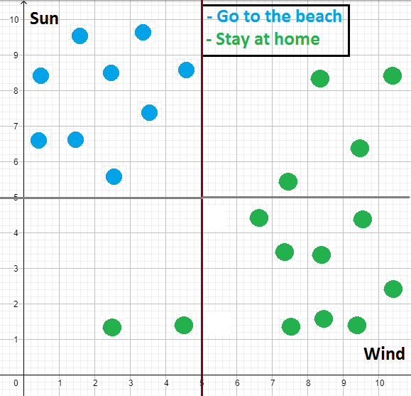
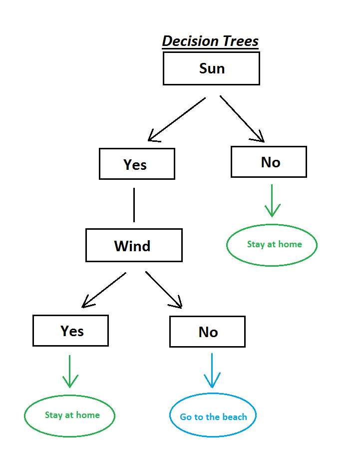
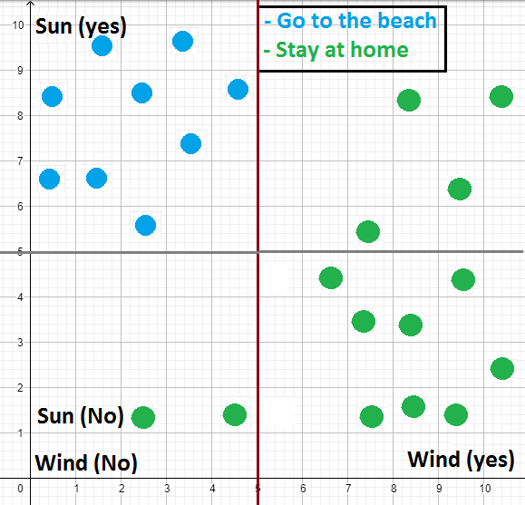

# Introdução a Decision trees (Árvores de Decisão)

## Conteúdo

 - [01 - Problema e Introdução](#01)
 - [02 - Resolvendo o problema com o Algoritmo Decision Trees](#02)

---

## 01 - Problema e Introdução

Para começar nossos estudos sobre **Decision trees (Árvores de Decisão)** vamos imaginar que nós estamos analisando as pessoas que resolveram `ir para a praia hoje` e `as que resolveram ficar em casa`. Também, vamos ter 2 variáveis que vão afetar essa decisão: **Sol (Sun)** e **Vento (Wind)**.

Digamos que o gráfico ficou mais ou menos assim:

  

**NOTE:**  
Se você prestar bem atenção você vai ver que as pessoas gostam de ir para a praia:

 - Quando tem bastante Sol (Sun);
 - E quando tem pouco Vento (Wind).

Suponha, que agora nós temos um problema que é classificar essas 2 classes:

 - Ficar em casa **(Stay at home)**;
 - Ir para a praia **(Go to the beach)**.

Basicamente, nós temos que classificar esses dados (classes) para que a partir de uma nova entrada nós decidirmos se as pessoas vão para praia ou não com base no **Sol (Sun)** e no **Vento (Wind)**.

---

## 02 - Resolvendo o problema com o Algoritmo Decision Trees

Bem, nós poderíamos separar esse dados de várias formas. Uma delas **(para esse exemplo)** seria criar 2 retas, mais ou menos assim:

  

**NOTE:**  
OK, é isso que o basicamente que o *Algoritmos Decision Trees* faz.

> **Ele vai criando várias retas para tentar separar (classificar) nossos dados.**

**Mas como ele faz isso na prática?**  
Bem, de fato ele cria uma árvore, parecida com essa:

  

**Ok, mas como isso pode ser representado no meu gráfico?**  
Vocês lembram que nós criamos 2 retas para dividir os dados (classes)? Então, vai ser assim:

  

Viu? Nós divimos os dados com às 2 retas criando 4 blocos. Agora vamos ver como interpretar eles... Primeiro, vamos começando olhando se tinha **Sol (Sun)**:

 - Se **NÃO** tem Sol então logo de cara nós já descartamos sair de casa **(Stay at home)**:
   - **Isso você pode verifcar tanto na árvore quanto no gráfico. Nenhum dos casos vai nós levar a ir para a praia.**
 - Agora **SE TIVER SOL (YES)** + e **TAMBÉM TIVER VENTO (YES)**, também vamos ficar em casa **(Stay at home)**:
   - **No gráfico é muito simples chegar a essa conclusão. Você começa no *Sol (YES)* e move para a direta → *vento (YES)*, logo você vai ver que não tem nenhum dado da classe "Go to the beach".**
 - Por fim, **SE TIVER SOL (YES)** + **NÃO TIVER VENTO (NO)**. Então, nós vamos para a praia **(Go to the beach)**.

**NOTE:**  
Vale salientar que esse modelo de aplicação é só um exemplo. Nós poderíamos colocar o **Vento (Wind)** no eixo-y se desejássemos.

---

## 03 - x

Soon...

---

**REFERÊNCIA:**  
[Didática Tech - Inteligência Artificial & Data Science](https://didatica.tech/)  
