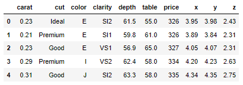

# Ensemble Methods

## Contents

 - Stacking
 - Bagging:
   - Random Forest
 - Booting:
   - AdaBoost
   - CatBoost:
     - [Intro to CatBoost](#intro-catboost)
     - **CatBoost examples:**
       - [Diamonds dataset](#diamonds-dataset)
   - LightGBM
   - XGBoost

---

<div id="intro-catboost"></div>

## Intro to CatBoost

> CatBoost is an open-source machine learning (gradient boosting) algorithm, with its name coined from **“Category”** and **“Boosting”**.

It was developed by **Yandex (Russian Google 😁)** in 2017. According to Yandex, **CatBoost** has been applied to a wide range of areas such as:

 - Recommendation systems.
 - Search ranking.
 - Self-driving cars.
 - Forecasting.
 - Virtual assistants.

**NOTE:**  
It is the successor of [MatrixNet](https://en.wikipedia.org/wiki/MatrixNet) that was widely used within Yandex products.

---

<div id="diamonds-dataset"></div>

## Diamonds dataset

> One of the unique features of CatBoost over other boosting algorithms is that **we can use categorical features (if any in the dataset) directly (without encoding) with CatBoost**.

To check this out, we’ll build a **CatBoost regression model** with the **“diamonds” dataset** that has some categorical features.

```python
import pandas as pd

df = pd.read_csv('diamonds.csv')
df.head()
```

  

**NOTE:**  
Let’s find out some information on the features (variables) in the dataset:

```python
df.info()
```

**OUTPUT:**  
```python
<class 'pandas.core.frame.DataFrame'>
RangeIndex: 53940 entries, 0 to 53939
Data columns (total 10 columns):
 #   Column   Non-Null Count  Dtype  
---  ------   --------------  -----  
 0   carat    53940 non-null  float64
 1   cut      53940 non-null  object 
 2   color    53940 non-null  object 
 3   clarity  53940 non-null  object 
 4   depth    53940 non-null  float64
 5   table    53940 non-null  float64
 6   price    53940 non-null  int64  
 7   x        53940 non-null  float64
 8   y        53940 non-null  float64
 9   z        53940 non-null  float64
dtypes: float64(6), int64(1), object(3)
memory usage: 4.1+ MB
```

> **NOTE:**
> - As you can see, the variables **cut**, **color** and **clarity** are categorical variables.
> - They all have the **object data type**.
> - These categorical variables do not have numerical values. Usually, we need to encode them into numerical values because most of the algorithms only accept data with numerical values during the training process.

**NOTE:**  
But, this is not the case for **CatBoost**. We can directly use categorical features with CatBoost without encoding them. For this, we need to convert our data into CatBoost’s special Pool data type by using the **Pool() class**.

The designing process of a CatBoost model on the diamonds data is straightforward:

 - We can select the **price** variable as the **target column (y)**.
 - And the remaining variables as the feature matrix (X).
 - We also remove the columns **table**, **x**, **y** and **z** variables from the dataset as they do not provide much value to the data.

```python
X = df.drop(columns=['price', 'table', 'x', 'y', 'z'])
y = df['price']
```

Before create a model instance to training the model, let's divide the data into traing and testing sets:

```python
from sklearn.model_selection import train_test_split

X_train, X_valid, y_train, y_valid = train_test_split(
    X,
    y,
    test_size=0.20, 
    random_state=1,
)
```

**NOTE:**  
Because the **price** is a continuous-valued variable, here we need to build a regression model (actually a CatBoost regression model!). To build the model, we use the **CatBoostRegressor() class** with its relevant hyperparameter values.

However, first let's create a **Pool** to separe training and testing data to pass for the model:

```python
from catboost import Pool

pool_train = Pool(
    X_train,
    y_train,
    cat_features = ['cut', 'color', 'clarity']
)

pool_valid = Pool(
    X_valid,
    cat_features = ['cut', 'color', 'clarity']
)
```

Finally, let's training the model:

```python
from catboost import CatBoostRegressor

model = CatBoostRegressor()

model.fit(
    pool_train,
    silent=True,
)
```

Ok, with the model trained let's go do some predicts:

```python
prices_predicted = model.predict(pool_valid)
```

Now, let's check prices predicted:

```python
print(prices_predicted.shape)
```

**OUTPUT:**  
```python
(10788,)
```

```python
print(prices_predicted)
```

**OUTPUT:**  
```python
array([ 512.18620587, 5884.38708995, 2594.19190219, ..., 2272.75119573,
       5860.03001759, 1467.82915034])
```

**NOTE:**  
To finalize let's evaluation the model:

```python
import numpy as np
from sklearn.metrics import mean_squared_error as mse

evaluation_result = np.sqrt(
    mse(
        y_valid,
        prices_predicted,
    )
)

print("RMSE in y units:", np.mean(evaluation_result))
```

**OUTPUT:**  
```python
RMSE in y units: 525.9028290707731
```

**Is this a good value?**
 - This is the Standard Deviation of prediction errors (residuals).
 - The lower the value, the better the model.

Let’s look closer at the **price** variable:

```python
y.describe()
```

**OUTPUT:**  
```python
count    53940.000000
mean      3932.799722
std       3989.439738
min        326.000000
25%        950.000000
50%       2401.000000
75%       5324.250000
max      18823.000000
Name: price, dtype: float64
```

**NOTE:**  
 - The range (max-min) is 18497.
 - The standard deviation is 3989.
 - So, the RMSE value we got is a really good one for our model:
   - Also, note that we got this value without doing any hyperparameter tuning!

---

**REFERENCES:**  
[How Do You Use Categorical Features Directly with CatBoost?](https://towardsdatascience.com/how-do-you-use-categorical-features-directly-with-catboost-947b211c2923)  
[CatBoost tutorial: Categorical features parameters](https://github.com/catboost/catboost/blob/master/catboost/tutorials/categorical_features/categorical_features_parameters.ipynb)  

---

Ro**drigo** **L**eite da **S**ilva - **drigols**
