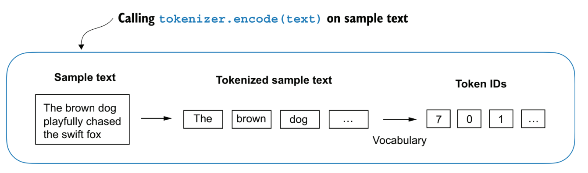
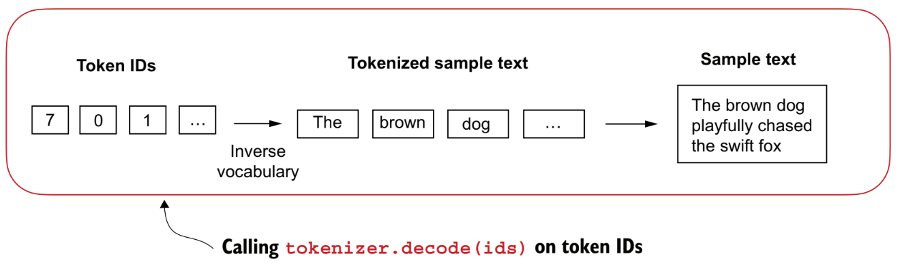

# Large Language Models

## Conteúdo

 - **Introdução a LLMs:**
   - [O que são LLMs?](#intro-to-llm)
   - [Como o modelo "entende" linguagem?](#how-understand)
   - [Como LLMs são treinados)](#how-are-trained)
   - [Diferença entre LLMs e modelos tradicionais de NLP](#llm-vs-nlp)
   - [Por que os Transformers revolucionaram o NLP?](#transformers-inovation)
   - [Como funciona o Mecanismo de Attention (Atenção)?](#attention-mechanism)
   - [Exemplos de tarefas resolvidas por LLMs](#llm-examples)
 - **Conceitos utilizados em LLMs:**
   - [Entendendo "Word Embeddings"](#understanding-word-embeddings)
   - [Word2Vec](#word2vec-idea)
 - **Preparação e amostragem de dados (Data preparation & sampling):**
   - **Lendo arquivos (Reading files):**
     - [read_txt()](#read-txt)
   - **Tokenization:**
     - [Tokenização de texto (Tokenizing text)](#tokenization)
     - [Convertendo tokens em IDs de token (Converting tokens into token IDs)](#token-id)
     - [Convertendo IDs de tokens em tensores de incorporação (Embeddings)](#token-id-to-tensor)
     - [Criando token embeddings](#creating-token-embeddings)
   - **Encode & Decode:**
     - [encode()](#intro-to-encode)
     - [decode()](#intro-to-decode)
   - [**Sliding Window (input-target)**](#sliding-window)
 - **Mecanismo de atenção (Attention mechanism):**
 - **Arquiteturas de LLMs (LLMs architecture):**
 - **Pré-treinamento (Pretraining):**
 - **Loop de treinamento (Training loop):**
 - **Avaliação do modelo (Model evaluation):**
 - **Carregamento pesos pré-treinados (Load pretrained weights):**
 - **Afinação (Fine-tuning):**
   - **Modelos de classificação (Classification models):**
   - **Assistentes pessoais ou modelos de chat (Personal assistants or chat models):**
 - [**🚀 Instalação / Execução local**](#settings)
 - [**REFERÊNCIAS**](#ref)
<!---
[WHITESPACE RULES]
- Same topic = "20" Whitespace character.
- Different topic = "200" Whitespace character.
--->


<!--- ( Introdução a LLMs ) --->

---

<div id="intro-to-llm"></div>

## O que são LLMs?

**📘 Definição:**  
LLMs (Large Language Models) são modelos de aprendizado de máquina treinados para **"entender"**, **"gerar"** e **"manipular linguagem natural"**.

> **OBSERVAÇÃO:**  
> Eles são chamados de "grandes" por causa da quantidade massiva de parâmetros (milhões ou bilhões) e por serem treinados em grandes volumes de texto da internet, livros, artigos, fóruns, código-fonte etc.


---

<div id="how-understand"></div>

### Como o modelo "entende" linguagem?

Na verdade, LLMs não entendem no sentido humano. Eles aprendem probabilidades estatísticas:

> Se eu vejo a frase: "O céu está ___", a palavra mais provável é "azul".  
> Esse "palpite" é feito com base no que ele viu durante o treinamento.


---

<div id="how-are-trained"></div>

### Como LLMs são treinados

 - **Pré-treinamento (Pretraining):**
   - O modelo é exposto a grandes quantidades de texto e aprende padrões de linguagem por meio de tarefas como **"prever a próxima palavra"** (auto-regressivo) ou **"preencher palavras faltantes"** (máscara).
 - **Ajuste fino (Fine-tuning):**
   - O modelo pode ser adaptado para tarefas específicas, como:
     - Classificação de texto;
     - Tradução;
     - Geração de código;
     - Resumo de documentos.


---

<div id="llm-vs-nlp"></div>

## Diferença entre LLMs e modelos tradicionais de NLP

 - Antes dos LLMs, os modelos de **NLP** eram **específicos para cada tarefa**, como *análise de sentimentos*, *tradução*, ou *resumo*.
 - Com os **LLMs**, **um único modelo pode ser usado para várias tarefas** com pouco ou nenhum ajuste.

### Comparação Direta

| Característica                  | Modelos Tradicionais de NLP                 | LLMs (Large Language Models)                        |
| ------------------------------- | ------------------------------------------- | --------------------------------------------------- |
| **Arquitetura**                 | Simples (SVM, Regressão, Naive Bayes, RNNs) | Transformer (profundo e em larga escala)            |
| **Treinamento**                 | Um modelo por tarefa                        | Um único modelo para tarefas múltiplas              |
| **Requer feature engineering?** | Sim! Manual e demorado                      | Não. O modelo aprende tudo automaticamente          |
| **Escalabilidade**              | Limitado                                    | Altamente escalável e flexível                      |
| **Precisão/Desempenho**         | OK, mas limitado com grandes volumes        | Alta, especialmente com dados em larga escala       |
| **Entrada/Saída**               | Tipicamente vetores numéricos               | Texto puro (prompts e respostas)                    |
| **Contexto considerado**        | Curto (às vezes só 1 frase)                 | Longo (vários parágrafos ou até milhares de tokens) |
| **Exemplos**                    | TF-IDF + SVM, Word2Vec + LSTM               | GPT, BERT, T5, LLaMA, Claude, Gemini                |

### Explicando com um exemplo

 - **Modelo tradicional (pré-LLM):**
   - Transformar o texto em vetores (TF-IDF, Bag of Words).
   - Treinar um SVM ou uma Regressão Logística para prever o sentimento.
   - Modelo só serve pra essa tarefa.
 - **LLM:**
   - Você escreve:
     - `Classifique o sentimento desta frase: Estou muito feliz hoje!`
   - O modelo responde:
     - `Sentimento: Positivo`
   - **OBSERVAÇÃO:** O mesmo modelo pode também traduzir, resumir, gerar código...

### Vantagens dos LLMs sobre modelos tradicionais

 - ✅ **Generalização:** Um modelo para muitas tarefas;
 - ✅ **Zero-shot & few-shot:** Resolve tarefas com poucas instruções;
 - ✅ Menos dependência de dados rotulados;
 - ✅ Contexto mais longo e melhor compreensão;
 - ✅ Geração de linguagem natural mais fluida.

### Mas os modelos tradicionais morreram?

 - **❌ Não! Eles ainda são úteis quando:**
   - Você tem poucos dados e poucos recursos computacionais;
   - A tarefa é muito específica e não exige interpretação profunda;
   - Você precisa de explicabilidade clara e rápida.


---

<div id="transformers-inovation"></div>

## Por que os Transformers revolucionaram o NLP?

> Transformers são uma arquitetura introduzida no artigo [**"Attention is All You Need" (2017)**](https://arxiv.org/abs/1706.03762).

**OBSERVAÇÃO:**  
Eles eliminaram a necessidade de processar palavras em sequência como faziam **RNNs** e **LSTMs** — e com isso, permitiram muito mais *"paralelismo"*, *"contexto global"* e *"velocidade"*.

### 🚫 Problema dos modelos anteriores (RNN, LSTM)

 - Processavam tokens um por um (sequencialmente).
 - Sofriam com longas dependências ("o que foi dito 30 palavras atrás?").
 - Eram lentos para treinar.
 - Tinha dificuldade com frases longas e contexto amplo.

### ✅ Como o Transformer resolveu tudo isso?

**A resposta:** Attention Mechanism.

> O modelo aprende a **"prestar atenção"** nas palavras mais importantes do texto — independentemente da posição!

### 🧩 Componentes principais do Transformer

| Componente                    | Função Básica                                                    |
| ----------------------------- | ---------------------------------------------------------------- |
| **Embedding**                 | Converte palavras em vetores numéricos.                          |
| **Self-Attention**            | Calcula a importância de cada palavra em relação às outras.      |
| **Positional Encoding**       | Adiciona informação da posição das palavras (já que é paralelo). |
| **Feedforward Layers**        | Faz transformações profundas nos vetores.                        |
| **Normalization & Residuals** | Ajudam a estabilizar e melhorar o aprendizado.                   |


---

<div id="attention-mechanism"></div>

## Como funciona o Mecanismo de Attention (Atenção)?

> O mecanismo de atenção permite que o modelo **"foque" em partes importantes da entrada** — como humanos fazem ao ler.

Por exemplo, imagine que nós temos a frase:

Imagine a frase:

> “A maçã estava azeda, então ela foi jogada fora.”

 - A palavra **"ela"** poderia se referir à **maçã** ou à **azeda**.
 - O modelo precisa **“prestar atenção”** nas palavras relevantes para entender corretamente.

### 🧮 Fórmula matemática (simples)

A fórmula matemática (simples) é a seguinte:

$\text{Attention}(Q, K, V) = \text{softmax}\left(\frac{QK^\top}{\sqrt{d_k}}\right)V$

 - `QKᵀ`
   - Compara (multiplica) os queries com os keys → gera pontuações de atenção.
 - `/ √d_k`
   - Normaliza para evitar explosões numéricas.
 - `softmax`
   - Transforma em probabilidades.
 - `× V`
   - Gera a atenção ponderada, ou seja, a saída final.

### 🔢 Exemplo numérico ilustrativo

```bash
Frase: ["O", "gato", "correu"]

→ Para "correu", o modelo calcula:

Q(correu) • K(O)     →  baixa atenção
Q(correu) • K(gato)  →  alta atenção
Q(correu) • K(correu)→  média atenção
```

> **Resultado:**  
> O modelo vai ponderar mais o **"gato"**, porque **"gato correu"** tem uma relação forte.


---

<div id="llm-examples"></div>

### Exemplos de tarefas resolvidas por LLMs

Vamos começar com uma introdução de algumas tarefas que podem ser resolvidas utilizando **"LLMs"**:

| Tarefa                      | Exemplo prático                             |
| --------------------------- | ------------------------------------------- |
| **Geração de texto**        | Chatbots, redação automática                |
| **Classificação**           | Análise de sentimentos, spam vs. não spam   |
| **Tradução**                | Inglês → Português, etc.                    |
| **Perguntas e Respostas**   | Assistente de dúvidas                       |
| **Resumo automático**       | Resumir longos artigos                      |
| **Extração de informações** | Pegar nomes, datas, eventos de um texto     |
| **Geração de código**       | Auto-complete em IDEs, explicação de código |

### 🚀 Aplicações Reais das LLMs

| **Área**                   | **Aplicação**                                                                                       |
| -------------------------- | --------------------------------------------------------------------------------------------------- |
| **Assistentes virtuais**   | Chatbots inteligentes (ex: ChatGPT, Google Bard, Alexa)                                             |
| **Educação**               | Tutores personalizados, correção automática de redações, explicações sob demanda                    |
| **Saúde**                  | Análise de prontuários, resposta a perguntas médicas, apoio à decisão clínica                       |
| **Atendimento ao cliente** | Respostas automáticas, suporte 24/7, resumo de interações com usuários                              |
| **Pesquisa e ciência**     | Síntese de artigos, geração de hipóteses, revisão automática de literatura                          |
| **Programação**            | Autocompletar código, explicar funções, gerar trechos em diferentes linguagens (ex: GitHub Copilot) |
| **Tradução de idiomas**    | Traduções contextuais e multilíngues, com adaptação ao domínio específico                           |
| **Criação de conteúdo**    | Geração de artigos, roteiros, marketing, posts para redes sociais                                   |
| **Direito**                | Análise de contratos, extração de cláusulas, sumarização de decisões legais                         |
| **Análise de sentimentos** | Classificação de avaliações e sentimentos em redes sociais e e-commerce                             |
| **Segurança cibernética**  | Explicação de exploits, análise de logs e geração de alertas                                        |
| **Games e NPCs**           | Diálogos gerados dinamicamente, comportamentos inteligentes, roteiros                               |

### 📈 Exemplos Reais de Impacto com LLMs

| **Organização / Produto** | **Uso de LLMs**                                                                          |
| --------------------------|------------------------------------------------------------------------------------------|
| `Duolingo`                | Feedback em tempo real sobre frases escritas por alunos com explicações contextualizadas |
| `Notion AI`               | Geração e reformulação de textos, resumos automáticos, criação de tarefas                |
| `Khan Academy (GPT-4)`    | Tutor personalizado que responde dúvidas dos alunos com explicações passo a passo        |
| `GitHub Copilot`          | Sugestões de código em tempo real, explicações de funções, geração de testes             |
| `GrammarlyGO`             | Reescrita e aprimoramento de textos com base no contexto do usuário                      |
| `Legal Robot`             | Análise de contratos com explicação em linguagem natural das cláusulas jurídicas         |
| `You.com (YouChat)`       | Motor de busca com respostas geradas por LLM, integrando fontes e interatividade         |


<!--- ( Conceitos utilizados em LLMs ) --->

---

<div id="understanding-word-embeddings"></div>

## Entendendo "Word Embeddings"

 - Modelos de Deep Learning, incluindo LLMs, não podem processar texto bruto diretamente;
 - Como o texto é categórico, ele não é compatível com as operações matemáticas utilizadas para implementar e treinar redes neurais;
 - Portanto, precisamos de uma forma de representar palavras como vetores com valores contínuos.

> **OBSERVAÇÃO:**  
> O conceito de converter dados (áudio, vídeo, texto) para o formato de vetor (numérico) é frequentemente chamado de **"embedding"**.

Por exemplo:

  

> **OBSERVAÇÃO:**  
> No entanto, é importante observar que diferentes formatos de dados exigem *modelos de embbedding* distintos.  
> Por exemplo, um modelo de embedding projetado para texto não seria adequado para embbedding de dados de áudio ou vídeo.


---

<div id="word2vec-idea"></div>

## Word2Vec

> A principal *ideia* por trás do **Word2Vec** é que *"palavras que aparecem em contextos semelhantes tendem a ter significados semelhantes"*.

Consequentemente, quando projetadas em embeddings de palavras bidimensionais para fins de visualização, palavras semelhantes ficam agrupadas.

  


<!--- ( Preparação e amostragem de dados (Data preparation & sampling) ) --->

---

<div id="read-txt"></div>

## read_txt()

Aqui nós vamos aprender como ler um arquivo de texto no formato `.txt`:

<!--- ( Python (From Scratch) ) --->
<details>

<summary>Python (From Scratch)</summary>

</br>

[utils.py](src/utils.py)
```python
import re


def read_txt(file_path):
    with open(file_path, "r", encoding="utf-8") as f:
        text = f.read()
    return text


if __name__ == "__main__":

    file_path = "../datasets/the-verdict.txt"
    text = read_txt(file_path)

    print("Total number of characters:", len(text))
    print("Text type:", type(text), "\n")
```

**OUTPUT:**
```bash
Total number of characters: 20479
Text type: <class 'str'> 
```

> **OBSERVAÇÃO:**  
> Podemos usar o conceito **fatiamento (slicing)** para selecionar uma parte específica do texto.

```python
print(text[:353])
```

**OUTPUT:**
```bash
I HAD always thought Jack Gisburn rather a cheap genius--though a good fellow enough--so it was no great surprise to me to hear that, in the height of his glory, he had dropped his painting, married a rich widow, and established himself in a villa on the Riviera. (Though I rather thought it would have been Rome or Florence.)

"The height of his glory"
```

</details>


---

<div id="tokenization"></div>

## Tokenização de texto (Tokenizing text)

> Aqui, vamos discutir como podemos dividir uma entrada texto em *tokens* individuais, uma etapa de pré-processamento necessária para criar *embeddings* para um *LLM*.

Esses tokens são palavras individuais ou caracteres especiais, incluindo sinais de pontuação, conforme mostrado abaixo:

  

Vamos ver como implementar isso na prática:

<!--- ( Transformers (Hugging Face) ) --->
<details>

<summary>Transformers (Hugging Face)</summary>

</br>

Para criar tokens com a biblioteca biblioteca [🤗 Transformers (Hugging Face)](https://github.com/huggingface/transformers) vamos utilizar o tokenizador `AutoTokenizer` com o modelo `bert-base-uncased`:

[transformers_tokenizers.py](src/transformers_tokenizers.py)
```python
from transformers import AutoTokenizer

from utils import read_txt


# load the BERT tokenizer
tokenizer = AutoTokenizer.from_pretrained("bert-base-uncased")

# Load the and read the text
file_path = "../datasets/the-verdict.txt"
text = read_txt(file_path)

# Tokenization
tokens = tokenizer.tokenize(text)

print("Total number of tokens (without whitespaces):", len(tokens))
print("Tokens (first 10):", tokens[:10])
```

**OUTPUT:**  
```bash
Total number of tokens (without whitespaces): 5212
Tokens (first 10): ['i', 'had', 'always', 'thought', 'jack', 'gi', '##sb', '##urn', 'rather', 'a']
```

> **Por que nós temos mais tokens utilizando o tokenizador da Hugging Face?**

### 🧠 Diferença fundamental: Subword Tokenization

O **BERT** não usa tokenização por palavras ou pontuações simples. Ele usa um método chamado:

> **👉 WordPiece Tokenization:**  
> Palavras desconhecidas ou raras são quebradas em subpartes, chamadas *"subwords"*.

Por exemplo:

```bash
'Gisburn' → ['gi', '##sb', '##urn']
```

A ideia é balancear entre:

 - Cobertura de vocabulário (poucos tokens desconhecidos);
 - Tamanho do vocabulário (tornar o modelo mais eficiente).

### `🧠 O que são esses ##?`

 - No **BERT**, os tokens que começam com `##` são subpalavras que continuam uma palavra anterior.
 - Por exemplo:
   - `gi` é o começo da palavra `Gisburn`;
   - ``##sb`` e ``##urn`` são subpalavras que continuam `gi` até formar `gi + sb + urn = Gisburn`.

Esse tipo de tokenização:

 - Reduz o número de palavras *OOV (out-of-vocabulary)*;
 - Garante que até palavras não vistas no treinamento ainda sejam entendidas em partes.

### 📌 Outros detalhes que aumentam a contagem no BERT:

| Fator                                 | Explicação                                                                        |
| ------------------------------------- | --------------------------------------------------------------------------------- |
| **Subwords**                          | Palavras como `Gisburn`, `unbelievable` viram várias partes                       |
| **Lowercasing**                       | O `bert-base-uncased` transforma tudo em minúsculo antes de tokenizar             |
| **Tokens especiais (em outros usos)** | `[CLS]`, `[SEP]` etc. (no seu caso não estão aparecendo porque você só tokenizou) |
| **Sem filtragem de pontuação**        | O tokenizer BERT inclui pontuações como tokens próprios (`.`, `,`, etc.)          |

### ✅ Conclusão

| Tokenizador          | Tipo de tokenização            | Total de tokens | Exemplo                 |
| -------------------- | ------------------------------ | --------------- | ----------------------- |
| `Seu (com re.split)` | Baseado em pontuação e espaços | 4690            | `'Gisburn'`             |
| `BERT ("WordPiece")` | Subword Tokenization           | 5212            | `'gi', '##sb', '##urn'` |

> **OBSERVAÇÃO:**  
> O BERT gera mais tokens porque ele quebra palavras em partes menores que estão no vocabulário aprendido durante o pré-treinamento. Isso permite lidar melhor com palavras raras ou compostas.

</details>


---

<div id="token-id"></div>

## Convertendo tokens em IDs de token (Converting tokens into token IDs)

Aqui nós vamos ver o processo de atribuir um ID numérico único para cada token (palavra, subpalavra ou símbolo) com base em um vocabulário fixo do modelo.

### 📘 O que é "Vocabulário" em LLMs?

No contexto de Modelos de Linguagem (LLMs), o vocabulário é a lista de todos os tokens que o modelo conhece.

**✅ Cada token tem:**

 - Uma forma textual (ex: "hello", "##ing", "!")
 - Um ID único (ex: 101, 1254, 999)

> **OBSERVAÇÃO:**  
> Esse vocabulário é definido antes do treinamento do modelo, geralmente criado com base em um grande corpus de texto.

### 🧠 Por que esse vocabulário é importante?

Porque o modelo só consegue processar textos usando os *tokens* do seu *vocabulário*. Se uma palavra não estiver nele, será dividida em subpalavras ou marcada como token desconhecido ([UNK]).

Por exemplo, imagine que temos o seguinte texto como entrada:

**Entrada (Input):**
```python
I love learning because I love new things
```

| Token      | Token ID |
| ---------- | -------- |
| `[PAD]`    | 0        |
| `[UNK]`    | 1        |
| `i`        | 2        |
| `love`     | 3        |
| `learning` | 4        |
| `because`  | 5        |
| `new`      | 6        |
| `things`   | 7        |

**🧮 Tokenização (simples):**
```python
tokens = ['i', 'love', 'learning', 'because', 'i', 'love', 'new', 'things']
```

> **OBSERVAÇÃO:**  
> Mesmo que as palavras **"i"** e **"love"** apareçam mais de uma vez, elas serão tokenizadas da mesma forma, pois o vocabulário é estático.

**🔢 Conversão para Token IDs:**
```python
token_ids = [2, 3, 4, 5, 2, 3, 6, 7]
```

| Palavra      | Token      | Token ID |
| ------------ | ---------- | -------- |
| **I**        | `i`        | 2        |
| **love**     | `love`     | 3        |
| **learning** | `learning` | 4        |
| **because**  | `because`  | 5        |
| **I**        | `i`        | 2        |
| **love**     | `love`     | 3        |
| **new**      | `new`      | 6        |
| **things**   | `things`   | 7        |

**✅ Observações:**

 - Tokens repetidos (como "i" e "love") continuam recebendo o mesmo ID.
 - O modelo trata repetições de **forma contextual**:
   - Ou seja, mesmo com o mesmo token ID, o significado pode *"mudar dependendo do contexto anterior"*.

Agora vamos ver como implementar isso na prática:

<!--- ( Transformers (Hugging Face) ) --->
<details>

<summary>Transformers (Hugging Face)</summary>

</br>

Com a biblioteca **transformers (Hugging Face)** podemos utilizar a função `tokenizer.get_vocab()` para pegar o vocaculário dos tokens:

[transformers_tokenizers.py](src/transformers_tokenizers.py)
```python
from transformers import AutoTokenizer

from utils import read_txt


# load the BERT tokenizer
tokenizer = AutoTokenizer.from_pretrained("bert-base-uncased")

# Load the and read the text
file_path = "../datasets/the-verdict.txt"
text = read_txt(file_path)

tokens = tokenizer.tokenize(text)   # Tokenize the text
vocabulary = tokenizer.get_vocab()  # Get the vocabulary

print("Vocabulary type:", type(vocabulary))
for voc in list(vocabulary.items())[:10]:
    print(voc)
```

**OUTPUT:**
```bash
Vocabulary type: <class 'dict'>
('women', 2308)
('[unused452]', 457)
('sponsorship', 12026)
('devout', 26092)
('william', 2520)
('glide', 21096)
('referees', 25118)
('handball', 12378)
('1950s', 4856)
('treated', 5845)
```

</details>


---

<div id="token-id-to-tensor"></div>

## Convertendo IDs de tokens em tensores de incorporação (Embeddings)

Converter os IDs de tokens em *tensores de incorporação ("Embeddings")* é a última etapa da preparação antes do modelo propriamente dito (LLM) processar os dados.

Vamos ver como fazer isso na prática:

<details>

<summary>PyTorch</summary>

<br/>

Para transformar os IDs de tokens em tensores, você só precisa ajustar o parâmetro `return_tensors="pt" (para utilizar PyTorch)`: 

[embeddings_pytorch.py](src/embeddings_pytorch.py)
```python
# encode process = here we tokenize + convert to IDs
encoding = tokenizer.encode_plus(
    text,
    add_special_tokens=True,
    return_tensors="pt",      # pt = Pytorch
    truncation=True,
    padding=False
)

input_ids = encoding["input_ids"]
token_type_ids = encoding["token_type_ids"]
attention_mask = encoding["attention_mask"]

print("Tensor input_ids shape:", input_ids.shape)
print("Tensor token_type_ids shape:", token_type_ids.shape)
print("Tensor attention_mask shape:", attention_mask.shape)
```

**OUTPUT:**
```bash
Tensor input_ids shape: torch.Size([1, 512])
Tensor token_type_ids shape: torch.Size([1, 512])
Tensor attention_mask shape: torch.Size([1, 512])
```

> **NOTE:**  
> Vejam que agora nós temos **PyTorch tensores**.

</details>


<details>

<summary>TensorFlow</summary>

<br/>

Para transformar os IDs de tokens em tensores, você só precisa ajustar o parâmetro `return_tensors="tf" (para utilizar TensorFlow)`: 

[embeddings_tensorflow.py](src/embeddings_tensorflow.py)
```python
encoding = tokenizer.encode_plus(
    text,
    add_special_tokens=True,
    return_tensors="tf",      # tf = Tensorflow
    truncation=True,
    padding=False
)

input_ids = encoding["input_ids"]
token_type_ids = encoding["token_type_ids"]
attention_mask = encoding["attention_mask"]

print("Tensor input_ids shape:", input_ids[0, :10])
print("Tensor token_type_ids shape:", token_type_ids[0, :10])
print("Tensor attention_mask shape:", attention_mask[0, :10])
```

**OUTPUT:**
```bash
Tensor input_ids shape: tf.Tensor([  101  1045  2018  2467  2245  2990 21025 19022 14287  2738], shape=(10,), dtype=int32)
Tensor token_type_ids shape: tf.Tensor([0 0 0 0 0 0 0 0 0 0], shape=(10,), dtype=int32)
Tensor attention_mask shape: tf.Tensor([1 1 1 1 1 1 1 1 1 1], shape=(10,), dtype=int32)
```

> **NOTE:**  
> Vejam que agora nós temos **TensorFlow tensores**.

</details>


---

<div id="creating-token-embeddings"></div>

## Criando token embeddings

Token Embedding é o processo de transformar:

 - Tokens *inteiros* (IDs):
   - Que são números inteiros representando palavras ou subpalavras.
 - Em vetores densos de *números reais*.

Esse processo é essencial para que os modelos de linguagem (LLMs) possam trabalhar com texto de forma numérica.

Por exemplo:

```bash
token_id  = 1037     # "a" no BERT tokenizer.
embedding = [0.1, 0.5, ..., -0.2]  # vetor de 768 dimensões.
```

### 🧠 Por que isso é importante?

Redes neurais não entendem palavras ou números inteiros diretamente — elas precisam de *vetores contínuos* que capturam semântica, contexto e relação entre palavras. Embeddings fazem essa ponte.

### 🚫 Quando não utilizar?

 - ❌ Se estiver usando um modelo pré-treinado completo (ex: AutoModel do Hugging Face) — os embeddings já estão lá.
 - ❌ Se estiver apenas tokenizando e não treinando nenhum modelo.


---

<div id="intro-to-encode"></div>

## encode()

> Um **encode()** é um método (ou função) fornecido por tokenizers de modelos pré-treinados (como os da biblioteca 🤗 transformers) para converter uma string de texto em IDs numéricos de tokens.

O método (ou função) `.encode()` realiza duas etapas principais:

 - **Tokenização:**
   - Divide o texto em unidades menores chamadas tokens (subpalavras, palavras ou pedaços).
 - **Mapeamento para IDs:**
   - Converte cada token em um número inteiro com base no vocabulário do modelo.

  

Vamos ver como implementar isso na prática:

<!--- ( Transformers (Hugging Face) ) --->
<details>

<summary>Transformers (Hugging Face)</summary>

</br>

A biblioteca **🤗 Transformers** já possui `.encode()` pronto. Ela fornece tokenizers otimizados, que:

 - Tokenizam o texto (tokenize);
 - Criam vocabulário (vocab);
 - Fazem mapeamento de tokens para IDs (convert_tokens_to_ids);
 - E até fazem o encode automático com padding, truncamento e máscara de atenção, se necessário.

[transformers_encode_decode.py](src/transformers_encode_decode.py)
```python
from transformers import AutoTokenizer

from utils import read_txt


# load the BERT tokenizer
tokenizer = AutoTokenizer.from_pretrained("bert-base-uncased")

# Load the and read the text
file_path = "../datasets/the-verdict.txt"
text = read_txt(file_path)

# encode = Here we tokenize + convert to IDs
encoding = tokenizer.encode_plus(
    text,
    add_special_tokens=True,  # Add [CLS], [SEP]
    return_tensors=None,      # "pt" for Pytorch, "tf" for TensorFlow or None
    truncation=True,          # Truncates if too long
    padding=False             # Do not add padding
)
```

No código acima nós já tokenizamos o texto e convertemos para IDs.

> **Mas qual o tipo eo que tem dentro de "encoding"?**

```python
print("Return type:", type(encoding))
print("\nencoding:\n", encoding)
```

**OUTPUT:**
```bash
Return type: <class 'transformers.tokenization_utils_base.BatchEncoding'>

encoding:
 {'input_ids': [101, 1045, 2018, 2467, 2245, 2990, 21025, 19022, 14287, 2738, 1037, 10036, 11067, 1011, 1011, 2295, 1037, 2204, 3507, 2438, 1011, 1011, 2061, 2009, 2001, 2053, 2307, 4474, 2000, 2033, 2000, 2963
, 2008, 1010, 1999, 1996, 4578, 1997, 2010, 8294, 1010, 2002, 2018, 3333, 2010, 4169, 1010, 2496, 1037, 4138, 7794, 1010, 1998, 2511, 2370, 1999, 1037, 6992, 2006, 1996, 15544, 14356, 2050, 1012, 1006, 2295, 10
45, 2738, 2245, 2009, 2052, 2031, 2042, 4199, 2030, 7701, 1012, 1007, 1000, 1996, 4578, 1997, 2010, 8294, 1000, 1011, 1011, 2008, 2001, 2054, 1996, 2308, 2170, 2009, 1012, 1045, 2064, 2963, 3680, 1012, 12137, 1
6215, 9328, 1011, 1011, 2010, 2197, 3190, 4133, 3334, 1011, 1011, 2139, 24759, 28741, 2290, 2010, 14477, 21408, 16671, 3085, 19935, 21261, 1012, 1000, 1997, 2607, 2009, 1005, 1055, 2183, 2000, 4604, 1996, 3643,
 1997, 2026, 3861, 1005, 2126, 2039, 1025, 2021, 1045, 2123, 1005, 1056, 2228, 1997, 2008, 1010, 2720, 1012, 6174, 3511, 1011, 1011, 1996, 3279, 2000, 12098, 5339, 2003, 2035, 1045, 2228, 1997, 1012, 1000, 1996
, 2773, 1010, 2006, 3680, 1012, 16215, 9328, 1005, 1055, 2970, 1010, 28608, 2049, 1035, 12667, 1035, 2004, 2295, 2027, 2020, 7686, 1999, 2019, 10866, 13005, 1997, 13536, 1012, 1998, 2009, 2001, 2025, 2069, 1996
, 3680, 1012, 16215, 9328, 2015, 2040, 9587, 21737, 2094, 1012, 2018, 2025, 1996, 19401, 2014, 10092, 28983, 1010, 2012, 1996, 2197, 28680, 3916, 2265, 1010, 3030, 2033, 2077, 21025, 19022, 14287, 1005, 1055, 1
000, 4231, 1011, 10487, 1000, 2000, 2360, 1010, 2007, 4000, 1999, 2014, 2159, 1024, 1000, 2057, 4618, 2025, 2298, 2588, 2049, 2066, 2153, 1000, 1029, 2092, 999, 1011, 1011, 2130, 2083, 1996, 26113, 1997, 2014,
10092, 1005, 1055, 4000, 1045, 2371, 2583, 2000, 2227, 1996, 2755, 2007, 1041, 16211, 3490, 16383, 1012, 3532, 2990, 21025, 19022, 14287, 999, 1996, 2308, 2018, 2081, 2032, 1011, 1011, 2009, 2001, 11414, 2008,
2027, 2323, 9587, 14287, 2032, 1012, 2426, 2010, 2219, 3348, 8491, 23161, 2020, 2657, 1010, 1998, 1999, 2010, 2219, 3119, 6684, 1037, 20227, 1012, 2658, 14225, 1029, 3383, 1012, 2065, 2009, 2020, 1010, 1996, 62
25, 1997, 1996, 7477, 2001, 19354, 26022, 2011, 2210, 8149, 17490, 3051, 1010, 2040, 1010, 1999, 2035, 2204, 4752, 1010, 2716, 2041, 1999, 1996, 15552, 1037, 2200, 8502, 1000, 20815, 1000, 2006, 2990, 1011, 101
1, 2028, 1997, 2216, 2265, 2100, 4790, 24802, 2007, 6721, 4087, 6447, 2008, 1045, 2031, 2657, 1006, 1045, 2180, 1005, 1056, 2360, 2011, 3183, 1007, 4102, 2000, 21025, 19022, 14287, 1005, 1055, 4169, 1012, 1998,
 2061, 1011, 1011, 2010, 10663, 2108, 4593, 20868, 2890, 6767, 21170, 1011, 1011, 1996, 6594, 6360, 2351, 2041, 1010, 1998, 1010, 2004, 3680, 1012, 16215, 9328, 2018, 10173, 1010, 1996, 3976, 1997, 1000, 21025,
 19022, 14287, 2015, 1000, 2253, 2039, 1012, 2009, 2001, 2025, 6229, 2093, 2086, 2101, 2008, 1010, 1999, 1996, 2607, 1997, 1037, 2261, 3134, 1005, 8909, 2989, 2006, 1996, 15544, 14356, 2050, 1010, 2009, 3402, 4
158, 2000, 2033, 2000, 4687, 2339, 21025, 19022, 14287, 2018, 2445, 2039, 2010, 4169, 1012, 2006, 9185, 1010, 2009, 2428, 2001, 1037, 23421, 3291, 1012, 2000, 26960, 2010, 2564, 2052, 2031, 2042, 2205, 3733, 10
2], 'token_type_ids': [0, 0, 0, 0, 0, 0, 0, 0, 0, 0, 0, 0, 0, 0, 0, 0, 0, 0, 0, 0, 0, 0, 0, 0, 0, 0, 0, 0, 0, 0, 0, 0, 0, 0, 0, 0, 0, 0, 0, 0, 0, 0, 0, 0, 0, 0, 0, 0, 0, 0, 0, 0, 0, 0, 0, 0, 0, 0, 0, 0, 0, 0, 0
, 0, 0, 0, 0, 0, 0, 0, 0, 0, 0, 0, 0, 0, 0, 0, 0, 0, 0, 0, 0, 0, 0, 0, 0, 0, 0, 0, 0, 0, 0, 0, 0, 0, 0, 0, 0, 0, 0, 0, 0, 0, 0, 0, 0, 0, 0, 0, 0, 0, 0, 0, 0, 0, 0, 0, 0, 0, 0, 0, 0, 0, 0, 0, 0, 0, 0, 0, 0, 0, 0
, 0, 0, 0, 0, 0, 0, 0, 0, 0, 0, 0, 0, 0, 0, 0, 0, 0, 0, 0, 0, 0, 0, 0, 0, 0, 0, 0, 0, 0, 0, 0, 0, 0, 0, 0, 0, 0, 0, 0, 0, 0, 0, 0, 0, 0, 0, 0, 0, 0, 0, 0, 0, 0, 0, 0, 0, 0, 0, 0, 0, 0, 0, 0, 0, 0, 0, 0, 0, 0, 0
, 0, 0, 0, 0, 0, 0, 0, 0, 0, 0, 0, 0, 0, 0, 0, 0, 0, 0, 0, 0, 0, 0, 0, 0, 0, 0, 0, 0, 0, 0, 0, 0, 0, 0, 0, 0, 0, 0, 0, 0, 0, 0, 0, 0, 0, 0, 0, 0, 0, 0, 0, 0, 0, 0, 0, 0, 0, 0, 0, 0, 0, 0, 0, 0, 0, 0, 0, 0, 0, 0
, 0, 0, 0, 0, 0, 0, 0, 0, 0, 0, 0, 0, 0, 0, 0, 0, 0, 0, 0, 0, 0, 0, 0, 0, 0, 0, 0, 0, 0, 0, 0, 0, 0, 0, 0, 0, 0, 0, 0, 0, 0, 0, 0, 0, 0, 0, 0, 0, 0, 0, 0, 0, 0, 0, 0, 0, 0, 0, 0, 0, 0, 0, 0, 0, 0, 0, 0, 0, 0, 0
, 0, 0, 0, 0, 0, 0, 0, 0, 0, 0, 0, 0, 0, 0, 0, 0, 0, 0, 0, 0, 0, 0, 0, 0, 0, 0, 0, 0, 0, 0, 0, 0, 0, 0, 0, 0, 0, 0, 0, 0, 0, 0, 0, 0, 0, 0, 0, 0, 0, 0, 0, 0, 0, 0, 0, 0, 0, 0, 0, 0, 0, 0, 0, 0, 0, 0, 0, 0, 0, 0
, 0, 0, 0, 0, 0, 0, 0, 0, 0, 0, 0, 0, 0, 0, 0, 0, 0, 0, 0, 0, 0, 0, 0, 0, 0, 0, 0, 0, 0, 0, 0, 0, 0, 0, 0, 0, 0, 0, 0, 0, 0, 0, 0, 0, 0, 0, 0, 0, 0, 0, 0, 0, 0, 0, 0, 0, 0, 0, 0, 0, 0, 0, 0, 0, 0, 0, 0, 0, 0, 0
, 0, 0, 0, 0, 0, 0, 0, 0, 0, 0, 0, 0, 0, 0, 0, 0, 0, 0, 0, 0, 0, 0, 0, 0, 0, 0, 0, 0, 0], 'attention_mask': [1, 1, 1, 1, 1, 1, 1, 1, 1, 1, 1, 1, 1, 1, 1, 1, 1, 1, 1, 1, 1, 1, 1, 1, 1, 1, 1, 1, 1, 1, 1, 1, 1, 1,
 1, 1, 1, 1, 1, 1, 1, 1, 1, 1, 1, 1, 1, 1, 1, 1, 1, 1, 1, 1, 1, 1, 1, 1, 1, 1, 1, 1, 1, 1, 1, 1, 1, 1, 1, 1, 1, 1, 1, 1, 1, 1, 1, 1, 1, 1, 1, 1, 1, 1, 1, 1, 1, 1, 1, 1, 1, 1, 1, 1, 1, 1, 1, 1, 1, 1, 1, 1, 1, 1,
 1, 1, 1, 1, 1, 1, 1, 1, 1, 1, 1, 1, 1, 1, 1, 1, 1, 1, 1, 1, 1, 1, 1, 1, 1, 1, 1, 1, 1, 1, 1, 1, 1, 1, 1, 1, 1, 1, 1, 1, 1, 1, 1, 1, 1, 1, 1, 1, 1, 1, 1, 1, 1, 1, 1, 1, 1, 1, 1, 1, 1, 1, 1, 1, 1, 1, 1, 1, 1, 1,
 1, 1, 1, 1, 1, 1, 1, 1, 1, 1, 1, 1, 1, 1, 1, 1, 1, 1, 1, 1, 1, 1, 1, 1, 1, 1, 1, 1, 1, 1, 1, 1, 1, 1, 1, 1, 1, 1, 1, 1, 1, 1, 1, 1, 1, 1, 1, 1, 1, 1, 1, 1, 1, 1, 1, 1, 1, 1, 1, 1, 1, 1, 1, 1, 1, 1, 1, 1, 1, 1,
 1, 1, 1, 1, 1, 1, 1, 1, 1, 1, 1, 1, 1, 1, 1, 1, 1, 1, 1, 1, 1, 1, 1, 1, 1, 1, 1, 1, 1, 1, 1, 1, 1, 1, 1, 1, 1, 1, 1, 1, 1, 1, 1, 1, 1, 1, 1, 1, 1, 1, 1, 1, 1, 1, 1, 1, 1, 1, 1, 1, 1, 1, 1, 1, 1, 1, 1, 1, 1, 1,
 1, 1, 1, 1, 1, 1, 1, 1, 1, 1, 1, 1, 1, 1, 1, 1, 1, 1, 1, 1, 1, 1, 1, 1, 1, 1, 1, 1, 1, 1, 1, 1, 1, 1, 1, 1, 1, 1, 1, 1, 1, 1, 1, 1, 1, 1, 1, 1, 1, 1, 1, 1, 1, 1, 1, 1, 1, 1, 1, 1, 1, 1, 1, 1, 1, 1, 1, 1, 1, 1,
 1, 1, 1, 1, 1, 1, 1, 1, 1, 1, 1, 1, 1, 1, 1, 1, 1, 1, 1, 1, 1, 1, 1, 1, 1, 1, 1, 1, 1, 1, 1, 1, 1, 1, 1, 1, 1, 1, 1, 1, 1, 1, 1, 1, 1, 1, 1, 1, 1, 1, 1, 1, 1, 1, 1, 1, 1, 1, 1, 1, 1, 1, 1, 1, 1, 1, 1, 1, 1, 1,
 1, 1, 1, 1, 1, 1, 1, 1, 1, 1, 1, 1, 1, 1, 1, 1, 1, 1, 1, 1, 1, 1, 1, 1, 1, 1, 1, 1, 1, 1, 1, 1, 1, 1, 1, 1, 1, 1, 1, 1, 1, 1, 1, 1, 1, 1, 1, 1, 1, 1, 1, 1, 1, 1, 1, 1, 1, 1]}
```

Vejam que nós temos:

 - Um objeto `transformers.tokenization_utils_base.BatchEncoding`;
 - Em `encoding` temos um dicionário:
   - Com as chaves: `input_ids`, `token_type_ids` e `attention_mask`.
   - E os valores temos *listas* para cada chave.

> **Mas o que são `input_ids`, `token_type_ids` e `attention_mask`?**

 - `input_ids`
   - IDs dos tokens, incluindo tokens especiais ([CLS], [SEP], [PAD]).
 - `token_type_ids`
   - Informa a qual sentença cada token pertence.
 - `attention_mask`
   - 	Informa quais tokens devem ser processados (1) ou ignorados (0).

**OBSERVAÇÃO:**  
Sabendo que nós temos um dicionário com essas chaves (`input_ids`, `token_type_ids` e `attention_mask`), podemos acessar seus valores usando a lógica de dicionários em Python:

```python
token_ids = encoding["input_ids"]
token_type_ids = encoding["token_type_ids"]
attention_mask = encoding["attention_mask"]
```

> **E os vocabulários?**  
> Eles ainda estão disposíveis utilizando `tokenizer.get_vocab()`, lembre-se que **"tokenizer"** é um objeto transformers.

```python
vocabulary = tokenizer.get_vocab()
for vocab in list(vocabulary.items())[:10]:
    print(vocab)
```

**OUTPUT:**
```bash
('titan', 16537)
('##vu', 19722)
('ascended', 19644)
('coats', 15695)
('persist', 29486)
('squeak', 29552)
('₍', 1558)
('##erine', 24226)
('##irus', 26013)
('##valent', 24879)
```

> **OBSERVAÇÃO:**  
> Com isso nós temos o básico de um `encode()`.

</details>


---


<div id="intro-to-decode"></div>

## decode()

> Um **decode()** é um método (ou função) que transforma uma sequência de IDs de tokens de volta em texto legível (strings).

Por exemplo:

  

Vamos ver como implementar isso na prática:

<!--- ( Transformers (Hugging Face) ) --->
<details>

<summary>Transformers (Hugging Face)</summary>

</br>

Da mesma maneira que a biblioteca tem um mecanismo de `encode()`, ela tem um mecanismo de `decode()`:

[transformers_encode_decode.py](src/transformers_encode_decode.py)
```python
# decode process = here we convert IDs back to text
token_ids = encoding["input_ids"]
decoded_text = tokenizer.decode(token_ids)

print("\nDecoded text (first 353 chars):\n", decoded_text[:353])
```

**OUTPUT:**
```bash
Decoded text (first 353 chars):
 [CLS] i had always thought jack gisburn rather a cheap genius - - though a good fellow enough - - so it was no great surprise to me to hear that, in the height of his glory, he had dropped his painting, marrie
d a rich widow, and established himself in a villa on the riviera. ( though i rather thought it would have been rome or florence. ) " the height
```

</details>


---

<div id="sliding-window"></div>

## Sliding Window (input-target)

Como já aprendemos, alguns LLMs são pré-treinados para **prever da próxima palavra em um texto**, por exemplo:

  

Vamos ver um exemplo mais fácil:

```python
"O rato roeu a roupa do rei de Roma"
```

**Tokenizado:**
```python
tokens = ["O", "rato", "roeu", "a", "roupa", "do", "rei", "de", "Roma"]
```

Agora, criamos pares `input → target` com *Sliding Window*:

| Input                                                    | Target    |
| -------------------------------------------------------- | --------- |
| `["O"]`                                                  | `"rato"`  |
| `["O", "rato"]`                                          | `"roeu"`  |
| `["O", "rato", "roeu"]`                                  | `"a"`     |
| `["O", "rato", "roeu", "a"]`                             | `"roupa"` |
| `["O", "rato", "roeu", "a", "roupa"]`                    | `"do"`    |
| `["O", "rato", "roeu", "a", "roupa", "do"]`              | `"rei"`   |
| `["O", "rato", "roeu", "a", "roupa", "do", "rei"]`       | `"de"`    |
| `["O", "rato", "roeu", "a", "roupa", "do", "rei", "de"]` | `"Roma"`  |

### 🧠 Como o modelo aprende?

O modelo recebe o **input (lista de tokens)** e é treinado para prever o **target (próximo token)**. Isso é a base do aprendizado de linguagem.

### ✅ Resumo

| Conceito            | Explicação                                                   |
| ------------------- | ------------------------------------------------------------ |
| **O que é?**        | Técnica que divide texto longo em blocos sobrepostos         |
| **Para que serve?** | Permitir input contínuo para LLMs com limitação de tokens    |
| **Quando usar?**    | Em textos longos, geração de texto, fine-tuning              |
| **Quando evitar?**  | Quando o modelo aceita entradas longas ou a tarefa é pequena |

Agora vamos ver como implementar isso na prática:


<!--- ( 🚀 Instalação / Execução local ) --->

---

<div id="settings"></div>

## 🚀 Instalação / Execução local

*Crie e ative o ambiente virtual (recomendado):**  

```bash
python -m venv environment
```

**LINUX:**  
```bash
source environment/bin/activate
```

**WINDOWS:**  
```bash
source environment/Scripts/activate
```

**ATUALIZE O PIP:**
```bash
python -m pip install --upgrade pip
```

**Instale as dependências:**  

```bash
pip install -U -v --require-virtualenv -r requirements.txt
```


<!--- ( REFERÊNCIAS ) --->

---

<div id="ref"></div>

## REFERÊNCIAS

 - **AI Agents:**
   - [ChatGPT](https://chat.openai.com/)
 - **Books:**
   - [Build a Large Language Model (From Scratch)](https://www.manning.com/books/build-a-large-language-model-from-scratch)

---

**Rodrigo** **L**eite da **S**ilva - **rodrigols89**
<!--->

<details>

<summary>Python (From Scratch)</summary>

<br/>

[](src/)
```python

```

**OUTPUT:**
```bash

```

</details>
