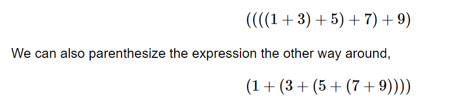
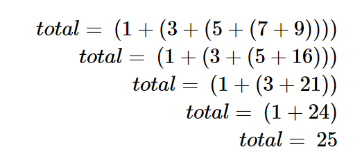

# Recursion

## Contents

 - **Concepts:**
   - [Intro to Recursion](#intro-to-recursion)
   - [The problem of summing elements of a list](#initial-problem)
   - [The three laws of Recursion](#recursion-laws)
 - **Complexity of Recursive Algorithms:**
   - [Tip for Recursion Time Complexity](#tip-rtc)
 - **Tips & Tricks:**
   - [Recurrence vs. Recursion](#recurrence-relation-vs-recursion)
   - [Recursion vs. Iteration](#recursion-vs-iteration)
   - [Finite vs. Infinite Recursion](#finite-vs-infinite-recursion)
   - [Recursion vs. Induction](#recursion-vs-induction)
 - [References](#ref)


<!--- ( Concepts ) --->

---

<div id="intro-to-recursion"></div>

## Intro to Recursion

 - **EN -** The *Recursion* is a method of solving problems that involves breaking a problem down into smaller and smaller subproblems until you get to a small enough problem that it can be solved trivially:
   - Usually recursion involves a function calling itself.
 - **PT -** A *Recursão* é um método de resolver problemas que envolve dividir um problema em subproblemas cada vez menores até chegar a um problema pequeno o suficiente para que possa ser resolvido trivialmente:
   - Normalmente, a recursão envolve uma função chamando a si mesma.

**Recursion has some important properties. Some of which are mentioned below:**

 - The primary property of recursion is the ability to solve a problem by breaking it down into smaller sub-problems, each of which can be solved in the same way.
 - A recursive function must have a *base case* or *stopping criteria* **to avoid infinite recursion**.
 - Recursion involves calling the same function within itself, which leads (leva) to a call stack (pilha de chamadas).
 - Recursive functions may be less efficient than iterative solutions in terms of memory and performance.

---

<div id="initial-problem"></div>

## The problem of summing elements of a list

To understand how to solve problems using Recursion, let's imagine that we need to sum all the elements of a given list, like this below:

```bash
[1, 3, 5, 7, 9]
```

If you think mathematically you can parenthesize this list, making an add algebraic expression. For example:

  

Notice that the innermost (mais interno) set of parentheses, *(7 + 9)*, is a problem that we can solve without a loop or any special constructs. In fact, we can use the following sequence of simplifications to compute a final sum:

  

Another approach to solve this is using iterative programming (using a loop). For example, see the function implementation below:

**Python:** [driver_sumElements_iterative_approach.py](src/python/driver_sumElements_iterative_approach.py)
```python
def sumElements(myList: list[int]) -> int:
    sum = 0
    for element in myList:
        sum += element
    return sum


if __name__ == "__main__":
    myList: list[int] = [1, 3, 5, 7, 9]
    print("The sum of all element is:", sumElements(myList))
```

**INTPUT:**
```bash
python driver_sumElements_iterative_approach.py
```

**OUTPUT:**
```bash
The sum of all element is: 25
```

The **Time Complexity** of the **sumElements()** function is:

 - **Time Complexity:**
   - **[Worst Case] - Big O(O)** 
     - **O(n):** In the *worst case*, the time complexity of this function is **O(n)**, where **"n"** is the number of elements in the vector. This happens when the vector is completely filled, and we need to iterate over all the elements to perform the sum. In this case, the function has to iterate over each element of the vector once, adding them to the total sum.
   - **[Best Case] - Omega (Ω)**
     - **Ω(1):** In the *best case*, the time complexity is O(1), which occurs when the vector:
       - The list empty.
       - The list has only 1 element.
       - In these two cases, we have a constant *Time Complexity*.

---

<div id="recursion-laws"></div>

## The three laws of Recursion

Like the robots of Asimov, all recursive algorithms must obey (devem obedecer) three important laws:

 - **1. A recursive algorithm must have (deve ter) a *base case*:**
   - Um algoritmo recursivo deve ter um *caso base*.
 - **2. A recursive algorithm must change (deve mudar) its state and move toward (em direção) the base case:**
   - Um algoritmo recursivo deve mudar seu estado e se mover em direção ao caso base.
 - **3. A recursive algorithm must call itself (deve chamar a si mesmo), recursively:**
   - Um algoritmo recursivo deve chamar a si mesmo, recursivamente.

Back to our [**Problem of calculating the sum of a list of numbers**](#initial-problem) we can use the *"The three laws of Recursion"* to try to solve using Recursion:

 - **1. A recursive algorithm must have (deve ter) a *base case*:**
   - First, a *base case* is the condition that allows the algorithm to stop recursing.
   - In the sumElements() algorithm (function) the base case is a list of length 1.
 - **2. A recursive algorithm must change (deve mudar) its state and move toward the base case:**
   - To obey (para obedecer) the second law, we must arrange (devemos providenciar) for a change of state that moves the algorithm toward (em direção) the base case.
   -  A change of state means that some data that the algorithm is using is modified.
   - Usually the data that represents our problem gets smaller (ficam menores) in some way (de alguma forma).
   - In the sumElements() algorithm (function) our primary data structure is a *list*, so we must focus our state-changing efforts on the list.
   - Since (como) the *base case* is a *list of length 1*, a natural progression toward (em direção) the base case is to shorten the list.
 - **3. A recursive algorithm must call itself (deve chamar a si mesmo), recursively:**
   - The final law is that the algorithm (function) must call itself (deve chamar ela mesmo).

Following these laws, let's get started with the **base case (first law)**, that's, the recursion stop when the *list size = 1*:

**Python:**
```python
def sumElementsRecursive(myList: list[int]) -> int:
    if len(myList) == 1:  # Base case.
        return myList[0]
```

Following the second law, now we need to **change the state to go toward (para ir em direção)** the base **case**:

> **NOTE:**  
> Remember, that, a change of state means that some data that the algorithm is using is modified. For our case, the list is modified toward the base.

**Python:**
```python
def sumElementsRecursive(myList: list[int]) -> int:
    if len(myList) == 1:  # Base case.
        return myList[0]
    else:
        lastElement = myList[-1]  # Get the last element.
        newList = myList[:-1]  # Remove the last element from the list.
```

**NOTE:**  
See that we are removing the last element, that's, we are changing the state to go toward (para ir em direção) the *base case*, list size = 1.

Finally, following the third law, we need to call the algorithm (function) itself.

**Python:**
```python
def sumElementsRecursive(myList: list[int]) -> int:
    if len(myList) == 1:  # Base case.
        return myList[0]
    else:
        lastElement = myList[-1]  # Get the last element.
        newList = myList[:-1]  # Remove the last element from the list.
        sum = lastElement + sumElementsRecursive(newList)  # Recursive call.
        return sum
```

See, the complete code to **sumElementsRecursive()** algorithms (function) below:

**Python:** [driver_sumElements_recursive_approach.py](src/python/driver_sumElements_recursive_approach.py)
```python
def sumElementsRecursive(myList: list[int]) -> int:
    if len(myList) == 1:  # Base case.
        return myList[0]
    else:
        lastElement = myList[-1]  # Get the last element.
        newList = myList[:-1]  # Remove the last element from the list.
        sum = lastElement + sumElementsRecursive(newList)  # Recursive call.
        return sum


if __name__ == "__main__":
    myList: list[int] = [1, 3, 5, 7, 9]
    print("The sum of all element is:", sumElementsRecursive(myList))
```

**INTPUT:**
```bash
python driver_sumElements_recursive_approach.py
```

**OUTPUT:**
```bash
The sum of all element is: 25
```

The **Time** and **Space complexity** of the **sumElementsRecursive()** algorithm (function) is:

 - **Time Complexity:**
   - **[Worst Case] - Big O(O)** 
     - **O(n):** The *worst-case time complexity* occurs when the function needs to iterate through all the elements of the list. In this case, the function will make a recursive call for each element of the list, resulting in complete recursion. Therefore, the worst-case time complexity is **O(n)**, where **"n"** is the number of elements in the list.
   - **[Best Case] - Omega (Ω)**
     - **Ω(1):** The *best-case time complexity* occurs when the function reaches (atinge) the base case immediately, i.e., when the list has only one element. In this case, the function returns the value of the single element without the need for recursive calls. Therefore, the *best-case time complexity* is **O(1)**, as the execution time is *constant*.


<!--- ( Complexity of Recursive Algorithms ) --->

---

<div id="tip-rtc"></div>

## Tip for Recursion Time Complexity

> The **Time Complexity of Recursion** *depends on the number of times the function calls itself*.

 - If a function calls itself one times then its *time complexity* is **O(N)**:
   - Linear time complexity.
 - If a function calls itself two times then its *time complexity* is **O(2<sup>N</sup>)**:
   - Exponential time complexity.
 - If a function calls itself three times then its *time complexity* is **O(3<sup>N</sup>)**:
   - Exponential time complexity.


<!--- ( Tips & Tricks ) -->

---

<div id="recurrence-relation-vs-recursion"></div>

## Recurrence vs. Recursion

> **Recurrence** and **Recursion** are related concepts, but they are not exactly the same thing.

### Recurrence

> Recurrence refers to a mathematical relationship or equation that describes a sequence or a function in terms of its previous terms.

In other words, a recurrence is a formula that allows for calculating subsequent values based on earlier values (valores anteriores).

For example, the **Fibonacci sequence** is defined by a recurrence where each number is the sum of the two preceding numbers:

```cpp
F(n) = F(n-1) + F(n-2)

with
    F(0) = 0 and F(1) = 1.
```

### Recursion

> Recursion, on the other hand, is a concept used in programming to solve problems by breaking them down into smaller subproblems and solving them recursively.


 - **In summary:**
   - Recurrence refers to a mathematical relationship that describes a sequence or function in terms of its previous terms.
   - While recursion is a programming technique that involves a function calling itself to solve problems recursively.

---

<div id="recursion-vs-iteration"></div>

## Recursion vs. Iteration

 - A program (or function) is called **recursive** when calls itself.
 - A program (or function) is called **iterative** when there is a loop (or repetition).

See the examples of functions **recursive** and **iterative** below:

**Python:** [driver_recursion_vs_iteration.py](src/python/driver_recursion_vs_iteration.py)
```python
# ----- Recursion -----
# method to find factorial of given number.
def factorialUsingRecursion(n):
    if n == 0:  # Base case.
        return 1
    return n * factorialUsingRecursion(n - 1)  # Recursion call.


# ----- Iteration -----
# Method to find the factorial of a given number.
def factorialUsingIteration(n):
    res = 1
    for i in range(2, n + 1):  # Using iteration.
        res *= i
    return res


if __name__ == "__main__":
    print("Enter a number to find the factorial: ", end="")
    num = int(input())
    print("Factorial of", num, "using Recursion is:", factorialUsingRecursion(num))
    print("Factorial of", num, "using Iteration is:", factorialUsingIteration(num))
```

**INTPUT:**
```bash
python driver_recursion_vs_iteration.py
```

**OUTPUT:**
```bash
Enter a number to find the factorial: 5
Factorial of 5 using Recursion is: 120
Factorial of 5 using Iteration is: 120
```

---

<div id="finite-vs-infinite-recursion"></div>

## Finite vs. Infinite Recursion

### Finite Recursion

Finite Recursion occurs when the recursion terminates after a finite number of recursive calls.

> A recursion terminates only when a **base condition** is met (atendida).

For example, below is an implementation to demonstrate **Finite Recursion**:

**Python:** [driver_finite_recursion.py](src/python/driver_finite_recursion.py)
```python
# Recursive function.
def Geek(N):
    if N == 0:  # Base case.
        return
    print(N, end=" ")  # Print the current value of "N".
    Geek(N - 1)  # Call itself recursively.


if __name__ == "__main__":
    N = 5  # Initial value of "N".
    Geek(N)  # Call the recursive function.
```

**INTPUT:**
```bash
python driver_finite_recursion.py 
```

**OUTPUT:**
```bash
5 4 3 2 1
```

> **NOTE:**  
> The **Time complexity** of the **Geek()** function is **O(n)**.

The recursion tree for the above recursive function looks like this:

  

> **NOTE:**  
> When the value of **"N"** becomes **0**, we have a Base Case and, the recursion terminates.

### Infinite Recursion

Infinite Recursion occurs when the recursion does not terminate after a finite number of recursive calls.

> As the base condition is never met (atendida), the recursion carries on infinitely.

For example, below is an implementation to demonstrate **Infinite Recursion**:

**Python:** [driver_infinite_recursion.py](src/python/driver_infinite_recursion.py)
```python
# Recursive function.
def Geek(N):
    if N == 0:  # Base case.
        return
    print(N, end=" ")  # Print the current value of "N".
    Geek(N)  # Call itself recursively.


if __name__ == "__main__":
    N = 5  # Initial value of "N".
    Geek(N)  # Call the recursive function.
```

**INTPUT:**
```bash
python driver_infinite_recursion.py
```

**OUTPUT:**
```bash
5 5 5 5 5 5 5 5 ..... 5 5 5 5 5 Until stack full.

RecursionError: maximum recursion depth exceeded while getting the str of an object
```

 - **Time Complexity:**
   - Non finite as this recursion will never end.
 - **Auxiliary Space:**
   - non finite.

The recursion tree for the above recursive function looks like this:

  

**NOTE:**  
Since the value of **"N"** never becomes **0**, so the recursion never terminates. Instead, the recursion continues until the implicit stack becomes full which results in a **Stack Overflow**.

---

<div id="recursion-vs-induction"></div>

## Recursion vs. Induction

> **Recursion** and **Induction** belong (pertecem) to the branch (ramo) of Mathematics, these terms are used interchangeably (intercambiáveies). But there are some differences between these terms.

### Recursion

 - Recursion is a process in which a function gets repeated again and again until some *Base Case* of the function is satisfied.
 - It repeats and uses its previous values to form a sequence.
 - The procedure applies a certain relation to the given function again and again until some *Base Case* condition is met (atendida). It consists of two components:
   - **Base (Case) condition:**
     - In order to stop a recursive function, a condition is needed. This is known as a *Base (Case) condition*.
     - Base (Case) condition is very important. If the *Base (Case) condition* is missing from the code then the function can enter into an *infinite loop*. 
   - **Recursive step:**
     - It divides a big problem into small instances that are solved by the recursive function and later on recombined in the results.

### Induction

> Induction is the branch (ramo) of mathematics that is used to prove (provar) *a result*, *or a formula*, *or a statement*, *or a theorem*.

It is used to establish the validity of a theorem or result. It has two working rules:

 - **1) Base Step:**
   - It helps us to prove that the given statement is true for some initial value. 
 - **2) Inductive Step:**
   - It states (afirma) that if the theorem is true for the *nth term*, then the statement is true for *(n+1)th term*. 

### Some differences between Recursion and Induction are:

| Recursion | Induction |
|-----------|-----------|
|Recursion is the process in which a function is called again and again until some base condition is met (atendida).|Induction is the way of proving a mathematical statement.|
|Recursive function is always called to find successive terms.|Here statements or theorems are proved and no terms are found.|
|It can lead (pode levar) to infinity if no base condition is given.|There is no concept of infinity.|


<!--- ( References ) --->

---

<div id="ref"></div>

## References

 - [Problem Solving with Algorithms and Data Structures using Python](https://runestone.academy/ns/books/published/pythonds/index.html)
 - [Difference between Recursion and Iteration](https://www.geeksforgeeks.org/difference-between-recursion-and-iteration/)
 - [Finite and Infinite Recursion with examples](https://www.geeksforgeeks.org/finite-and-infinite-recursion-with-examples/)
 - [Difference Between Recursion and Induction](https://www.geeksforgeeks.org/difference-between-recursion-and-induction/)
 - [How to analyse Complexity of Recurrence Relation](https://www.geeksforgeeks.org/how-to-analyse-complexity-of-recurrence-relation/)
 - [What is Recursion?](https://www.geeksforgeeks.org/what-is-recursion/)

---

Ro**drigo** **L**eite da **S**ilva - **drigols**
