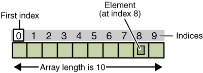

# Arrays, Vectors, Strings

## Contents

 - **Array Operations:**
   - [Traversing (from the beginning) | O(n)](#traversing-from-the-beginning)
   - [Set element by index | O(1)](#set-element-by-index)
   - [Get element by index | O(1)](#get-element-by-index)
 - **Tips & Tricks:**
   - [The duplicates items issue](#the-duplicates-issue)
 - [REFERENCES](#ref)
<!---
[WHITESPACE RULES]
- Same topic = "10" Whitespace character.
- Different topic = "50" Whitespace character.
--->


<!--- ( Array Operations ) --->

---

<div id="traversing-from-the-beginning"></div>

## Traversing (from the beginning) | O(n)

Here, let's see how to implement the **traverse()** method to traverse the array from the beginning:

<details>
<summary>Python</summary>

<br/>

> In Python to traversing an array is very easy. You just need to traverse all elements in the **"self.arr"** variable.

[Array.py](src/python/Array.py)
```python
def traverse(self):
    for index, _ in enumerate(self.arr):                   # O(n)
        print(f"Index: {index}, Item: {self.arr[index]}")  # O(1)
```

$f(n) = O(n) + O(1) = O(n)$

### Complexity Explanation

 - **Time Complexity: O(n)**
   - The "for" loop iterates **"n"** times, so its complexity is **O(n)**.
   - Inside the loop, the print operation has **constant O(1)** complexity.
   - Since the loop repeats **"n"** times, the total cost becomes: $n \times O(1) = O(n)$.
 - **Space Complexity: O(1)**
   - The *Space Complexity* is **O(1)** because it only uses a constant amount of additional space to store the index and item variables.
   - Also the "for" loop does not create any additional data structures.

Let's see how it works in practice:

```python
from Array import StaticArray

if __name__ == "__main__":

    myArray = StaticArray(size=5)
    myArray.traverse()

    myArray.arr[0] = 10
    myArray.arr[1] = 20
    myArray.arr[2] = 30
    myArray.arr[3] = 40
    myArray.arr[4] = 50

    myArray.traverse()
```

**OUTPUT:**
```bash
Index: 0, Item: None
Index: 1, Item: None
Index: 2, Item: None
Index: 3, Item: None
Index: 4, Item: None

Index: 0, Item: 10
Index: 1, Item: 20
Index: 2, Item: 30
Index: 3, Item: 40
Index: 4, Item: 50
```

</details>


---

<div id="set-element-by-index"></div>

## Set element by index | O(1)

Here, let's see how to implement the **set_element_by_index()** method to set an element at a specific index:

  

<details>
<summary>Python</summary>

<br/>

[Array.py](src/python/Array.py)
```python
def set_element_by_index(self, index, element):
    if not (0 <= index < len(self.arr)):  # O(1)
        raise IndexError                  # O(1)
    self.arr[index] = element             # O(1)
    self.nItems += 1                      # O(1)
```

$f(n) = O(1) + O(1) + O(1) + O(1) = O(1)$

### Complexity Explanation

 - **Time Complexity: O(1)**
   - The overall *Time Complexity* of the code is **O(1)**, as all operations within the code block have constant time complexity.
 - **Space Complexity: O(1)**
   - The *Space Complexity* of this function is also **O(1)** because it does not use any additional space that grows with the input size.

### Code explanation

 - **To understand the code `"if not (0 <= index < len(self.arr))"`, let's see the some examples below:**
   - **But first, we need to know that Python expressions are read from left to right *(left->right)*.**
   - **Imagine we pass the index=0 and the array size is 5:**
     - `(0 <= 0 < 5)`, we read as:
       - `0 <= 0:` Zero is less or equal to zero? **True**
       - AND
       - `0 < 5:` Zero is less than five? **True**
       - **True AND True = True**
       - **NOTE:** Remember we use the **"not"** statement to invert the result. That's, if we pass by indexing test (if) the **"not"** statement does the if *False* and continues the function flow.
   - **Imagine we pass the index=5 and the array size is 5:**
     - `(0 <= 5 < 5)`, we read as:
       - `0 <= 5:` Zero is less or equal to five? **True**
       - AND
       - `5 < 5:` Five is less than five? **False**
       - **True AND False = False**
       - **NOTE:** Remember we use the **"not"** statement to invert the result. That's, now our test (if) is True and we raise an exception.
 - **`self.arr[index] = element`**
   - Here we assign the element to the passed index.
 - **`self.nItems += 1`**
   - Finally, we increment the number of elements in the array.

Let's see how it works in practice:

```python
from Array import StaticArray

if __name__ == "__main__":

    myArray = StaticArray(size=5)

    myArray.set_element_by_index(index=0, element=1)
    myArray.traverse()
    print("")

    myArray.set_element_by_index(index=1, element=2)
    myArray.traverse()
    print("")

    myArray.set_element_by_index(index=2, element=3)
    myArray.traverse()
    print("")

    myArray.set_element_by_index(index=3, element=4)
    myArray.traverse()
    print("")

    myArray.set_element_by_index(index=4, element=5)
    myArray.traverse()
    print("")

    myArray.set_element_by_index(index=5, element=5)  # ERROR!
```

**OUTPUT:**
```bash
Index: 0, Item: 1
Index: 1, Item: None
Index: 2, Item: None
Index: 3, Item: None
Index: 4, Item: None

Index: 0, Item: 1
Index: 1, Item: 2
Index: 2, Item: None
Index: 3, Item: None
Index: 4, Item: None

Index: 0, Item: 1
Index: 1, Item: 2
Index: 2, Item: 3
Index: 3, Item: None
Index: 4, Item: None

Index: 0, Item: 1
Index: 1, Item: 2
Index: 2, Item: 3
Index: 3, Item: 4
Index: 4, Item: None

Index: 0, Item: 1
Index: 1, Item: 2
Index: 2, Item: 3
Index: 3, Item: 4
Index: 4, Item: 5

Traceback (most recent call last):
  File test.py", line 27, in <module>
    myArray.set_element_by_index(index=5, element=5)  # ERROR!
    ^^^^^^^^^^^^^^^^^^^^^^^^^^^^^^^^^^^^^^^^^^^^^^^^
  File ....
   set_element_by_index
    raise IndexError
IndexError
```

</details>


---

<div id="get-element-by-index"></div>

## Get element by index | O(1)

Here, let's see how we can retrieve an element from an array by its index:

  

<details>
<summary>Python</summary>

<br/>

[Array.py](src/python/Array.py)
```python
def get_element_by_index(self, index):
    if not (0 <= index < len(self.arr)):  # O(1)
        raise IndexError                  # O(1)
    return self.arr[index]                # O(1)
```

$f(n) = O(1) + O(1) + O(1) = O(1)$

### Complexity Explanation

 - **Time Complexity: O(1)**
   - The overall *Time Complexity* of the code is **O(1)**, as all operations within the code block have constant time complexity.
 - **Space Complexity: O(1)**
   - The *Space Complexity* of this function is also **O(1)** because it does not use any additional space that grows with the input size.

### Code explanation

 - **To understand the code `"if not (0 <= index < len(self.arr))"`, let's see the some examples below:**
   - **But first, we need to know that Python expressions are read from left to right *(left->right)*.**
   - **Imagine we pass the index=0 and the array size is 5:**
     - `(0 <= 0 < 5)`, we read as:
       - `0 <= 0:` Zero is less or equal to zero? **True**
       - AND
       - `0 < 5:` Zero is less than five? **True**
       - **True AND True = True**
       - **NOTE:** Remember we use the **"not"** statement to invert the result. That's, if we pass by indexing test (if) the **"not"** statement does the if *False* and continues the function flow.
   - **Imagine we pass the index=5 and the array size is 5:**
     - `(0 <= 5 < 5)`, we read as:
       - `0 <= 5:` Zero is less or equal to five? **True**
       - AND
       - `5 < 5:` Five is less than five? **False**
       - **True AND False = False**
       - **NOTE:** Remember we use the **"not"** statement to invert the result. That's, now our test (if) is True and we raise an exception.
 - **`return self.arr[index]`**
   - Finally, we return the element from the passed index.

Let's see how it works in practice:

```python
from Array import StaticArray

if __name__ == "__main__":

    myArray = StaticArray(size=5)


    myArray.set_element_by_index(index=0, element=1)
    myArray.set_element_by_index(index=1, element=2)
    myArray.set_element_by_index(index=2, element=3)
    myArray.set_element_by_index(index=3, element=4)
    myArray.set_element_by_index(index=4, element=5)

    result_one = myArray.get_element_by_index(index=3)
    print(result_one)

    result_error = myArray.get_element_by_index(index=5)  # ERROR!
    print(result_error)
```

**OUTPUT:**
```bash
4

Traceback (most recent call last):
  File
    result_error = myArray.get_element_by_index(index=5)  # ERROR!
                   ^^^^^^^^^^^^^^^^^^^^^^^^^^^^^^^^^^^^^
  File
    raise IndexError
IndexError
```

</details>


---

<!--- ( Tips & Tricks ) --->

<div id="the-duplicates-issue"></div>

## The duplicates items issue

> To understand **"the duplicates items issue"** see the two examples below.

### Searching without Duplicates

When you design a data storage structure, you need to decide whether items with duplicate keys will be allowed.

 - If you’re writing a data storage program in which duplicates are not allowed, you may need to guard against human error during an insertion.
 - Checking all the data items in the array to ensure (garantir) that not one of them already has the same key value as the item being inserted.
 - **NOTE:** This check increases the steps required for an insertion from *1* to *N*:
   - This is because the Algorithm now needs to check all elements, that's, "N" times.

### Searching with Duplicates

 - Allowing duplicates complicates the search algorithm. Even if the search finds a match, it must continue looking for possible additional matches until the last occupied cell.
 - At least, this is one approach; you could also stop after the first match and perform subsequent searches after that.
 - How you proceed depends on whether the question is:
   - “Find me everyone with the family name of Smith”.
   - “Find me someone with the family name of Smith”.
   - “Find how many entries have the family name Smith”.
 - Finding all items matching a search key is an exhaustive search.
 - **NOTE:** Exhaustive searches require *N* steps because the algorithm must go all the way to the last occupied cell, regardless of what is being sought.

> **NOTE:**
> You need to worry about duplicate items to **Insertion**, **Deletion**, **Traversal**, and **Search**.


<!--- ( REFERENCES ) --->

---

<div id="ref"></div>

## REFERENCES

 - **General:**
   - [Introduction To Algorithms (6.006 | Spring 2020 | Undergraduate)](https://ocw.mit.edu/courses/6-006-introduction-to-algorithms-spring-2020/)
   - [Data Structures & Algorithms in Python](https://learning.oreilly.com/library/view/data-structures/9780134855912/)
   - [Runtime Calculator](https://www.timecomplexity.ai/)
   - [Big O Calc](https://www.bigocalc.com/)
   - [ChatGPT](https://chat.openai.com/)
   - [Bard](https://bard.google.com/)

---

**Rodrigo** **L**eite da **S**ilva - **drigols**
