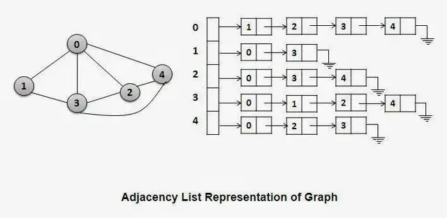
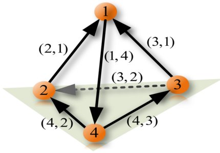
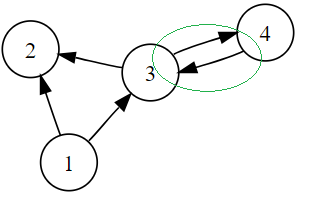

# Graphs

## Contents

 - **Basics:**
   - [Intro to Graphs (Vertex/Node, Edge, Weight, Adjacency, Path, Cycle)](#intro-to-graphs)
 - [**Undirected Graphs**](#undirected-graph)
   - [Adjacency Matrix for Undirected Graphs](#adj-matrix-for-ug)
     - [Adjacency Matrix class using Array (n x n) for Undirected Graph | O(n<sup>2</sup>)](#amcuafug)
       - [Print an Adjacency Matrix for an Undirected Graph | O(n<sup>2</sup>)](#amcuafug-print)
       - [Add an edge on the Adjacency Matrix for an Undirected Graph | O(1)](#amcuafug-addedge)
       - [Add "edge weights" on the Adjacency Matrix for an Undirected Graph | O(1)](#amcuafug-addweights)
       - [Remove an Edge on the Adjacency Matrix for an Undirected Graph | O(1)](#amcuafug-remove)
   - [Adjacency List for Undirected Graphs](#adj-list-for-ug)
     - [Adjacency List class using Array (n) for an Undirected Graph | (n) or O(V)](#alcuafaug)
       - [Add a Vertex on the Adjacency List for an Undirected Graph | O(1)](#alcuafaug-addvertex)
 - [**Directed Graphs**](#directed-graph)
 - **Tips & Tricks:**
   - [Add and Remove problem (Index out of range)](#add-remove-problem-01)
   - [Add and Remove problem (Add the same edge twice)](#add-remove-problem-02)
 - [REFERENCES](#ref)


<!--- ( Basics ) --->

---

<div id="intro-to-graphs"></div>

## Intro to Graphs (Vertex/Node, Edge, Weight, Adjacency, Path, Cycle)

> A ***Graph*** is a *non-linear* data structure consisting of **vertices (nodes)** and **edges**.

 - The vertices are sometimes also referred to as nodes.
 - The edges are lines or arcs that connect any two vertices (nodes) in the graph.

**NOTE:**  
More formally a *Graph* is composed of **"a set of vertices (V)"** and **"a set of edges (E)"**.

A Graph is denoted by **"G(V, E)"**. For example:

```bash
V = {0, 1, 2, 3}  # Set of vertices.
E = {(0, 1), (0, 2), (0, 3), (1, 2)}  # Set of edges.

G = {V, E}  # The Graph.
```

The **visual graph** to the above example is:

  

Looking at the example above we have more two concepts of graphs: 

 - **Adjacency:**
   - A *vertex* is said to be `adjacent` to another *vertex* if there is an edge connecting them.
   - **NOTE:** Looking at our visual example Vertices 2 and 3 are not adjacent because there is no edge between them.
 - **Path:**
   - A sequence of edges that allows you to go from vertex A to vertex B is called a path.
   - **NOTE:** Looking at our visual example *0-1* and *1-2* is a paths from *vertex 0* to *vertex 2*.

### Graphs with "weights"

 - *Edges* may be **weighted** to show that there is a cost to go from one vertex to another.
 - For example in a graph of roads that connect one city to another, the *weight* on the *edge* might represent the distance between the two cities.

For example, imagine we have a **"Graph = (V, E)"**, denoted by:

  

> **NOTES:**  
> See that again we have a **"set of vertices"** and a **"set of edges"**. However, `"our edges have weights"`.

See the graph for our example below:

  

 - **Cycle:**
   - A *Cycle* in a graph is a path that starts and ends at the same vertex:
     - For example, in our example above the path **(V5, V2, V3, V5)** is a cycle.
   - **NOTE:** A graph with no cycles is called an **"Acyclic Graph"**.
   - **NOTE:** A *Directed Graph* with no cycles is called a **Directed Acyclic Graph** or a **DAG**:
     - We will see that we can solve several important problems if the problem can be represented as a **DAG**.


<!--- ( Undirected Graphs ) --->

---

<div id="undirected-graph"></div>

## Undirected Graphs

An ***"Undirected Graphs (Symmetry or Bidirectional)"*** is a *graph* where the *edges* do not have a specific direction and it is `bidirectional` in nature it does not have a parent-child relation concept as there is no particular direction.

For example:

  

#### Undirected Graph is Symmetry

 - *Symmetry* is present in the undirected graph as each edge is `bidirectional`, so it’s not like anyone’s the boss.
 - The graph is connected, so you can always find a way to get to any node you want to, and the degree of each vertex tells you how popular that node is in the graph.

#### Algorithms for Undirected Graphs

 - **Depth-First Search (DFS).**
 - **Breadth-First Search (BFS).**

---

<div id="adj-matrix-for-ug"></div>

## Adjacency Matrix for Undirected Graphs

An ***Adjacency Matrix*** is one of the most popular ways to represent a graph because it's the easiest one to understand, implement and works reasonably well for many applications.

 - It uses an **"nxn matrix"** to represent a graph *(where "n" is the number of vertices in the graph)*.
   - In other words, the number of rows and columns is equal to the number of vertices in the graph.

To understand more easily, see the **Undirected Graph** and your **Adjacency Matrix** example below:

  

---

<div id="amcuafug"></div>

## Adjacency Matrix class using Array (n x n) for Undirected Graph | O(n<sup>2</sup>)

Now, let's see how to implement an **Adjacency Matrix class** using Array (n x n) starting with the *constructor*:

[graphs.py](src/python/graphs.py)
```python
class AdjacencyMatrix:
    def __init__(self, n):
        self.n = n                                               # O(1)
        self.matrix = [[0 for _ in range(n)] for _ in range(n)]  # O(n^2)
```

$f(n) = O(1) + O(n^2)$

#### Complexity Explanation

 - **Time Complexity: O(n<sup>2</sup>)**
   - The *Time Complexity* of the `__init__` method is **O(n<sup>2</sup>)** because it initializes a *2D matrix* of size *n x n*, which requires iterating over **"n"** rows and **"n"** columns.
 - **Space Complexity: O(n<sup>2</sup>)**
   - The *Space Complexity* of the `__init__` method is also **O(n<sup>2</sup>)** because it creates a *2D matrix* of size *n x n*, which requires **n<sup>2</sup>** memory space.

#### Code Explanation

 - **We have "n" instance variable:**
   - That's, the number of vertices on the Graph.
 - **Next, we create a matrix of size equal to the number of vertices "n" passed to the constructor:**
   - `self.matrix = [[0 for _ in range(n)] for _ in range(n)]`
     - Creates a *2D list (matrix)* with *"n rows"* and *"n columns"*, filled with *0s*:
       - Each row and column represents a vertex (node) in the graph.
       - The value at `matrix[i][j]` will indicate whether there's an edge between node `i` and vertex (node) `j`.

Now, let's test in the practice:

```python
from graphs import AdjacencyMatrix

if __name__ == "__main__":

    g1 = AdjacencyMatrix(1)
    print(g1.matrix)

    g2 = AdjacencyMatrix(2)
    print(g2.matrix)

    g3 = AdjacencyMatrix(3)
    print(g3.matrix)

    g4 = AdjacencyMatrix(4)
    print(g4.matrix)

    g5 = AdjacencyMatrix(5)
    print(g5.matrix)
```

**OUTPUT:**
```bash
[[0]]
[[0, 0], [0, 0]]
[[0, 0, 0], [0, 0, 0], [0, 0, 0]]
[[0, 0, 0, 0], [0, 0, 0, 0], [0, 0, 0, 0], [0, 0, 0, 0]]
[[0, 0, 0, 0, 0], [0, 0, 0, 0, 0], [0, 0, 0, 0, 0], [0, 0, 0, 0, 0], [0, 0, 0, 0, 0]]
```

---

<div id="amcuafug-print"></div>

## Print an Adjacency Matrix for an Undirected Graph | O(n<sup>2</sup>)

[graphs.py](src/python/graphs.py)
```python
def print_adjacency_matrix(self):
    for row in self.matrix:  # O(n)
        print(row)           # O(n)
```

$f(n) = O(n) * O(n) = O(n^2)$

#### Complexity Explanation

 - **Time Complexity: O(n<sup>2</sup>)**
   - The *Time Complexity* of this function is **O(n<sup>2</sup>)**, where **"n"** is the number of vertices in the graph. This is because the function visits each element in the matrix exactly once.
   - The nested nature of these operations (looping over rows and printing elements within each row) results in a quadratic time complexity of **O(n<sup>2</sup>)** in the **Worst Case**.
 - **Space Complexity: O(1)**
   - The *Space Complexity* of this function is **O(1)**, because it doesn't use any additional space.

#### Code Explanation

 - `for row in self.matrix:`
   - Iterates through each row of the matrix attribute (which stores the adjacency information) using a for loop.
 - `print(row)`
   - Prints the current row to the console, displaying the connections from that node to other nodes.
   - Each value in the row indicates the presence or absence of an edge to a corresponding node.

Let's see how it works in practice:

```python
from graphs import AdjacencyMatrix

if __name__ == "__main__":

    graph = AdjacencyMatrix(4)
    graph.print_adjacency_matrix()
```

**OUTPUT:**
```bash
[0, 0, 0, 0]
[0, 0, 0, 0]
[0, 0, 0, 0]
[0, 0, 0, 0]
```

---

<div id="amcuafug-addedge"></div>

## Add an edge on the Adjacency Matrix for an Undirected Graph | O(1)

Ok, now let's see how to add an edge between two vertices (source->destination) on the **Adjacency Matrix** to an **Undirected Graph:**

[graphs.py](src/python/graphs.py)
```python
def add_edge(self, source, destination):
    self.adj_matrix[source][destination] = 1  # O(1)
    self.adj_matrix[destination][source] = 1  # O(1)
```

$f(n) = O(1) + O(1) = O(1)$

#### Complexity Explanation

 - **Time Complexity: O(1)**
   - The *Time Complexity* of this function is **O(1)** because it performs a constant number of operations regardless of the size of the input. It simply assigns values to two elements in the Adjacency Matrix.
 - **Space Complexity: O(1)**
   - The *Space Complexity* is also **O(1)** because it does not use any additional space that grows with the size of the input. It only modifies the existing adjacency matrix.

#### Code Explanation

 - **source:**
   - The *"source"* is the exit *point (vertex)*.
   - The *"row"* in the *Adjacency Matrix* represents the *point (vertex)* of departure (saída).
 - **destination:**
   - The *"destination"* is the *point (vertex)* of arrival (chegada).
   - The *"column"* in the *Adjacency Matrix* represents the *point (vertex)* of arrival (chegada).
 - **In an "Undirected Graph", an edge between two vertices is "bidirectional":**
   - Meaning it can be traversed in both directions. Therefore, when adding an edge between vertices *"source"* and *"destination"*, you need to reflect this connection in both directions in the adjacency matrix:
     - This is because some problems need symmetric representations.
     - `"self.adj_matrix[source][destination] = 1"`
     - `"self.adj_matrix[destination][source] = 1"`

Let's see how it works in practice:

```python
from graphs import AdjacencyMatrix

if __name__ == "__main__":

    graph = AdjacencyMatrix(4)

    graph.add_edge(0, 1)
    graph.add_edge(0, 3)
    graph.add_edge(2, 1)
    graph.add_edge(2, 3)

    graph.print_adjacency_matrix()
```

**OUTPUT:**
```bash
[0, 1, 0, 1]
[1, 0, 1, 0]
[0, 1, 0, 1]
[1, 0, 1, 0]
```

  

---

<div id="amcuafug-addweights"></div>

## Add "edge weights" on the Adjacency Matrix for an Undirected Graph | O(1)

We can also design an **Adjacency Matrix** to represent the *weight of the Graph*. For example:

  

Now, let's implement a method to insert an Edge on the **Adjacency Matrix** based on *weights*:

[graphs.py](src/python/graphs.py)
```python
def add_edge_based_weight(self, source, destination, weight):
    self.adj_matrix[source][destination] = weight  # O(1)
    self.adj_matrix[destination][source] = weight  # O(1)
```

$f(n) = O(1) + O(1) = O(1)$

#### Complexity Explanation

 - **Time Complexity: O(1)**
   - The *Time Complexity* of this function is **O(1)** because it performs a constant number of operations regardless of the size of the adjacency matrix. It simply assigns the weight to the corresponding positions in the matrix.
 - **Space Complexity: O(1)**
   - The *Space Complexity* is also **O(1)** because it does not use any additional space that grows with the input size. It only modifies the existing adjacency matrix.

#### Code Explanation

**NOTE:**  
See that like the old approach, we also use the **"source"** and **"destination"** to locate the `intersection` on the Matrix between the two vertices. However, here we assign the **"weight"** on the Matrix, not one (1).

Let's see how it works in practice:

```python
from graphs import AdjacencyMatrix

if __name__ == "__main__":

    graph = AdjacencyMatrix(5)

    graph.add_edge_based_weight(0, 1, 2)
    graph.add_edge_based_weight(0, 2, 3)

    graph.add_edge_based_weight(1, 2, 15)
    graph.add_edge_based_weight(1, 3, 2)

    graph.add_edge_based_weight(3, 4, 9)

    graph.add_edge_based_weight(4, 2, 13)

    graph.print_adjacency_matrix()
```

**OUTPUT:**
```bash
[0, 2, 3, 0, 0]
[2, 0, 15, 2, 0]
[3, 15, 0, 0, 13]
[0, 2, 0, 0, 9]
[0, 0, 13, 9, 0]
```

  

---

<div id="amcuafug-remove"></div>

## Remove an Edge on the Adjacency Matrix for an Undirected Graph | O(1)

Now, let's see how to *remove* an edge between two vertices (source->destination) on the **Adjacency Matrix** for an **Undirected Graph**:

[graphs.py](src/python/graphs.py)
```python
def remove_edge(self, source, destination):
    if self.adj_matrix[source][destination] == 0:         # O(1)
        print(f"No Edge from {source} to {destination}")  # O(1)
        return                                            # O(1)
    self.adj_matrix[source][destination] = 0              # O(1)
    self.adj_matrix[destination][source] = 0              # O(1)
```

$f(n) = O(1) + O(1) + O(1) + O(1) + O(1) = O(1)$

#### Complexity Explanation

 - **Time Complexity: O(1)**
   - The Time Complexity of this function is **O(1)** because it only performs a constant number of operations regardless of the size of the adjacency matrix.
 - **Space Complexity: O(1)**
   - The **Space Complexity** is also **O(1)** because it does not use any additional data structures that grow with the input size.

#### Code Explanation

 - **First we need to check if the Edge exists or not:**
   - `if self.adjMatrix[source][destination] == 0:`
   - If not exists we stop the function.
 - **If the Edge exists, we need to remove it:**
   - `self.adjMatrix[source][destination] = 0`
   - `self.adjMatrix[destination][source] = 0`
   - **In an "Undirected Graph", an edge between two vertices is "bidirectional":**
     - Meaning it can be traversed in both directions. Therefore, when removing an edge between vertices *"source"* and *"destination"*, you need to reflect this connection in both directions in the adjacency matrix:
       - This is because some problems need symmetric representations.

Let's see how it works in practice:

```python
from graphs import AdjacencyMatrix

if __name__ == "__main__":

    graph = AdjacencyMatrix(4)

    graph.add_edge(0, 1)
    graph.add_edge(0, 3)
    graph.add_edge(2, 1)
    graph.add_edge(2, 3)
    graph.print_adjacency_matrix()

    print("")
    graph.remove_edge(1, 3)  # No Edge from 1 to 3.
    graph.remove_edge(0, 1)  # Remove edge from 0 to 1.
    graph.print_adjacency_matrix()
```

**OUTPUT:**
```bash
[0, 1, 0, 1]
[1, 0, 1, 0]
[0, 1, 0, 1]
[1, 0, 1, 0]

No Edge from 1 to 3
[0, 0, 0, 1]
[0, 0, 1, 0]
[0, 1, 0, 1]
[1, 0, 1, 0]
```

  

---

<div id="adj-list-for-ug"></div>

## Adjacency List for Undirected Graphs

> An **Adjacency List** represents a graph as **an array (or list) of Linked Lists**. This approach is the most efficient way to store a graph.

 - It allows you to store only edges that are present in a graph:
   - Which is the opposite of an *Adjacency Matrix*, which explicitly stores all possible edges (both existent and non-existent).

To implement an *Adjacency List*, first, let's implement the **Node class to represent each Vertex of the Graph**:

  

See that:

 - **We have an Array of Linked Lists:**
   - *Each index* in the array *represents a Vertex*:
     - `| 0 | 1 | 2 | 3 | 4 |`
   - Each index (vertex) has a linked list where each node contains the vertex to which the current index (vertex) is connected.

---

<div id="alcuafaug"></div>

## Adjacency List class using Array (n) for an Undirected Graph | O(n) or O(V)

To implement an *Adjacency List*, let's first implement the **"AdjNode"** class to represent our Linked List of connected Vertices to the current index (Vertex) on the Array:

[graphs.py](src/python/graphs.py)
```python
+-------------------+------+
| Vertex (e.g. "A") | next ---> None
+-------------------+------+

class AdjNode:
    def __init__(self, vertex, next=None):
        self.vertex = vertex  # O(1)
        self.next = next      # O(1)
```

$f(n) = O(1) + O(1) = O(1)$

#### Complexity Explanation

 - **Time Complexity: O(1)**
   - The *Time Complexity* of this function is **O(1)** because it only performs a constant number of operations regardless of the size of the adjacency list.
 - **Space Complexity: O(1)**
   - The *Space Complexity* is also **O(1)** because it does not use any additional data structures that grow with the input size.

Ok, now let's see how to implement the **Adjacency List** class *constructor*:

[graphs.py](src/python/graphs.py)
```python
class AdjacencyList(AdjNode):
    def __init__(self, num_vertices):
        self.num_vertices = num_vertices              # O(1)
        self.edges_list = [None] * self.num_vertices  # O(n) or O(V)
```

$f(n) = O(1) + O(n) = O(n)$

#### Complexity Explanation

 - **Time & Space Complexity: O(n) or O(V)**
   - The *Time & Space Complexity* of the AdjacencyList class in the *Worst Case* is **O(n) or O(V)**, where **"n (or V)"** is the *number of vertices in the Graph*.

### Code Explanation

 - The **AdjacencyList** class *inherits* from the **AdjNode** class.
 - The constructor receives the number of vertices as instance variable.
 - Next, we create a list of size equal to the number of vertices passed to the constructor:
   - That's, we have a fixed number of vertices in the Graph.
   - Each space in the list represents a Vertex (node) in the Graph. For example:
     - `| 0 | 1 | 2 | 3 | 4 |`

Let's see how it works in practice:

```python
from graphs import AdjacencyList

if __name__ == "__main__":

    g1 = AdjacencyList(5)
    print(g1.edges_list)

    g2 = AdjacencyList(10)
    print(g2.edges_list)
```

**OUTPUT:**
```bash
[None, None, None, None, None]
[None, None, None, None, None, None, None, None, None, None]
```

> **NOTE:**  
> See that we have a list (or Array) to represent each Vertex of the Graph.

---

<div id="alcuafaug-addvertex"></div>

## Add a Vertex on the Adjacency List for an Undirected Graph | O(1)

Now, let's see how to add a Vertex on the **Adjacency List**.

[graphs.py](src/python/graphs.py)
```python
def add_vertex(self, source, destination):
    new_node = AdjNode(destination)               # O(1)
    new_node.next = self.edges_list[source]       # O(1)
    self.edges_list[source] = new_node            # O(1)

    new_node = AdjNode(source)                    # O(1)
    new_node.next = self.edges_list[destination]  # O(1)
    self.edges_list[destination] = new_node       # O(1)
```

$f(n) = O(1) + O(1) + O(1) + O(1) + O(1) + O(1) = O(1)$

#### Complexity Explanation

 - **Time Complexity: O(1)**
   - The *Time Complexity* of this function is **O(1)** because it performs a constant number of operations regardless of the size of the graph.
   - It simply creates a *"new_node"* and updates the adjacency list for both the *"source"* and *"destination"* vertices.
 - **Space Complexity: O(1)**
   - The *Space Complexity* of this function is also **O(1)** because it does not use any additional space that grows with the size of the graph.
   - It only creates a *"new_node"* and updates the adjacency list, which are constant space operations.

#### Code Explanation

 - `new_node = AdjNode(destination)`
   - Creates a new node for the adjacency list, presumably using a custom *"AdjNode"* class to represent a node in the Linked List.
   - Stores the destination vertex in this node.
 - `new_node.next = self.edges_list[source]`
   - Links the *"next"* pointer of the *"new_node"* to the existing head of the adjacency list for the source vertex, inserting it at the front.
 - `self.edges_list[source] = new_node`
   - Updates the head of the adjacency list for the *"source vertex"* to be the newly added node, completing the insertion.
 - `(Repeat for the inverse direction):`
   - This ensures that the graph is undirected, with edges going both ways.


<!--- ( Directed Graphs ) --->

---

<div id="directed-graph"></div>

### Directed Graphs

A **"Directed Graphs (Asymmetry or Unidirectional)"** is a *graph* that is `unidirectional` in this the edges have a specific direction and the edges have directions specified with them also a directed graph can contain cycles.

For example:



#### Directed Graphs is Asymmetry

*Asymmetry* is present in the Directed Graph as the edges are all one-way, so it’s not like everyone is on equal footing and the graph might not be connected, which means there might be some nodes that are totally out of the loop.

#### Algorithms for Directed Graphs

 - **Topological Sort.**
 - **Dijkstra’s Algorithm.**


<!--- ( Tips & Tricks ) --->

---

<div id="add-remove-problem-01"></div>

## Add and Remove problem (index out of range)

We always need to pay attention to not try to **"add/remove"** an edge out of the Matrix/List range (size).

For example:

```python
from graphs import AdjacencyMatrix

if __name__ == "__main__":

    graph = AdjacencyMatrix(4)

    graph.add_edge(0, 1)
    graph.add_edge(0, 3)
    graph.add_edge(2, 1)
    graph.add_edge(2, 3)

    graph.add_edge(4, 3)  # Out index (size).

    graph.print_adjacency_matrix()
```

**OUTPUT:**
```bash
Traceback (most recent call last):
  File ..................., line 23, in <module>
    graph.add_edge(3, 4)  # Out the range (size).
    ^^^^^^^^^^^^^^^^^^^^
  File ..................., line 22, in add_edge
    self.adjMatrix[source][destination] = 1
    ~~~~~~~~~~~~~~~~~~~~~~^^^^^^^^^^^^^
IndexError: list assignment index out of range
```

---

<div id="add-remove-problem-02"></div>

## Add edge problem (Add the same edge twice)

> When we add an edge we need to pay attention to not add the same edge twice.

For example:

```python
add_edge(1, 2)
add_edge(2, 1)
```

**NOTE:**  
In the example above, we add the same edge two times. Unless (a menos) they had two edges connecting the same vertices.

For example, see two edges connecting the same vertices:

  

See that we have two edges connecting the vertices 3 and 4.

```python
add_edge(3, 4)
add_edge(4, 3)
```

> **NOTE:**  
> To solve this problem of adding an edge more than once, first we count how many edges there are in the Graph and then add them one by one.


<!--- ( REFERENCES ) --->

---

<div id="ref"></div>

## REFERENCES

 - [Python Graphs (Using dictionaries)](https://www.tutorialspoint.com/python_data_structure/python_graphs.htm)
 - [Graph Data Stucture](https://www.programiz.com/dsa/graph)
 - [Introduction to Graphs – Data Structure and Algorithm Tutorials](https://www.geeksforgeeks.org/introduction-to-graphs-data-structure-and-algorithm-tutorials/)
 - [Types of Graphs with Examples](https://www.geeksforgeeks.org/graph-types-and-applications/)
 - [Adjacency Matrix](https://www.programiz.com/dsa/graph-adjacency-matrix)
 - [Adjacency List](https://www.programiz.com/dsa/graph-adjacency-list)
 - [Data Structures & Algorithms in Python](https://learning.oreilly.com/library/view/data-structures/9780134855912/)
 - [Problem Solving with Algorithms and Data Structures using Python](https://runestone.academy/ns/books/published/pythonds/index.html)
 - [What is Undirected Graph? | Undirected Graph meaning](https://www.geeksforgeeks.org/what-is-unidrected-graph-undirected-graph-meaning/)
 - [What is Directed Graph? | Directed Graph meaning](https://www.geeksforgeeks.org/what-is-directed-graph-directed-graph-meaning/)
 - [Kruskal’s Minimum Spanning Tree (MST) Algorithm](https://www.geeksforgeeks.org/kruskals-minimum-spanning-tree-algorithm-greedy-algo-2/)
 - [Prim’s Algorithm for Minimum Spanning Tree (MST)](https://www.geeksforgeeks.org/prims-minimum-spanning-tree-mst-greedy-algo-5/)
 - [How to find Shortest Paths from Source to all Vertices using Dijkstra’s Algorithm](https://www.geeksforgeeks.org/dijkstras-shortest-path-algorithm-greedy-algo-7/)
 - [Breadth First Search or BFS for a Graph](https://www.geeksforgeeks.org/breadth-first-search-or-bfs-for-a-graph/)
 - [Depth First Search or DFS for a Graph](https://www.geeksforgeeks.org/depth-first-search-or-dfs-for-a-graph/)
 - [Difference between BFS and DFS](https://www.geeksforgeeks.org/difference-between-bfs-and-dfs/)
 - [Add and Remove Edge in Adjacency List representation of a Graph](https://www.geeksforgeeks.org/add-and-remove-edge-in-adjacency-list-representation-of-a-graph/)
 - [Convert Adjacency Matrix to Adjacency List representation of Graph](https://www.geeksforgeeks.org/convert-adjacency-matrix-to-adjacency-list-representation-of-graph/)
 - [Convert Adjacency List to Adjacency Matrix representation of a Graph](https://www.geeksforgeeks.org/convert-adjacency-list-to-adjacency-matrix-representation-of-a-graph/)
 - [Graph as adjacency list – Graph implementation 1](https://www.lavivienpost.net/graph-implementation-as-adjacency-list/)
 - [Weighted graph as adjacency list – Graph implementation 2](https://www.lavivienpost.net/weighted-graph-as-adjacency-list/)
 - [Representation of Graphs: Adjacency Matrix and Adjacency List](https://www.thecrazyprogrammer.com/2014/03/representation-of-graphs-adjacency-matrix-and-adjacency-list.html)

---

Ro**drigo** **L**eite da **S**ilva - **drigols**
